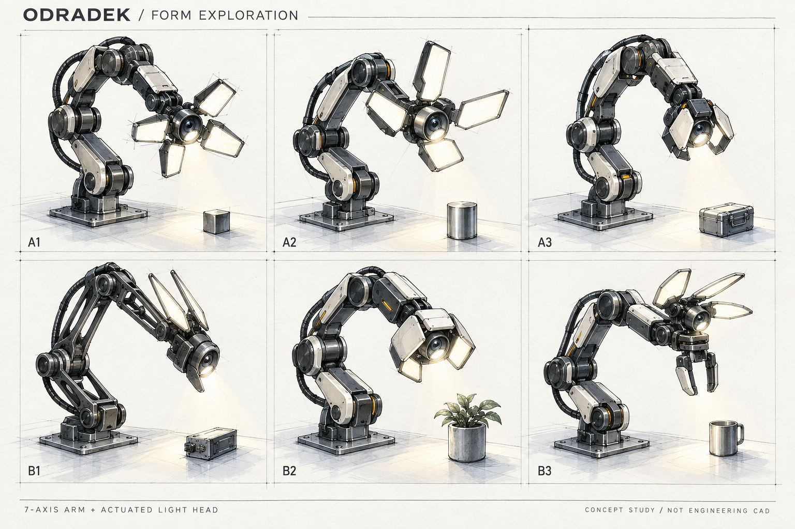
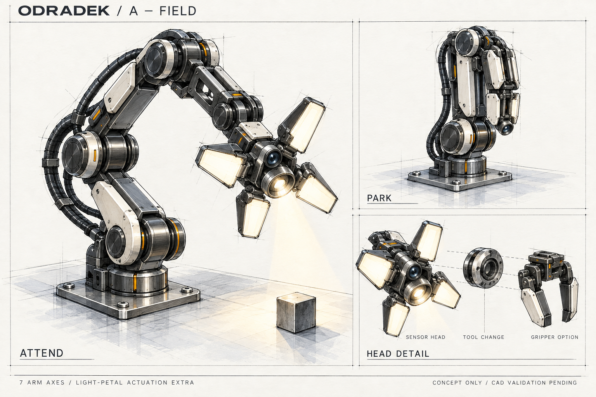
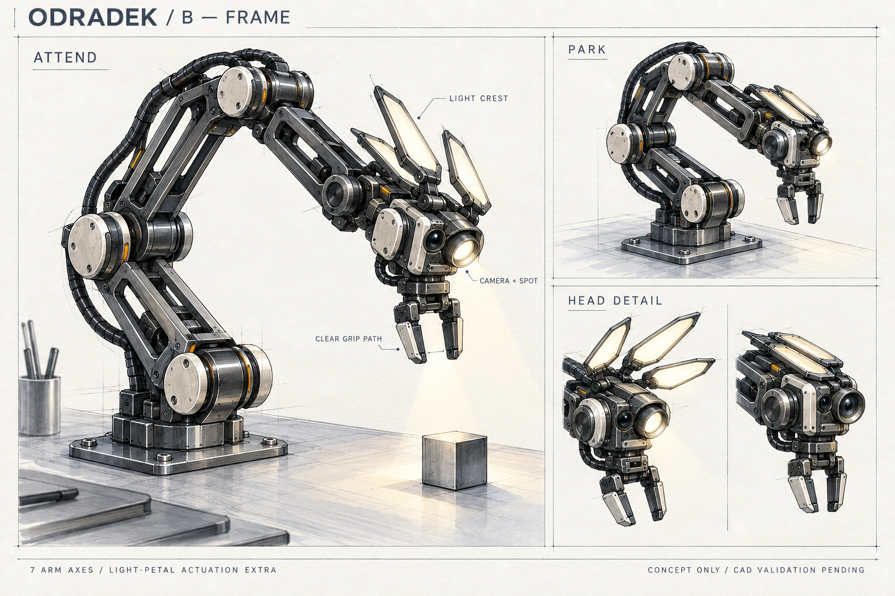
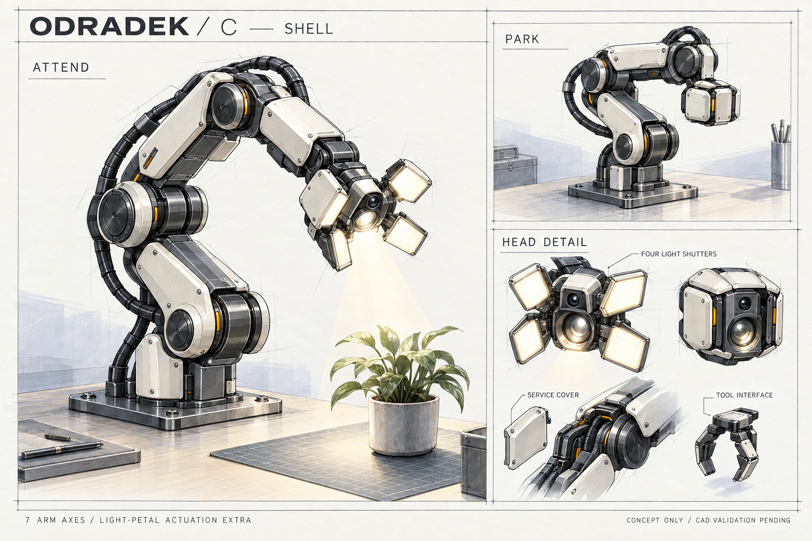
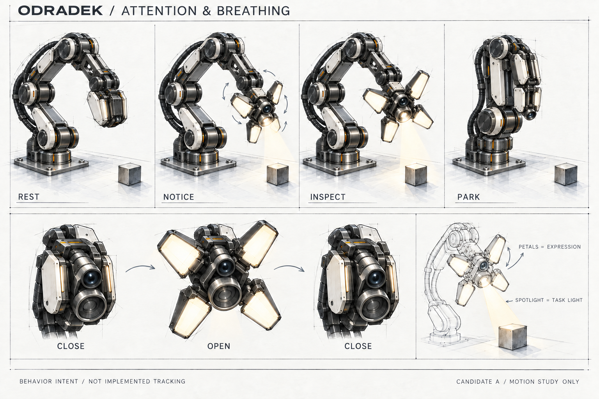

# Odradek

**An open-source seven-axis desktop arm exploring active attention, directional lighting, and breathing light petals.**

[中文说明](README.zh-CN.md) · [Design brief](docs/design-brief.md) · [Concept comparison](docs/concept-comparison.md) · [Behavior study](docs/behavior-spec.md) · [Roadmap](docs/roadmap.md)

Odradek is an independent Auromix project inspired by the attentive, articulated scanner in *Death Stranding*. Its intended identity comes from where it looks, how it directs light, and how its illuminated panels open and close. The first application is a fixed-base desktop arm for practical tasks.

**Stage: industrial design concept exploration.** This repository currently contains AI-assisted concept artwork, design intent, prompts, and a development roadmap. It does not yet contain manufacturing CAD, a validated seven-axis mechanism, firmware, a tracking system, or tested hardware. Payload, reach, cost, and performance targets remain open.

## Form exploration

The six sketches explore head packaging and light-panel morphology. They are narrowed into three candidates below. The working target is **seven arm axes**, with gripper and light-petal actuation counted separately. Perspective artwork does not establish the joint topology; that is a subsequent CAD task.

## Three candidates

### A / FIELD — modular observation head

Four luminous petals surround a directional spotlight and camera. Graphite structure and local removable covers express a serviceable exploration instrument. The observation head and gripper are alternate tool modules in this study.

### B / FRAME — light crest with a gripper

Three slender light leaves fold along the back of the wrist. A dorsal optical pod sits above a parallel gripper, exploring observation, expression, and manipulation on one assembly. Finger clearance and collision envelopes still require validation.

### C / SHELL — compact light shutters

Four short illuminated panels fold around the sides of a compact optical pod, with the camera and spotlight apertures remaining exposed. Segmented covers and a separate tool interface explore a calmer, compact instrument with accessible service areas.

## Attention and breathing

The behavior sheet uses candidate A to explore an expressive vocabulary; this is not a selection of the final hardware design. A directional spotlight serves observation and task illumination. Diffuse petal lighting and slow opening/closing communicate state. Arm orientation, task lighting, and expression should be independently controllable and coordinated by task state. Tracking shown in artwork is design intent, not an implemented capability.

## Design process

Research and references → design brief → six form thumbnails → three concept boards → behavior study → **review and task definition** → kinematic packaging → engineering prototype → task validation.

Industrial design and mechanical design develop together: every iteration must account for actuator and structural volume, motion clearance, cable routing, tool access, optical field of view, and service access. The current boards support discussion of appearance and interaction intent, not a build decision.

## Repository guide

| Path | Contents |
| --- | --- |
| [`docs/design-brief.md`](docs/design-brief.md) | Confirmed requirements, sketch assumptions, and unknown inputs |
| [`docs/concept-comparison.md`](docs/concept-comparison.md) | Qualitative trade-offs and review criteria |
| [`docs/behavior-spec.md`](docs/behavior-spec.md) | Proposed attention, illumination, and petal states |
| [`docs/decisions.md`](docs/decisions.md) | Decisions and changes in direction |
| [`docs/sources.md`](docs/sources.md) | Research sources and their limited roles |
| [`docs/generation.md`](docs/generation.md) | AI assistance, prompts, references, and review limitations |
| [`docs/roadmap.md`](docs/roadmap.md) | Planned route to reproducible hardware |
| [`docs/concepts/`](docs/concepts/) | Full-resolution concept boards |
| [`prompts/`](prompts/) | Exact generation prompts |

## Contributing

Start with the [contribution guide](CONTRIBUTING.md). The most useful next inputs are a concrete desktop task, its target objects, tool requirements, payload definition, reach, and available fabrication budget. Concept feedback can use the issue template and should identify the candidate and pose it refers to.

## License and attribution

Original repository content is released under [Apache-2.0](LICENSE). Third-party reference images are not included or relicensed. Inspiration and technical references are linked in [sources](docs/sources.md). This is an independent project, not an official *Death Stranding* or KOJIMA PRODUCTIONS product. Future third-party parts and contributions must retain their own attribution and licensing requirements.
