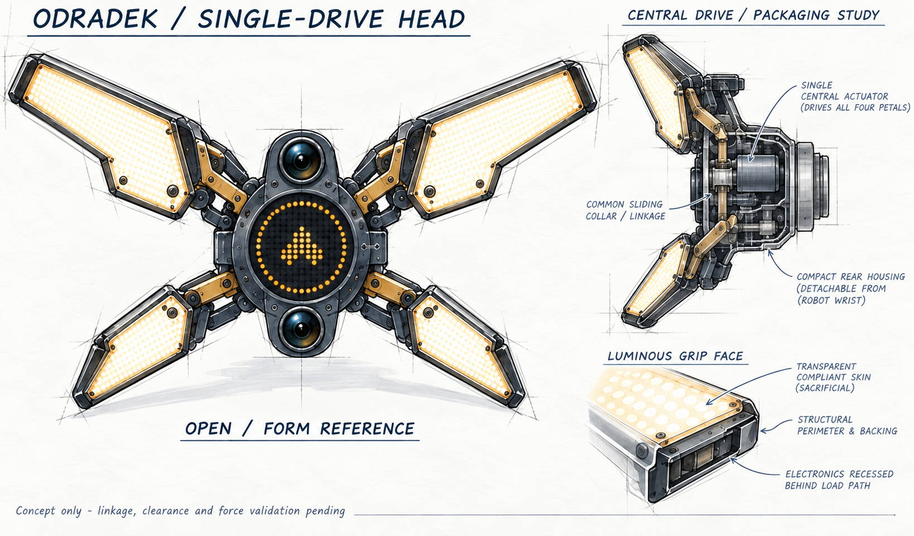
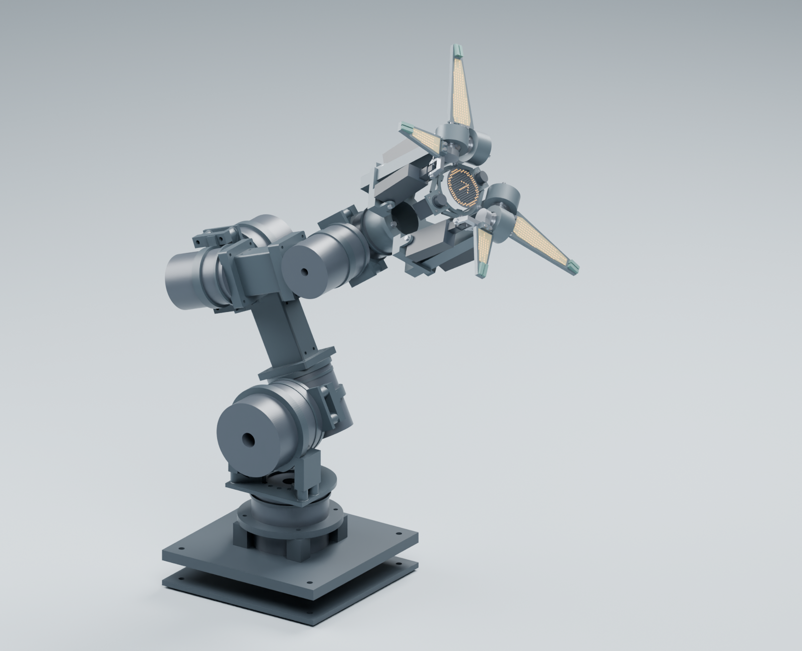
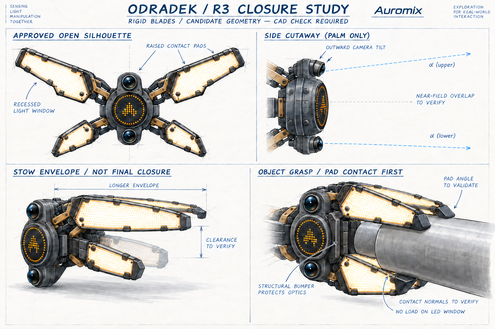
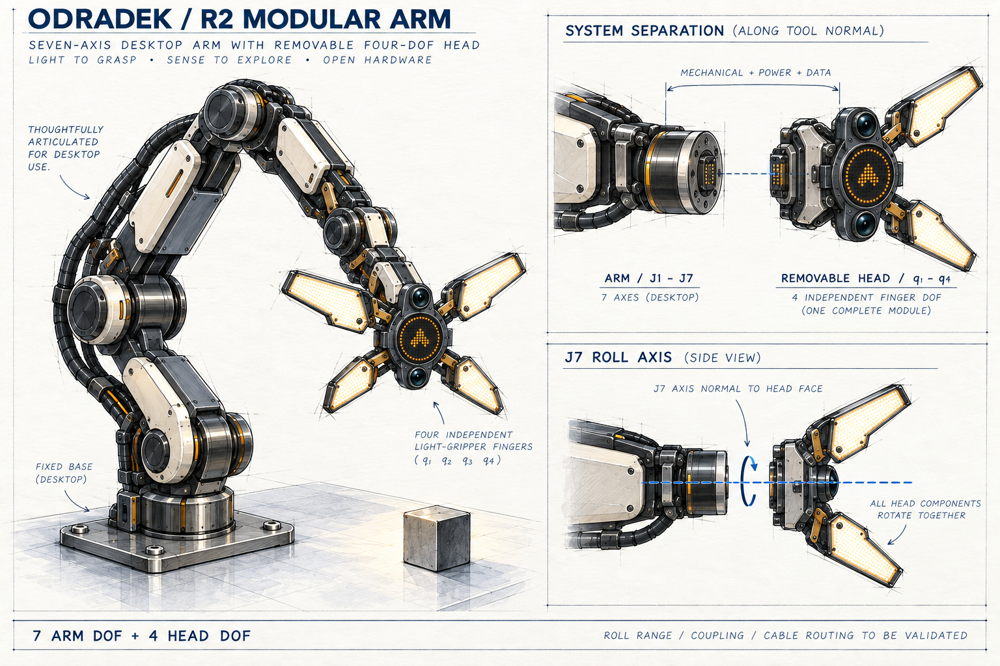
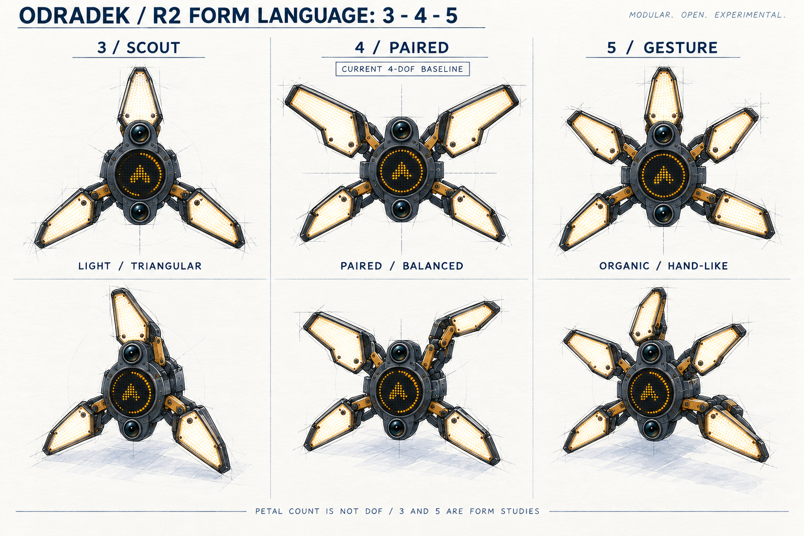

# Odradek

**当前工程推进（2026-10-10）：** [A19当前整合](engineering/arm_a19/README.md)使用全灵足实际关节、340/185 mm长版和同源B06底座，J5升级RS03并将J5—J6轴距改为75 mm。[同源整臂试配包](manufacturing/candidates/arm-body-a19-integrated-fit/README.md)收录41件当前打印件、6件采购结构件、504项五金、当前装配指引、自有件Blender及实际CAD渲染。变更新件对在134个有限姿态无相交；18个螺钉工具入口按装配阶段无相交，不代表全工作空间或实物装配通过。裸臂估算11.483 kg，裸法兰3 kg目标下J2原始静态筛选约48.149 Nm；当前载荷和金属根部自重已用于root32二次位移分析。**肩部助力、持续温升、动态线束、完整金属骨架与物理资格尚未解决；仅支撑、断电、无载试配，尚非生产版。** [A18上一版](engineering/arm_a18/README.md)保留历史范围。

**A16历史完整试配阶段（2026-10-10）：** [A16完整外罩固定试配](engineering/arm_a16/README.md)使用全灵足原生关节、常规法兰/连接板/标准管、分体鞍座和外罩，保持340/185 mm长版与3 kg法兰中心目标，读取同一份当前B06底座。[收敛整臂试装包](manufacturing/selected/arm-body-a16-fit/A16-complete-body-supported-fit.zip)独立收录41件贴床STL、当前自有STEP、41页打印件＋3页管材工作图、完整BOM、装配/首件检查、运动学和[自有件Blender](manufacturing/selected/arm-body-a16-fit/A16-body-own-parts.blend)。全部外罩已有普通固定结构；修正J6横摆干涉后，26个有限运动采样通过。**仅外部支撑、断电、空载打印试装；3 kg肩部保持、完整线束、金属骨架与生产资格未放行。** 下文A11–A15及旧A16骨架包保留其历史或研究范围，当前装配按收敛包替换清单。

**最新供应商决策（2026-10-09）：** 本体七个关节统一使用灵足RobStride，不采用脉塔MYACTUATOR。[A15-RS01](engineering/arm_a15/robstride01/README.md)保留长版与法兰中心3 kg目标，提供独立质量预算、空载/满载重力及理想肩部补偿筛查；RS02/RS10P原厂STEP已取得并按原尺度导入本机Blender检查场景。新版总装、真实补偿和生产资格尚未冻结。

**2026-10-09 arm body / 本体更新：** 用户已选择[A12 A连续甲壳](docs/concepts/selected/arm-body-a12-manta-carapace/README.md)。当前为[A14五件CAD外罩集成](engineering/arm_a14/wrist-tail01/README.md)：四件修长连杆分壳＋缩短J6后罩，提供[七轴交互预览](docs/viewers/arm-body-a14-wrist-tail01/index.html)、STEP、增量试配 STL 和同版本Blender。65个离散配置通过报告所列新件干涉检查，预览网格与原生模型一致；全尺寸电机、长版轴距及同源B06底座保持。**[持续载荷复核](engineering/arm_a14/qualification01/README.md)未通过，整臂尚非生产发布。** 部分关节造型罩、金属骨架、连通线束、制造工艺与实物验证仍待完成；[下一版全灵足关节链](engineering/arm_a15/robstride01/README.md)正在复核，具体型号及补偿机构未冻结。历史腕罩、肩罩和整臂造型按各模块范围保留。

[A11长版](engineering/arm_a11/README.md)与其[查看器](docs/viewers/arm-body-a11/index.html)、[验证记录](docs/engineering/arm-body-a11-validation.md)保留为历史结构基线；51个打印文件只适用于该版本受支撑试配，不移用于A12。裸法兰3 kg是目标，实物装配、温升、承力底盘和线束仍需验证。

**制造目标补充（2026-10-09）：** 用户要求整臂可制造且造型优雅。新增[A13制造重构前置审查](engineering/arm_a13/README.md)：当前A12按现有账本/外罩体积估算约9.11 kg，3 kg中心法兰负载水平伸展时J2静态需求约38.95 N·m。需要收敛外罩质量、承力结构、关节包装与热条件；审查不构成新模型或制造放行。

**塑料先行路线（2026-10-09已确认）：** 先打印结构和外罩，受支撑无载验证，再独立设计加工金属骨架。[J7 FIT01局部模块](engineering/arm_a13/j7-fit01/README.md)修正旧轴颈一体法兰导致的轴承装入阻碍，提供分体法兰、减材轴承座、六件装配件与六个配合小样、Blender、STEP/STL及尺寸工作图；整臂A12造型和约700 mm长版仍保留。此模块不构成整臂制造或3 kg负载放行。

**工具接口上一阶段（2026-10-09）：** [TOOL-IF02](engineering/arm_a13/tool-if02/README.md)将旧突出小仓改为端面Ø54凹腔、外圈Ø76定位和可拆背部检修盖。保留RS00与原J7核心，两路GMSL采用原厂具体HFM壳体尺寸作空间检查，供电/控制使用可换嵌件预算；工具侧试验杯用于验证后腔，不是最终四瓣头。工具平面前移44.3 mm，整臂TCP/负载与动态线束须后续重算。本轮是受支撑、无载、不通电的局部塑料试配；[TOOL-IF01](engineering/arm_a13/tool-if01/README.md)作为历史方案保留。

**整腕核心上一阶段（2026-10-09）：** [WRIST-ROUTE01](engineering/arm_a13/wrist-route01/README.md)将J7核心和凹腔接口装回长版整臂，并用108支架替换105，修正J6中间角度的固定螺钉头干涉。73个离散整腕姿态通过所列模块检查；工具基准更新为J7局部X110。[该阶段交互预览](docs/viewers/arm-body-a13-wrist-route01/index.html)、Blender与14件局部打印包保留核心试配范围；J6后罩B以后续A14替换件为准。动态GMSL线束仍未通过，直连侧边路线被否定；整臂制造与3 kg均未放行。旧105及历史TOOL-IF02包不再作为当前打印来源。

**A 7-DOF desktop arm with a detachable four-petal luminous gripper, expressing attention through orientation, opening, and light.**

[中文说明](README.zh-CN.md) · [Design brief](docs/design-brief.md) · [Comparison](docs/concept-comparison.md) · [Nickname candidates](docs/nickname-candidates.md) · [Roadmap](docs/roadmap.md)

**2026-09-28 checkpoint:** preserve the current research and drafts without adding complexity. The preferred head uses positive single-input synchronization and permits one opposed petal pair to carry the grasp. Passive differential studies remain comparisons. [Saved scope and draft status](docs/engineering/checkpoint-2026-09-28.md).

Odradek is an independent Auromix robotics project sharing design material for noncommercial research and hobby use inspired by the articulated scanner in *Death Stranding*. The intended application is practical manipulation from a fixed desktop base. Mechanical design, appearance, and behavior develop together.

**Stage: engineering research; the head drive is being redesigned for a confirmed ≤1-second empty closed–open–closed cycle.** Gripping is the primary function and the illuminated petal face is the contact face. The user has confirmed a 2 kg net object plus head mass, approximately 700 mm reach, EtherCAT, GMSL/GMSL2 cameras, internal cabling and external computing. P16 actuators cannot meet the new cycle; their CAD and electrical branch remain historical references. The existing 7+4 assembly does not demonstrate the new speed requirement. See [current requirements](docs/engineering/fast-grasp-requirements01.md). No manufacturing release or tested 2 kg prototype exists.

## R5: single-drive head and separate arm body

One concealed central actuator drives four coupled petals; their luminous faces also grip. The seven-axis body is developed separately with slender proportions and a detachable tool flange. [See both concept sheets and the current design brief](docs/r5-modular-design.md). Generated illustrations guide appearance; linkage, clearance and load capacity require engineering validation.

The latest engineering includes [revised layered petal STEP and drawings](docs/engineering/r5-petal-form02.md), a [fold-then-radial path and passive differential study](docs/engineering/r5-stage01.md), a [detachable eRob wrist adapter](docs/engineering/r5-wrist-erob01.md), and a [separate arm mass/reach study](docs/engineering/r5-body01.md). Everyday boxes, bottles and cans of approximately **50–120 mm gripping width** are the first target. Bare-petal geometry now has a continuous separation bound, but the physical mechanism, final closed posture and complete grasp range remain unqualified. The earlier [single-slider Blender rig](docs/engineering/r5-linkage-blender01.md) remains a separate comparison. See the [current baseline](docs/engineering/current-baseline.md) for evidence and remaining work.

The [native radial-candidate Blender model and guide](docs/engineering/r5-stage-blender01.md) contain 28 actual petal CAD meshes, including contact poses for an Ø80 mm cylinder and a 50×120 mm rectangular box. One mean input and three passive review offsets express the differential constraint; the physical transmission, central module and time simulation are not included.

## Engineering package

This model combines 24 original link parts, a shoulder raised by 35 mm, the corrected base and the 697-object HEAD-INTEGRATED03 snapshot. Joint housings in Blender remain catalog envelopes; arm fasteners, harnesses and exterior guards are not fully integrated. The central pixel display is a separate visual preview. [The raised candidate](docs/engineering/raised-arm-integration01.md) passes the stated actual-BREP checks for ten poses, including the historical shoulder-collision pose. These discrete checks do not qualify trajectories or payload. [Current baseline and hardware choices](docs/engineering/current-baseline.md) separate the conditional eight-node P16 branch from earlier alternatives.

| Package | Evidence and scope |
|---|---|
| [Engineering index](docs/engineering/README.md) | Requirements, assumptions, source records, and release checklist |
| [R4 layout and grasp](docs/engineering/r4-layout-and-grasp.md) | Same-parameter geometry, closure proof, conditional contact calculations, and optical sightlines |
| [Existing native Blender / historical P16 head](engineering/generated/raised-arm-integration01/blender/odradek-integrated-7-plus-4.blend) / [model guide](docs/engineering/raised-arm-integration01.md) | 736 product meshes, 11 controls, persistent actuator linkage drivers; geometric review only |
| [Integrated head STEP and evidence](docs/engineering/head-integrated03-study.md) / [coupled dynamics](docs/engineering/articulated-dynamics-review.md) | Actual candidate solids, frozen board placement and explicit mass/inertia assumptions |
| [Historical layout](docs/engineering/r4-layout-and-grasp.md) / [subassembly scenes](docs/engineering/subassembly-blender-review.md) | Earlier design stages retained for traceability |
| [A3 review drawings](engineering/generated/layout/ODR-R4-assembly-review.pdf) | Axes, dimensions, and orthographic mesh views |
| [Manual finger fixture](engineering/generated/finger-fixture/README.md) / [joint interface coupons](docs/engineering/interface-coupon-guide.md) | Unpowered printable geometry checks with dimensions |
| [Hardware BOM](docs/engineering/hardware/bom.csv) / [optical bench](docs/engineering/hardware/optical-bench-build.md) | Sourced component candidates and a concrete dual-fisheye bench chain |
| [Reproduce the calculations and CAD](engineering/README.md) | Dependencies, generation order, units, and limitations |

The old [finite-pad contact counterexample](docs/engineering/finite-pad-contact-study.md) remains documented. HEAD-INTEGRATED03 now combines the revised CONTACT-02 pads and retention, narrowed CARRIER02 roots, lamp cavities, board placement and EXT24. Its 17 scoped continuous checks pass nominal geometry conditions; dynamic harnesses, tolerances, deformation and grasp testing remain unresolved. Conditional force calculations are not a measured payload rating.

## Historical R3: silhouette, closure and contact

The larger upper / smaller lower, left-right mirrored open silhouette is selected. The upper fisheye tilts upward and the lower downward; the amount remains open pending near-grasp visibility checks.

The study identifies three issues: unequal rigid lengths do not fold into one short common-depth pod, wide plates can collide before their tips reach the center, and forward curling turns the original luminous face toward the object. The leading candidate keeps each plate intact, uses different limits and real depth offsets, and places proud contact pads / structural borders on the light-facing side with recessed windows.

The [geometry study](docs/r3-closure-study.md) includes counterexamples and a continuous-domain separation result for an illustrative four-box model. This does not validate the full head or a stable grasp. The artwork's stow panel is an envelope study, not a final closed pose.

## Current direction: a detachable four-petal head

- **Seven arm DOFs; a single-drive four-petal head is now the preferred route.** J7 rolls the head about its front normal. One motor with three mechanically coupled followers is permitted; linkage mapping and passive compliance remain to be designed.
- **Two close petals on each side, with left/right mirror symmetry and different upper/lower proportions.** Longer upper and shorter lower petals avoid 180-degree rotational symmetry. The grouping is inspired by the XPENG logo composition; it does not require mechanically coupled pairs.
- **The light petals are the fingers.** Forward curling turns the light face inward. The latest requirement makes the illuminated face itself the gripping face; the contact skin and load-bearing support are being redesigned. Earlier proud tip pads are a historical contact study. Empty full closure must reach a mechanical limit with real clearances; it does not imply a sealed pod or four tips meeting at one point.
- **One circular LED display in the center.** Ring graphics use pixels at its perimeter. The four fingers provide lighting. Two fisheye cameras sit above and below the screen, tilt upward/downward respectively, and rotate with the head.
- **The detachable boundary is after the J7 output flange.** One concealed central actuator and local execution interfaces are proposed within the head; connection specifications remain open.

The roll sketches show finite-angle pose intent without defining travel. Open, grasping, and fully closed geometry must be reconciled in one CAD model; the R2 compact protective pod is now a historical assumption. Mechanical breathing is limited to empty, task-permitted operation; expression must not change an active grasp.

## Three, four, or five petals

| Count | Visual character | Role |
| --- | --- | --- |
| 3 | Light triangular silhouette; instrument or alien-tool associations | Aesthetic comparison |
| **4** | Two visually grouped pairs; balance between tool and creature | **Four shaped petals, single-drive coupling permitted** |
| 5 | Denser flower or biological silhouette; a hand-like reading needs an offset petal | Aesthetic comparison |

Petal count is not a DOF count. Three- and five-petal variants would require their own motion allocation; the latest direction permits a single actuator with coupled motion.

## Nickname candidates

**Odi** is the leading suggestion for continuity with Odradek; **Lumo** emphasizes light and breathing. Noto, Piko, Tavi, and Filo are additional options. See the [shortlist](docs/nickname-candidates.md). No nickname has been selected; the project and repository remain Odradek.

## Process and next steps

Research → R0 form exploration → R1 luminous fingers → R2 7+4 DOF and modular head → R3 silhouette and closure → **R4 sourced components, mathematics, CAD, and geometry fixtures** → complete load paths and harness routes → physical task and manufacturing validation.

The [gallery](docs/gallery.html) retains original R0/R1 artwork and exact prompts for traceability. R1's separate physical light annulus and finger-count candidates are superseded by R2.

| Document | Contents |
| --- | --- |
| [Design brief](docs/design-brief.md) | Confirmed requirements, concept assumptions, and open inputs |
| [Comparison](docs/concept-comparison.md) and [behavior](docs/behavior-spec.md) | Form, grasp, light, and attention studies |
| [Decisions](docs/decisions.md) and [roadmap](docs/roadmap.md) | Evolution and route to reproducible hardware |
| [Sources](docs/sources.md) | Research and reference roles |
| [Generation](docs/generation.md) and [review notes](docs/review-notes.md) | Prompts, AI assistance, and specific visual limitations |

Current open items include the shoulder's usable motion range, installed holding/thermal performance, complete controller and harness design, contact/fastener qualification and manufacturing tolerances. See the [release checklist](docs/engineering/release-checklist.md).

## License and commercial permissions

New original artwork, documentation, research scripts, parameters, and models are offered under **[CC BY-NC 4.0](LICENSE)**. Noncommercial research, study, hobby use, adaptation, and sharing are permitted under its terms. Sharing requires attribution, license information, and indication of changes. Commercial use requiring authorization needs a [separate written license from the authors](https://github.com/Auromix/odradek/issues/new?template=commercial-license.yml).

**Prior Apache-2.0 grants through `2d7d00f` and marked-script PolyForm grants in `698736a` through `c4f1fde` remain valid.** See [licensing scope and history](LICENSING.md), including the explicit limitations of applying CC to engineering research software. Future production control firmware needs a suitable separate license decision. Copyright notices do not themselves control all functional hardware manufacture.

The noncommercial restriction means this is not open source under the OSI definition. Contributions in English or Chinese are welcome; see [CONTRIBUTING](CONTRIBUTING.md). Third-party reference images are not included or relicensed. This project has no official affiliation with *Death Stranding*, KOJIMA PRODUCTIONS, or XPENG.
