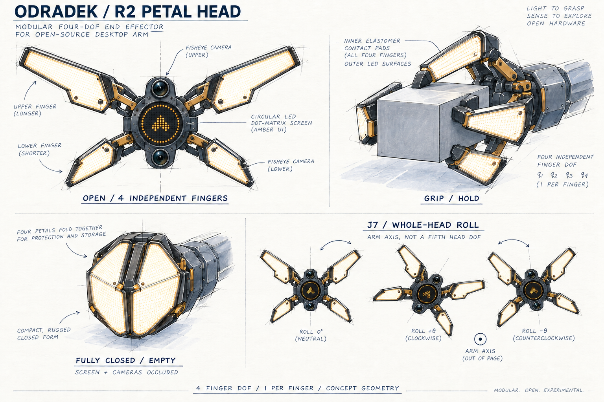

# Odradek

**A 7-DOF desktop arm with a detachable 4-DOF luminous gripper, expressing attention through orientation, opening, and light.**

[中文说明](README.zh-CN.md) · [Design brief](docs/design-brief.md) · [Comparison](docs/concept-comparison.md) · [Nickname candidates](docs/nickname-candidates.md) · [Roadmap](docs/roadmap.md)

Odradek is an independent Auromix open-source robotics project inspired by the articulated scanner in *Death Stranding*. The intended application is practical manipulation from a fixed desktop base. Mechanical design, appearance, and behavior develop together.

**Stage: R2 industrial design concepts.** This repository contains AI-assisted artwork, design records, references, and exact prompts. It does not yet contain manufacturing CAD, a validated seven-axis mechanism, firmware, or tested hardware. Payload, reach, cost, and performance targets remain open.

## R2: a detachable four-petal head

- **Seven arm DOFs and four head DOFs.** J7 rotates the whole head about the normal to its front face. Each luminous finger has one independent opening coordinate.
- **Two close petals on each side, with left/right mirror symmetry and different upper/lower proportions.** Longer upper and shorter lower petals avoid 180-degree rotational symmetry. The grouping is inspired by the XPENG logo composition; it does not require mechanically coupled pairs.
- **The light petals are the fingers.** Inner pads contact objects, a frame carries load, and outer or edge windows emit light. Empty full closure is a protective storage pose that may occlude the screen and cameras.
- **One circular LED display in the center.** Ring graphics use pixels at its perimeter. The four fingers provide lighting. Two fisheye cameras sit above and below the screen in the head's local frame and rotate with it.
- **The detachable boundary is after the J7 output flange.** Four finger actuators and local control are proposed within the head; connection specifications remain open.

The roll sketches show finite-angle pose intent without defining travel. Open, grasping, and fully closed geometry must be reconciled in one CAD model. Mechanical breathing is limited to empty, task-permitted operation; expression must not change an active grasp.

## Three, four, or five petals

| Count | Visual character | Role |
| --- | --- | --- |
| 3 | Light triangular silhouette; instrument or alien-tool associations | Aesthetic comparison |
| **4** | Two visually grouped pairs; balance between tool and creature | **Current mechanical direction: one DOF per finger** |
| 5 | Denser flower or biological silhouette; a hand-like reading needs an offset petal | Aesthetic comparison |

Petal count is not a DOF count. Three- and five-petal variants would require their own motion allocation; the confirmed four independent coordinates apply to the four-petal design.

## Nickname candidates

**Odi** is the leading suggestion for continuity with Odradek; **Lumo** emphasizes light and breathing. Noto, Piko, Tavi, and Filo are additional options. See the [shortlist](docs/nickname-candidates.md). No nickname has been selected; the project and repository remain Odradek.

## Process and next steps

Research → R0 form exploration → R1 luminous fingers → **R2 7+4 DOF and modular head** → task and scale definition → mechanism samples and arm kinematics → engineering and task validation.

The [gallery](docs/gallery.html) retains original R0/R1 artwork and exact prompts for traceability. R1's separate physical light annulus and finger-count candidates are superseded by R2.

| Document | Contents |
| --- | --- |
| [Design brief](docs/design-brief.md) | Confirmed requirements, concept assumptions, and open inputs |
| [Comparison](docs/concept-comparison.md) and [behavior](docs/behavior-spec.md) | Form, grasp, light, and attention studies |
| [Decisions](docs/decisions.md) and [roadmap](docs/roadmap.md) | Evolution and route to reproducible hardware |
| [Sources](docs/sources.md) | Research and reference roles |
| [Generation](docs/generation.md) and [review notes](docs/review-notes.md) | Prompts, AI assistance, and specific visual limitations |

The next priorities are finger trajectories and closure clearance, module mass and connection design, J7 cable routing, and a concrete target task that determines arm sizing.

Contributions in English or Chinese are welcome; see [CONTRIBUTING](CONTRIBUTING.md). Original repository content is released under [Apache-2.0](LICENSE). Third-party reference images are not included or relicensed. This project has no official affiliation with *Death Stranding*, KOJIMA PRODUCTIONS, or XPENG.
