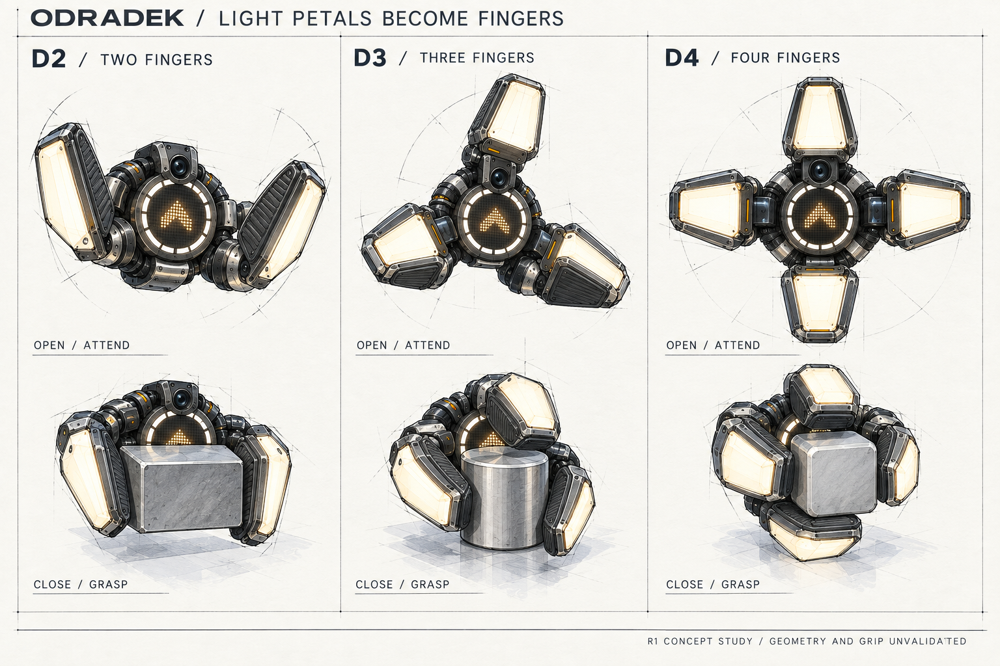
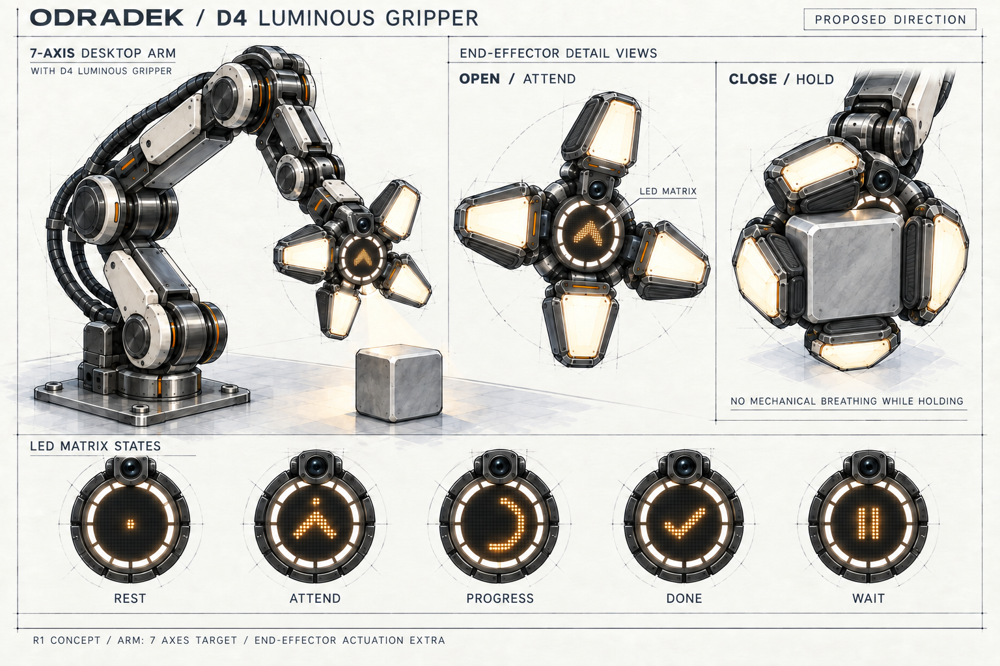

# Odradek

**An open-source seven-axis desktop arm exploring luminous gripper fingers, circular LED feedback, and active attention.**

[中文说明](README.zh-CN.md) · [Design brief](docs/design-brief.md) · [Concept comparison](docs/concept-comparison.md) · [Behavior study](docs/behavior-spec.md) · [Roadmap](docs/roadmap.md)

Odradek is an independent Auromix project inspired by the attentive, articulated scanner in *Death Stranding*. Its intended identity comes from where it looks, how it directs light, and how its illuminated panels open and close. The first application is a fixed-base desktop arm for practical tasks.

**Stage: industrial design concept exploration.** This repository currently contains AI-assisted concept artwork, design intent, prompts, and a development roadmap. It does not yet contain manufacturing CAD, a validated seven-axis mechanism, firmware, a tracking system, or tested hardware. Payload, reach, cost, and performance targets remain open.

## R1: the light petals are the gripper fingers

The current exploration integrates gripping into the illuminated petals themselves. Each finger combines a structural frame, replaceable inner contact pad, and outward or edge lighting. The circular palm currently depicts an **LED matrix plus a separate segmented white task-light annulus**; this is a proposed configuration, not a selected component.

D2 explores opposed pinch, D3 an enveloping three-finger grasp, and D4 four fingers arranged as two opposing pairs. **D4 is recommended for further study, not selected as the final design.**

The five display examples are rest, attention, progress, done, and wait. Mechanical breathing is limited to empty, unconstrained operation. Expression must not disturb acquisition, holding, or release; light modulation is also subordinate to illumination and imaging needs. Objects may occlude the central display: never relax a grasp to reveal it. The display matrix and task illumination require distinct optical treatment; an all-white matrix is not evidence of a working spotlight.

The sketches do not validate gripping, motion, optics, or thermal performance. Seven axes refer to the arm; end-effector actuation is counted separately without assuming separate gripper and petal mechanisms.

## R0 archive: form exploration

The original boards below preserve the initial exploration. Their structural and cover styling remains relevant; their separate observation-head / conventional-gripper arrangements are superseded by R1. These images do not depict petals gripping objects.

## R0 archive: three candidates

### A / FIELD — modular observation head

Four luminous petals surround a directional spotlight and camera. Graphite structure and local removable covers express a serviceable exploration instrument. The observation head and gripper are alternate tool modules in this study.

### B / FRAME — light crest with a gripper

Three slender light leaves fold along the back of the wrist. A dorsal optical pod sits above a parallel gripper, exploring observation, expression, and manipulation on one assembly. Finger clearance and collision envelopes still require validation.

### C / SHELL — compact light shutters

Four short illuminated panels fold around the sides of a compact optical pod, with the camera and spotlight apertures remaining exposed. Segmented covers and a separate tool interface explore a calmer, compact instrument with accessible service areas.

## R0 archive: attention and breathing

This historical R0 sheet used candidate A to explore expression; it does not satisfy the R1 gripping requirement or select the final hardware design. A directional spotlight serves observation and task illumination. Diffuse petal lighting and slow opening/closing communicate state. Arm orientation, task lighting, and expression should be independently controllable and coordinated by task state. Tracking shown in artwork is design intent, not an implemented capability.

## Design process

Research and references → R0 form and behavior studies → R1 luminous-finger and circular-display studies → **review and task definition** → kinematic packaging → engineering prototype → task validation.

Industrial design and mechanical design develop together: every iteration must account for actuator and structural volume, motion clearance, cable routing, tool access, optical field of view, and service access. The current boards support discussion of appearance and interaction intent, not a build decision.

## Repository guide

| Path | Contents |
| --- | --- |
| [`docs/design-brief.md`](docs/design-brief.md) | Confirmed requirements, sketch assumptions, and unknown inputs |
| [`docs/concept-comparison.md`](docs/concept-comparison.md) | Qualitative trade-offs and review criteria |
| [`docs/behavior-spec.md`](docs/behavior-spec.md) | Proposed attention, illumination, and petal states |
| [`docs/decisions.md`](docs/decisions.md) | Decisions and changes in direction |
| [`docs/sources.md`](docs/sources.md) | Research sources and their limited roles |
| [`docs/generation.md`](docs/generation.md) | AI assistance, prompts, references, and review limitations |
| [`docs/roadmap.md`](docs/roadmap.md) | Planned route to reproducible hardware |
| [`docs/concepts/`](docs/concepts/) | Full-resolution concept boards |
| [`prompts/`](prompts/) | Exact generation prompts |

## Contributing

Start with the [contribution guide](CONTRIBUTING.md). The most useful next inputs are a concrete desktop task, its target objects, tool requirements, payload definition, reach, and available fabrication budget. Concept feedback can use the issue template and should identify the candidate and pose it refers to.

## License and attribution

Original repository content is released under [Apache-2.0](LICENSE). Third-party reference images are not included or relicensed. Inspiration and technical references are linked in [sources](docs/sources.md). This is an independent project, not an official *Death Stranding* or KOJIMA PRODUCTIONS product. Future third-party parts and contributions must retain their own attribution and licensing requirements.
