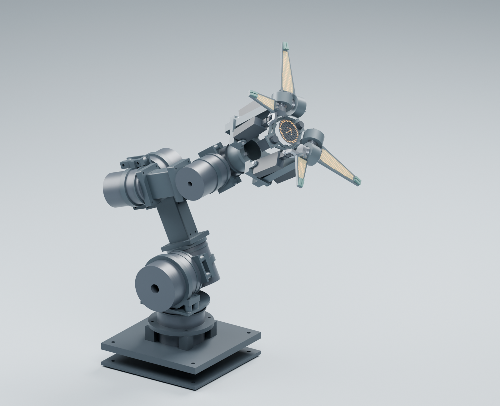

# Odradek

**7 自由度本体＋4 自由度发光夹爪，以朝向、张合与灯光表达主动注意力。**

[English](README.md) · [设计简报](docs/design-brief.md) · [方案比较](docs/concept-comparison.md) · [昵称候选](docs/nickname-candidates.md) · [路线图](docs/roadmap.md)

Odradek 是 Auromix 面向非商业研究与爱好者公开设计资料的桌面／固定底座机械臂项目，灵感来自《死亡搁浅》中的探测器，面向实际操作任务。本体与末端的机构、外观和行为同步设计。

**当前为 R4 工程研究与几何样件阶段。** 已确认末端负载要求2 kg、EtherCAT、内走线、外置计算与先打印后金属加工。计算保守地把2 kg视为净工件；当前P16条件分支的末端计量模型2.802 kg，完整规划2.987～3.252 kg，驱动速度和占空条件仍待确定。臂展仍是设计假设。六段承力连接、可拆整头、7＋4耦合数学与原生Blender总装已经集成；尚无制造发布版、2 kg实测样机或正式控制固件。

## 当前工程包

图中已合并24个原创连接件、修正后的底座和697对象的HEAD-INTEGRATED03快照。关节仍为目录包络，臂侧紧固件、线束和外壳尚未完整集成，中央像素屏单独标为显示效果。[整臂真实实体检查](docs/engineering/integrated-collision-study.md)发现历史reach姿态存在肩部碰撞，禁止执行；图示inspect仅通过已说明范围的离散几何检查，未取得轨迹或带载资格。

| 入口 | 内容与范围 |
|---|---|
| [工程总览](docs/engineering/README.md) | 输入、假设、一手来源和发布清单 |
| [布局、闭合与抓取](docs/engineering/r4-layout-and-grasp.md) | 同参数实体、独立角域分离、条件抓取和名义光线检查 |
| [当前原生Blender](engineering/generated/integrated-arm-preview/odradek-integrated-7-plus-4.blend)／[模型使用说明](docs/engineering/integrated-blender-review.md) | 736个产品网格、11个控制量、可独立重开的推杆随动；几何检查候选 |
| [整头STEP与证据](docs/engineering/head-integrated03-study.md)／[耦合动力学](docs/engineering/articulated-dynamics-review.md) | 实际候选实体、冻结灯板位置、明确的质量与惯量代理 |
| [历史布局](docs/engineering/r4-layout-and-grasp.md)／[分组件场景](docs/engineering/subassembly-blender-review.md) | 保留早期设计阶段用于追溯 |
| [A3 装配审查图](engineering/generated/layout/ODR-R4-assembly-review.pdf) | 轴坐标、布局尺寸和正交网格视图 |
| [单指手动台架](engineering/generated/finger-fixture/README.md)／[关节接口片](docs/engineering/interface-coupon-guide.md) | 可打印、无动力的孔位与几何检查件，配尺寸图 |
| [元件 BOM](docs/engineering/hardware/bom.csv)／[双鱼眼光学台架](docs/engineering/hardware/optical-bench-build.md) | 有来源的候选及具体相机—采集板—主机链 |
| [计算与 CAD 复现](engineering/README.md) | 依赖、生成顺序、单位和限制 |

旧布局的[有限双垫接触反例](docs/engineering/finite-pad-contact-study.md)继续保留。HEAD-INTEGRATED03已合并CONTACT-02软垫及保持键、CARRIER02窄根、灯腔、灯板位置和EXT24；17项指定范围的连续几何检查通过。动态线束、公差、变形与抓取试验仍未闭合，条件性力平衡不等于2 kg实测额定负载。

## R3：保留外形，检查闭合与接触

已选定上两瓣大、下两瓣小、左右对称的展开外形。双鱼眼保持上下位置并向上／下略外倾，安装角需兼顾最近夹取区域。

本轮发现三项需修正的机构假设：长短刚性板不能直接收成同深度短茧；宽板过度向中心闭合会相撞；向前包合时原来的灯面会转向工件。因此优先研究完整板、不同限位与前后错层，并将凸起软垫／承力边框布置在灯面同侧，让灯窗凹入。

[几何检查与完整推导](docs/r3-closure-study.md)给出了反例，以及一个四矩形板模型的连续角域分离结果；其通过不代表整头或有效抓取通过。下图收纳区明确为包络研究，不是最终闭合姿态。

## 当前：可拆四瓣末端

- **本体 7 DOF，末端 4 DOF。** J7 的轴线垂直于末端正面，带动整个头部旋转；四片夹指各有一个独立开合自由度。
- **左右各一组近邻双瓣，左右镜像、非中心对称。** 上瓣较长、下瓣较短，借鉴小鹏 logo 的分组关系；视觉成组不要求动作联动。
- **灯片就是夹指。** 向前包合时灯面转向工件，拟由同侧凸起软垫／边框先接触，灯窗凹入。空手全闭需达到有真实间隙的机械限位；不是四尖挤到同一点或密封壳。
- **中央仅圆形 LED 屏。** 环形图案由屏幕圆周像素绘制；照明由四片承担。两个鱼眼位于屏幕局部上方和下方，分别向上／下外倾，随整头旋转。
- **可拆分界在 J7 输出法兰之后。** 四指执行器与端侧控制拟置于末端内，接口规格待定。

图中 roll 表达有限角度姿态变化，角度尚未定义。开合、抓取和收拢态需在同版 CAD 中验证；R2 的紧凑保护茧原图已退为历史假设。机械呼吸仅在空手且任务允许时进行；表达动作不改变正在保持的夹持。

## 3／4／5 片的艺术比较

| 片数 | 视觉气质 | 当前定位 |
| --- | --- | --- |
| 3 | 三角剪影、轻巧，偏探测仪或异形工具 | 艺术比较 |
| **4** | 两组有亲疏关系，兼有工具感和生命感 | **当前机械深化主线，四片各 1 DOF** |
| 5 | 轮廓更密，偏花冠或生物；偏置一片才更容易产生手掌联想 | 艺术比较 |

片数不等于自由度。三片或五片不能直接套用目前的四个独立开合坐标；若改变片数，需重新定义机构。

## 昵称候选

建议优先考虑 **Odi／欧迪**：保留与 Odradek 的联系，只有两个音节。**Lumo／露莫** 更偏灯光与呼吸感。其他候选为 Noto／诺托、Piko／皮可、Tavi／塔维、Filo／菲洛，见[完整比较](docs/nickname-candidates.md)。昵称尚未选定，项目和仓库名保持 Odradek。

## 过程与下一步

调研 → R0 形态发散 → R1 灯片夹爪 → R2 7＋4 DOF 与模块化末端 → R3 外形与闭合 → **R4 元件、数学、CAD 与几何台架** → 完整承力连接及动态线束 → 样机任务与制造验证。

R0／R1 的原图和提示词保留在[图集](docs/gallery.html)。R1 的独立实体灯环与片数候选已由 R2 取代；旧图不代表当前要求。

- [设计简报与未知输入](docs/design-brief.md)
- [方案比较](docs/concept-comparison.md)与[行为草案](docs/behavior-spec.md)
- [决策记录](docs/decisions.md)与[路线图](docs/roadmap.md)
- [参考来源](docs/sources.md)、[生成方式和提示词](docs/generation.md)、[图像审阅记录](docs/review-notes.md)

当前继续推进肩部可用活动范围、安装后的保持与温升、完整控制器及动态线束、接触/紧固件资格和制造公差，见[工程发布清单](docs/engineering/release-checklist.md)。

## 许可与商业授权

新增原创图稿、文档、工程研究脚本、参数与模型采用 **[CC BY-NC 4.0（署名—非商业性使用）](LICENSE)**，允许非商业研究、学习、爱好者使用与修改分享；分享时须署名、保留许可信息并注明修改。需要依赖该许可的商业使用，须[联系作者取得单独书面授权](https://github.com/Auromix/odradek/issues/new?template=commercial-license.yml)。

**截至 `2d7d00f` 的 Apache-2.0 授权及 `698736a` 至 `c4f1fde` 中标明 PolyForm 的脚本授权继续有效。** 新政策不追溯收回旧权利，详见[许可范围与历史](LICENSING.md)，其中也明确 CC 用于工程研究软件的局限。正式控制固件需另选合适的软件许可；版权声明不等于对功能性硬件制造的全面限制。

带非商业限制的公开设计不属于 OSI 定义的开源项目。欢迎按[贡献说明](CONTRIBUTING.md)参与。第三方参考原图未收录，也不纳入本项目许可；项目与《死亡搁浅》、KOJIMA PRODUCTIONS 或 XPENG 无官方关联。
