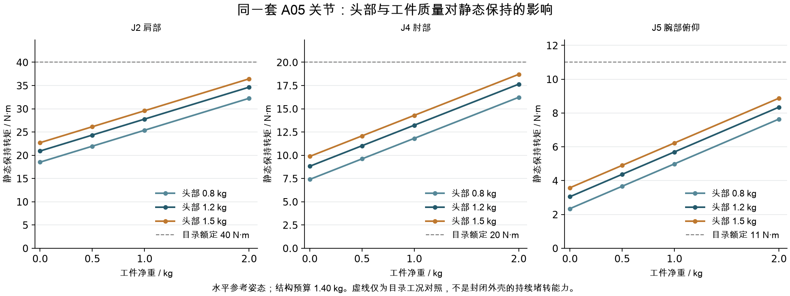

<!-- SPDX-License-Identifier: CC-BY-NC-4.0 -->
# A06：从J7到J1的静态负载回算

> 历史场景。2026-10-02用户已改为裸臂法兰总负载目标3 kg，本轮不考虑四瓣头。当前目标见[A07参数](../engineering/parameters/arm-a07-target.json)；下文保留当时输入与结果。

日期：2026-10-02。用户同意从末端向根部计算，并希望结合桌面机械臂市场规格重新审视目标。本页完成第一轮**带显式质量假设的重力静态计算**；不修改已确认的2 kg净工件、约700 mm肩至TCP、七轴与QDD要求。市场对标及目标建议见 [负载目标对标](arm-body-payload-target-a06.md)。

## 输入与质量口径

继续采用A05几何、实际候选关节的目录质量和电机位置。头与工件质心均为条件假设，不是实测结果。

| 项目 | 本轮参考值 | 性质 |
|---|---:|---|
| 工件净重 | 2.0 kg | 已确认目标；另算0、0.5、1 kg场景，不自动降低要求 |
| 可拆头部总质量 | 1.5 kg | 历史研究假设；另算0.8、1.2 kg，尚未选定制造质量 |
| 七个关节总质量 | 5.612 kg | A04候选型号目录质量之和 |
| 连杆、叉架、附加支承、外壳、线束预算 | 1.40 kg | 本轮新增预算假设，非CAD导出；按0.84～2.24 kg作敏感性比较 |
| 臂体＋头部，不含固定底座和工件 | 8.512 kg | 上述假设之和，不是样机称重 |
| 臂体＋头部＋工件 | 10.512 kg | 模型总质量；不能称为本体自重 |

结构预算按各刚体分别分配，详见 [参数表](../engineering/parameters/arm-a06-load-budget.json)。电机整机质量暂放在壳体包络中心、归入其固定端；这会计入上游载荷，但不把自身整台电机计作自身输出端负载。实际转子/输出组件质量及质心未分解，所以本轮的支承载荷不包含准确的自身旋转部分；也未得到惯量张量。

## 方法：先算完整力矩，再投影到转轴

对每个下游质量点求 `F_k=m_k g`，并从J7到J1递推合力与力矩。以世界坐标表示：

```text
F_i = 本刚体重力之和 + F_(i+1)
M_i = Σ_当前刚体[(COM_k - p_i) × m_k g]
      + M_(i+1) + (p_(i+1) - p_i) × F_(i+1)
保持转矩 τ_i = -a_i · M_i
横向弯矩 M_perp = M_i - a_i (a_i · M_i)
```

`p_i`是当前运动学关节原点，`a_i`是其世界坐标轴向；计算内部统一用m、kg、N、N·m。每一级只加入归属当前刚体的质量，避免重复累计下游部件。

**驱动转矩与横向弯矩不是同一项。** 所有力矩均以运动学关节原点为参考截面，真实轴承位置尚未冻结。换参考点时还要平移力矩，双侧支承则需按轴承间距分解反力；不能拿表中的弯矩直接当作某个轴承已通过的载荷。

## 从J7开始：同轴负载不等于没有负担

参考伸展姿态为 `[0,90,0,0,0,0,0]`。J7、头原点、TCP的X分别为550、610、700 mm，三者Y均为90 mm，Z均为175 mm；因此头和工件的轴向力臂分别为60、150 mm。

仅计头1.5 kg与工件2 kg、质心均在roll轴线上时：

- J7的重力驱动转矩为0；它仍有34.335 N径向重力和 **3.8259 N·m横向弯矩**，以J7运动学原点为准。
- 工件质心沿头局部Y偏50 mm，J7重力驱动转矩幅值变为 `2×9.81×0.05=0.981 N·m`；偏100 mm为1.962 N·m。横向弯矩仍为3.8259 N·m。
- 如果偏移发生在局部X，则增加悬伸弯矩；如果偏在局部Z，本水平姿态下并不直接产生roll重力矩。不能把“偏心50 mm”写成与方向无关的定值。
- 头部上下瓣不等大，真实质心可能离轴。以头质量1.5 kg、径向偏20 mm为假设，其额外roll重力矩在姿态变化中的上界为0.2943 N·m；这不是实测质心，也没有并入当前标称全臂扫描。

加上暂定50 g快接口后，J7原点处的参考横向弯矩为3.8401 N·m。若仅把参考截面前移26 mm，头＋工件那一项会降至2.9332 N·m，而roll驱动矩不变；这个例子只说明参考截面的重要性，26 mm不是已确认轴承位置。

目前不能因名义同轴重力矩接近0就缩小J7：大灯瓣的转动惯量、实际质心、动作加速度、线束阻力以及输出支承仍需独立核算。J7目录5 N·m也不能自动视为壳内持续保持能力。

## 逐级向根部累计

下表为**参考水平伸展姿态**的驱动转矩幅值；质量假设同前。目录额定值沿用A04已固定版本手册，仅作工况对照，不是本封装零速热稳态限值。

| 轴 | 仅头＋工件 N·m | 再加下游电机 N·m | 再加结构预算 N·m | 候选目录额定 N·m |
|---|---:|---:|---:|---:|
| J7 roll | 0 | 0 | 0 | 5 |
| J6 横摆 | 0 | 0 | 0 | 11 |
| J5 俯仰 | 7.946 | 8.646 | **8.875** | 11 |
| J4 肘部 | 14.126 | 17.567 | **18.704** | 20 |
| J3 上臂roll | 3.090 | 4.920 | **5.602** | 20 |
| J2 肩部 | 22.710 | 32.978 | **36.441** | 40 |
| J1 转向 | 0 | 0 | 0 | 20 |

J6在本姿态轴线竖直，重力驱动转矩为0，但其原点的横向弯矩约6.336 N·m。J1的竖直转轴同样不产生重力驱动转矩，但在此质量预算下承受约37.018 N·m倾覆弯矩；驱动还要承担整臂转向的惯性、摩擦和线束阻力。

仅比较目录额定，J2已用到约91%，J4约94%，J5约81%；尚未计入加减速、摩擦、线束和接触任务力，也没有实测散热条件。因此这些数字揭示的是**候选方案的余量紧张**，不是“仍低于额定所以已经通过”。

## 姿态扫描：上臂roll同样可能成为瓶颈

共检查2152个姿态：3预设、101个收拢至互动插值点、2048个确定性Halton角域样点。其中989个通过当前A05粗包络碰撞检查。扫描仅覆盖头1.5 kg、工件2 kg、结构预算1.40 kg、质心居中的参考质量场景。

| 轴 | 粗包络无冲突样点中的最大静态驱动矩 N·m | 判读 |
|---|---:|---|
| J7 | 约0 | 由质心在roll轴线上的假设导致，另看偏心表 |
| J6 | 6.333 | 肩/肘/上臂转动后，横摆轴也会承担重力矩 |
| J5 | 8.885 | 接近水平托头工况 |
| J4 | 18.704 | 参考前伸已构成高负载 |
| J3 | **19.215** | 弯肘侧展时约为目录20 N·m的96%，不能按轻载roll处理 |
| J2 | 36.441 | 参考前伸构成高负载 |
| J1 | 0 | 仅重力项，不能用于判定转向电机过大 |

各轴最大值发生在不同姿态。有限样点最大值不是连续全角域的上界，也没有加入墙面、桌边、工具接触、线束和未建细节的限制；“粗包络无冲突”不能称为实机安全工作空间。J3见证姿态及各轴姿态都保存在JSON，后续可单独复查。

## 工件质量、头重和重心的敏感性

以下保持同一套电机和1.5 kg头部、1.40 kg结构预算，仅改变工件净重，均为参考水平伸展：

| 工件净重 | J2 N·m | J4 N·m | J5 N·m |
|---|---:|---:|---:|
| 0 kg | 22.707 | 9.875 | 3.577 |
| 0.5 kg | 26.140 | 12.083 | 4.902 |
| 1 kg | 29.574 | 14.290 | 6.226 |
| 2 kg | 36.441 | 18.704 | 8.875 |



同为2 kg工件、1.5 kg头部，结构预算0.84～2.24 kg时，J2约35.06～38.52 N·m，J4约18.25～19.39 N·m。若工件COM再向TCP前方移50 mm，J2/J4/J5各增加0.981 N·m，参考J4达到约19.685 N·m；因此工作物的质心范围应与“2 kg”一起定义。

质量敏感性和工件COM场景只在reference姿态计算，不宣称覆盖其各自全姿态最大值。维持原硬件时，净工件从2 kg降到1 kg可让参考J2下降约6.87 N·m、J4下降4.41 N·m、J5下降2.65 N·m；如果随后减小关节，还需要重新迭代整套质量模型。

## 验证、复现与边界

- J7→J1力矩递推与逐质量直接求和逐样点一致。
- 三个预设及一个倾斜偏心姿态用重力势能对关节角的数值导数校核，最大误差约1.02×10⁻⁹ N·m。
- 独立NumPy运动学/质量点复算三预设，最大误差约7.1×10⁻¹⁵ N·m；样点最大值见证和J7偏心解析式复核一致。
- 图表已渲染检查；报告是数值计算与文档验证，不是实物承载验收。

```sh
node engineering/arm_a06/static_loads.js
python engineering/arm_a06/plot_loads.py
```

输入：[质量预算](../engineering/parameters/arm-a06-load-budget.json)、[A05轴系](../engineering/parameters/arm-a05-layout.json)。输出：[完整结果JSON](engineering/analysis/arm-a06-gravity.json)、[预设CSV](engineering/analysis/arm-a06-preset-loads.csv)、[矢量图](engineering/analysis/arm-a06-load-sensitivity.svg)。源码：[静力递推](../engineering/arm_a06/static_loads.js)、[绘图](../engineering/arm_a06/plot_loads.py)。

本轮没有指定关节速度/加速度，没有做完整逆动力学、刚度/疲劳/轴承寿命、热稳态或实际线束阻力测试。下一步应先确认常用净工件目标和头部质量预算，再按确认的工况继续J7的支承、惯量及动作需求；整个A05本体仍为候选构型。
