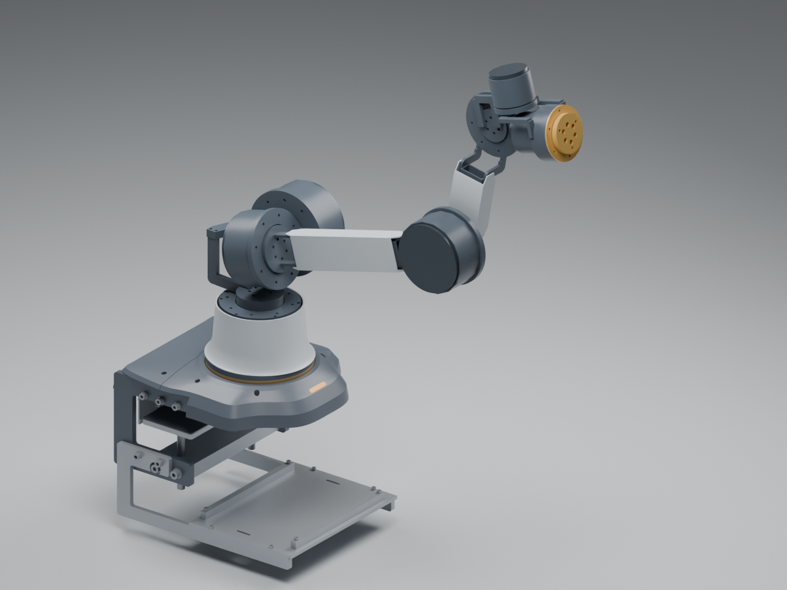
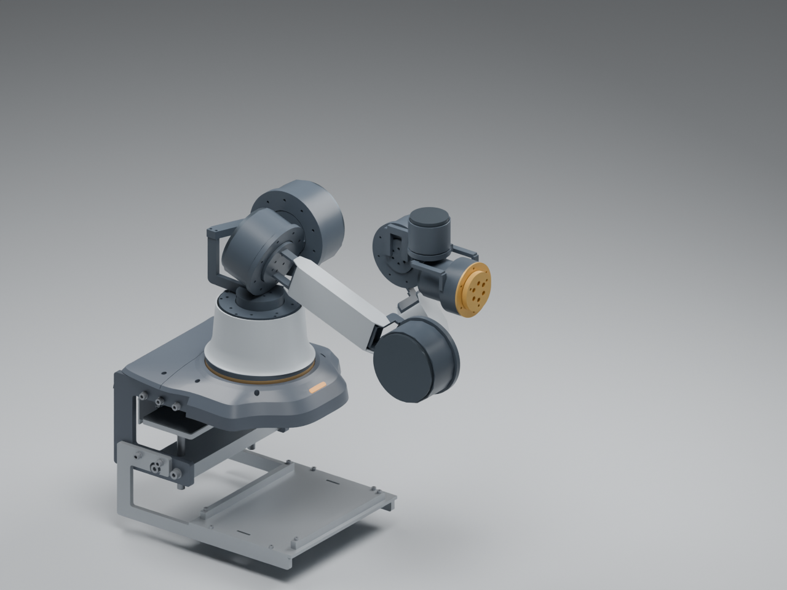

# A09 本体重设计：纤细比例与可加工骨架

**当前是外观与结构架构提案，尚未进入最终选项。** 用户要求连杆容易加工、适配候选电机、整体灵动纤细，并允许调整长度及底座与本体的衔接。A09取代A08作为本体讨论入口；原底座及花瓣头文件保持独立。

[打开七轴查看器](viewers/arm-body-a09/index.html) · [工程源文件与生成说明](../engineering/arm_a09/README.md)

## 外观与装配架构

连杆采用细直的“骨片”轮廓，电机作为有节奏的关节节点；肩部采用交叉轴，腕部压缩轴间悬臂。收腰过渡壳承接盾形底座，石墨色骨架、灰色薄护罩及少量黄铜色末端件与四瓣头的材料语言呼应。图中未装四瓣头，以免混入此前已暂停的末端设计。

真实电机外径保持不变：RS04为120 mm、RS03为106 mm、RS06为88 mm、RS00为57 mm。纤细主要来自直连杆和减少偏置；电机本身尚未减重或缩径。

| 模块 | 结构与加工思路 | 尚未冻结的内容 |
|---|---|---|
| 本体根座P00 | 开口车削筒体＋独立8 mm电机顶环，沿用PCD120底座接口 | 六M4连接、螺纹与边距强度、装配工具空间 |
| 肩部P01 | 独立8 mm背板、12 mm顶板、两个电机端座；平面铣削与侧面钻孔 | 板/端座紧固方式、预紧与受力路径 |
| 交叉肩部P02 | 10 mm原输出板接口＋紧凑定位端座，J2向侧面移15 mm | 小端座加工装夹、螺栓头与定位配合 |
| 上臂/前臂P03/P04 | 标准20×40×2直矩形铝管＋两侧4 mm平板＋独立电机端座 | 板到端座连接、垫片、管内抗压套、扭转与挠度 |
| 紧凑腕部P05/P06 | 平直短肋、互相正交的J6/J7；轴间距25 mm | 肋的应力、连接方式、轴承承载与寿命 |
| 外观件S00/S03/S04 | 薄护罩，与金属承载件分开 | 打印分件、卡扣/螺钉、线束检修开口 |

管件可锯切、钻孔；四片侧板可由4 mm板材切割轮廓再精加工；端座采用车削或多面铣削，定位圆与孔位应在同一基准加工。无需将主要连杆做成弯管或自由曲面金属件。当前不因板件与端座几何相接就认定完整螺栓承载路径成立。

[短版平板轮廓图](../engineering/arm_a09/build/slim/flat-profile-plan.svg) · [短版DXF目录](../engineering/arm_a09/build/slim/dxf/) · [短版STEP目录](../engineering/arm_a09/build/slim/step/)

## 比例、电机与静态负载

本轮按**裸臂法兰总外负载3 kg、质心在法兰中心**计算，不叠加工件及花瓣头质量。未知紧固、护套与线束每个B2–B7暂留0.1 kg，共0.6 kg；它是质量预算，不是完成的BOM。质量采用金属承载件＋塑料护罩假设，不能转用于塑料配合副本。

| 项目 | 短版slim | 长版long |
|---|---:|---:|
| 上臂轴距 | 300 mm | 340 mm |
| 前臂轴距X分量 | 145 mm | 185 mm |
| 前臂侧偏Y分量 | 62 mm | 62 mm |
| 肩至法兰轴向参考长度 | 610.7 mm | 690.7 mm |
| 水平参考姿态J2静态保持需求 | 33.59 N·m | 38.61 N·m |
| J4静态保持需求 | 13.62 N·m | 15.73 N·m |
| J5静态保持需求 | 6.13 N·m | 6.13 N·m |
| 裸臂估算质量，含0.6 kg预算，不含底座/盒子/外负载 | 9.35 kg | 9.45 kg |

| 轴 | 当前候选 | 外径 | 备注 |
|---|---|---:|---|
| J1 | RobStride RS03 | 106 mm | 埋入收腰根座 |
| J2 | RS04 | 120 mm | 肩部主要热/扭矩约束 |
| J3、J4 | RS03 | 106 mm | 分别上臂旋转与肘部回折 |
| J5 | RS06 | 88 mm | 腕俯仰 |
| J6、J7 | RS00 | 57 mm | 腕横摆与法兰roll |

厂商[2026-07-13参数表](https://github.com/RobStride/Product_Information/blob/main/README.md)列出双编码器及低减速比，但RS04额定扭矩依赖外部散热条件：40 N·m对应345×345 mm铝散热板，35 N·m对应220×200 mm散热板。**不能把这些扭矩直接作为紧凑罩内的持续能力。**长版38.61 N·m缺少可确认的持续散热和动态裕量，保留为外观对比；短版作为下一轮机械细化起点，也不代表电机定型。

当前七个候选电机按官方质量公差上限估算合计5.447 kg，整臂仍约9.35 kg。它改善了视觉比例，尚未实现整体质量意义上的轻量化。后续必须在肩部持续工况、电机配置和承载件质量之间继续取舍。J7在法兰中心载荷假设下roll重力扭矩接近零，但仍承受轴承力/弯矩和动态惯量，不能据此忽略选型。

[计算报告：短版](../engineering/arm_a09/build/slim/screening.json) · [长版](../engineering/arm_a09/build/long/screening.json)

标准矩形管截面参考[Misumi型材表](https://uk.misumi-ec.com/pdf/fa/2014/P2_0749-0750_F40_EN.pdf)：20×40×2 HFHQ管约0.607 kg/m；本模型按理想截面224 mm²和铝密度2.70 g/cm³计算0.6048 kg/m。表中0.315 kg/m属于角材，不适用于该矩形管。采购材料、圆角与实际截面需复核。

## 运动、干涉与线束边界

轴序Z/Y/X/Y/Y/Z/X；J2上臂竖直向上为显示0°。查看器角度范围是包装探索值：J1 ±120°，J2 −70°至110°，J3 ±100°，J4 −155°至135°，J5 −90°至130°，J6 ±60°，J7 ±90°。

两个长度版本的三种展示姿态均未检出大于0.05 mm³的实体相交。每版150个参考姿态逐轴离散样本中，有2个冲突样本：

- J2 = −70°：上臂管、侧板及护罩进入肩部顶板；该后仰位置应排除，或下一轮调整肩部顶板。
- J4 = −155°：J6腕部回折进入J2电机和端座；单独深折肘不成立，需要肩/腕协同。低位展示姿态使用J2 = 110°、J4 = −150°、J5 = 130°，该离散姿态未检出相交，不代表可从任意姿态连续到达。

查看器对上述两个精确已检查姿态显示干涉提示，其他拖动组合均标注未做碰撞检查。**本轮不把七个独立范围笛卡尔积发布为可执行工作空间。**

[短版单轴采样](../engineering/arm_a09/build/slim/local-wrist-sweep.json) · [长版单轴采样](../engineering/arm_a09/build/long/local-wrist-sweep.json) · [短版原厂肩/腕CAD核对](../engineering/arm_a09/build/slim/vendor-clearance.json)

根座内J1电机下方预留21.8 mm高度，背面14 mm宽、约9.5 mm深通道用于拆分线束。12 mm圆束不能据此认为已经可走通；电源、CAN及两路未来GMSL同轴要拆分布置。没有假设电机有中空穿线孔，未完成插头空间、应变释放、折弯寿命与全运动线束仿真。

## 交付与下一步

[短版Blender](../engineering/arm_a09/build/slim/odradek-slim-arm-a09.blend) · [长版Blender](../engineering/arm_a09/build/long/odradek-slim-arm-a09.blend) · [短版32件配合检查STL包](../engineering/arm_a09/build/slim/odradek-a09-slim-fit-review.zip) · [长版检查包](../engineering/arm_a09/build/long/odradek-a09-long-fit-review.zip)

模型内部使用米，界面显示毫米；J1.rotor至J7.rotor的`angle_deg`可调。STEP/STL/DXF采用mm。底座背景不属于本轮打印包，采购电机及轴承不打印。金属几何的打印副本只检查孔位、避让和比例，未经固定的板件不构成可上电的装配。

下一轮在外观比例确认后，先完成P01/P03/P04板到端座紧固、定位公差和工具空间，再做肩部静态散热、输出轴承载荷、刚度及载荷测试。完整平面制造图、罩壳打印分件和连续运动约束要基于这些结果；本轮图纸与数字检查不构成3 kg承载认证。
