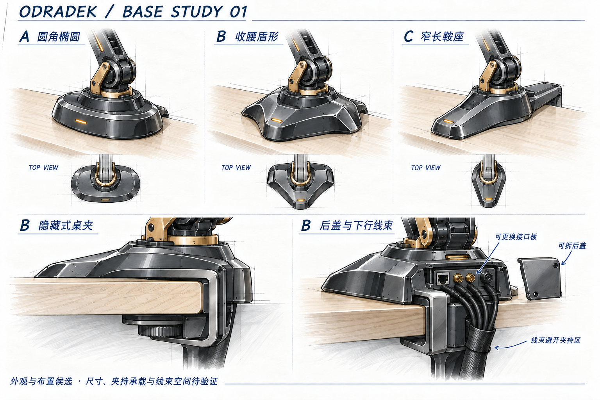

<!-- SPDX-License-Identifier: CC-BY-NC-4.0 -->
# 底座外形候选 01

状态：用户明确选择 **B 收腰盾形：呼应灯瓣折线，保留圆润边缘**，随后要求现成桌夹采购拼装，并在下面连接外置盒托架。A/C 作为比较过程保留；范围限于底座、隐藏桌夹、后部接线仓与托架的布置，不冻结尺寸、连接器或加工方案。

## 共同输入

- 桌面机械宠物，以外观协调和模块化为重点；延续石墨黑、少量香槟金属、琥珀色细节点缀。
- 隐藏式桌夹固定，背部隐藏接线仓，线束沿桌边下行至外置盒。桌夹在常用观察角度下隐藏，安装和维护时仍可访问。
- 本体提供 EtherCAT、双路 GMSL/GMSL2 与独立直流供电通路。相机品牌、插头数量和孔位不在本轮定型。
- 外置盒支持个人 Ubuntu PC 经普通 LAN 连接，也支持直接在盒内开发运行；本图不展开盒内硬件。
- 原有 2 kg 净工件另计末端质量及约 700 mm 臂展需求保留，不由外观图推导桌夹承载或底座尺寸。

## 三种外形

| 候选 | 造型与视觉效果 | 主要取舍 |
|---|---|---|
| A 圆角椭圆 | 低矮、连续曲面，少量切边；桌面亲和感较强 | 与末端的折线联系较弱，可能更像通用设备底座 |
| B 收腰盾形，用户已选 | 左右镜像、前端钝化，两侧适度收腰，后部容纳接线仓；使用少量大切面呼应灯瓣 | 需限制切面和金属装饰数量，避免臃肿或过强攻击性 |
| C 窄长鞍座 | 横向收窄、前后延伸，臂根与后部藏线脊连成一体 | 增加前后占用，后部长尾与桌边的比例需要进一步收敛 |

用户对 B 的确认是外观选择，不代表它的结构性能优于其他两案。三案大图保持相近的臂根和观察角度，供轮廓比较。后续沿 B 收敛，保留圆润边缘，不增加尖锐突出物。

## 建议共享的模块边界

1. 承力骨架连接臂根与桌夹；外观壳体、后盖及接口面板独立拆换。
2. 固定后仓与 J1 旋转部分明确分缝，外部线束从固定部位下行。旋转范围和内部线束处理另行核对。
3. 桌夹从桌边外侧绕至桌下，夹持垫分别接触桌面上下表面；图稿不要求在桌面开孔。
4. 接口面板内缩，后盖遮挡插头与线端；线束独立固定，绕开夹持接触面和调节机构。合束表示整理方式，不等于所有信号复用。
5. 前部小型状态光为造型建议，可移除；不增加底座显示屏或整圈灯带。

## 当前收敛：采购桌夹与桌下托架

用户明确采用简单、可在市场采购拼装的方案，拧紧固定即可；底座下方还需连接一个承托外置盒的架子。只考虑平整桌面、一般兼容性。此前 [市售桌夹对比](base-clamp-market-study01.md)提出的 15–60 mm 仍是未确认目标；下一步优先根据现成夹具选择兼容范围，不先开发专用调节机构。

建议装配关系如下。采购拼装与下挂托架是用户要求；具体连接方式、数量及型号仍是设计建议。

| 部件 | 首版做法 | 连接职责 |
|---|---|---|
| 金属桌夹总成 | 采购带固定承载座的螺杆桌夹，保留原有压垫和调节方式 | 在桌边拧紧，承载机械臂与下挂组件 |
| 固定承载件 | 优先标准多孔金属安装板；孔位不适配时，仅增加简单金属转接板 | 上接臂根，下接桌夹固定部位，并为托架留独立连接点 |
| 下挂支架 | 标准金属角码、带孔连接条或短立柱，以螺栓组装 | 从固定承载件沿桌后缘下伸，与桌夹螺杆错开 |
| 外置盒托架 | 采购小主机托架或设备托盘，设置机械限位与束带/固定螺钉 | 承托盒子，允许独立取下维护；不靠连接线悬挂 |
| B 收腰盾形外壳 | 初期 3D 打印 | 遮挡桌面上方的标准连接件，后盖可拆；不承担夹紧力或托架载荷 |

托架接在固定金属承载件上，不挂在可动压盘、夹紧螺杆或打印外壳上。盒子安装在桌下靠后的区域；保留夹紧工具、后盖、接头和散热空间，线束独立固定并留维护余量。拆卸盒子不应松开机械臂桌夹。盒体横放或竖放取决于盒子尺寸、散热方向与接头布置，本轮不冻结。

市场已有分开销售的部件，例如 Ergotron 的 **LX Pro 标准底座＋两件式桌夹 98-726-292**，以及 **Mini PC Mount 80-107-200**，见 [官方配件目录](https://www.ergotron.com/en-ca/products/accessories)。这证明采购模块的路线存在，不代表两者可直接组成当前方案；机械臂接口、下挂孔位和安装包络尚需核对。

盒体托架还可参考 [StarTech ACCSMNT](https://www.startech.com/en-be/display-mounting-ergonomics/accsmnt)：原厂标称设备夹持厚度 17–70 mm、承重 5 kg，支持桌下及 VESA 75/100 安装。这里的厚度指盒体，不是桌板；孔位可作为连接板候选接口，金属板安装需另配合适紧固件。盒子与电源如何分置尚未确定，因此不据此限制外置盒或直接下单。

后续只需先核对夹具及托架实物尺寸，画出同一套部件的侧视装配关系。具体型号、桌夹数量、板厚、螺栓、盒体尺寸/质量尚未定型。整套承载需覆盖本体、末端、2 kg 工件、运动反力及外置盒，不由显示器夹具或主机托架的额定重量直接推导。

图稿由内置 image_gen 生成并局部修改，是外观与布置示意。C 的俯视缩略图与主视图后部长度仍不一致，后仓线端也未形成精确插接关系；不要用这些缩略图读取尺寸或接口定义。[完整提示词与图稿检查](concepts/13-base-study01.prompt.md)。

本轮收敛为 B 外形、平整桌面、现成桌夹采购拼装和桌下外置盒托架；尚未形成可下单的配套 BOM 或已验证结构。
