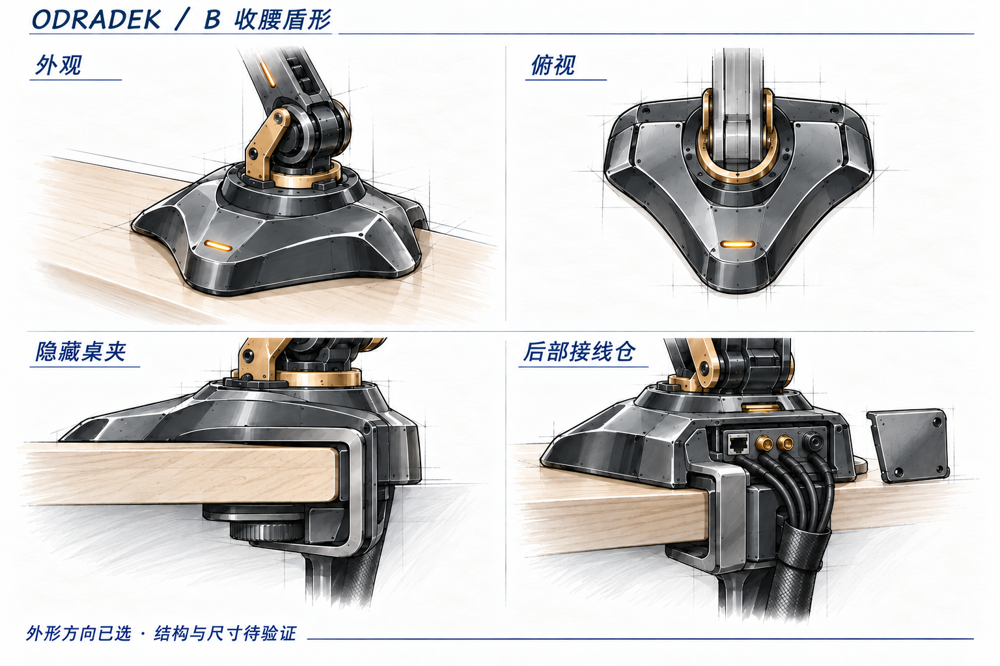
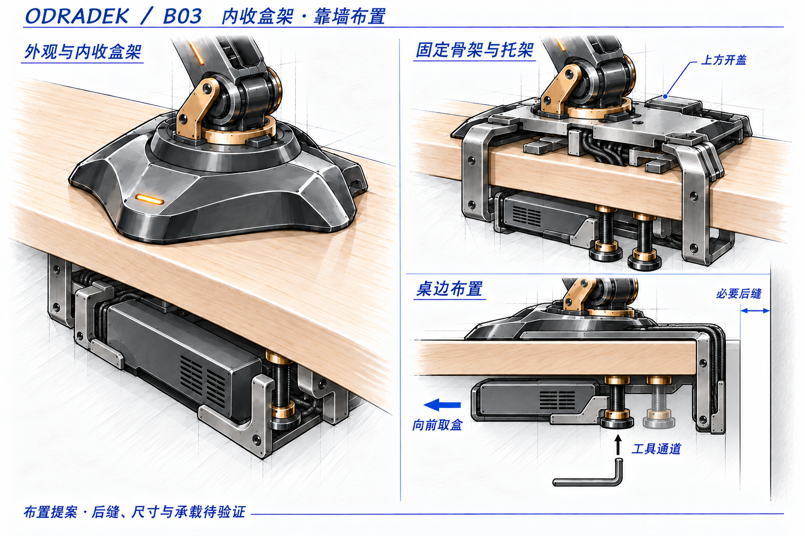

<!-- SPDX-License-Identifier: CC-BY-NC-4.0 -->
# 底座 B：外形与自设计夹具

状态：用户已选择 **B 收腰盾形：呼应灯瓣折线，保留圆润边缘**，授权自行设计夹具和盒架。最新确认 **盒架向桌内收，保留后沿夹装，允许夹体和走线所需的小间隙**，不是严格零间隙贴墙。本页只推进底座模块，具体新结构为设计提案，不冻结尺寸、材料或承载。

已选方向图单独放在 [selected/](concepts/selected/README.md)。上图为 B 方案参考摘编，夹具及后仓仍是原布置示意，尚未体现新增的桌下外置盒托架；完整 [A/B/C 三案比较板](concepts/13-base-study01.png)保留在研究目录。

## 共同输入

- 桌面机械宠物，以外观协调和模块化为重点；延续石墨黑、少量香槟金属、琥珀色细节点缀。
- 隐藏式桌夹固定，背部隐藏接线仓，线束沿桌边下行至外置盒。桌夹在常用观察角度下隐藏，安装和维护时仍可访问。
- 靠墙场景：盒架与盒体收进桌板投影以内；墙侧只容纳必要的固定夹体与受保护走线，不依赖向墙侧开盖、取盒或拔插。实际后缝待包络验证，未指定毫米数。
- 本体提供 EtherCAT、双路 GMSL/GMSL2 与独立直流供电通路。相机品牌、插头数量和孔位不在本轮定型。
- 外置盒支持个人 Ubuntu PC 经普通 LAN 连接，也支持直接在盒内开发运行；本图不展开盒内硬件。
- 原有 2 kg 净工件另计末端质量及约 700 mm 臂展需求保留，不由外观图推导桌夹承载或底座尺寸。

## 三种外形

| 候选 | 造型与视觉效果 | 主要取舍 |
|---|---|---|
| A 圆角椭圆 | 低矮、连续曲面，少量切边；桌面亲和感较强 | 与末端的折线联系较弱，可能更像通用设备底座 |
| B 收腰盾形，用户已选 | 左右镜像、前端钝化，两侧适度收腰，后部容纳接线仓；使用少量大切面呼应灯瓣 | 需限制切面和金属装饰数量，避免臃肿或过强攻击性 |
| C 窄长鞍座 | 横向收窄、前后延伸，臂根与后部藏线脊连成一体 | 增加前后占用，后部长尾与桌边的比例需要进一步收敛 |

用户对 B 的确认是外观选择，不代表它的结构性能优于其他两案。三案大图保持相近的臂根和观察角度，供轮廓比较。后续沿 B 收敛，保留圆润边缘，不增加尖锐突出物。

## 建议共享的模块边界

1. 承力骨架连接臂根与桌夹；外观壳体、后盖及接口面板独立拆换。
2. 固定后仓与 J1 旋转部分明确分缝，外部线束从固定部位下行。旋转范围和内部线束处理另行核对。
3. 桌夹从桌边外侧绕至桌下，夹持垫分别接触桌面上下表面；图稿不要求在桌面开孔。
4. 接口面板内缩，后盖遮挡插头与线端；线束独立固定，绕开夹持接触面和调节机构。合束表示整理方式，不等于所有信号复用。
5. 前部小型状态光为造型建议，可移除；不增加底座显示屏或整圈灯带。

## 当前主线：B03 内收盒架与靠墙布置

自设计的范围是承力骨架、桌夹几何、盒架接口与外观壳体。螺钉、螺母、垫片及适配的压垫仍可使用标准件，不因自行设计而重新开发通用紧固件。不再围绕显示器支架底座、短立柱或现成小主机架安排外观。

这版保留左右对称的金属侧板骨架、两个桌下夹紧螺杆和中央固定走线通道。双螺杆仍是结构建议，不代表已证明满足机械臂载荷；其间距、夹紧力和桌面承压还要计算。外置盒改为桌板下的扁平横置占位，托盘从固定骨架向桌内延伸，盒体与承托区域放在夹紧螺杆更靠桌内的一侧；具体尺寸与散热方案尚未确定。

| 模块 | 本轮构想 | 连接与维护 |
|---|---|---|
| 承载上板 | 独立金属板，直接连接 J1 固定座；下表面设置桌面保护垫 | 承担上方载荷并连接左右侧板；外罩薄边不承压 |
| 桌夹骨架 | 左右两块 C 形承力侧板绕过桌后缘，由上板、后脊和下反力桥连接 | 螺栓组装形成金属受力路径；中央线槽避开关键横向连接 |
| 夹紧件 | 左右各一个内六角螺杆向上顶压垫；压垫可小角度调平并与螺杆转动解耦 | 工具从下方进入；压垫接触桌底，上板保护垫接触桌顶 |
| 后接线仓 | 位于底座后部，上方取下小盖；接口板朝侧面/下方内缩，线槽固定 | 不向墙侧打开或拔插；接头退出和线缆转弯空间另行核对，接口板以后可换 |
| 外置盒架 | 固定骨架上的独立螺栓接口，左右挂臂向桌内延伸，连接低矮 U 形托盘 | 盒体与托盘不向桌后凸出；承托区避开螺杆下方，独立挡件防脱，向桌前取盒 |
| B 外观罩壳 | 保留收腰盾形、圆润边缘、石墨黑大切面与少量琥珀点缀 | 单独拆装，不承担桌夹预紧力或盒子重量 |

### 装配关系与使用动作

臂根载荷传入金属上板和左右侧板，通过上方保护垫、下反力桥及螺杆压垫夹住桌面。两侧板必须有金属横向连接，外罩不参与抗扭。外置盒的重量沿托盘、向内延伸的挂臂、固定后脊传回同一骨架，不挂在夹紧螺杆、可动压垫或外罩上。内收改变了盒架的悬臂方向与偏心，后续按新力臂核算，不沿用 B02 外挂布局。

安装构想为：从桌后沿套入夹体，交替拧紧两侧螺杆，再安装朝桌内延伸的盒架，放入盒子并锁住独立挡件。安装时可以先移开桌子，安装后的日常拆盒与接线维护不应再依赖桌后操作。盒子、托盘承载区位于螺杆的桌内侧，两侧挂臂绕开工具路径；两个螺杆正下方保留直达的操作通道，并覆盖厚桌/薄桌两端的位置和扳手转动范围。

本文“向桌内/向前”指从桌后缘朝使用者方向，区别于朝墙的桌后方向。盒体在桌板下横置，主要维护路径为朝桌前抽取；采用可拆限位挡件，不增加抽屉滑轨或复杂快拆。散热面和可维护插头优先朝侧方或桌内，避免被桌板、托盘和墙封堵，接口最终朝向仍需与盒内硬件匹配。

后接线仓位置不变，盖板改为从上方取下；插头在仓内朝侧方或下方布置。线束沿固定通道下行后转向桌内，避开压垫、螺杆和取盒路径。固定线槽上下各设线束固定点；拆盒前从可访问的一面断开其电源和信号连接，桌夹保持锁紧。EtherCAT、两路 GMSL/GMSL2 与供电仍是独立通路，概念图不冻结插头数量、孔位或盒内硬件。

### 靠墙空间边界

用户已确认允许必要小间隙，因此保留后沿 C 型夹装，不改为侧边或穿孔安装。夹体后脊和受保护线束仍有厚度，装好后桌后需要永久保留相应间隙；临时移开桌子安装不能消除这部分占位。新目标是盒体/盒架不增加桌后凸出，后缝由固定后脊、走线通道与防擦余量的实际组合包络决定。

本轮不承诺某个毫米值。后续须连同端接长度、护套、线缆最小弯曲半径和上盖取放一起检查，不能为压缩后缝把 GMSL 同轴线急折或挤在夹持面里。图中墙线与后缝只用于明确方向，不可量取尺寸。

### 验证与制造顺序

先用 3D 打印外罩和无载空间样件确认外形、夹口、工具及走线空间；承力夹持原型采用金属板件与标准紧固件。加工方向优先切割/折弯/必要位置机加工后螺栓装配，不预设一体铸件或复杂曲面承力件。

下一步只收敛同一套底座的桌边侧视和后视包络，检查小后缝、两侧工具通道、中央线槽、向前取盒及桌下腿部空间。15–60 mm 保留为早期提出的桌厚验证目标，尚非已确认兼容范围；板厚、螺纹规格、预紧、接触面积、盒体尺寸/质量和桌板允许承压均未冻结。承载核算须包括本体、末端、2 kg 净工件、运动反力及内收盒架；本轮没有结构或带载资格结论。

新图放在 [proposals/](concepts/proposals/README.md)，是沿已选 B 外形的结构提案；确认后再更新 [selected/](concepts/selected/README.md)。图稿及其标注不能代替尺寸图或机构验证，出处见 [B03 提示词与检查](concepts/proposals/base-b-inward03.prompt.md)。

## 历史选择与比较资料

此前曾提出采购桌夹总成和小主机托架拼装；用户最新明确撤销该前提。市售夹具仅保留为 [安装方式参考](base-clamp-market-study01.md)，不再约束本项目轮廓、孔位或盒架。原 [A/B/C 图稿记录](concepts/13-base-study01.prompt.md)继续保留；原后仓线端与夹具只是布置意向，不是本版结构。

[B02 外挂竖盒提案](concepts/proposals/base-b-custom02.png)及其 [出图记录](concepts/proposals/base-b-custom02.prompt.md)保留作历史；桌后竖置盒体已被 B03 向内横置布局替代。
