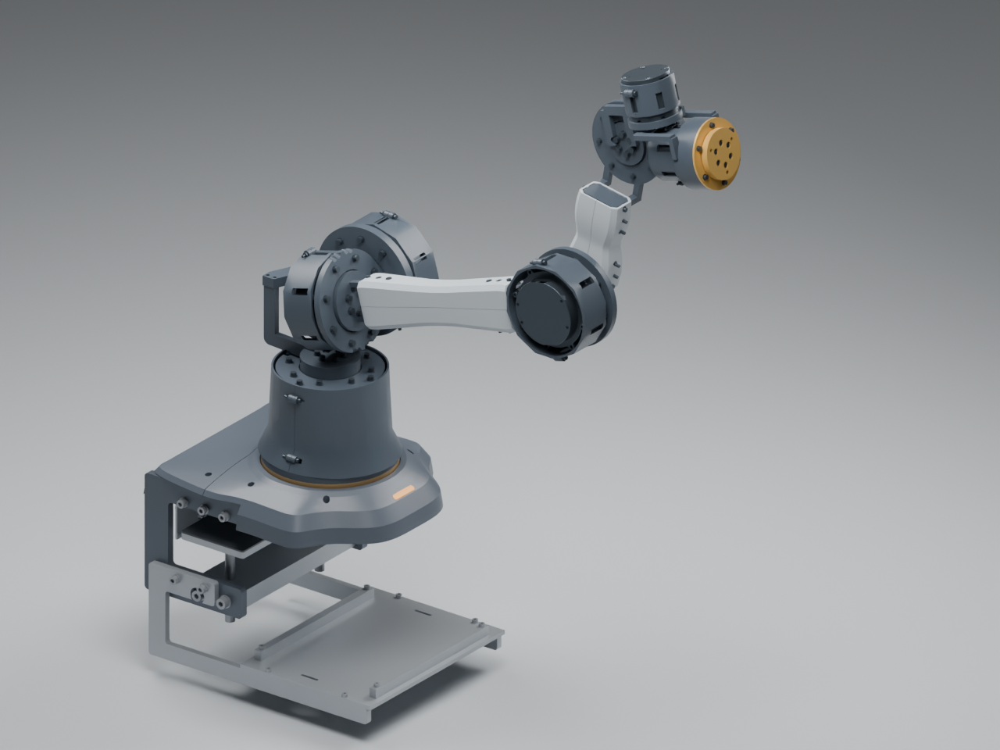
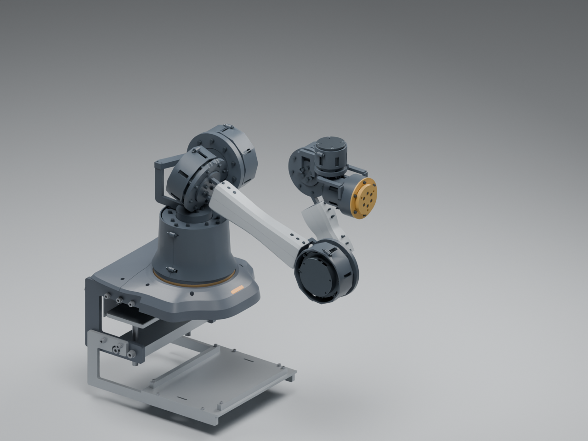

# 长版 A10 收敛目录

**2026-10-08更新：用户保留长版，但已否定此处A10本体外观。这里保留历史与机械比例记录，不能作为当前认可的造型；新外观选择见[A11风格探索](../../exploration/arm-body-a11-style-study/README.md)。**

2026-10-08。用户选择的长版比例继续推进为机械试装原型；本目录只保存这一方向，短版及历史提案留在原目录。外观采用细直管骨架、折面曲线护罩、深色关节与琥珀色细节，呼应收腰盾形底座和四瓣头。四瓣头不参与本体结构及负载计算。

[七轴滑条查看器](../../../viewers/arm-body-a10/index.html) · [本体设计与重建](../../../../engineering/arm_a10/README.md) · [验证结果与后续门槛](../../../engineering/arm-body-a10-validation.md)

这是当前收敛的制造验证方向，尚未经过用户对新护罩造型的最终审阅或实物打印装配验收。
