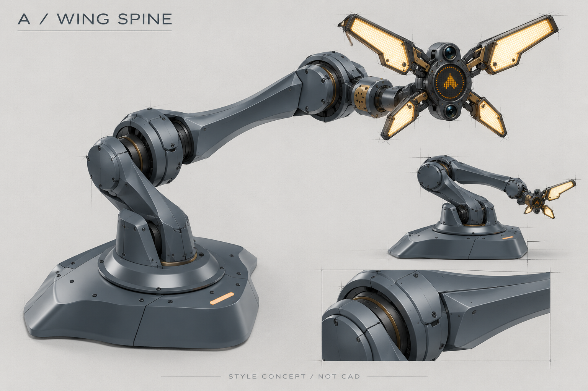
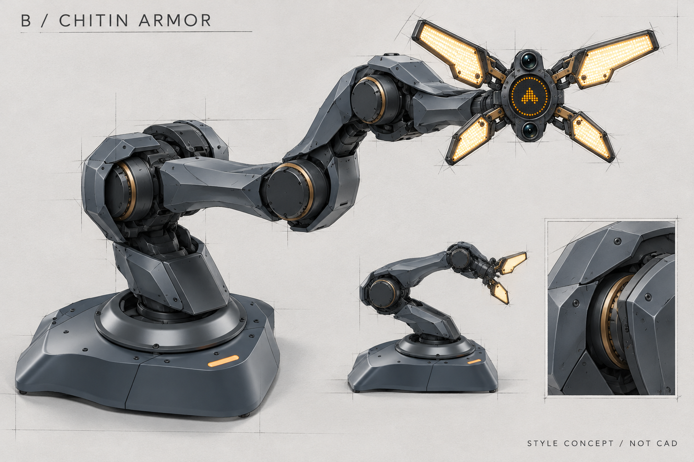
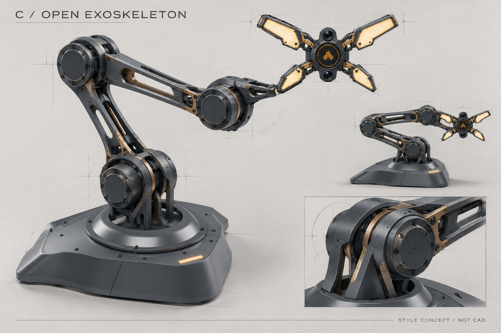

# 长版本体风格选择：A / B / C

2026-10-08。**尚未选择；本轮不修改机械构型、打印结构或底座源模型。** 用户保留长版，拒绝A10本体外观，要求重新建立与魔鬼鱼底座和四瓣头一致的设计语言。

随后讨论的[整机衔接与模块调整图](../../selected/arm-body-a11-style-bridge01/README.md)提出A连续轮廓结合少量B腕部折面的方向，用户已确认以此作为A11修改方向；本目录A/B/C仍保留为未进入最终方案的探索记录。

## 三个方向

| 方向 | 主要设计语言 | 要控制的问题 |
| --- | --- | --- |
| A 连续翼脊 | 长曲面、明确脊线、收腰连杆、低位过渡根座；统一性最强 | 后续必须在真实肩部交叉轴体积、插头和散热余量之外建立曲面，不能靠缩小电机实现 |
| B 分层甲壳 | 斜向盾甲、分层阴影缝、折面连接；最呼应四瓣头 | 防止叠层过厚、遮挡运动间隙和维修工具；优先浅槽而非每条线都分件 |
| C 开放骨架 | 长镂空、双侧筋、局部护罩、结构与铜色节点可见；轻盈且机械感强 | 镂空不能切断负载路径；线束防护、夹点遮挡和可清洁性需要深化 |

三张是内置image_gen生成的工业设计风格参考，不是精确CAD渲染。虽使用实际电机尺寸与长版构型作为提示约束，生成图里的轴位置、关节数量可读性、连接机构和折叠视图仍可能简化或偏离；不能据图确定装配关系、打印零件、干涉或负载。最终由用户选择整体语言，再在真实电机STEP上逐面落实。四瓣头在图中用于风格比较，不纳入本体3 kg裸法兰目标的计算。

## 共用设计来源

底座权威内容来自会话 **调研七轴机械臂外观风格**（`01a0e333-57b3-7cc3-963d-365298d0dcba`），工作区为同级`outputs/odradek`。本轮直接使用那里的文件作参考，没有复制或修改底座结构：

- `../odradek/engineering/base_b05/build/exterior/ODR-BASE-B05-EXTERIOR.blend`：同一份原生底座模型。
- 同目录`exterior-manifest.json`、`front-three-quarter.png`、`top.png`：本次读取为B05-EXTERIOR-SHAPE-06，约356×253 mm，环台OD170/ID104、轴心(0,75) mm。
- `../odradek/docs/concepts/selected/head-open-reference.png`：已确认的四瓣头外观参考，上大下小、左右对称。

生成期间，底座源模型已更新为B05-EXTERIOR-SHAPE-07的8件方案；本轮引用的完成渲染仍是SHAPE-06，外轮廓控制点一致，渲染文件哈希未变。源模型更新记录写入`baseline.json`。后续Blender集成必须直接读取同一位置的最新SHAPE-07模型和安装接口，不把本体旧B04快照当作当前外观或承载接口。底座当前外观环台不是已经批准承载的机械法兰。

本体保留[A10长版机械输入](../../../../engineering/arm_a10/README.md)与[锁定原厂资料](../../../../docs/engineering/sources/arm-a05-mechanical-sources.json)：J1/J3/J4 RS03、J2 RS04、J5 RS06、J6/J7 RS00，双编码器QDD、CAN。具体几何、源文件SHA及注册变换已存在导入记录和本机原厂电机Blender，不能再用任意圆柱替代实际电机来声称制造完成。

## 选定后的深化顺序

使用同源魔鬼鱼底座、原厂电机模型与长版轴架构搭建统一Blender场景；先处理根座—肩部、肘部和腕部的主轮廓，再设计与负载路径分离的少量可拆打印护罩。考虑真实插头、侧向跨轴走线、螺钉/螺母与工具入口、散热和Z形收拢。逐模块输出实际渲染、STEP/STL、尺寸与装配图，并重新做数字配合检查。现有3 kg负载仍须关闭J2温升、输出轴承和打印强度等验证项。

[基线来源和哈希](baseline.json) · [A完整提示词](A.prompt.md) · [B完整提示词](B.prompt.md) · [C完整提示词](C.prompt.md) · [图像文件校验](images.json)。本目录属于探索，用户选择后再将选中方案单独放入收敛目录。
