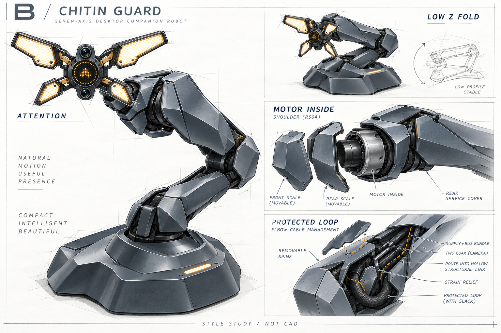
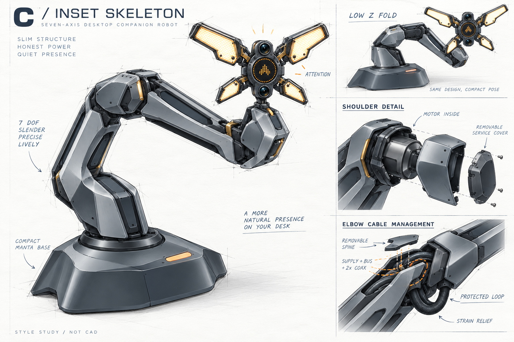

# A12 臂身包覆设计：风格候选

2026-10-08。用户认为 A11 臂身缺乏设计感，电机裸露、走线尚未解决；要求先绘制候选风格，确认后再细化。**本目录全部属于未选定探索，不修改 A11 CAD、打印件或选定方案目录。**

这轮用内置 image_gen 绘制工业设计图稿。原厂电机的实体尺度作为设计约束，图稿不是原厂 CAD 的精确投影，也不是干涉、散热、负载或线束寿命验证。

| 候选 | 轮廓策略 | 深化时优先解决 |
| --- | --- | --- |
| A 连续甲壳 | 以连续长曲面、收腰和折脊连接底座与末端；关节外部用偏置盾形罩，隐藏大圆盘轮廓 | 大肩部真实体积、护罩运动边界、连续轮廓与维修开盖兼容 |
| B 层叠鳞甲 | 宽肩盾甲、斜向阴影缝、少量重叠护片；最直接呼应四瓣造型 | 层间夹点与运动间隙、避免过厚、降低分件数 |
| C 嵌入式骨架 | 细长双脊与内凹面形成视觉轻盈；电机仍完整包覆 | 凹面不能切断承力件，线束通道必须独立可拆、可装配 |

共用边界：保留七轴长版拓扑、低位 Z 折叠、末端 J7 roll、上大下小四瓣和上下鱼眼；现有电机为 J1/J3/J4 RS03、J2 RS04、J5 RS06、J6/J7 RS00，不允许靠缩小电机获得纤细外观。图中透视、关节数可读性和折叠姿态可能简化，须由后续实际模型逐项落实。

走线设计意向：金属连杆承力，可拆背脊槽收纳电源、通信及双路 GMSL 同轴；在非贯通电机外侧绕轴，采用受护罩保护的活动 U 弯，设置固定点和应力释放。关节两侧的壳体保持独立，不用外壳跨接旋转轴；不假定电机有中心通孔或已有滑环。弯曲半径、插头包络、夹线风险、有限旋转角度和线束寿命仍须按最终线材实测。图稿中的线束示意不构成已完成的布线设计。

底座引用同级 `outputs/odradek/engineering/base_b06/build/exterior/front-three-quarter.png`，是另一会话最新紧凑底座候选的渲染；只作风格参考，不宣称 B06 已与 A11 完成装配适配。本体原装配检查依旧绑定 B05 SHAPE08，不能移用到新外罩或 B06。四瓣直接引用同源 `docs/concepts/selected/head-open-reference.png`，不另建可编辑副本。参考文件及图像 SHA 记录在 `references.json`、`images.json`；完整提示词见 `A.prompt.md`、`B.prompt.md`、`C.prompt.md`。

用户选定后，将选定图移入独立收敛目录，再依序进行肩部与根座、肘部与长连杆、腕部的真实电机包覆、插接与走线、工具入口、可拆分件设计。每个模块先给实际 Blender 视图确认，再输出试配件并检查；不从概念图直接宣布可制造。
