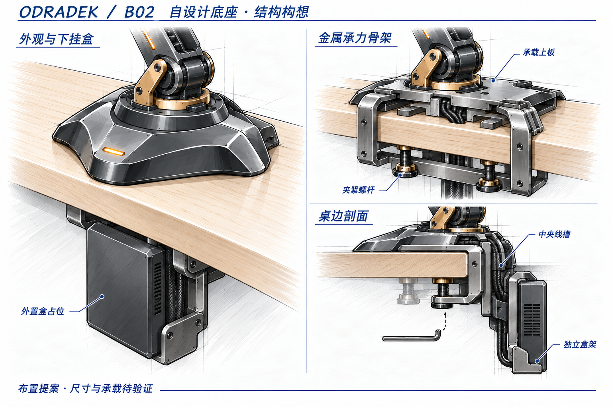

<!-- SPDX-License-Identifier: CC-BY-NC-4.0 -->
# 待确认的深化图

本目录放沿已选方向继续设计、尚待确认的新图。它与 [selected/](../selected/README.md) 分开，避免将新提案当成已经选定的外观或结构。

## B02：自设计底座、隐藏桌夹与独立盒架

保留已选 B 收腰盾形，按用户最新授权自行设计骨架和夹具。提出左右 C 形承力侧板、双螺杆、中央线槽及独立下挂盒架；外置盒为竖置体积占位，尚未选定盒体。图稿表达布置目标，不证明受力、装配或制造可行。

[结构说明](../../base-design-study01.md) · [提示词与视觉检查](base-b-custom02.prompt.md)
