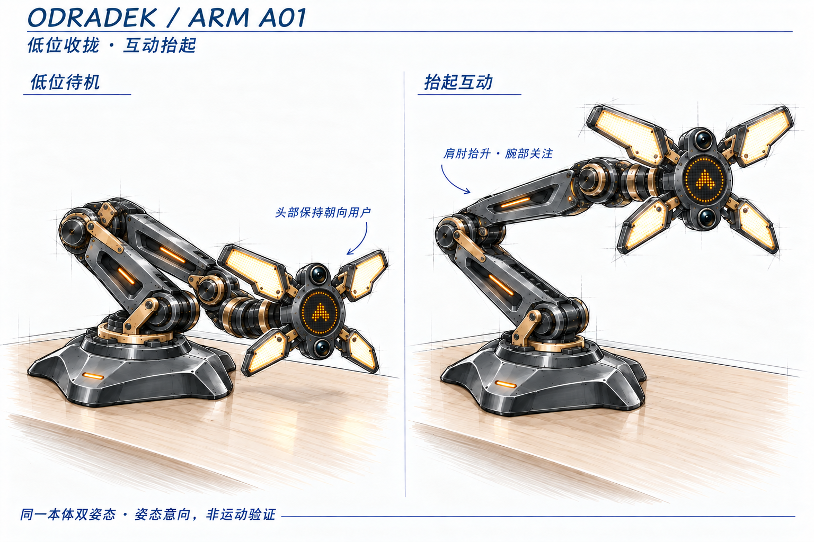

<!-- SPDX-License-Identifier: CC-BY-NC-4.0 -->
# 机械臂本体：待确认图稿

本目录只放本体当前的深化提案，与已选外观图及其他模块的候选分开。用户已确认“低位收拢，互动时抬起”；这项选择不自动确认以下图中的全部形状与机械细节。

## A01 / 低位待机与抬起互动

比较同一本体在两个状态下的轮廓，四瓣头保持相同展开状态。尚未完成轴系、关节范围、动态间隙与负载验证；本图不是制造或运动学结果。

[本体讨论与确认输入](../../../arm-body-discussion.md) · [生成提示词和检查](01-idle-attention.prompt.md)
