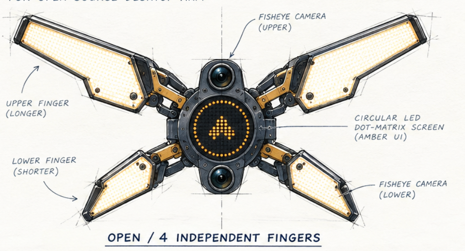
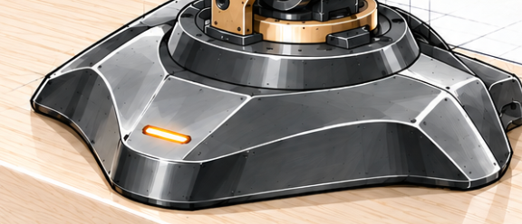
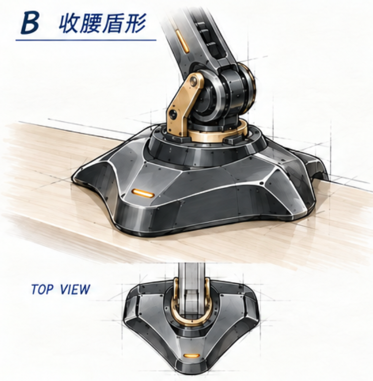

<!-- SPDX-License-Identifier: CC-BY-NC-4.0 -->
# 已选设计方向

本目录单独存放用户已选定方向的图稿。按模块归档，供后续深化与外观对齐；不混入其他候选、比较板或历史机构研究。“已选”指外形方向，不等于结构定型或制造发布。

## 末端：四瓣展开外形

原参考图原样迁入，保留上两瓣大、下两瓣小、左右镜像、宽肩折线和截短端部。双鱼眼保持上下位置，按后续确认向上/下外倾。

图中 `4 INDEPENDENT FINGERS` 是旧标注；现已允许一个隐藏电机带动四瓣联动，不再要求独立四驱。本图只作为展开外形依据，不确认闭合、传动、接触或相机倾角。[当前末端说明](../../r5-modular-design.md)。

## 底座：B 收腰盾形

从原三案板的 B 方案单独整理，保留收腰、大切面和圆润边缘，不包含 A/C。单方案板通过内置 image_gen 编辑生成，属于参考摘编，非逐像素裁切；原始选择依据仍是 [历史三案板](../13-base-study01.png)的 B。

夹具和后仓小图延续原布置示意，并非已定结构。用户最新撤销现成总成采购拼装前提，改为自行设计夹具、承力骨架与桌下外置盒托架；螺钉等通用件仍可标准化。本图只保留已选 B 外形，尚未体现新托架。当前 [B03 内收结构提案](../proposals/README.md)单独放在待确认目录，详见 [底座方案](../../base-design-study01.md)。

最新形态澄清：盾形特指低矮飞碟式护盾，中央抬起、肩部向外铺展、外缘下扣。早期[B04-P2三维研究](../../../engineering/base_b04/README.md)保留为历史；当前已确认的实际外观以[B06-COMPACT-02](../../../engineering/base_b06/README.md)为准。

## 归档规则

- 仅在用户明确选择后，将相应外观方向图纳入本目录；“最新生成”不自动表示“已选”。
- 多方案板和含未选造型的拼图留在上一级研究目录；不得整板放入本目录。
- 同一模块的新图应注明新增或修改内容、确认范围；未经确认的替代外观仍留在研究目录。
- R5 末端深化图、独立本体图及工程 CAD 仍是研究材料，入口见 [图稿目录](../README.md)。
- 出图来源与提示词见 [整理记录](base-b-shield.prompt.md)；保留原图和变更记录。

最新约束以此图的短宽盾形、后置环台、肩部大曲面及简约琥珀灯窗为准。[B05原生模型](../../../engineering/base_b05/README.md)保留为历史比较。用户已确认[B06-COMPACT-02](../../../engineering/base_b06/README.md)的紧凑一体方向与本轮外观；此后的底座修改遵循[同源规则](../../engineering/base-authority.md)，不另建并行底座。外观确认仍不等于制造放行。
