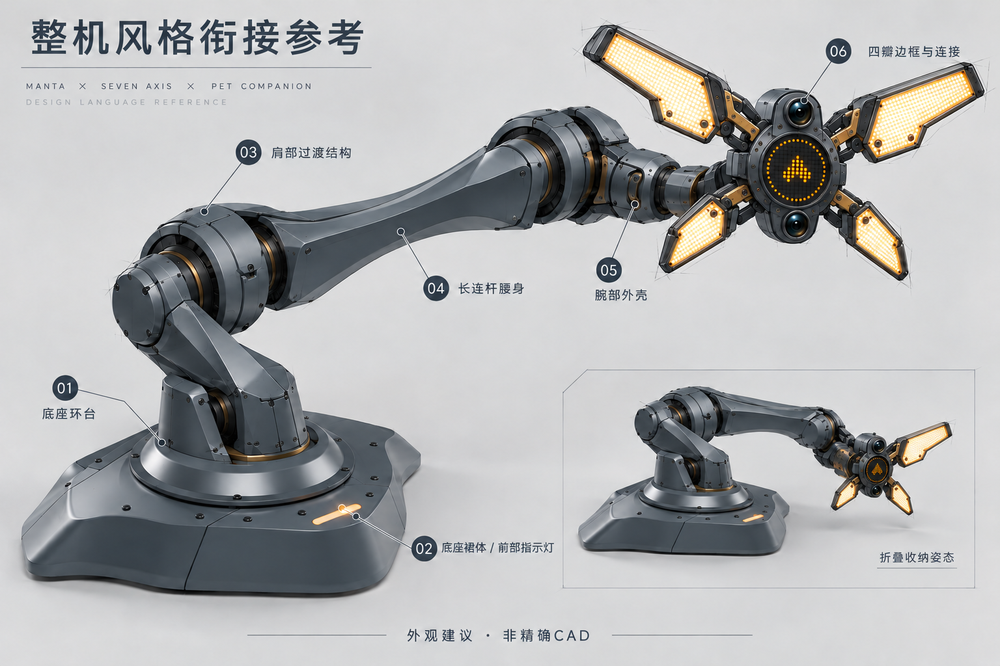
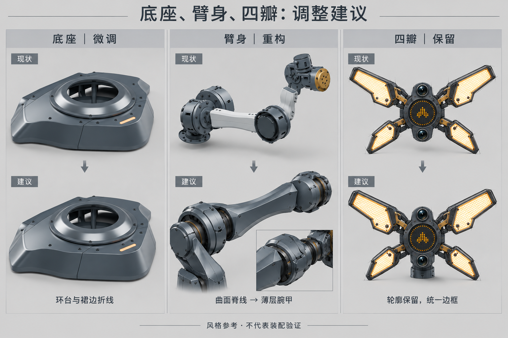

> 2026-10-08 用户已确认：底座微调、臂身重构、四瓣形状保留。此目录仅收纳已选方向；以下两图为风格参考，实际几何及打印件见 `engineering/arm_a11`。

# 整机风格衔接与调整参考

2026-10-08。**外观建议，未获造型定稿确认；不是精确CAD、打印文件或装配验证。** 本轮围绕最新同源魔鬼鱼底座、保留长版本体、已满意的四瓣头，绘制整机参考与分模块对照。使用内置image_gen，并针对整机图的两处标注做了文字修正。

| 图中区域 | 保留 | 建议调整 |
| --- | --- | --- |
| 01 底座环台 | 魔鬼鱼底座与环台的比例 | 强化环台外沿的宽倒角和明确转折，根部护罩接入环台时保持连贯。环台是外观装甲，不因本图而成为旋转/承载法兰 |
| 02 底座裙边与灯窗 | 两翼外展、腰部内收、圆钝前鼻、琥珀灯 | 冠面—裙边折线更清楚，灯窗边框采用同一套倒角；不增加装饰灯带或无功能分件 |
| 03 根座—肩部 | 真实RS04/RS03的交叉轴空间 | 将直立根罩和孤立圆盘改为低位、后掠的分体过渡护罩，实际插头、散热与运动空间不能缩小 |
| 04 长连杆 | 长版轴距、细长意图、金属负载路径 | 收腰曲面结合纵向脊线与平面侧腹，让端部护罩和连杆顺接；不以大量叠甲增加体积 |
| 05 腕部 | J5/J6/J7轴序与J7直接roll | 从连杆的曲面逐步过渡到薄层折面，关节阴影缝、螺钉座和四瓣边框呼应。实际电机、独立头部接口与侧向走线需在Blender中确认 |
| 06 四瓣 | 上两瓣较长较大、下两瓣较小，左右对称；灯面、中央点阵和上下鱼眼布局 | 只建议统一边框、倒角、紧固件处理及头—腕连接。生成图的微小形状偏移不构成对已确认灯瓣轮廓的修改要求 |

本轮的核心是**底座微调、臂身重构、四瓣保留**。深石墨灰、少量铜色机械节点与琥珀灯色统一；根部曲线较连续，向腕部渐进增加清晰折面。两张图统一绘图与光照语言，以减少原先底座真实渲染和四瓣手绘之间的比较偏差。

## 同源内容与后续边界

底座继续只读取另一个会话 **调研七轴机械臂外观风格** 的源文件：同级`outputs/odradek/engineering/base_b05/build/exterior/ODR-BASE-B05-EXTERIOR.blend`及同目录渲染、manifest，本轮读取为SHAPE-07。没有修改底座模型、接口或其分件数量。四瓣读取同一仓库`docs/concepts/selected/head-open-reference.png`。来源SHA见[baseline.json](baseline.json)。

长版、电机型号和参数使用当前机械输入：J1/J3/J4 RS03、J2 RS04、J5 RS06、J6/J7 RS00。生成图仅按这些体积和轴序作风格约束，画中的电机可见数量、构型、折叠姿态、倒角和机构并不是原厂CAD或有效干涉检查。确认外观后，必须直接读取最新底座及已锁定电机STEP，在统一Blender场景内设计真实连接、可拆护罩、紧固和走线；造型图不能放行3 kg承载或替代打印试配。

[整机图完整提示词](overview.prompt.md) · [调整图完整提示词](adjustments.prompt.md) · [标注修正提示词](overview-label-fix.prompt.md) · [图片校验](images.json)。图像保存在探索目录，不与最终选中方案混放。
