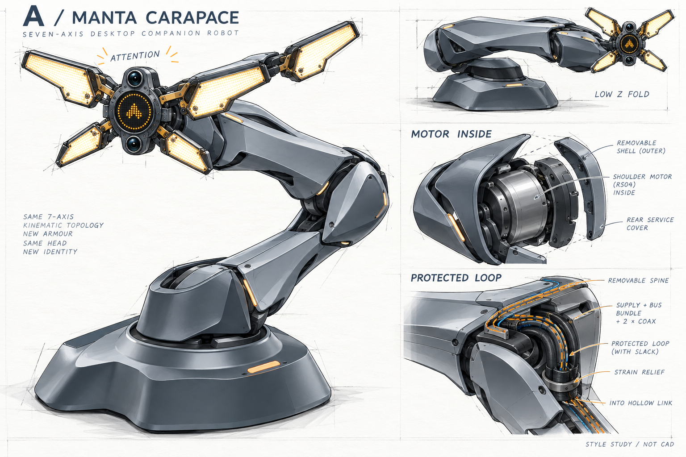

# 已确认 A：连续甲壳

2026-10-08，用户明确选择“A好”。图稿由内置image_gen生成，完整提示词在`A.prompt.md`，图像和输入来源哈希在`images.json`、`references.json`。原图是风格参考，不是精确CAD或制造放行。

采用连续长曲面、收腰与明确折脊，关节用偏置盾形甲壳包覆；深色运动缝、可拆背脊和后侧维修开口承担功能，避免裸露圆盘电机或装饰性拼片。四瓣主体轮廓保留；底座继续读取相邻权威项目，不建立第二份可编辑底座。

确认的第一模块为肩部包覆：先围绕全尺寸RS04/J2设计两片可拆护罩与后侧线弯空间，再处理J3、肩桥与臂根的连续轮廓。其后依次推进连杆与肘部、腕部。每段保留承力件与非承力外罩的边界，检查真实插头、线束、工具入口、运动间隙及散热。

本次选择替代A11外观迭代方向；A11仍保留为已有结构基线及历史试配文件。图稿中的七轴、折叠姿态和RS04拆解需回到源STEP重建，不能直接量图造件或继承A11检查结果。
