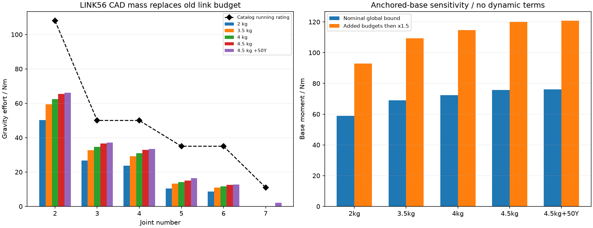

# 用实际连接件质量复算整臂与底座

**CANDIDATE-LOADS-01：混合质量模型，非整机制造／载荷放行。** 将 LINK56-01 的六件原创 STEP 逐一求体积、质心和转动惯量，替换旧 L5 预算；其他关节和连接仍保留目录／预算代理。主 R4-layout-03 参数不变，历史 HEAD-MASS-01 结果不覆盖。

六件按均匀6061、ρ=2700 kg/m³得到 **0.811973 kg**，世界质心约 **[0, −52.439, 522.224] mm**。另在该点放0.10 kg紧固件／局部线束余量，共 **0.911973 kg**。余量不是已称重，其惯量仍是50 mm立方体代理；仅六件金属使用真实CAD积分。全部属于J5之后、J6之前的同一刚体。

对六件和余量用平行轴定理合成等效刚体，在12个姿态比较逐件与合成模型：重力矩最大差7.11×10⁻¹⁵ N·m，质量矩阵最大差4.45×10⁻¹⁶ kg·m²。这验证积分、坐标和刚体合并的一致性，不证明其余整机惯量真实。

## 整臂静力

仍按净工件2 kg、旧名义TCP与头COM起算，另外检查4.5 kg头向+Y偏50 mm。每情景使用15,005个固定种子样本及每轴三个局部优化起点，随后用独立Arm重力实现核对。下表每列来自各自的姿态，不是同一机器人姿态；所有姿态仍未经碰撞、线束或任务工作域筛选。

| 头部质量与偏心 | J2 | J3 | J4 | J5 | J6 | J7 |
|---|---:|---:|---:|---:|---:|---:|
| 2 kg | 50.309 | 26.729 | 23.661 | 10.381 | 8.711 | 0.000 |
| 3.5 kg | 59.420 | 32.627 | 29.191 | 13.175 | 10.991 | 0.000 |
| 4 kg | 62.457 | 34.595 | 31.035 | 14.106 | 11.751 | 0.000 |
| 4.5 kg | 65.495 | 36.564 | 32.879 | 15.038 | 12.511 | 0.000 |
| 4.5 kg，+Y 50 mm | 66.112 | 37.130 | 33.507 | 16.365 | 12.704 | 2.206 |

单位为N·m。已找到的姿态均未超过目录运行力矩；但4.5 kg、+Y 50 mm情景的全域路径上界中 **J3=63.543 N·m > 50 N·m**，因此仍不能证明整个研究关节域都符合选型。上界超过额定本身也不是实际超载见证。J1绕竖直轴的重力驱动力矩为零，但基座仍承受轴向力与倾覆矩。

## 原底座几何的更新载荷

继续使用已有260×260×16底板、四柱、前后安装环和桌下背板的名义几何。倾覆静力界为肩部路径长度上界加J2之前质量的偏心项；再加入工件100 mm、头部额外50 mm、0.10 kg余量150 mm的COM不确定性，并乘研究倍率1.5。该倍率不是已确定的安全系数，也不覆盖所有质量误差。

| 头部情景 | 名义倾覆界 / N·m | 加余量×1.5 / N·m | 每柱等刚度最大绝对力 / N | 底板条带应力敏感性 / MPa |
|---|---:|---:|---:|---:|
| 2 kg | 58.910 | 92.998 | 804.886 | 71.185 |
| 3.5 kg | 69.009 | 109.250 | 935.415 | 82.729 |
| 4 kg | 72.375 | 114.667 | 978.925 | 86.577 |
| 4.5 kg | 75.741 | 120.084 | 1022.435 | 90.425 |
| 4.5 kg，+Y 50 mm | 76.183 | 120.746 | 1027.527 | 90.875 |

最重偏心情景：研究倾覆矩 **120.746 N·m**，比原底座研究92.536 N·m明显上升。四柱等刚度模型约1027.5 N/柱；J1固定侧每颗M4外载约641.2 N。四锚等刚度且不减重力的单锚拉力约388.1 N；若用一个锚独自承担、假定110 mm反力臂的例子，则约1097.7 N。两者都是注明边界的载荷分配，不是锚固的保证上界。

底板24 mm宽条带模型给出约90.88 MPa和0.444 mm挠度，**条带宽度、局部接触与撬力尚未被验证为保守模型**，不能靠与材料屈服值比较就放行。支柱名义轴压加偏心应力约2.96 MPa也不涵盖螺纹薄边、预紧和疲劳。桌面材质／框架、锚固允许载荷尚未明确。

当前只复算静重力。驱动峰值／堵转、急停、惯性、外部接触、预紧、线程拉脱、载荷循环和制动仍需加入；目录关节峰值可能成为某段结构更大的设计工况。新头实际质心、后伸接口、CONTACT-02的新夹持高度和其余五段连接增重未合并，因此这份结果也不是整机最坏载荷。

## 复现与证据

- [质量积分与混合模型](../../engineering/candidate_mass_model.py)：逐STEP读取、校验来源hash、输出六件COM/惯量。
- [载荷复算脚本](../../engineering/recalculate_candidate_loads.py)：局部优化、独立重力复核、等效刚体回归及底座分配。
- [完整模型、角度与结果JSON](../../engineering/generated/candidate-loads/study.json)。
- [J5→J6结构](link56-structure-study.md)、[原底座几何和公式](base-structure-study.md)、[历史重头敏感性](head-mass-sensitivity.md)。

从仓库根运行 `python3 engineering/recalculate_candidate_loads.py`。仅生成独立研究输出，不改原模型或原底座图纸。
