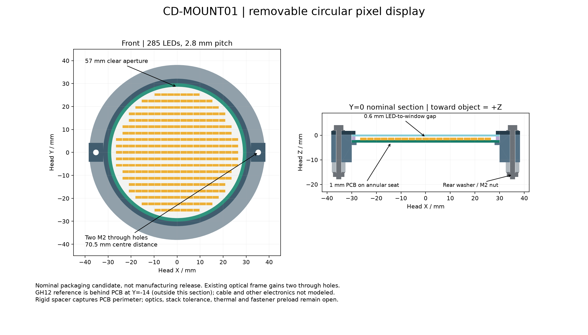

# CD-MOUNT01 — 可拆中央圆形点阵屏

将原来的Ø64空间占位落实为带侧耳的杯形座、PCB外围支承、绝缘垫圈、透光片和前压框。**285个发光点保留，格距由历史3mm缩为2.8mm**，为实际压框留出空间。环形、箭头等图案仍由同一组LED绘制，没有新增实体灯环。



[实际STEP与数值报告](../../engineering/generated/central-display-mount01/study.json) · [LED中心表](../../engineering/generated/central-display-mount01/led-centres.csv) · [源程序](../../engineering/central_display_mount01.py) · [商品紧固件与GH12来源](hardware/central-display-hardware01.md)

[独立审查](central-display-review01.md)进一步核对了真实接触面积、后垫足印、17项工具/拆装空间及连续证明公式。它对995件全开总装的16,291个对象对进行筛查，未发现穿透；实际GH导线与操作可达仍不在模型内。

这是名义结构候选，尚未并入HEAD03、整机Blender或整机质量模型。没有给PCB、透光片或商品连接器包络套虚构的金属密度；原有185～450g未知头部预算也没有重复计入。

## 完整安装层叠

坐标沿用HEAD03：屏中心为头坐标原点，+Z指向被夹物体。肩部加高只改变父级位置，不改变这里的零件尺寸。所有原始STEP以mm为单位，已重新导入检查实体有效性和体积。

| 件 | 实际候选几何 / Z范围 mm | 作用 |
|---|---|---|
| [杯形座](../../engineering/generated/central-display-mount01/CD01-cup.step) | 主体OD64、内孔Ø60.2，Z−11…0.25；PCB座环R28…30.1，Z−4…−3 | 左右耳承压到既有光学框；后方开放，留电子件及出线空间 |
| [PCB轮廓](../../engineering/generated/central-display-mount01/CD01-PCB-outline.step) | Ø60×1，Z−3…−2 | 外周R28…30得到支承；没有把整板背面压在金属上 |
| LED装配包络 | 285个，每个2.4×0.9×0.9，Z−2…−1.1 | 包含目前LED焊盘/本体及0.1mm焊高规划量；不是厂家原生CAD |
| [绝缘垫圈](../../engineering/generated/central-display-mount01/CD01-insulating-spacer.step) | OD59.8、ID57、厚1.5，Z−2…−0.5 | 只在无LED的外围捕获PCB，具体材料尚未选择 |
| [透光片](../../engineering/generated/central-display-mount01/CD01-window.step) | Ø59.8×0.75，Z−0.5…0.25 | 与LED名义间隙0.6mm；透光/扩散/涂层与可读性需光学样片 |
| [前压框](../../engineering/generated/central-display-mount01/CD01-bezel.step) | OD64、可见口Ø57、厚1.5，Z0.25…1.75 | 与杯侧耳共同锁到后框，保护窗口边缘 |
| [修订光学框](../../engineering/generated/central-display-mount01/CD01-optical-frame.step) | 原框只新增两Ø2.2通孔，X±35.25/Y0 | 删除材料30.4106169mm³；原相机位置、8°外倾和四柱不变 |

两颗 `SSC-M2-20-A2-BL` 配四片 `HPW-M2-A2-BL` 与两颗 `HPN-M2-A2`，用最大公开头径/头高/垫片/螺母尺寸建名义几何。孔距70.5mm，把最大Ø5后垫片的整个足印放在R32.75…37.75，距后框内R32.5与外R38各0.25mm。由原X±35改到±35.25是为了消除内缘零余量，不改变旧四根光学柱。

前垫片顶及螺钉头下座面Z2.1，M2×20末端Z−17.9，后螺母末端Z−16.95，名义突出0.95mm。尚未取得螺钉长度公差和不完整牙长度，因此不能由这项尺寸直接批准有效啮合或拧紧力矩。杯底圆筒没有落在后框环上，**真实支承经两个侧耳传递**；不能把中间悬空区域算作承压面。

PCB、垫圈、窗口之间当前是刚性名义接触链。实际板厚、片厚、温差和加工误差可能导致松动或过压；需要选材料、柔性压持/垫片策略及公差链后才能发布。外围结构不承担夹爪抓取载荷，也不据此忽略装配预紧和窗口冲击。

## 像素和电路空间

LED最大包络角点半径为 **27.4438062mm**，小于28.5mm可见口半径，最小名义径向余量 **1.0561938mm**。LED中心表中的历史driver/SW/CS列仅保留坐标来源，后续中央板电路生成自己的权威寻址映射；位置与电气通道号不能混为一事。

背面电子装配暂限定在 **R28、Z−10…−3** 内。这里包括全部芯片、电容、电阻、焊高、对插插头和必要绝缘；圆柱本身不是一张已完成PCB。双LP5860正在独立推进，板边须另留实际工艺/爬电和装配约束。

中央板用JST `SM12B-GHS-TB(LF)(SN)`侧插板座配 `GHR-12V-S`。原厂安装面局部坐标变换为：

```text
head_x = -u
head_y = -14 + v
head_z = -3 - h
```

这是绕Y转180°的刚体变换，行列式+1；pin1焊盘中心落在head `[6.875,-12.15,-3]`。完整参考包络包含对插本体、焊尾/焊盘及平面0.25mm、高度0.1mm规划裕量，当前head界为X±9.475、Y−19.8…−11.05、Z−7.45…−3。它不是原厂受控STEP，也未包含导线转弯、锁扣按压或完整拔出路径。HEAD-CTRL02端是BM顶插，不能拿此SM侧插体替代另一端。

## 实体与连续运动检查

300个名义对象包括285个LED包络、15件结构/紧固/连接器参考；其中商品螺纹和倒角尚作简化。检查不是渲染图目测：

- 新屏全部对象逐件包含于一个闭合障碍体，再用该障碍体对HEAD03其余123个固定对象逐实体求交，未发现穿透。屏内实际件逐对检查同样无正体积交叠；名义贴合面允许相接。
- 改孔后的光学框严格是原框的子集，没有增加外形，因此继承原框的运动避让范围；不能把这种继承用于其承载能力。
- 四指真实转动件采用到轴最大半径的点速度界；在每段角区间用端点距离减去半区间运动上界，验证连续范围。上指0…109°、下指0…122°独立成立，指间原有结构未改。
- 上指对新屏连续名义下界17.78162mm，下指44.69933mm；P16原厂实体已验证包含的运动包络对新屏分别39.70607/30.67027mm。没有把几张离散开合图当作全程证明。

上述结果不含新线束、实际中央电子板、受载变形、公差或完整整臂联合运动。新的压框比旧屏占位前伸0.75mm，本轮已重新计算头内相对运动；整机和工件可见性/碰撞应在下一次统一集成时更新。

## 原型与制造推进

可先用这些CAD制作无电、无载的屏模块装配样件，观察前压框比例、可见口、孔和出线方向。实际3D打印的孔/直径补偿由试片决定，不直接把0.1mm径向名义间隙称为FDM保证配合。透光和发热应另用实际LED板及选定片材试验。

金属版仍需补充内圆角/刀具可达、材料和表面处理、绝缘压持及防松、基准与位置/尺寸公差、夹紧力和热路径。当前STEP与评审图可供设计审核，不是可带载运行或无需审核即可下单的制造发布图。
