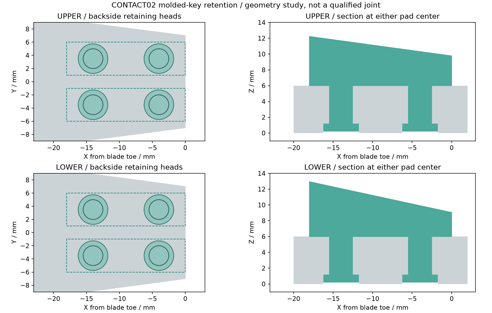

<!-- SPDX-License-Identifier: CC-BY-NC-4.0 -->
<!-- Required Notice: Odradek — Auromix contributors (https://github.com/Auromix/odradek) -->
# CONTACT02 软垫保持：贯穿浇注键候选

状态：**R4-PAD-RETENTION-01，名义实体、特征图和受力路径筛查完成，未浇注或进行保持力试验。** 每块垫用两个贯穿骨架的硅胶键保持，背面扩大头藏在沉孔内。它补上明确的保持构造；反复抓取能力仍需验证，不记入2 kg额定能力。

## 构造

把原片片尖设为X0，向根部为负，宽度中心Y0，背面Z0；骨架厚6 mm。上片全长150、下片100 mm。两垫占X=-18…0、中心Y=±3.5、宽5 mm，原接触楔面不变。

| 特征 | 名义尺寸 / 位置，mm |
|---|---|
| 每片4个通孔 | Ø3.0，X=-14/-4，Y=-3.5/+3.5，沿Z |
| 每孔背面沉孔 | Ø4.5，深1.2，从Z0进入 |
| 每垫两个键 | Ø3杆，Z1.2…6；Ø4.5扩大头，Z0.2…1.2 |
| 扩大头 | 厚1.0，背面凹入0.2，不突出骨架 |
| 两垫 / 两扩大头组净距 | 2.0 / 2.5 |
| 沉孔到片外边最小名义金属韧带 | 上1.736737，下1.750000 |
| 独立测试片 | 22×16×6，X=-20…+2、Y=±8；不是夹指新配件 |

装配意图为**直接在带孔骨架上浇注**，软垫、杆、扩大头一次连成一体。不计胶粘强度，也不假设固化后的扩大头能无损穿过Ø3孔。更换需去除旧垫及键、检查孔缘后重新成型；免浇注快换需要另做载体结构。

金属骨架维持6061-T6候选，软垫 Dragon Skin 30 的来源和固化条件见[材料试片说明](contact-pad-prototype.md)。旧四腔模具属于旧片型，**不能直接制作本版楔角和带键软垫**。本包尚无带进胶/排气的专用模具；孔内充填、气泡、界面污染、收缩、孔缘圆角仍须解决。打印测试片用于工艺/保持构造试样，不能替代实际金属孔缘试验。

## 实体一致性

脚本读取 CONTACT02 精确STEP，变换到片尖坐标后钻孔、将键与原垫合并；不重画接触面、不改主参数。

- 每片去金属212.057504 mm³，增加软键199.334054 mm³；每块带键软垫549.667027 mm³。
- 新骨架与软垫整体是原整体的子集：两型外部布尔差均0，仅背面四个0.2 mm凹入面合计减少12.723450 mm³。
- 因而**未变形名义外形**继承 CONTACT02 对指定角域的分离及原圆柱接触关系；不继承孔缘强度、软垫变形、公差、灯板/根部集成或物体容差。
- 8个输出件均为有效单实体；STEP回读双向差、STL封闭/法向/单连通及体积差、DXF毫米单位/孔数量检查通过。两页PDF已完整渲染查看。

## 受力不能只看总拉力

使用 CONTACT02 一组条件可行解：Ø80×40圆柱、μ0.4、2 kg×2重力、四指3.7 N·m上限。这是**见证解，不是最小所需力或全工况最大力**，真实双垫分担仍取决于材料变形及工件。

物体受力取反、变换到骨架坐标后，高载上垫为[-13.402,+0.678,-24.112] N，下垫为[-13.261,-0.550,-19.640] N。负Z压向骨架，但片尖/侧边接触产生偏心矩。

| 诊断量 | 上型高载垫 | 下型高载垫 |
|---|---:|---:|
| 面内剪力 | 13.4191 N | 13.2723 N |
| 两Ø3杆均分的平均剪应力 | 0.9492 MPa | 0.9388 MPa |
| 垫底中心力矩Mx/My/Mz，N·mm | -62.83/166.49/39.60 | -47.42/136.29/28.20 |
| 面内合力在底中心传递时，压心偏移x/y，mm | +6.905/+2.606 | +6.939/+2.414 |

两杆总截面积14.1372 mm²；两扩大头环形肩面积17.6715 mm²。这些平均量不描述键根缺口、孔壁接触、撕裂、扭转或疲劳。

上型诊断压心Y=**2.606 mm，超过半宽2.5 mm**。在上述传力假设下，仅靠底面压应力不能平衡，需局部牵拉、剪力传递位置变化或接触变形重新分配。所以净外拉力为0并不排除局部剥离，不能据此删扩大头或声明保持通过。

后续试样分别记录单垫X/Y剪切、法向拉脱及偏心剥离，保留第一次裂纹、位移和失效位置；用实际孔缘、硅胶批次和目标表面重复。没有材料允许值、疲劳和工艺数据前，不把平均应力配上任意安全系数当作合格证明。

## 文件与复现

- [两页名义特征图](../../engineering/generated/pad-retention-study/ODR-PAD-RETENTION-01-review.pdf)：孔表、剖面、楔面方程，尚缺生产公差和孔缘工艺。
- [生成目录](../../engineering/generated/pad-retention-study/)：两型骨架、测试片、左右软垫STEP/STL；分层DXF；[验证JSON](../../engineering/generated/pad-retention-study/verification.json)。DXF同时含全片、测试片和孔特征，不是二维切割清单。
- [脚本](../../engineering/build_pad_retention_study.py)：从根目录执行 `python engineering/build_pad_retention_study.py`，需已有CONTACT02和工程锁定依赖。

生产前须冻结孔径/位置/沉孔深度公差、孔缘圆角和表面处理，复算开孔后骨架，完成专用模具及排气，再以实测接触和保持力更新模型。当前是可复核候选，不是制造发布包。
