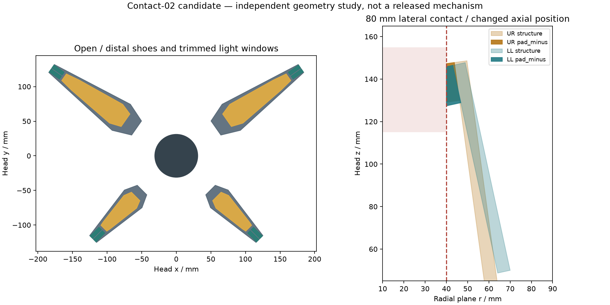

# 片尖接触鞋候选 CONTACT-02

**独立几何与条件静力研究；不替换 R4-layout-03，不是制造发布。** 旧 R03 的 Ø80 圆柱会先撞骨架／灯窗，见[实际双垫反例](finite-pad-contact-study.md)。本候选将软垫移到片尖，并调整长短指的接触高度，使灯面与承力接触分开。

## 尺寸与可复现数学

生成器为 [build_contact02_study.py](../../engineering/build_contact02_study.py)，输出 [16 个零件 STEP](../../engineering/generated/contact02-study/parts-step/)、[张开装配](../../engineering/generated/contact02-study/contact02-open.step)、[空夹闭合装配](../../engineering/generated/contact02-study/contact02-empty-closed.step)及[完整计算数据](../../engineering/generated/contact02-study/study.json)。运行 `python3 engineering/build_contact02_study.py`。

| 项目 | 上两片 | 下两片 |
|---|---:|---:|
| 长度 L | 150 mm（旧值 140） | 100 mm |
| 最大宽 W／承力片厚 | 46／6 mm | 36／6 mm |
| 根部半径／轴向位置 | 70／0 mm | 70／50 mm |
| 片尖宽 | 14 mm | 14 mm |
| 两垫中心沿片位置 s=L−9 | 141 mm | 91 mm |
| 垫中心横向坐标 | ±3.5 mm | ±3.5 mm |
| 垫平面尺寸／中心表面高度 | 18×5／11 mm | 18×5／11 mm |
| 空夹候选终点 | 109° | 122° |

灯窗在 x=L−22 截止，留出接触鞋。平面轮廓顶点为 `(0,±0.27W), (0.18L,±0.5W), (L,±7)`，保持左右镜像；尚未与窄根叉、真实灯板厚度合并。

在单指径向坐标中，点 `(x,y,h)` 随角度 q 移动为：

`r = R + x cos(q) − h sin(q)`，`t=y`，`z=z_root + x sin(q) + h cos(q)`。

垫上表面为 `h=11+(x−s)cot(q*)`，其中 `q*=acos(−30/sqrt(s²+11²))−atan2(11,s)` 以 Ø80 理想中心接触为目标。真实圆柱首次接触由有限垫实体求得，不直接代入垫中心。八个接触点共享四个轴力矩限制。

## 独立闭合与物体避让

对 16 个凸多面体的全部顶点，沿各自完整角域解析求 `A+Bcos(q)+Csin(q)` 的最小值，建立指对之间的固定平面分离界。六组指对均通过，最小间隙下界 **4.2821 mm**。这允许四指在各自范围内独立运动；不含新根部支承、紧固件、光学层、公差或物体。

同轴长圆柱逐个测试 Ø30、40、50、60、70、80、90、100、110、120，均为软垫先接触。不是对所有直径或任意物体的证明。首次接触采用 253 节点定位区间加求根，不能替代连续物体碰撞证书。

| 圆柱直径 | 上／下首次接触角 | 此时骨架最小径向余隙 | 灯面最小径向余隙 |
|---|---|---:|---:|
| 30 mm | 107.750°／118.064° | 2.660 mm | 9.692 mm |
| 80 mm | 97.791°／102.219° | 2.971 mm | 6.110 mm |
| 120 mm | 89.036°／87.951° | 4.001 mm | 3.729 mm |

另外用 OpenCascade 原始实体独立复核 Ø30／80／120 长圆柱及 Ø80、z=115…155 mm 有限圆柱，**64 项交叠体积均为 0**，硬件最小实体距离 2.660 mm，垫在数值精度内接触。该有限 Ø80 工件允许四指侧面接触；移动到 z=95…125 mm 则失败，存在端盖先进入等情况。夹持区沿头部前方有所移动，不能继续假设旧名义 TCP 就是接触中心。

## 条件夹持力与驱动缺口

以 2 kg 工件、2 倍竖向重力、工件质心位于八点平均高度、每垫至少 1 N 法向力、16 边内接摩擦锥进行 LP。忽略指片自重、传动损失、柔性与动态冲击，故结果只说明给定接触假设是否存在平衡解。

在 μ=0.4、每轴 3.7 N·m 限制下，上述十个长圆柱案例均有解；Ø80 在最小总法向力的一组解中，上／下轴力矩分别 **3.621／1.928 N·m**；这不是最低所需轴力矩上限。改成每轴 3.0 N·m 时，Ø80 无解；μ=0.3、3.7 N·m 同样无解。μ=0.6 的 Ø80 可降至约 2.310／1.172 N·m，但摩擦系数尚无实测，不能以该值选型。

[后续受力分配复核](paired-pad-loadsharing.md)修正了由一组示例力矩直接判断驱动不足的推论：Ø80、μ=0.4、法向力自由分配时，3.515 N·m 限制仍有解，数值可行阈值约3.423 N·m。若每指两垫限定相等法向力，阈值约3.517 N·m，已几乎耗尽“3.7 N·m×95%效率”的假设输出。85%／90%效率对应的3.145／3.33 N·m均无解。实际传动效率、同指软垫分担、自重和保持尚未闭合，现有驱动仍未获承载资格。

## 尚未冻结

接触鞋当前没有机械保持结构；旧材料浇注模可用于材料测试，其形状不直接转用本候选。软垫压缩、接触角点压力、磨损及抗剥离未知。真实 LED 板与罩层需要重排，不能套用 0.6 mm 发光占位。根叉、相机、线束、头壳、总装运动碰撞尚未合并。空夹闭合指的是在目标范围收拢且不互撞，并非四个刚性尖端都挤到同一点。
