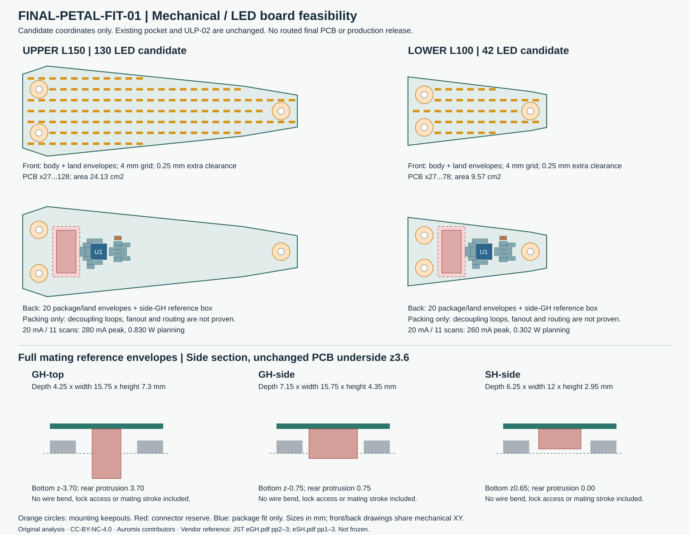

<!-- SPDX-License-Identifier: CC-BY-NC-4.0 -->
<!-- Required Notice: Odradek — Auromix contributors (https://github.com/Auromix/odradek) -->
# 正式上下灯板与机械口袋的适配分析

**FINAL-PETAL-FIT-01，独立可行性研究，尚未冻结正式灯板。** 当前轮廓能容纳一组上片 130 灯、下片 42 灯的候选点阵，普通背面元件也有平面排布空间。建议下一步优先评估带正锁的侧插 JST GH，但它仍需要根部后腔和线束通道。焊接高度、混光及金属散热接触尚未闭合，不能把这份分析当作已完成装机的 PCB。

本研究读取已提交的 [LED-POCKET-01](led-petal-pocket-study.md) 和 [ULP-02](hardware/upper-petal-ulp02.md)，没有修改它们的几何、113 个灯点或电路。新点阵和元件坐标只是可计算的适配候选；ULP-02 的 ERC/DRC 结果不传递到它们。



## 1. 机械接口和检查方法

坐标从指根向片尖为 +X，金属背面为 Z0。直接从 `UPPER/LOWER-PCB_outline.step` 提取顶面外轮廓，不用旧 113 点板的梯形近似替代。两轮廓均已检查为凸多边形；以下面积扣除了三个 Ø2.4 PCB 孔。

| 项目 | 上片 | 下片 |
|---|---:|---:|
| 指片长度 | 150 mm | 100 mm |
| PCB / 灯窗 X | 27…128 | 27…78 |
| 最大半宽 | 16.56 mm | 12.60 mm |
| PCB 面积 | 2413.221 mm² | 956.759 mm² |
| 背面预留可用投影面积 | 2142.244 mm² | 685.782 mm² |
| 安装孔中心 | (33,±8)、(122,0) | (33,±6)、(72,0) |

PCB 保持 Z3.6…4.4，正面封装预留 0.8、背面 1.45，普通腔底 Z1.9；三个安装点保留 Ø6.5 元件禁区。根部金属贯通口为 X38.5…47.5、Y±8.75；背面元件额外避让 X38…48、Y±9.25。x≤25 的关节连接不在本研究中。

本研究用**真实 LED 封装和焊盘的合并矩形**检查边界，用矩形至安装禁圆的最近距离检查孔边。LED 合并包络为 2.4×0.9 mm：2.4 来自焊盘总长，0.9 来自封装最大宽，不能只检查灯点中心。要求包络距 PCB 边及 Ø6.5 禁圆均至少 0.25 mm。这是规划间距，不能代替板厂铜边距和装配公差。

随后把各矩形拉伸为实体，对原始 STEP 的正/背面预留做布尔相减：上 150 个、下 62 个包络的最大外逸体积均为 **0 mm³**。其中含 130/42 个 LED 包络与每板 20 个背面器件包络，不含接头、走线/过孔、焊料、公差和变形。这个检查证明名义包络容纳关系，并不证明 PCB 可布通或可装配。

## 2. 候选灯点与背面器件

保持 4×4 mm 视觉点距，X 从 30 开始，Y 为 4 mm 的整数倍，筛掉不满足上述条件的点，得到：

| 项目 | 上片 | 下片 |
|---|---:|---:|
| 候选灯数 | 130 | 42 |
| 最小包络至板边距离 | 0.509 mm | 0.284 mm |
| 最小包络至安装禁圆距离 | 0.300 mm | 0.389 mm |
| 对应 ULP-02 原 113 点直接投影，通过 / 不通过 | 96 / 17 | 39 / 74 |

下片投影只是说明旧板不适配，不能解读成建议把上灯板裁成下灯板。上片不通过的原坐标为 D1…D12、D14、D18、D21、D25、D113；它们涉及根部边界、安装禁区或片尖焊盘伸出。新 130/42 点是独立计算，未将这些冲突点自动改成正式设计。

LED 保留 **Würth 150060YS75000**。正面没有普通矩形屏，不侵入末端接触垫；零件最大高度 0.8 mm、极性和焊盘来自 [Würth 原厂 PDF，第 1–2 页](https://www.we-online.com/components/products/datasheet/150060YS75000.pdf)。4 mm 点距与不足 1 mm 的混光间距能否达到所需灯片观感，需要实物光学样条，不能由点位图推断均匀亮面。

每板保留 ULP-02 的完整本地电路规模：LP5860RKPR、两只 C2012X5R1V226M125AC、七只 0603 电容、九只 0603 电阻和 NCU18XH103F6SRB，共 **20 件非接头器件**。完整型号沿用 [ULP-02 BOM](../../engineering/electronics/upper-petal-prototype/ulp02/bom.csv)，接口仍是两路 3.3 V、GND、SPI/同步/使能、NTC 返回的十芯候选。

一组上下通用的平面摆放可以把 U1 放在 (55,0)，两只大电容在 (49,0)/(51,0) 旋转 90°，其余器件放在约 X49…66.5、Y−6.225…5.725；NTC 在 (62,5)。已对封装/焊盘包络每侧再扩 0.25 mm，避开背面让位区与安装禁圆；下片仍至少有 2.501 mm 到板边、2.529 mm 到安装禁圆的距离。全部逐件坐标和检查值在 JSON 中。

这是一组**面积/排布见证**。电容并非已经紧邻对应电源引脚，NTC 未被证明能代表最热点；QFN 逃线、热过孔、参考地连续性、焊盘钢网与信号回流都要在新的 ECAD 中重新完成。封装之间无重叠不等于走线与去耦合格。建议新板继续以四层、连续 GND 层作为起点，禁止直接复用 ULP-02 的布线快照和寄存器映射。

## 3. JST 完整配对尺寸与根部空间

以下是公开原厂目录的**已配对参考尺寸**，不是仅用空 PCB 座高度。坐标计算假定接头在 PCB 背面，长轴沿 Y，配对参考包络可平移至中心 (43,0)；这个中心不是厂商的封装原点。目录的安装面图须经底面镜像后另行建立封装，引脚号不能随镜像或插向更换而重排。

| 方案 | 板座 + 壳体 + 端子 | 配对 X深×Y宽×高度 mm | 最低 Z / 超出金属背面 | 超出普通背面 1.45 限高 |
|---|---|---:|---:|---:|
| GH 直插 | BM10B-GHS-TBT(LF)(SN) + GHR-10V-S + SSHL-002T-P0.2 | 4.25×15.75×7.30 | −3.70 / 3.70 | 5.85 |
| **GH 侧插，建议优先评估** | SM10B-GHS-TB(LF)(SN) + GHR-10V-S + SSHL-002T-P0.2 | 7.15×15.75×4.35 | −0.75 / 0.75 | 2.90 |
| SH 侧插，低背部候选 | SM10B-SRSS-TB(LF)(SN) + SHR-10V-S + SSH-003T-P0.2-H | 6.25×12.00×2.95 | +0.65 / 0 | 1.50 |

尺寸依据：[JST GH 目录第 2–3 页](https://www.jst-mfg.com/product/pdf/eng/eGH.pdf)、[JST SH 目录第 1–3 页](https://www.jst-mfg.com/product/pdf/eng/eSH.pdf)。GH 具有外部正锁；SH 不能按同等正锁处理。GH 1 A 的目录条件为 AWG26，适用 AWG30…26、线外径 0.76…1.0；SH 1 A 为 AWG28，适用 AWG32…28、外径 0.4…0.8。线径范围不是机器人反复弯折或扭转寿命证据。

GH 安装面图给出的焊盘长轴总跨度为 **15.95 mm**，比 15.75 的零件参考宽更大；若再按每侧 0.25 的本研究规划余量，需 16.45 mm 平面宽度。这个焊盘范围也要避开金属，但焊盘坐标、器件外形与配对框不能未经原点变换就强行同中心。

静态参考框居中时，GH 侧插在 9×17.5 孔内只余 **X 合计 1.85 mm / Y 合计 1.75 mm**，即对称每侧 0.925 / 0.875。三种参考框与原金属 STEP 的体积交集都是 0，但该结果只说明此人为居中参考框可放入。GH 根向线束至少要从约 X39.425 延伸至 X25 区域，约 14.425 mm 的后续路程不在开口验证内。十根最大外径 1.0 的线按 1.25 节距平排，最外缘跨度约 12.25 mm，尚未加入束线固定和转弯空间。

必须把端子出口位置、弯曲半径、松弛段、锁扣可操作空间、插拔行程和根部应变消除一起建模。侧插能减小背部凸出，但插拔方向移到 X，并不会自动消除装配问题。接头不应承受手指关节反复运动造成的拉力。

SH 不越过 Z0，仍下探普通腔底 Z1.9 约 **1.25 mm**，不能直接放进普通 1.45 mm 背面区域。改用它要重新做板座、线束、保持方式及局部口袋，当前没有替换 BOM。建议保留 GH 正锁能力，先评估侧插 GH 的局部后盖/根向出线，再比较 SH 的收益。

较早的独立 GH 盒 X25…40、u±7、Z−4…0 与本口袋不同：宽 14 比 GH 15.75 少 1.75，且 (43,0) 的侧插参考框到 X46.575。该旧盒已由载体研究标为 superseded。载体研究随后按整个口袋背部投影 X38.5…47.5、u±8.75、Z−3.7…0 重做空间探针，见 [P16 载体接口记录](../../engineering/generated/p16-carrier-01/led-interface-reservation.json)；这仍不等于真实配对接头、插拔或线束全角检查，本研究未把其距离结论拼接成装机证明。

原厂受控型号图/STEP 尚未取得：[JST 官方型号图入口](https://www.jst-mfg.com/product/index.php?doc=4&filename=BM10B-GHS-TBT.pdf&series=105&type=10)说明需要公司/联系人表单和邮件交付。本研究只读公开目录，没有提交表单或外联；原厂参考值无公差保证，制造前仍需受控图及实物复核。来源 PDF 仅保存在库外，未随开源仓库再分发。

## 4. 焊高与可协调的层叠预算

现有 LED 0.8、C0805 1.45 都是**封装最大高度**，未包含焊接离板高度。不能把它们直接当作装配件限高。以下用 **0.10 mm 焊高预算**提出具体协调方案；该数值是规划假设，尚未由贴装厂钢网/焊接试片证实，不是承诺值。

| 协调方案 | PCB | LED装配顶面 | 混光隙至Z6.0 | 两大电容最低面 | 保持0.25名义底隙所需局部腔底 |
|---|---:|---:|---:|---:|---:|
| 原预算，未计焊高 | 3.6…4.4 | 5.20 | 0.80 | 2.15 | 1.90 |
| **A：建议先评估，PCB不变** | 3.6…4.4 | 5.30 | 0.70 | 2.05 | 1.80 |
| B：PCB整体降0.10 | 3.5…4.3 | 5.20 | 0.80 | 1.95 | 1.70 |

A 只在两个最高电容下方讨论额外 0.10 mm 局部深腔，普通地板仍可保持 1.9；混光/透光总表面仍到 Z6.6。其代价是更小的混光隙及局部刚度改变，需要光学样条和净截面复算。若不加深，这两点到原地板仍有名义 0.15 mm，但不足以沿用原 0.25 的预算。

B 保住原 0.8 混光预算，却需要降低支承台，改变螺钉几何啮合和接头后伸量，并让高电容区域剩余金属厚度再减 0.20，代价更大。另一条路线是替换较低的电容，但要先验证有效电容/DC偏压和动态压降，不能仅按标称 µF 替换。本研究未改零件或推荐一个未经核查的新型号。

这两案均**没有闭合完整公差链**。需要把板厚、三安装台高度/共面度、绝缘环压缩、器件高度、焊高、PCB 翘曲、透光片公差及载荷下相对变形列入最坏尺寸。原梁模型的片尖挠度不是 PCB 相对金属的变形值；须独立测试 PCB/焊点应变与局部贴底风险。侧插 GH 的目录配对高度也只是参考，不应用固定 0.10 的通用焊高去冒充厂商尺寸公差。

## 5. 扫描、电源和热量

为了比较同色灯片，本候选保留 11 个扫描时隙；下片未用时隙关闭。每个时隙最多 14 个 CS，灯阳极接 SW、阴极接 CS。候选邻近列分组为：

- 上：10、14、14、14、14、12、10、10、10、13、9。
- 下：12、10、13、7，其余 7 行空白。

这只是功耗可行性分组，尚未生成正式板的网络表、CS使能/扫描寄存器或固件；旧 ULP-02 地址不适用。LP5860 的扫描和封装约束来自 [TI 原厂数据手册](https://www.ti.com/lit/ds/symlink/lp5860.pdf)。

忽略扫描消隐而取平均上界，满 PWM、每灯瞬态 I=20 mA、VLED=3.3 V：

`Ipeak = 最大同行灯数 × I；Iavg ≤ N × I / 11；PVLED ≤ 3.3 × Iavg`。

| 单板项目 | 上130灯 | 下42灯 |
|---|---:|---:|
| VLED瞬态峰值 | 280 mA | 260 mA |
| VLED平均上界 | 236.364 mA | 76.364 mA |
| VLED输入功率上界 | 0.780 W | 0.252 W |
| 额外逻辑规划预算，非datasheet最大值 | 0.050 W | 0.050 W |
| 单板规划合计 | **0.830 W** | **0.302 W** |
| 按板面积平均，不能代替热点 | 0.0344 W/cm² | 0.0316 W/cm² |
| 2 V典型Vf下LED电功率 | 0.473 W | 0.153 W |
| 同一典型条件下驱动输出级耗散估计 | 0.307 W | 0.099 W |

四片 VLED 同相最坏行峰值合计 **1.08 A**，平均上界 0.625 A，包含上述逻辑预算的四片合计约 **2.264 W**；均不含中央圆点阵、相机、转换损耗或其他头部设备。上片供电峰值至少需重新以 280 mA 加余量核对；25%规划余量为 350 mA，下片为 325 mA，还要另计逻辑电源和共同返回电流。初次点亮可按既有电测流程从每灯 3 mA 开始，对应行峰值 42/39 mA，不因矩阵平均电流小就忽略行峰值。

两只 22 µF 标称合计 44 µF；以 8 µs 行脉冲作纯电容上界模型，`ΔV=Ipeak·8µs/Ceff`：上/下为 50.9/47.3 mV。若实际有效合计只有 20 µF，则为 112/104 mV；20 µF 是敏感性假设，未当作已测降容。还需叠加 ESR、线束与 PCB 压降、上游环路响应。3.3 V 到每颗 LED 的合规余量应检查 `Vrail,min−Irow·Rwire−VSW−Vf,max ≥ VCS,required`，不能从典型 Vf 直接证明所有温度/批次恒流。

### 热路径必须单独设计

封闭片内最终保守散热预算可先按全部输入电功率处理；典型 Vf 下的分项不是热极限。现有地板到不同表面的间距不同：

| 到金属腔底Z1.9的名义距离 | 未计焊高 |
|---|---:|
| 裸PCB背面Z3.6 | **1.70 mm** |
| 高1.0的IC外壳顶 | 0.70 mm |
| 高1.45的大电容外壳顶 | 0.25 mm |

所以只放一片 0.25 mm 导热材料不能连通 PCB 与金属。建议保留 LP5860 暴露焊盘到 GND 铜层/热过孔的路径，在**背面无器件铜区**讨论绝缘导热桥及对应金属热台；桥厚、压缩力、耐压、导热率与PCB受力均需选材、实测和结构校核。不能让金属热台直接压在 IC/电容壳体上，也不能利用安装绝缘环自动宣称良好散热。

计算可用 `Rbridge=t/(k·A)+Rcontact`、`ΔT=P·Rthermal` 建模，但 k、接触压强、真实铜层面积和对流边界尚未确认。TI 标准测试板的 RθJA 不等于本片封闭金属腔的热阻。先在真实叠层下记录环境温度、U1/LED/板上NTC及金属温度，验证稳定温升、断电温升惯性与降亮阈值；再做张合工况、相机条纹和电磁兼容检查。不能从面积平均功率直接宣布无热问题。

## 6. 下一步的明确边界

1. 联合冻结 PCB装配限高及侧插GH的封装原点、朝向、根向出线、插拔与固定；原受控配对图/实物未得前，保留参考包络属性。
2. 用 A 方案先做叠层/光学小样评估，核查焊高与混光，再决定局部电容深腔；目前不修改已有口袋。
3. 随后建立上下两块独立正式 ECAD：新轮廓、安装孔/禁区、灯点、行列映射、回流/电源/热通孔、BOM、寄存器和固件一致生成，分别跑 ERC/DRC。ULP-02 继续作为原电测样片。
4. 把真正 PCBA、完整配对连接器、应变消除、线束和透光片保持件导回机械 CAD，检查全角、插拔、受载变形与热路径，之后才讨论制造放行。

## 文件与复现

[结构化计算与官方尺寸证据](sources/final-petal-board-fit-analysis.json)记录完整点位、20件背面包络坐标、三种接头参考框、输入 SHA256、厂商 URL/页码/下载 hash 和计算边界。[生成器](../../engineering/final_petal_board_fit_analysis.py)只输出本研究 JSON 和原创 SVG，不改输入。

```sh
python engineering/final_petal_board_fit_analysis.py
```

依赖 CadQuery、NumPy、SciPy。正面/背面矩形都与原 STEP 做独立实体相减；接头只与金属检查**参考长方体**，不能冒充原厂实物 CAD。无采购、外联、Gerber 或制造订单。
