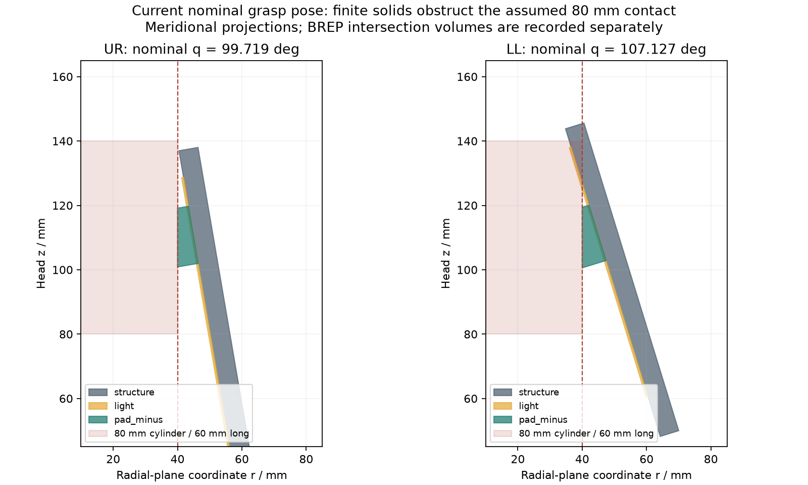

# 有限双垫与圆柱物体接触检查

**R4-FINITE-PAD-01：当前接触布局未通过 80 mm 圆柱的几何检查，需要修改。** 本研究读取 R4-layout-03 的真实 STEP 顶点；不修改已发布的四瓣形状、模具或闭合证书。它补上此前“每指一个理想接触点”遗漏的物体与指片干涉。



## 直接结果

四个角度独立变化时片与片的分离证明，仍只证明原来的 16 个实体彼此分开。它不证明夹指能绕过一个物体并使软垫到位。

以同轴直径 80 mm 圆柱为例，下指 LL 的骨架在 **103.99163°** 就碰到较长圆柱，而双垫需要 **107.12865°** 才能接触其侧面。两者不是同一个可实现姿态。缩短物体也不能一概解决：长 60 mm、轴向范围 z=80…140 mm 时，灯窗在 **104.54778°** 先碰物体；长 30 mm、z=95…125 mm 时，灯窗在 **107.11478°** 先碰圆柱边缘。

在下指双垫应到位的 107.12865°，使用独立 CAD 布尔交叉核验：

| Ø80 圆柱的头坐标 z 范围 | 骨架与物体相交 / mm³ | 灯窗与物体相交 / mm³ | 单块垫与物体相交 / mm³ |
|---|---:|---:|---:|
| −100…300，代表足够长的侧面 | 303.66080 | 59.71548 | 0 |
| 80…140 | 202.26829 | 59.71548 | 0 |
| 95…125 | 0 | 0.000920 | 0 |

最后一行虽小，仍没有正间隙，且尚未加入制造、限位及变形误差。零相交的软垫是名义接触，不是已有接触面积或夹持压力。

在本次离散直径 30…120 mm 中，长圆柱只有 **100、110、120 mm** 三个样例通过“四指都由双垫先接触”的几何条件；不能把这些离散结果扩展成连续适用范围。有限长 Ø100、z=80…140 和 z=95…125 的两个样例也通过同一局部条件，仍未检查物体与整个掌部、支承及线束。

## 几何与数学

每个指片局部材料点记为 `(x,y,h)`，原点在指根、x 沿片长、y 沿切向。闭合角 q 下，其径向坐标、切向坐标及头部高度为：

```text
r = R + x cos(q) − h sin(q)
t = y
z = z_root + x sin(q) + h cos(q)
rho = sqrt(r² + t²)
```

对于这些凸的原始实体，先把顶点投影到 `(r,t)` 平面，求其凸包到原点的距离，得到与无限圆柱侧面的名义距离。有限圆柱先按 `z_min ≤ z ≤ z_max` 截取实体，再投影；所有顶点对与两个截平面的交点包含真实边交点，额外对角线交点位于凸实体内部，不改变凸包。圆柱边缘或端面首先接触的情况单独标记，不误用纯侧面法向进入握持力计算。

角度搜索采用每件 253 个等分节点确定首次交叉区间，再用 Brent 求根；**它不是整个角域的连续首次碰撞证书**。三组 Ø80 反例另外以真实 BREP 逐实体求交确认，因此失败结论不依赖采样之外是否还有更早碰撞。

双垫并非一块跨过中线的平垫。上/下指内侧垫边分别距切向中线 1.18/0.38 mm；即使名义径向位置 r=40，真实圆柱半径也略大于 40。接触因此落在垫边或角上，位置随 q 变化，不能把中心 z=110 mm 当成所有实际接触的共同高度。原定楔面只在目标角与径向法向对齐；软材料能否形成有效面积，需测量变形与压力。

## 八接触点、四个力矩约束

通过局部几何条件的样例使用八个接触点。每指两个点的广义力矩必须合计：

```text
tau_i = J_i,minus^T f_i,minus + J_i,plus^T f_i,plus
|tau_i| ≤ tau_cap,i
G f + wrench_external = 0
```

不能给每块垫单独一个完整电机力矩额度。求解仍使用 16 射线内接摩擦锥，假设每垫至少 1 N 法向力；这是强制八点接触的模型假设。物体质心取实际接触高度的平均值，重力沿头部 −z，净质量 2 kg，并分别计算载荷系数 1/2、μ=0.3/0.4/0.6、3.0/3.7 N·m 比较上限。

例如 Ø100 长圆柱、μ=0.4、系数 2，在 3.0 N·m 比较上限内有条件可行；μ=0.3 时需要更高上限。此结果仍不含指片自重、传动损耗、关节摩擦、柔性和零速温升；3.7 N·m 也不能直接套作锥齿传动后的可用连续力矩。

回归检查将四个点拆成八个重合点，确认总法向力不变、每指合计力矩误差小于 3e−16 N·m，并验证过小的共享力矩上限确实不可行。实际材料点 Jacobian 与数值差分误差约 1e−11 m/rad。它们检查计算实现，不是样机验证。

## 对下一版结构的影响

继续保留上大下小和左右对称的四瓣形态，但要把保护性接触面延伸到可能先触物的区域，或调整骨架尖端、接触垫位置和可抓物体范围。候选包括可更换的软质边缘/尖端，以及针对特定物体的接触附件。不能仅加厚透明窗来承担夹持，也不能把全部碰撞通过限制软件电流解决。

下一版需同时重算灯板避让、软垫机械保持、夹指力臂、四片全闭合、实际物体接触与相机视线。现有浇注模具仍能制作摩擦/固化试片，但不能据此对当前夹爪执行 2 kg 试抓。

来源与复现：[脚本](../../engineering/finite_pad_contacts.py)、[原始结果/18 项输入哈希与 BREP 反例](analysis/finite-pad-contacts.json)、[参数变化图](analysis/finite-pad-contacts.png)。从仓库根目录运行 `python engineering/finite_pad_contacts.py`；环境见[工程复现说明](../../engineering/README.md)。
