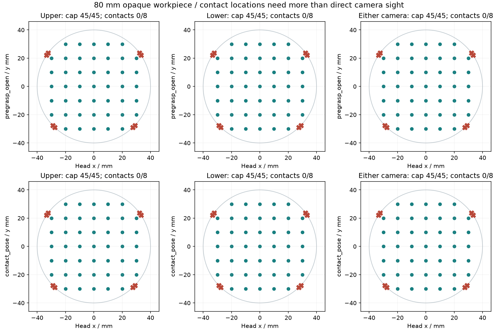

# 双鱼眼与真实夹持工件的遮挡

**CONTACT-02 的名义几何射线研究，不是实机相机视野验收。** 保留上下两相机、100 mm 名义间距、各向外仰8°。本次把 Ø80、高40 mm 的不透明圆柱放在头坐标 z=115…155 mm，使用 CONTACT-02 的八个实际软垫接触点，避免把没有物体的前方空平面当作夹持视野。

在张开等待和实际接触两种姿态中，两相机对近端盖上的 **45 个采样点均有无遮挡线段**。八个侧面接触点则均被工件自身遮住，即使把指片遮挡拿掉也无法直视。圆点是端面采样，叉号是侧面真实接触点；它们在图中投影到相同XY平面，但实际高度不同。

这说明当前上下相机布置仍可观察所测工件的近端表面，却不能直接看见全部夹紧界面。控制上应把物体位姿观察与接触／保持检测分开：后者需要可靠的力、驱动电流或其他接触反馈；仅凭这两路图像不能验证软垫未滑移或夹紧力充足。扩大鱼眼视角或仅增加向外仰角不能穿透不透明物体。

## 计算和独立核对

[脚本](../../engineering/check_grasp_object_sightlines.py)从原生 STEP 导入 CONTACT-02 四片和 R03 中心/相机占位实体，以 OpenCascade 线段—面求交判定所有目标前的阻挡。入口瞳暂取原5 mm镜头包络前方5.1 mm处，每条线段从瞳前0.05 mm开始、到目标前0.01 mm结束，避免把目标表面本身当作遮挡。输出记录全部遮挡零件、距离及相对光轴所需角度，见[完整数据](../../engineering/generated/contact02-sightlines/study.json)。

还独立用凸圆柱表面法向核对：侧面点 `P` 的外法向为 `n=(Px,Py,0)/40`。两个相机的瞳位置 E 对全部八点都满足 `(E−P)·n<0`，即位于接触点的背面半空间，因此不可能直接看到这些凸表面点。这与实体求交结果一致，不依赖渲染颜色。

采样端面为 −30…30 mm、间隔10 mm的7×7网格，去掉四个落在圆外的角点后共45点。它不是整端面连续可见性证明。八点用 CONTACT-02 的有限垫求解结果，正负两垫共享同一个指轴，不以垫中心代替实际接触位置。

## 仍未覆盖

真实入口瞳、镜头畸变、图像裁切、标定、曝光和反光未建立；报告里的射线角度不是厂商保证视场。SUPPORT-03、直线驱动候选、外壳和动态线束尚未加入，因此无遮挡结果可能随着集成改变。两姿态和一个工件案例也不能推广为所有尺寸／位置。下一轮总装必须重新核对相机窗口、工件遮挡、LED眩光与手眼标定。

复现：`python3 engineering/check_grasp_object_sightlines.py`。主参数不变，原创脚本和输出按仓库 CC-BY-NC-4.0 使用。
