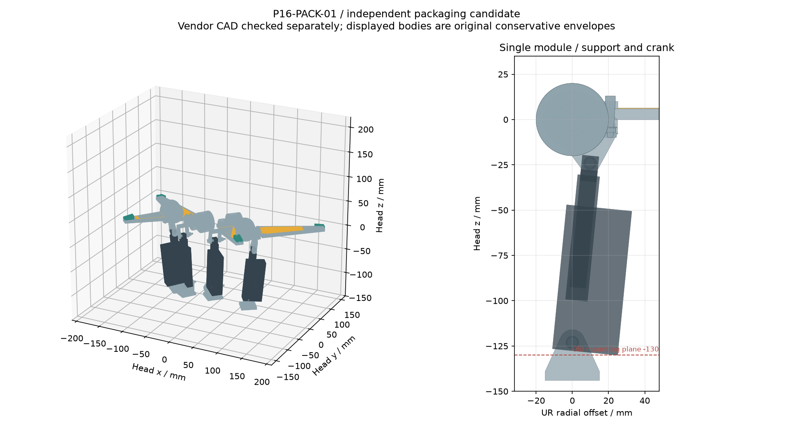
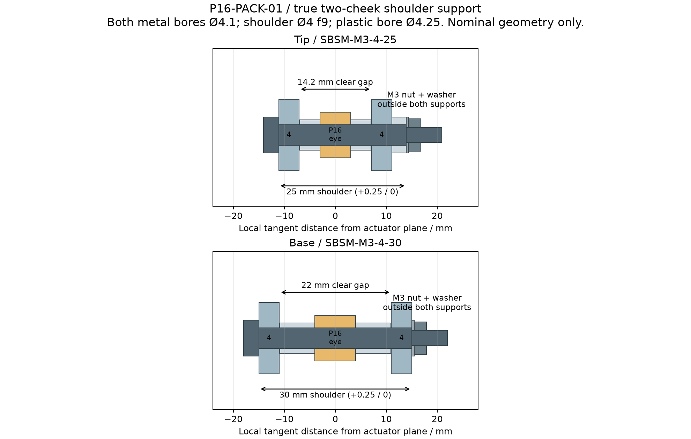

<!-- SPDX-License-Identifier: CC-BY-NC-4.0 -->
<!-- Required Notice: Odradek — Auromix contributors (https://github.com/Auromix/odradek) -->
# P16-PACK-01：真实线性执行器、双剪销叉与窄根接口

状态：**独立机构候选；不是主模型定型，也不是 2 kg 抓取、保持、寿命或制造放行。** 本研究读取 R4-layout-03（SHA-256 `4349d1797b906b67a7bc396fcb84bc439c2d70dd0b337659e552cee293d2dd81`），合并 SUPPORT03 的近根接口与 CONTACT02 的远端几何，仅输出独立模型。

结论和全部数值见下方结果表。相较锥齿轮方案，这条路线省去了四组电机、联轴器、输入轴承和八个锥齿轮，但仍保留八只 SKF 7201 输出轴承。它的主要代价是开合慢、20% 占空限制、塑料销耳的长期承载未知，以及向外摆动的机壳和向后伸出的基座叉。下一步应完成金属载体、销孔公差、杆端寿命及真实载荷试验，不能用外形缩放来消除这些约束。

## 输入与原厂 CAD 核对

- [Actuonix 产品页](https://www.actuonix.com/p16-50-256-12-p)：P16-50-256-12-P，50 mm 行程、12 V、256:1、目录质量 95 g。该页 97 mm 缩回销距与 CAD 97.4 mm 并列保留。
- [官方 datasheet](https://www.actuonix.com/assets/images/datasheets/ActuonixP16Datasheet.pdf)：PDF 第 1 页性能、限制；第 3 页外形、销耳及接口尺寸。300 N 是最大负载，不是本机构已验证的持续夹持力；最大静载 500 N、反驱阈值网页 500 N / PDF >500 N，均不是经过认证的防坠保持器。满幅运动的时间和占空约束见 [LINEAR-01](../../engineering/generated/linear-drive-study/study.json)。
- [官方 STEP 压缩包](https://www.actuonix.com/assets/images/datasheets/P16_STP.zip)：本地读取 `p16_50mm_in.stp` / `p16_50mm_out.stp`，分别 11 / 12 个有效实体。两端 STEP 的前 9 个固定实体与后 2 个滑动实体经双向布尔差核对：前 9 个不动，后 2 个只平移 50 mm，差体积全部为零。伸出文件多出的固定连接器也加入所有中间姿态，避免缩回文件遗漏它造成假间隙。
- 原生销孔圆柱面自动提取：轴线平行 native Y，Ø4.25；native X = −10.5；基端 Z = −4.5，缩回前端 Z = 92.9、伸出前端 Z = 142.9。因此 CAD 销距 97.4 / 147.4、真实行程 50 mm。实物和受控尺寸图仍须消除 0.4 mm 差异。
- **外导向管及端箍不是 Ø12 圆柱包络**。原生实体减去圆柱会遗留角部材料；最终使用 12.2 × 12.2 mm 方包络。前端销耳厚 6 mm，但其后方杆端组件约 9 mm 宽；基端销耳厚 8 mm。
- 公开 STEP 中的 P16 均为本项目原创的保守盒体/柱体，原厂实体逐一减去该包络后的剩余体积须 < 1e−5 mm³。原厂 STEP/PDF 留在 `work/`；不会重新许可或随本项目发布。

曲柄沿用 LINEAR-01：以各根轴为原点，`A = (0, −18, −123)`，`B(q) = (26 cos(q−68°), −18, 26 sin(q−68°))`，单位 mm。四指根仍是 R70，上根 z0、下根 z+50，q 上 0…109° / 下 0…122°。局部切向镜像符号 UR/UL/LL/LR = `+1/−1/−1/+1`，因此 −18 mm 偏置随左右镜像，不会把四执行器都挤向同一全局方向。机壳宽侧朝径向外方，未改前脸根位置和四瓣关系。

目录销距模型对应的连续 L 范围 99.371686…144.842924 mm。对 CAD 97.4 mm 基准，缩回端余量约 1.971686 mm，伸出端余量约 2.557076 mm。这里只是名义行程可达；不能把电动极限开关或限位保护视为已完成。

## 真实销叉及装配路径

原共面方案在 q122° 与原根部的 Ø24 轮毂相交，保留为明确反例。候选将执行器移至局部 u = −18，同时给整体式铝制轮毂增加两片 4 mm 厚曲柄叉耳，以及靠近根部右下侧的 6 × 6 mm 横桥。横桥与原轮毂/下叉为一个连通实体，不是悬空的夹爪连杆；主体灯片 x > 25 mm 沿用 CONTACT02。近根灯窗从 x25 开始，末端保留 CONTACT02 的退让，灯窗不悬出窄舌。

前叉净宽 14.2 mm，后叉净宽 22.0 mm。对保守方导管/机壳，名义单侧通道余量分别 1.0 / 0.9 mm。所有叉耳使用 Ø4.1 名义通孔，Ø4 肩轴必须贯穿两耳：

| 位置 | 标准候选 | 肩长 | 叉耳外侧总跨距 | 外侧金属间隔套 |
|---|---|---:|---:|---:|
| 前端 | NBK SBSM-M3-4-25 | 25 mm | 22.2 mm | 2.8 mm |
| 基端 | NBK SBSM-M3-4-30 | 30 mm | 30.0 mm | 0 mm（需按实测配垫） |

[NBK 官方尺寸表](https://static.nbk1560-chn.com.cn/images/zh-CN/product/adjustbolt/SBSM/SBSM_1.pdf) 第 1 页给出 Ø4 **f9**、肩长 +0.25/0、M3×0.5 螺纹长 7 mm、头 Ø7×3、内六角 2 mm、12.9 级钢；25 / 30 长型号目录质量 3.5 / 4 g。这里只确认目录型号和尺寸，未确认库存、交期或整机紧固性能。

肩末端位于第二耳外侧，外加 M3 保持垫圈与 M3 螺母，螺纹不充当第二个 Ø4 支承。M3 螺母采用既有 Böllhoff DIN934 名义包络；防松方案和拧紧规范尚未选择。前端塑料耳两侧用约 3.98 mm、外径 5.5 mm 的金属间隔套（让开原厂杆端过渡圆角），基端约 6.88 mm、外径 6 mm，保留约 0.24 mm 名义总轴向游隙。肩长 +0.25 mm、公差链、间隔套倒角、塑料表面和热变形必须实测后配垫，不能靠拧紧螺母夹死塑料销耳消除游隙。

装配顺序：先装根轴/轴承与键毂；在台面装好轮毂一体曲柄、灯片叉盖；将前端销从外偏一侧穿过两耳与杆端，装间隔套、保持垫圈及螺母；再装基端叉与销。前后销轴分别保持与根轴平行，执行器只承轴向推拉。销可从负 u 一侧抽出，螺母位于正 u 一侧。整机金属载体与最终壳体尚未建立，因此本研究不宣称整机工具/手柄空间完成；应在载体定型时保留这两个维护方向。

## 运动证据与范围

脚本把原厂固定部分与滑动部分分开；只将滑动杆、杆端沿原生轴平移 `L−97.4`。实际销孔位置与曲柄 A/B 同轴，姿态随真实销距变化。原厂实体仅用于配准、包含关系、销/塑料耳和已知碰撞反例。

公开几何的连续检验使用：距离函数对 Hausdorff 位移的 Lipschitz 界；每区间端点距离减去两运动体最大速度乘半区间角度。执行器方向角导数上界 `|β′| ≤ a(D+a)/Lmin²`，平移速度不超过 a；根部点速上界为距根轴的最大半径。没有把有限帧播放当成连续证书。导管与叉耳、机壳与基端叉耳另用恒定 u 区间证明分离。

四组间检查允许四个 q 各自独立取值：逐模块连续全角域坐标上下界，寻找分离的全局 x/y/z 轴。它覆盖当前原创包络、销/叉、轴承、CONTACT02 灯片与垫，不包含未建立的载体、光学组件、导线弯曲包络、外壳或工件。灯片与圆柱物体的先接触顺序仍由 CONTACT02/主线保持体研究负责。

原厂与金属间的销孔/间隔套接触单列。刚性子装配内部相交也单独检查，不能将计划接触或正体积穿透掩盖成一个总装“距离为零”。CAD 以名义尺寸为输入，孔的配合、公差、磨损与受力挠曲不在连续几何证书内。

## 本版可复核结果

| 项目 | 结果 | 含义 |
|---|---:|---|
| 原共面 q122 反例 | 100.829569 mm³ | 原厂执行器与旧近根真实相交 |
| 原厂固定/滑动实体包含检查 | 全部通过 | 原创公开包络完整包住所用原厂实体 |
| 原厂销/套/叉样本 | 58 项通过 | 含真实孔、杆端圆角和计划配合；不是寿命验证 |
| 刚性子装配内部相交 | 4 组通过 | 上/下根、基端叉组件、轴承组件无正体积穿透 |
| 自身全角域间隙下界 | 上 0.333 / 下 0.546 mm | 保守证书；最小采样值更大，未扣制造公差/挠曲 |
| 四模块六对独立运动间隙 | ≥ 2.040 mm | 不是四指同步同角才通过 |
| 驱动全行程保守共轴外包 | Ø247.41 mm | 单件世界 AABB 角点 + 连续速度裕量；不是要求外壳一定做成该圆柱 |
| 驱动保守 z 范围 | -145.33…78.41 mm | 相对 head face；包含旧输出轴承、销叉和执行器，不含远端片 |
| 基端叉真实后端 | −144 mm | 比现有 −130 mm 安装面多伸 14 mm；后架/J7 接口需重做 |
| 已建模金属、轴承、执行器质量 | 1.4231 kg | 包含四片金属骨架，排除真实灯板/相机/载体/壳/线等 |
| 同范围展开 COM 代理值 | [0, 1.06, -7.37] mm | 目录质量与自制体积；P16 内部质量分布未知，不能当作真实整头 COM |
| 两个总装 STEP 导回 | 188 / 188 有效实体 | 原创包络和接口几何的可读性检查 |

上述 Ø247 mm 和后伸 14 mm 必须一起进入下一版后架/外形约束。保守圆柱较松，可以后续按真实外壳剖面削减空白区域；未经新计算不能把它压回旧 Ø210。当前 1.423 kg 也不是整头质量：尚缺完整金属载体及紧固、中央光学件、相机、真实灯/PCB、垫保持件、外壳及活动线束。现有 2 kg 整头目标尚未证明可达。






## 偏置载荷：不可复用无偏心轴承结论

执行器轴向力 F 位于 u = −18。仅偏置一项增加 `M = F×0.018`；F300 N 时为 **5.4 N·m**。保留的输出轴承几何中心在 u19 / u29、中心距 10 mm。只考虑这一径向平面外载，静力平衡给出 `R19 = 4.7 F`、`R29 = −3.7 F`；300 N 对应 1410 / −1110 N。若负载平面在 u0，则是 2.9F / −1.9F；18 mm 偏置单独增加一对 ±1.8F，即 ±540 N。

这是有符号支承反力，**不是**角接触轴承等效动载 P、L10 寿命或已通过静载验算。真实 SKF7201 的压力中心、DB 配对游隙、预紧/座孔、接触力与片自重必须做矢量合成。保留轴承只为了继续使用已经核对的尺寸，不因 C/C0 数字较大就宣称通过。两个塑料销耳必须允许自由摆动；目录侧载 20 N 不是给刚性侧夹预紧使用的额度。

脚本同时列 123.1 / 218.8 / 300 / 500 N 敏感性。前两项来自 LINEAR-01 特定接触力分配的见证，不是全局最小执行器需求；500 N 仅静载/反驱边界敏感性，不是控制目标。最大的曲柄传动臂为 26 mm，300 N 可对应 7.8 N·m，所以旧 3.7 / 5 N·m 根接口筛查不能自动沿用。该扭矩首先作用在一体曲柄/轮毂上；准静态时它可与接触力矩在同一轮毂内平衡，不能把 7.8 N·m 直接当作已经求出的净轴扭矩。JSON 中 Ø10 空心截面的全扭矩数值是独立保守敏感性，实际轴载荷仍需完整自由体图。

双剪销的理想简支弯曲/剪切、塑料耳面压和一体横桥弯曲均在 JSON 中单列，均无材料允许值/疲劳放行。尤其原 Ø10 轴内 M4 孔与键槽之间的最薄约 1.2 mm 韧带仍存在，新增偏置使它更需要重新设计。6×6 横桥的理想应力也不是局部缺口/加工圆角验算；其与圆柱轮毂/原叉的接合是曲面搭接，不能把 6×6 直接当成连接处的最薄净截面。

## 下一步与外形协同

1. 在既有四瓣前脸比例下设计金属载体：给两只轴承外圈和基端叉真正闭合的承力路径，确认后伸和 J7 安装延伸。当前两处仍是定位到空间的组件，不能直接组装成工作夹爪。
2. 完成输出轴/一体曲柄强度、公差与疲劳设计。优先解决键槽/内螺纹薄壁、横桥圆角、两销塑料面压和保持紧固；不要通过删轴承或削薄叉耳来凑质量。
3. 试验 P16 带实际销叉的推拉、温升、占空、反驱、回差和循环寿命。目录 0.3 mm 线性回差/重复性与 Ø4 对 Ø4.25 孔间隙会降低近开位角度分辨率，不能先承诺高精度刚性夹持。
4. 与真实相机、中央灯/显示、线束及壳体一起复核。当前将机壳宽侧朝外，为中央光学区保留空间；这不是完整光学干涉证书。外形可用独立非承力装甲壳包覆，但驱动外包与后伸不能隐藏。
5. 在确认单次动作速度与周期之前维持候选状态：全幅空载时间下界约 8.76 / 9.47 s，负载下更慢。主动注意力可以通过小幅片运动、灯效及 J7 协同表达，但 20% 目录占空不支持任意持续满幅呼吸。

## 文件与复现

- [主脚本](../../engineering/p16_packaging_study.py)、[销轴叠层图脚本](../../engineering/p16_pin_stack_drawing.py)
- [结果 JSON](../../engineering/generated/p16-packaging-study/study.json)、[端态/校验脚本](../../engineering/p16_packaging_verify.py)、[QA 记录](../../engineering/generated/p16-packaging-study/qa.json)
- [展开 STEP](../../engineering/generated/p16-packaging-study/P16-PACK-01-open.step)、[闭合 STEP](../../engineering/generated/p16-packaging-study/P16-PACK-01-closed.step)
- [根叉 STEP](../../engineering/generated/p16-packaging-study/keyed_hub_lower_fork.step)、[基端叉 STEP](../../engineering/generated/p16-packaging-study/base_bracket.step)
- [候选 BOM](hardware/gripper-linear-support-bom.csv)、[来源记录](sources/gripper-linear-support.json)

运行环境包含 CadQuery、NumPy、SciPy、Matplotlib。先自行从原厂 URL 取得两个 STEP，留在库外 `work/p16-reference/`，再执行：

```sh
python engineering/p16_packaging_study.py --vendor-dir /absolute/path/to/vendor-reference
python engineering/p16_pin_stack_drawing.py
python engineering/p16_packaging_verify.py --vendor-dir /absolute/path/to/vendor-reference
```

`--skip-vendor` / `--skip-motion` 只供局部调试；会在结果中显示验证缺项，不能用于本页的完整结论。原厂模型始终不写入公开输出。许可证 CC BY-NC 4.0 仅覆盖本项目原创脚本、文字与几何，不覆盖 Actuonix / SKF / NBK 等来源材料。
