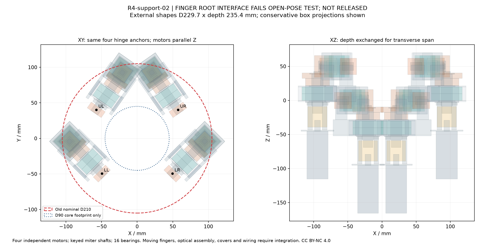
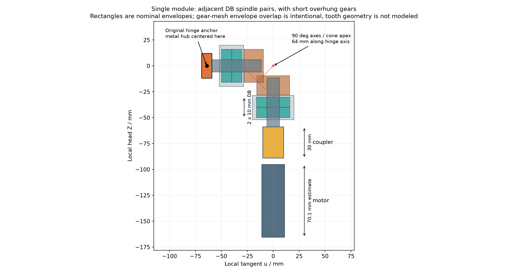

<!-- SPDX-License-Identifier: CC-BY-NC-4.0 -->
<!-- Required Notice: Odradek — Auromix contributors (https://github.com/Auromix/odradek) -->
# R4-support-02：轴向后置电机与直角锥齿轮支承研究

状态：**独立名义机构候选；与当前灯片连接存在已确认干涉，不能并入总装制造。** 四驱动之间通过了本次静态包络检查，但当前四片在 `q=0°` 会碰到固定支承。头部质量也不能继续按已实现 2 kg 处理。尚无零速持续夹持、失电保持或 2 kg 净工件额定结论。

输入固定为 `R4-layout-03`，[r4-layout.json](../../engineering/parameters/r4-layout.json) 的 SHA256 为 `4349d1797b906b67a7bc396fcb84bc439c2d70dd0b337659e552cee293d2dd81`。四个根点 R70、方位35/145/225/315°、上下根 z0/+50、四瓣轮廓均未修改。相对于 [support-01](gripper-shaft-support-study.md)，此版将四电机轴改为平行头部 Z，以后向空间换取横向跨度；没有把旧 Ø210 外包强行当成可满足条件。

## 结果和交付

| 项目 | R4-support-02 结果 | 解释 |
|---|---:|---|
| 四驱动外形的最小同轴包络直径 | **229.6945 mm** | 圆柱使用解析半径，矩形使用角点；不含罩、线缆、完整灯片 |
| 保守 OBB 角点直径 | 246.2194 mm | 斜置圆柱的方盒角点会夸大半径，不能与实体外形尺寸混用 |
| 头部前脸坐标中的 z 范围 | **−165.4…+70.0 mm** | 总深235.4；上电机尾部决定负向极值 |
| 旧安装面 | z=−130 mm | 名义驱动越过该面35.4 mm；尾线和拆装仍额外占空间 |
| 驱动间检查 | 25 对 OBB 待细查，实体包络均无正交叠、均≥1 mm | 上方两输入轴承座最近，实际间隙1.2635 mm；公差未加入 |
| 灯片展开检查 | **12 个灯片—固定支承正交叠** | 每指各碰轴承座、后盖和侧板，见后文 |
| 目录标准件质量小计 | 1.7256 kg | 包括电机、减速器、编码器、齿轮、轴承、联轴器、KM/MB；不是完整头 |
| 名义驱动质量估算 | **2.6873 kg** | 加自制金属件毛几何；不是称重数据 |
| 完整头部初步规划 | **3.57–4.35 kg** | 未含未选定的失电保持器；建议主臂算3.5/4.0/4.5 kg敏感性 |
| 驱动质心，前脸坐标 | **[0, +33.0694, −19.8122] mm** | 名义原生几何质心分配目录质量；不是原厂/实测 CoM |

[复现脚本](../../engineering/gripper_miter_support_study.py) · [完整输入/质量/计算 JSON](../../engineering/generated/gripper-support-02/R4-support-02.json) · [碰撞报告](../../engineering/generated/gripper-support-02/collision-report.json) · [四模块 STEP](../../engineering/generated/gripper-support-02/R4-support-02-envelope.step) · [单模块 STEP](../../engineering/generated/gripper-support-02/single-miter-module.step) · [候选 BOM](hardware/gripper-miter-support-bom.csv) · [来源及页码 JSON](sources/gripper-miter-support.json)



图中投影是保守方盒；圆柱之间的实际间隙以实体复查为准。图中 Ø90 圈仅为中心区域的平面参考，**不构成相机、显示、连接器或光路避碰通过**。相对旧安装面后伸也不自动等于已经碰到 J7 实体，但必须重新检查 J7 包络、回转扫掠、安装延伸和重心力臂。

## 齿轮候选：使用带成品键槽的 MMSB 配对

依据 [KHK 2025 官方斜交齿轮目录](https://khkgears.net/pdf/2025/miter-gears.pdf)，优先研究 `MMSB1.5-20R` + `MMSB1.5-20L`。两只必须来自相容系列、模数和齿数一致、旋向相反。以下均为目录条件下的参考值，不是本项目持续额定。

| 1:1 候选 | 主要尺寸 / 材料 | 目录弯曲 / 齿面扭矩 | 结论 |
|---|---|---:|---|
| SM1.5-20，直齿 | OD32.12，S45C未淬硬 | 3.12 / 0.30 N·m | 不能按3.7 N·m筛查通过 |
| SMSG1.5-20R/L，磨削弧齿 | OD31.74、孔8，S45C齿面淬硬 | 4.10 / 3.47 N·m | 表内齿面值仍小于3.7；不得直接拿低速补足 |
| **MMSB1.5-20R/L，成品孔弧齿** | **OD31.9、孔12H7、键槽4×1.8**；SCM415渗碳55–60HRC | **7.74 / 7.34 N·m** | 进入本次机构研究，仍需真实摆动工况核算 |
| MMSB1-20R/L，较小一级 | OD21.29、孔10 | 2.24 / 2.09 N·m | 不足，不能作为无代价减重替换 |

MMSB 尺寸来自 PDF第9页、印刷320–321页：节圆30、安装距 **E=28**、全长 **F=18.48**、齿冠到背面G=13.95、轮毂宽 **H=10.5**、孔长 **I=16.5**、齿宽 **J=7**、保持面直径K=17.2 mm，单只52 g；两颗M4顶丝随齿轮提供。传扭采用键，不能用“有两颗顶丝”代替承载证明。全件渗碳后不得擅自扩孔、切键槽或车短。英制网页字段与公制表出现齿宽换算不一致时，本研究以公制原图7 mm为准。

**E、F、H、I 是不同尺寸。** E是两轴交点至齿轮背面的安装距，不能把18.48 mm全长放到轴交点上；也不能仅按10.5 mm轮毂宽估算齿轮占用。当前名义模型让两轴准确90°相交，两齿轮的背面均离交点28 mm。模型的齿部只是外包体，**未生成真实齿形或接触斑**。

目录 PDF第3页、印刷308–309页规定：MMSB表内按100 rpm、超过10⁷次循环、均匀电机与负载冲击、50°C时100 cSt润滑、一般轴/箱体刚度及单端支承计算；双向载荷的齿根许用应力已按2/3处理。SMSG采用600 rpm条件。3.7 N·m对应的目录最小参考比为 `7.34/3.7=1.984`，**不能称为整机安全系数**。

90°/5 s 的平均速度约3 rpm。低速摆动、停驻受力、反复换向、润滑膜和局部重复接触与目录连续转动工况不同；不能按100/3倍放大许用扭矩，亦不能把目录值直接变成停驻持续力矩。需要按实际角度/载荷/温度循环复算并做寿命台架。安装距、轴交角、轴线偏置与接触斑要按 KHK 印刷312–313页落实；正常齿侧隙应保留，目录法向侧隙0.05–0.15 mm，不允许用零侧隙消除感知误差。

## 支承、轴向栈和扭矩路径

每指：`FAULHABER → MJC20柔性联轴器 → 独立输入阶梯轴 → R/L锥齿轮 → 独立输出轴 → 金属指根毂`。输入、输出轴各两只 **SKF7201 BECBP** 相邻背对背（DB），共16只。齿轮在双轴承前短悬伸；双支承不等于齿轮一定夹在两轴承之间。不能在相交轴中心画两根贯通钢轴让其穿模。

[SKF 官方目录](https://cdn.skfmediahub.skf.com/api/public/0901d196802809de/pdf_preview_medium/0901d196802809de_pdf_preview_medium.pdf) PDF408–409页、印刷406–407页：7201为12×32×10 mm、单只C=7.61 kN、C0=3.8 kN、约36 g、40°接触角。轴肩da≥16.2，壳肩Da≤27.8、另一侧Db≤30，圆角ra≤0.6/rb≤0.3 mm。名义轴肩Ø17.3，前壳口Ø27.5、后盖口Ø28；这些数值尚不是公差配合放行。

`CB`表示正常轴向游隙，**不是预载**。该孔径相邻DB未安装组的目录游隙为15–23 μm；加入隔圈不能仍无条件继承这个结果。当前两轴承直接相邻，几何中心距10 mm；SKF尺寸a=14 mm对应DB作用中心距28 mm，但下面保守梁筛查使用10 mm几何中心。实际内部轴向诱导载荷、安装配合、工作游隙与刚度仍需轴承系统计算。SKF还提示轴向偏载、卸载侧滚动状态与最小负载要求；不能仅看C0很大就认定合格。

轴坐标 `t` 从锥齿轮两轴交点向各轴后方取正：输入为−Z，输出为−u。`u`为每个固定指根轴的切向，空间符号UR/UL/LL/LR取+et/−et/−et/+et；这与齿轮R/L旋向是两件事。

| 局部t区间，mm | 输入轴 | 输出轴 |
|---|---|---|
| 7.2…11.5 | M4前端防脱螺钉/Ø16垫片名义预留 | 同左；螺纹啮合尚未发布 |
| 9.52…28 | MMSB全长；成品孔从11.5到28 | 同左 |
| 28…30 | Ø17.3轴肩 | 同左 |
| 30…40 / 40…50 | 两只相邻DB轴承 | 同左 |
| 50…52 | Ø17.3内圈垫套 | 同左 |
| 52…53 / 53…57 | MB1 / KM1，M12×1 | 同左 |
| 59…69 | Ø10联轴器轴头 | Ø12指根毂轴段，毂长10 |
| 59…89 | Ø20×30 MJC20 | — |
| 79…95.3 | 原厂Ø6输出轴16.3，嵌入10 | — |
| 95.3…165.4 | Ø22×70.1组合本体估算 | — |

轴交点位于原指根沿u偏移64 mm，输出毂中心恰好回到原指根；四个根点坐标没有为了藏传动而迁移。金属座包含独立轴承孔、外圈挡肩与后盖，齿轮轴向力经轴肩/锁紧件、内圈、滚动体、外圈、金属座回到头架，**不把锥齿推力交给减速器轴**。联轴器仍有装配偏差反力，隔离不是数学上的零反力。

KM1为M12×1、外径22、宽4、面径17 mm，MB1为12/17/25×1 mm，来源为SKF印刷1104/1106页；轴上需要锁片内舌槽，模型平垫片未展开弯折片。标准件可查到不等于自制轴已能下单：键槽、材料/热处理、磨削轴颈、公差、螺纹退刀槽、锁片槽、端螺钉有效啮合、壳体分件和装配通路仍是明确未决项。

[NBK MJC-CS-EGR 官方手册](https://www.nbk1560.com/images/en/product/jaw_type/MJC-CS-EGR/MJC-CS-EGR_1.pdf) p3–4给出MJC20 Ø20×30、单侧轴插入10、额定6 N·m，6/10 mm孔的滑移试验值6.4/6 N·m。12 mm齿轮/轴承座轴不能直接穿入最大孔11 mm的MJC20，输入轴必须车出10 mm轴头。FAULHABER KS1轴的5.982–5.990 mm与NBK的6h7/34–40HRC试验条件不完全相符，需原厂确认或扭矩连接台架。40–60°C弹性体降额系数0.7后为4.2 N·m；EGR EasyFit并不保证零回差，3.7/87估算扭转约2.44°。该连接和温升尚未闭合。



## 力、轴挠度和换向敏感性

依据 [KHK Gear Forces表12.1](https://khkgears.net/new/gear_knowledge/gear_technical_reference/gear_forces.html)：`dm=d−b·sinδ`，`Ft=2000T/dm`（T用N·m、dm用mm）。凸齿面作用时：

```text
Fa = Ft/cosβ × (tanα sinδ − sinβ cosδ)
Fr = Ft/cosβ × (tanα cosδ + sinβ sinδ)
```

凹齿面作用时上述两项的±号交换。取d30、b7、δ45°、α20°、β35°、T3.7，得到 `dm=25.0503 mm`，`Ft=295.406 N`；凸面 `(Fa,Fr)=(-53.450,239.074) N`，凹面为 `(239.074,-53.450) N`。轴承所见径向合力最大 `sqrt(Ft²+Fr²)=380.028 N`，外加轴向力最大239.074 N。负轴向力会拉近齿轮，轴承游隙与安装距离必须控制，否则可能吃掉齿隙。

**轴向力不能仅作为一个过轴心推力处理。** 它作用在平均节圆半径12.525 mm处，还形成最高约 `239.074×12.525=2994.44 N·mm` 的翻转力矩。代码将最大径向力、最大轴向力及此偏心力矩保守同向组合；不同齿面不一定同时出现各最大值，因此这是筛查上包络而非精确齿面工况。

梁简化使用支点t=35/45、载荷作用t=12.525 mm。力与力矩平衡求RA/RB；梁弯矩包含外加偶矩。取实心Ø12、E=205 GPa作估算，不借此指定材料屈服。挠度式为：

```text
δgear = F a²(a+L)/(3EI) + M a(3a+2L)/(6EI)
a = 35−12.525 mm; L=10 mm; I=πd⁴/64
```

| 筛查倍数 | 几何中心模型RA / RB | 最大弯矩 | 毛截面含轴向应力的von Mises | 齿轮处简支挠度 |
|---|---:|---:|---:|---:|
| 1.0× | +1533.6 / −1153.6 N | 11.536 N·m | 72.61 MPa | 0.01466 mm |
| 1.5× | +2300.4 / −1730.3 N | 17.303 N·m | 108.92 MPa | 0.02199 mm |
| 2.0× | +3067.2 / −2307.1 N | 23.071 N·m | 145.22 MPa | 0.02932 mm |

1.5×/2×是敏感性，不是已批准的工作循环。反力负号表示方向改变。C0/几何径向反力比不是SKF等效静载安全系数，不能拿它发布寿命；键槽、台阶、螺纹、缺口、配合、支承弹性、磨损及疲劳未加入。代码另列输出毂处±50 N外载对反力的影响，但那只是局部示例，未把真实全爪力平衡或灯片自重算成已经满足。假设有效4×4×8 mm键的毛剪切/挤压为19.27/38.54 MPa，也不是键连接制造验收。

3.7 N·m是这次齿轮与支承的统一筛查输入，**不是已证明的指根零速持续扭矩**。若直角级效率仅作0.85/0.90/0.95敏感性，减速器输出3.7 N·m后指根只有3.145/3.330/3.515 N·m；要指根3.7反需4.353/4.111/3.895 N·m输入。目录没有提供本工况效率，不能选一个漂亮值消掉损失。最终还需电机热、驱动电流、静摩擦、灯片自重偏置及失电保持验证。

## 已确认的根部干涉与质量边界

当前上片根半宽12.42 mm，下片9.72 mm，沿长度继续展宽；新输出固定座的最近侧距离毂中心仅12 mm。原片从R70直接展开，其外缘进入固定座。脚本直接按共享轮廓构造灯片实体并在q0做布尔交集，未修改原片来绕过问题。

| 每片 | 与自身输出座交叠 | 与后盖交叠 | 与侧板交叠 |
|---|---:|---:|---:|
| UR、UL分别 | 142.701 mm³ | 73.645 mm³ | 70.535 mm³ |
| LL、LR分别 | 88.420 mm³ | 73.645 mm³ | 45.333 mm³ |

因此“4个驱动没有互穿”不能推出“现有末端可装配”。这版已在展开姿态失败，未继续把它包装成完整开合无碰撞；安装孔/旋转金属叉尚未发布。下一步应在保持四瓣关系、根位和灯面方向的条件下，协同设计**窄根金属叉与独立输出支承**，然后重新检查全角度、线缆、相机与有限尺寸工件。原片自身的解析分离属于原有结论，不能替代这个新接口检查；法向力LP也不等于2 kg额定握持。

质量账本采用两种口径：目录标准件用目录质量，自制件按本次名义原生环/轴/板体积乘钢7.85、铝2.70 g/cm³的工程假设。自制件是未开工艺孔/键槽的毛几何，小范围固定载体接合重叠尚未从分件体积扣除；**不是把一个实心总方盒当成整块金属**——轴承座已有32 mm通孔、挡肩口和环形结构。未最终定义材料/开腔之前，不声称它是实测质量或严格上、下界。

| 类别，四指总计 | 质量 |
|---|---:|
| 4套电机28.9+减速器109+编码器13.5 g | 605.6 g，未含原厂连接法兰 |
| 8只齿轮 | 416.0 g |
| 16只7201 | 576.0 g |
| 4只MJC20 | 64.0 g，最大孔径配置参考 |
| 8只KM1 +8只MB1 | 64.0 g |
| **目录件小计** | **1725.6 g** |
| 8根阶梯轴含轴肩/螺纹毛形 | 411.8 g |
| 内圈垫套、齿轮前垫片及螺钉包络 | 40.9 g |
| 轴承座环形本体和盖 | 244.6 g |
| 两侧金属载体板 | 188.7 g |
| 电机安装架及指根毂 | 75.8 g |
| **名义驱动合计** | **2687.3 g** |

对旧2 kg头部预算而言，标准件小计约1.73 kg是很强的下限提示，但不是完备称重下限证书；约0.27 kg余量无法容纳本研究的8根轴、支承、四片、光学与壳体。以下是在驱动估算之外明确分开的规划项：

| 其余头部项 | 预算 | 头部前脸坐标CoM范围，mm（规划范围） |
|---|---:|---|
| 其余键、螺钉、凸台、调整垫片 | 40–90 g | x±15、y−15…65、z−90…45 |
| 原厂电机转接及连接附件 | 20–50 g | x±25、y−10…75、z−135…−65 |
| 四片承力骨架与接触垫 | 180–320 g | x±80、y−80…100、z0…130，随姿态变化 |
| 灯、扩散罩、中央显示/探灯及散热 | 100–220 g | 同上，实际分布需分成各片与中心 |
| 双ZED X One S鱼眼 | 72 g | x/y±60、z−40…0；[官方鱼眼行36 g/台](https://docs.stereolabs.com/docs/products/cameras/zedxone/specifications) |
| 相机安装件与头部电子板 | 80–160 g | x/y±65、z−90…10 |
| 齿轮罩、润滑、外装甲和密封 | 180–330 g | x±40、y−40…60、z−120…40 |
| 后架、腕部可拆接口和局部固线 | 150–300 g | x/y±30、z−180…−90 |
| 头部插头、连接线和分支线束 | 60–120 g | x/y±60、z−165…30 |
| **完整头初步合计** | **3569–4349 g** | 不能把驱动CoM直接当完整头CoM |

其中电机、减速器和编码器分别按其轴向子包络中心分配目录质量；锥齿轮按本次外包体积分配52 g，未得到真实齿体厂家CoM。逐项位置和质量在JSON的`mass_locations`；完整头未确定项的CoM范围在`allowances`。名义驱动CoM为 `[0,33.0694,-19.8122] mm`，在当前未移动前脸的世界坐标中为 `[0,88.0694,760.1878] mm`。只能作为后续主臂敏感性输入，不能替代真实材料CAD/称重。

头部规划**不含未选定的保持制动器/锁止器**；若四轴驱动板由外部迁入头内，也要追加。最靠后驱动到z−165.4，旧mount为−130；若通过把腕部安装面后移解决，至少涉及35.4 mm几何差以及额外尾线/工具空间，相应增加或改变末端力臂。现阶段既不能默认可塞在J7旁边，也不能直接把前脸整体前移后沿用原扭矩结果。

## 下一步最可靠的减重顺序

1. **先解决窄根金属叉、轴承座和齿轮定位的共同几何。** 当前根部接口失败，单独美化/缩小外壳无效。
2. **先优化自制载体，保留受力路径。** 188.7 g侧板若开腔减去40–60%，约省75–113 g；这是可核算的设计目标，需保留螺钉边距、扭转闭口路径和轴承定位刚度。244.6 g轴承座已是环形，不能再许诺按实心方盒比例大幅减重。轴和座的缺口、接触变形/疲劳仍需复算。
3. **输入/输出轴承分开定规格。** 16只7201本身576 g，是下一轮最值得对比的标准件质量项。输入端仅传齿轮载荷，输出端另有指根外载；可比较更小角接触对或深沟/专用推力定位组合，但要同时闭合双向推力、间隙、偏心翻转力矩和往复寿命，不能把小轴承外径换进CAD就宣告成功。
4. **小一级齿轮不是现成减重答案。** 同系列MMSB1-20齿面参考仅2.09 N·m，不能承担当前3.7筛查。保留m1.5配对，或先从真实垫位置/任务需求降低所需扭矩后再重选；不得把摆动低速当自动加额理由。
5. **最后才压缩轴和更换联轴器。** 当前8根毛轴约412 g，有针对性中空/局部减径可研究，但前端M4防脱、4 mm键槽、M12锁片槽可能竞争同一薄壁；先做应力与制造剖面。MJC20长30 mm确实耗轴向空间，但6 mm小孔的实际滑移和FAUL轴公差是硬条件，不能只比较额定弹性体扭矩。

即便把载体省下约0.1–0.2 kg，也没有证据能将完整头从约4 kg压回2 kg。应将3.5/4/4.5 kg与质心/安装面变化反馈到主臂，再讨论任务负载、保持方案、传动结构与外形；当前后部Ø230级只是待改的研究包络，不是新的工业设计定案。

## 复现与验证边界

```bash
python engineering/gripper_miter_support_study.py --cad
```

脚本只读冻结布局，输出到独占`engineering/generated/gripper-support-02/`。13项数学/单位/反算自检包括力矩反算、90°分力互换、复现KHK表12.6数值、力和力矩平衡、mm/SI挠度交叉验证、根点回代、轴90°与联轴器双侧嵌入。180个名义实体有效，STEP重导仍为180实体；25对驱动OBB候选完成实体距离与交叠复查；四片展开固定件交叠共12处明确失败。

这些验证证明**脚本、名义几何和计算在其声明范围内一致**，不证明采购已到货、加工图可制造、全运动无碰撞、热稳定、机械寿命、夹持成功或保持安全。原生几何仍欠键槽/真实齿形/紧固与工艺细节，没有用漂亮的可视化图覆盖这些未决。
