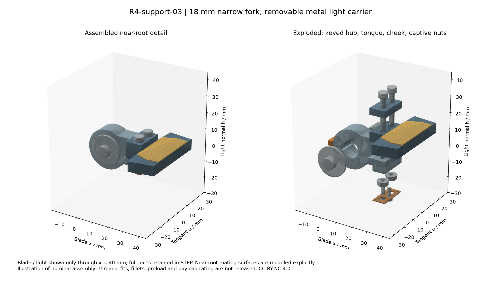

# R4-support-03：窄根金属叉、键轴与可拆灯片

**本阶段完成的是局部装配与刚体运动研究。** 保留 R4-layout-03 的四个根轴位置、上片 140 mm / 下片 100 mm，以及上 0–114° / 下 0–126° 的研究范围；修改限制在灯片局部 `x≤25 mm`。新的轴毂、叉板、金属舌、螺栓、捕获螺母和保持片均有实体，四片 `x>25 mm` 与原模型的双向差集体积为零。没有修改共享参数或共享总装。

四指对固定驱动零件的连续间隙校核通过当前名义模型：窄根保守包络间隙下界 **0.508 mm**；上片远端 **0.468 mm**；下片远端 **1.166 mm**。最小离散实体距离分别为 **1.000 mm**、**2.914 mm**、**2.914 mm**。这次根部集成**不需要缩小开合角**。这些余量未扣制造/安装误差、载荷变形、线束和外壳，不是整爪范围许可或 2 kg 承载证明。

当前 FAULHABER 22GPT 的 3.7 N·m 是齿轮箱目录限制，经过联轴器和 90° 齿轮传动之后不能把末端轴称作“持续 3.7 N·m”。另列的 5 N·m 是根部设计输入敏感性；当前电机/减速器组合并未满足这一输出要求。后续更轻的线性推杆路线可复用金属舌与可拆叉接口，但需要新的驱动和支承研究。



图中灯片仅截取到 x=40 mm 以看清近根连接，完整 STEP 保留整片。图是实体几何的技术视图；内螺纹、滚道、齿形和加工圆角未完整生成。

## 1. 相对 support02 的具体变化

| 项目 | 本次候选 |
|---|---|
| 四根转轴 | R=70 mm；φ=35°/145°/225°/315°；上 z=0，下 z=+50，全部保留 |
| 轴承 / 锥齿 / 电机 | 沿用 support02：双 SKF 7201 BECBP，KHK MMSB1.5-20，原电机后置；未用无来源的小轴承替换 |
| 输出轴末段 | Ø12 轴承/螺纹段 → **Ø10×10.8 mm** 轴毂座；轴肩在局部 u=+6 |
| 轴毂 | Ø24×10，Ø10 孔；中心仍在原根点；与下叉一体机加工候选 |
| 承扭键 | **3×3×8 mm** 方端平键；轴槽深 1.8，毂槽深 1.4，名义顶隙 0.2 |
| 轴向定位 | 轴肩 → Ø16/Ø10.1×1 垫套 → 轴毂 → Ø18/Ø4.3×1.5 端垫圈 → M4×10 |
| 轴端凹入 | 毂端面 u=−5；轴端 u=−4.8，凹入 0.2，保证端垫圈压毂而不是提前压住轴端 |
| 近根金属舌 | x=15…24 宽 18；x=24…25 恢复原片截面；x>25 保留原实体 |
| 可拆叉 | 下叉厚 4，上叉厚 4，夹住 6 mm 金属舌；两孔 Ø3.4，中心 **x=21、y=±4.5** |
| 灯窗 | 原灯窗在 x<25 部分移除；x≥25 保留，避免在 18 mm 金属舌之外悬空 |
| 螺母防转 | M3 六角螺母槽 AF5.7，端铣刀 Ø1 的角部避让；0.5 mm 金属保持片仅防螺母掉落 |
| 支架开腔 | 16 块原侧板开圆端槽；输入 26×12，输出 16×10；轴承座和挡肩不减薄 |

这里 `u` 沿各模块固定切向，正负镜像与 support02 一致；片体局部 x 沿长度，h 朝发光面。正开合 q 把片体向前转入抓取姿态。没有用隐藏相交、浮动灯片或不承力的灯屏来填补连接。

## 2. 真实接触与载荷路径

传力顺序是：**软垫 / 金属灯片 → 6 mm 金属舌 → 上下金属叉 → 键轴毂 → 平键 → 输出轴 → 双支承轴承 → 固定载体**。LED 扩散片和中央显示器不在这条结构载荷路径内。

轴毂与轴之间的扭矩由平键侧面传递，M4 端螺钉负责轴向保持。轴肩垫套越过 Ø10 座，停在 Ø12 轴肩；KM1 能从 Ø10 端装入，避免在其前面设置无法穿越的 Ø14 整体凸肩。KM1 仍负责支承内圈定位，新增轴毂端螺钉不用于随意施加轴承预紧。

金属舌上下两面分别接触叉板；每面名义接触面积 `18×10−2π×1.7²≈161.84 mm²`。舌端面 x=15 接触叉根止靠。指端弯矩以相反方向的叉面法向力及 M3 螺栓拉力闭合，不以灯窗摩擦保持。纵向拉出与侧向载荷还会进入螺栓孔壁；Ø3.4 间隙孔可能存在重复装夹位移，不能据此宣称零回差或定位精度。

关键接触对有实体距离=0、正相交体积=0 的校核。轴肩至垫套名义接触环面积约 **32.98 mm²**；毂槽、倒角和圆角会改变局部承压，需要真实加工图复核。六角槽不是热熔嵌件；0.5 mm 保持片不承担正常夹紧力，螺母通过垫圈直接压在下叉上。

## 3. 装配与工具路径

1. 在台架上先完成 support02 的双轴承轴系。轴承配合、CB 游隙、KM1/MB1 轴向定位仍需按 SKF 资料出制造图，不能把 CB 配对轴承称为已经预紧。
2. 装入肩垫套和平键，从 −u 侧滑入轴毂，装端垫圈、M4×10。名义轴内螺纹啮合长约 8.3 mm；端垫圈不会提前压到凹入的轴端。
3. 从下叉底侧加工开口装入 M3 垫圈和六角螺母，安装 0.5 mm 保持片及两颗 M2×6。保持片让拆灯片时螺母仍留在叉内。
4. 从发光面一侧放入金属舌和上叉，两颗 M3×20 穿过金属舌并拧入捕获螺母。灯窗起点后移，螺钉和工具不经过发光材料。
5. 头部按**上模块预装在先、下模块在后**的顺序集成。换灯片只拆灯面两颗 M3；换上部轴毂则需先拆下方模块。

20/40/60 mm 直线工具空间不是同一个结论：本次检查灯面 M3 的 Ø5×60 mm 直工具通道，四片共 8 处均无实体穿透；下两模块 M4 的 Ø5×60 mm 通道也通过。上两模块 M4 的长直通道被下模块输入轴承/载体挡住，所以明确采用**单模块预装**；完整头部中不能直接宣称这两颗 M4 可在线拆卸。单模块状态没有自身驱动零件阻挡该路径。

本模型没有冻结最终后载板和模块固定螺钉，因此仍需补齐模块安装/拆卸路径及外壳开启方式。工具柄旋转空间、M3/M4 头下圆角的孔口倒角、真实六角孔和供应商公差也要进入制造图。不可直接采用 Unbrako 目录中的一般拧紧扭矩；铝叉承压、垫圈硬度和接头刚度需要单独确定预紧窗口。

## 4. 运动检查边界与方法

对新根部使用能**完全包含每个实际近根实体**的简单实心包络，逐件执行“实际件减包络”的体积为零检查。该包络填实了空隙，因而是保守几何，不是缩小模型避碰。远端片体使用原实体。

对每个 2° 区间，以端点最小实体距离减去旋转位移上界 `2R sin(Δq/4)`，得到区间内的连续间隙下界。间距对形状的 Hausdorff 位移是 1-Lipschitz；使用每个运动块全部点到转轴的保守最大半径 R。仅排除自己输出轴 u=6 的积分式轴肩接触，其他固定驱动实体均参与。报告保留全部区间与最近零件名称；不是只检查开位、闭位或若干漂亮姿态。

| 运动块 | 上片 0–114° | 下片 0–126° |
|---|---:|---:|
| 新窄根的连续间隙下界 | 0.508 mm | 0.508 mm |
| 未改远端对固定驱动下界 | 0.468 mm | 1.166 mm |
| 新窄根采样最小间隙 | 1.000 mm | 1.000 mm |
| 远端采样最小间隙 | 2.914 mm | 2.914 mm |

新根部对其他新根部、以及对其他片远端另用根点球包络和独立角度范围做保守检查，全部通过；根对其他片远端的最低连续下界为 **25.211 mm**，结果保存在 `root-interface-details.json`。未改远端彼此的关系继续属于原片形分离研究；这份根部研究没有重新声称所有物体接触条件成立。原 Ø80 长圆柱可能先碰骨架的问题仍由后续接触鞋研究解决。另有原远端楔垫与 LED 窗占位相交：上片每垫约 **52.743 mm³**；本次遵守 x>25 不改的范围保留了它，新根部件之间无正体积相交。这进一步说明当前研究只闭合根部，不能宣称整片所有层已经可以制造。

以上未包含光学组件、J7、外壳、线束、软材料变形、末端工件与打印误差。因此可复用的是近根接口和局部避让证据，而非整头总装许可。

## 5. 3.7 / 5 N·m 静态粗筛

| 量 | 3.7 N·m | 5.0 N·m |
|---|---:|---:|
| Ø10 轴处键侧切向力 `2T/d` | 740 N | 1000 N |
| 平键剪应力 `F/(3×8)` | 30.83 MPa | 41.67 MPa |
| 铝毂键侧承压，按 1.2 mm 有效高 | 77.08 MPa | 104.17 MPa |
| Ø10/Ø4 环截面名义扭剪应力 | 19.34 MPa | 26.13 MPa |
| 10 mm 间距的叉面力偶 | 370 N | 500 N |
| 4 mm 上叉、18 mm 宽、7 mm 保守悬臂的名义应力 | 53.96 MPa | 72.92 MPa |
| 同一上叉梁模型挠度，E=70 GPa | 0.00630 mm | 0.00851 mm |
| 每颗 M3 外载增量，尚未加入预紧/撬力 | 185 N | 250 N |
| 金属舌穿过双 Ø3.4 孔的简化净截面弯应力 | 55.06 MPa | 74.40 MPa |

这些公式用来暴露受力点，不是安全系数或疲劳合格证。4 mm 薄上叉及短跨结构不满足无限细长梁假设；螺栓预紧、撬力、接触分布、键边缘峰值、反复换向微动和整个轴的组合弯矩仍须专门校核。Ø10 轴键槽底距离按 Ø4 螺纹大径包络计算的轴内孔仅剩 **1.2 mm**，是必须检查的局部薄弱截面；不能只用上表的完整圆环扭剪应力宣布通过。

6061-T6 是加工料候选，E、密度参考 [thyssenkrupp 数据表](https://d2zo35mdb530wx.cloudfront.net/_legacy/UCPthyssenkruppBAMXUK/assets.files/material-data-sheets/aluminium/aluminium-6061.pdf)。管材/挤压材的最低屈服值不自动变成这个叉形机加工毛坯的保证值；钢轴/平键的牌号、热处理和材质证明未冻结。打印件只能验证装配，不用来验证此力矩或 2 kg。

## 6. 质量与下一步

载体开槽按真实切除体积减少 **36.257 g**。输入侧板槽周围保留的最小桥宽 6 mm、输出槽桥宽 7 mm；轴承孔和挡肩未开腔。这个结果只说明几何减重，尚未证明侧板刚度和连接螺钉力流。

补齐根部后驱动总计 **2707.579 g**，比 support02 净增 **20.254 g**；四片金属片另计 **162.659 g**。驱动名义质心在头面坐标 **[0, +32.466, −19.042] mm**，用原生几何质心和厂商目录质量分配，非实测。含灯光、相机、后载体、壳体、线束等的规划头重为 **3.577–4.252 kg**，仍不含未选保持制动器。最终质量明细、头坐标 COM 和完整头预算见 [root-interface-details.json](../../engineering/generated/gripper-support-03/root-interface-details.json)。本次把真实叉、垫套、键、螺母和保持片补进来，不能只报去掉的 36 g。新轴毂接口也不会让原约 4 kg 头部自动回到 2 kg。

下一阶段优先比较能去掉多级锥齿/中间轴的线性推杆布置，同时保留这次闭合的金属舌与拆装逻辑。是否改成曲柄、采用何种销轴/支承、保持力与长时间夹持热条件，均需独立验证。当前根部接口作为可继续加工细化的候选归档；不把高质量锥齿驱动整体放大作为最终外形。

## 7. 文件与复算

- [主参数、区间间隙和 QA](../../engineering/generated/gripper-support-03/R4-support-03.json)
- [质量 / COM、接触、独立根部避让](../../engineering/generated/gripper-support-03/root-interface-details.json)
- [全开 STEP](../../engineering/generated/gripper-support-03/R4-support-03-open.step)、[原范围全闭 STEP](../../engineering/generated/gripper-support-03/R4-support-03-closed.step)
- [单驱动 + 近根 + 完整上片](../../engineering/generated/gripper-support-03/single-root-module.step)
- [独立 BOM](hardware/gripper-root-support-bom.csv)、[一手来源与页码](sources/gripper-root-support.json)

```sh
python engineering/gripper_root_support_study.py
python engineering/gripper_root_support_details.py
```

运行需 CadQuery、NumPy、Matplotlib；脚本读取并校验 R4-layout-03 参数 SHA256 `4349d1797b906b67a7bc396fcb84bc439c2d70dd0b337659e552cee293d2dd81`，也记录 support02 脚本 hash。252 个开位实体及 STEP 回读实体有效，14 项主 QA 自检通过；渲染不等于制造通过。`--skip-motion` 仅调试几何，会生成没有运动证明的 JSON，正式复算不可使用该参数。

原创研究文件采用 CC-BY-NC-4.0。Required Notice: Odradek — Auromix contributors (https://github.com/Auromix/odradek)。目录数据和源 PDF 版权仍属于各厂商；没有将第三方原厂 CAD/PDF 纳入本项目许可。
