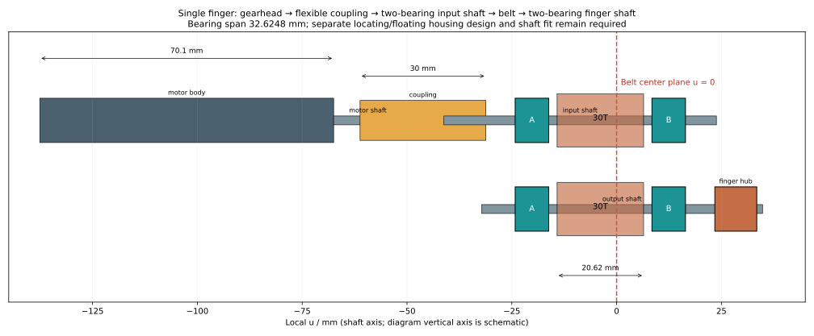
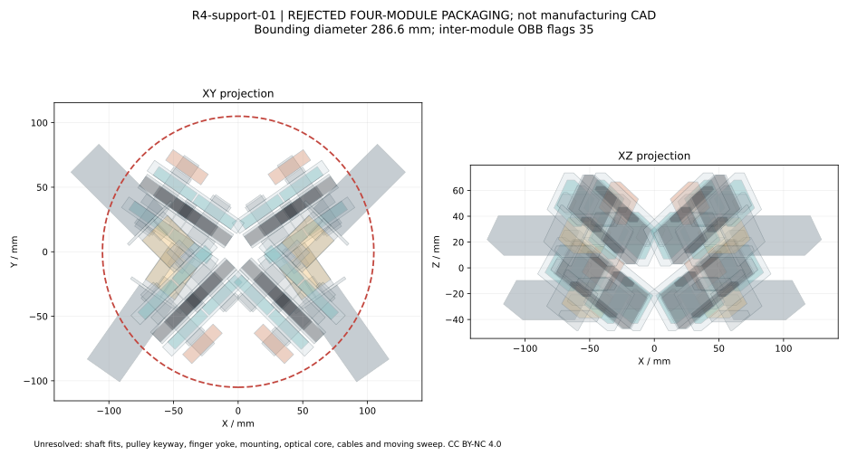

<!-- SPDX-License-Identifier: CC-BY-NC-4.0 -->
<!-- Required Notice: Odradek — Auromix contributors (https://github.com/Auromix/odradek) -->
# 单指双支承传动研究：R4-support-01

状态：**单指机构候选；四模块包装反例；未冻结、非制造发布、无额定净载荷或断电保持结论。** 2026-09-27。

结论先行：独立输入轴和指根轴各放两只轴承，可以让皮带径向载荷经轴承、金属支座传到头部结构，避免直接挂在 FAULHABER 减速器输出轴上。但把真实轮毂、联轴器和支座补入后，**原 R70 / C45 / q±2.5 / 上下根 z=0/+50 的紧凑布置不能沿用**。本研究的四模块名义外包为 **Ø286.64 × 122.16 mm**，并且仍有模块间实体交叠；扩大旧 Ø210 外壳本身不能解决问题。

应保留既定前脸和四灯片比例，下一步比较轴向后置电机配 90° 锥齿轮、两级同步带或直齿扇形驱动的独立方案。上述替代方案在本报告中**没有被选定或验证**。本报告完成当前方案的真实尺寸反例与单模块受力路径，不把外形设计迁就到一个尚未排除干涉的大头部。

## 1. 输入和交付边界

读取 [R4-layout-03 参数](../../engineering/parameters/r4-layout.json)，SHA-256：

`4349d1797b906b67a7bc396fcb84bc439c2d70dd0b337659e552cee293d2dd81`

关联旧研究：[原切向皮带布置](gripper-drive-packaging.md)、[下根前移 +50 mm](gripper-drive-forward-lower-note.md)、[旧 forward-lower JSON](../../analysis/gripper-drive-packaging-forward-lower.json)。本研究不修改这些输入、总装、夹片形状、主 BOM 或其历史证书。

- 四根轴的方位仍为 φ=35/145/225/315°；指根 R70，上根 z0、下根 z+50。驱动轴与指根轴平行且中心距45 mm，z差25 mm、径向差37.416574 mm。
- 电机组合本体仍以 Ø22×70.1 mm 作为**项目估算**；厂家最终电机、减速器、编码器组合图未闭合。本报告没有把该长度变成官方订单尺寸。
- 力矩3.7 N·m是齿轮箱目录上限附近的**支承筛查输入**，不是电机连续热能力、四指抓取或2 kg净载荷的通过证据。灯片、灯面、显示屏均不能成为结构止靠或承力回路。
- 联轴器、轴承、轮和轴已有可采购系列及具体候选；轴配合、轮轴连接、保持/制动、支架和指骨架仍未闭合。

交付：

- [可复现脚本](../../engineering/gripper_support_study.py)、[完整结果及坐标](../../engineering/generated/gripper-support/R4-support-01.json)、[四组碰撞报告](../../engineering/generated/gripper-support/collision-report.json)。
- [单模块 STEP 包络](../../engineering/generated/gripper-support/single-finger-envelope.step)、[四模块 STEP 包络](../../engineering/generated/gripper-support/R4-support-01-envelope.step)。STEP 包含轴、轴承环、联轴器、轮毂/法兰、带包络、带座孔的支座、输入安装桥及指根金属毂；不含真实齿廓、夹紧螺钉、键槽和完整指根连接叉。
- [支承 BOM](hardware/gripper-support-bom.csv)、[一手来源及页码](sources/gripper-support.json)。原厂 PDF 留在研究过程目录，未作为本项目授权材料重新分发。

## 2. 必须更正的旧假设

| 项目 | 旧模型 | 本次核对及影响 |
|---|---|---|
| 30齿、9 mm带宽轮的总长 | 14 mm，占位 | Gates `3MR-30S-09 / 7843-6011` 总长 **L=.812 in=20.6248 mm**。工作齿面宽 **W=.400 in=10.16 mm**，不能混作总长。 |
| 轮外径与轮毂 | Ø34整体柱，占位 | 齿顶外径27.8892 mm；法兰参考外径31.75 mm；轮毂直径19.7104 mm；单侧轮毂伸出E=7.7724 mm。总长在一侧伸出，不能把真实轮毂删除。 |
| 电机前面到轮中心 | 8.15 mm | 当前独立轴候选需 **67.4986 mm**，电机沿本轴后移 **59.3486 mm**。 |
| 皮带对轴的力 | 约258 N | 258.31 N是3.7 N·m所需的**张力差**；支承受紧边与松边的合力，预紧后通常更高。本报告筛400/600/800 N。 |
| 减速器径向能力 | 不能据占位圆柱推定 | 22GPT HT 官方为距安装面10 mm处径向300 N；不能将它理解成任意位置均可挂300 N，也不能当成没有径向能力。独立支承避免把带张力直接交给它。 |
| 原四驱动包络“通过” | Ø175.0343 / 深109，仅列出的占位体 | 该结论仍可描述历史占位输入，**不能支持真实双支承总装可装配**。本报告否定其对完整传动空间的外推。 |
| 光学、驱动避碰 | 基于旧驱动包络 | **待按本次新增支座、联轴器及轮毂重算**，旧结果不能继承到本方案。四灯片自身基于未改几何的解析分离结果不因此失效。 |

尺寸依据：[Gates Light Power 手册](https://www.gates.com/content/dam/documents-library/catalogs/light-power-and-precision-manual.pdf)，印刷页31的 Type 6F 图、印刷页32的30齿9 mm行（PDF第33、34页）；[FAULHABER 22GPT HT](https://www.faulhaber.com/fileadmin/Import/Media/EN_22GPT_HT_FCH.pdf)，PDF第1页载荷、第2页输出轴及选项。

## 3. 单模块构造与轴向堆叠

传力路径为：电机/减速器 → 柔性联轴器 → **双支承独立输入轴** → 30T/30T同步带 → **双支承指根轴** → 金属指根毂及连接叉 → 灯片承力骨架。四只轴承外圈经两块共同的金属支承桥传到头部骨架。输入和输出轮都位于各自的两支承之间。



定义局部 u 沿电机朝输出端的轴向，皮带中心面u=0，轮毂朝−u；以下单位均为mm。Type 6F的法兰组总长按L−E划分并关于带面居中，是名义图样读法；加工公差、法兰翘曲、端面跳动还没有进入模型。两侧各留2 mm轮与轴承间隙。

| 部件 | u范围/位置 | 含义 |
|---|---:|---|
| 真实轮总包络 | −14.1986…+6.4262 | 20.6248 mm；其中法兰组12.8524 mm、单侧轮毂7.7724 mm |
| A轴承 | −24.1986…−16.1986 | 6000-2RSH，中心−20.1986 |
| B轴承 | +8.4262…+16.4262 | 6000-2RSH，中心+12.4262 |
| 两轴承中心跨距 | **32.6248** | 带面不在跨距正中，反力不是各一半 |
| 两块支承桥 | −26.1986…−16.1986 / +8.4262…+18.4262 | 各10 mm厚；名义26×8座孔、24 mm外圈承肩开口；安装孔与配合未发布 |
| 外侧定位预留 | −30.1986…−26.1986 / +18.4262…+22.4262 | 垫片、挡圈和端隙的4 mm设计预留；不是已选定的挡圈成品 |
| 联轴器 | −61.1986…−31.1986 | Ø20×30 mm，每侧轴插入10 mm作为本候选输入 |
| 电机安装面 | −67.4986 | 16.3 mm轴伸减去10 mm插入长度后保留6.3 mm |
| 电机估算本体 | −137.5986…−67.4986 | 70.1 mm；不含线缆和接头 |
| 输入轴 | −41.1986…+23.8014 | 名义Ø10×65 mm |
| 指根轴 | −32.1986…+34.8014 | 名义Ø10×67 mm |
| 外侧金属指根毂 | +23.4262…+33.4262 | Ø24×10 mm研究包络，中心u=28.4262 |

**金属指根毂还不是灯片连接完成。** 它相对于原带面侧置28.4262 mm，需要金属连接叉回到原灯片平面，并验证该叉的扫掠、刚度、装卸和碰撞。不能直接把灯片平移28 mm后继续引用原夹片分离结果，也不能让光学片承担这个横向偏置产生的弯矩。

轴向定位应采用一端定位、另一端按热伸长允许适当浮动的外圈布置；轴承内圈与轴、垫片、轴肩/挡圈构成独立定位。内圈垫片可先按OD12.2 mm研究，SKF此轴承允许的轴肩直径12…12.5 mm、轴肩圆角≤0.3 mm。**本模型没有发布端隙、轴承预紧或精确挡圈型号**；不能靠拧紧两个端盖给深沟球轴承施加未知预紧。[SKF目录](https://cdn.skfmediahub.skf.com/api/public/0901d196802809de/pdf_preview_medium/0901d196802809de_pdf_preview_medium.pdf)，印刷页264–265。

## 4. 标准件选择的有效范围

| 件 | 当前候选 | 可以确定 | 不能据此确定 |
|---|---|---|---|
| 轴承 | 4×SKF `6000-2RSH`/指 | 10×26×8 mm；C=4.75 kN，C0=1.96 kN；19 g/只 | 配合、游隙、摆动磨损、组合轴向载荷、结构寿命 |
| 联轴器 | NBK `MJC-20CS-EGR-6-10` | Ø20×30；弹性体额定6 N·m；6 mm孔滑移试验6.4 N·m、10 mm孔6 N·m | 实际两根轴的夹持能力、反转寿命、零间隙 |
| 可采购轴基件 | MISUMI `KZAF10-65` / `KZAF10-67` | S45C、高频淬火表面≥50 HRC、h6；可配置键槽、挡圈槽 | h6并不是本工况的轴承过盈配合承诺；完整追加工订单未验证 |
| 轮/带 | 2×Gates `3MR-30S-09` + `180-3MGT-09` | 30/30齿1:1、3 mm节距、9 mm带宽；180 mm节线长度对应名义C45 | MPB轮的10 mm成品孔和可靠扭矩连接、预紧、零速保持、失电安全 |

### 联轴器与减速器接口

选择较小的MJC-20有具体原因：MJC-30虽然弹性体额定值更大，其6 mm小孔夹持滑移试验仅4 N·m；MJC-20在6/10 mm孔的试验限制分别为6.4/6 N·m。本次取两孔及弹性体的最小名义值6 N·m，除以3.7仅为1.62倍目录比值，**不是整机安全系数**。40…60°C弹性体温度系数0.7，名义值降至4.2 N·m。

NBK滑移表条件是h7轴、硬度34…40 HRC、规定夹紧扭矩。FAULHABER轴径公差为−0.010/−0.018 mm，6 mm轴h7试验下界为−0.012 mm，范围并不完全重合；KZAF轴表面硬度也不在NBK试验硬度范围。因此必须确认**22GPT HT KS1圆轴选项**与实际轴径、表面和夹持试验，不能把6 N·m直接认作已验证连接能力。KS1标准轴伸16.3 mm可以匹配本长度研究，但厂家注明选项可能改变尺寸，最终组合图仍需签回。

6 mm孔侧M2.5夹紧螺钉参考拧紧1 N·m，10 mm侧M2为0.5 N·m；这些是夹紧螺钉扭矩，**不是轴可传扭矩**。EGR为Easy Fit，厂家不承诺零回差；刚度87 N·m/rad对应3.7 N·m下线性估算扭转约2.44°，还未包含减速器和带传动误差。限力/接触控制不能仅据电机编码器推定夹片位置。[NBK规格](https://www.nbk1560.com/en/products/coupling/couplicon/jaw_type/MJC-CS-EGR/MJC-20CS-EGR/?SelectedLanguage=en)、[技术表及滑移条件](https://www.nbk1560.com/images/en/product/jaw_type/MJC-CS-EGR/MJC-CS-EGR_1.pdf)，PDF第3–4页。

柔性联轴器传递扭矩并补偿小量误差；它仍有偏心恢复力，不是绝对“零径向力”隔离器。目标是让带预紧/工作张力由两只输入轴承承受，电机端只承受已限制的联轴器残余反力。安装时应以共同加工基准对中，不能拿最大允许偏心量作为装配目标。

### 轴和轮连接尚未闭合

MISUMI基件满足现阶段几何和可采购性，但**不能不经处理直接宣布可承载**。SKF把摆动载荷按旋转载荷考虑，承受此载荷的内圈通常需要适当过盈，h6基件可能产生间隙或不够的过盈；轴向夹紧也不能替代正确轴配合。应进一步确定带座轴承与热游隙后，选供应商可支持的配合，或从更大坯料加工带适当轴颈的台阶轴。不能把h6欠尺寸轴“再磨一下”变成所需更大轴径。[SKF配合依据](https://www.skf.com/binaries/pub12/Images/0901d196802809de-Rolling-bearings---17000_1-EN_tcm_12-121486.pdf)，印刷页142；[MISUMI轴规格](https://jp.misumi-ec.com/vona2/detail/110300098640/)。

Gates轮为最小孔毛坯，库存孔约6.35 mm；10 mm孔在其允许加工范围内，但键槽和成品同轴度需加工。目录的两枚8-32紧定螺钉没有提供本装配3.7 N·m扭矩证明。用3×3×6 mm有效矩形键做算例，名义剪应力41.1 MPa、面压82.2 MPa；轮毂突出段只有7.7724 mm，短键、铝毂局部承压、圆头有效长度、键槽根部及反转均需另算。**该算例没有选定可放行的键 SKU**，也没有把名义应力当成材料许用值。

## 5. 皮带、轴和轴承的初筛

两轮相同、180°包角时，`Dp = 30×3/π = 28.64788976 mm`，节半径14.32394488 mm；几何啮合15齿。3.7 N·m给出：

`ΔT = T紧 − T松 = 2τ/Dp = 258.3087 N`。

两边近似平行，忽略离心力时支承合力 `F ≈ T紧 + T松`。本报告用400/600/800 N作为**独立试算输入，不是厂家建议预紧**；相应紧/松边分别为329.15/70.85、429.15/170.85、529.15/270.85 N。258.31 N下松边为零，仅是数学下界，不是建议工作点。实际张紧值必须按Gates选型/安装条件并测量确定；需设置可调中心距，安装调节应同时移动电机与输入双支承组件，避免只移动轴承而破坏联轴器对中。

支承A/B位置−20.1986/+12.4262 mm，带载荷作用于u0。由力和力矩平衡：

`RB = F×20.1986/32.6248`，`RA = F − RB`。

轴按名义实心Ø10 mm、钢E=205 GPa的**未认证材料参数假设**计算；`I=πd⁴/64`，`Mmax=F ab/(a+b)`，`δ带面=F a²b²/[3EI(a+b)]`，`σb=32M/(πd³)`，`τt=16T/(πd³)`。所有计算内部同时反算SI单位。

| F / N | RA / N | RB / N | 名义轴弯曲应力 / MPa | 弯扭von Mises / MPa | 仅轴弹性挠度 / mm | C0/max(R)目录比值 |
|---:|---:|---:|---:|---:|---:|---:|
| 400 | 152.35 | 247.65 | 31.35 | 45.25 | 0.00256 | 7.91 |
| 600 | 228.53 | 371.47 | 47.02 | 57.24 | 0.00384 | 5.28 |
| 800 | 304.71 | 495.29 | 62.69 | 70.68 | 0.00512 | 3.96 |

这些数字显示标准轴承的目录载荷量级可供继续设计，**不证明强度、寿命或2 kg净载荷通过**。挠度不含轴承游隙、内外圈变形、支架、头部安装面、键槽和指骨架。轴未校核缺口、轴颈过盈、淬硬层、腐蚀、冲击及疲劳；没有材料许用应力就不报屈服余量。短角往复还需处理润滑、微动磨损和摆动寿命，不能简单把`(C/P)^3`换成寿命小时。

指根毂相对于B支承中心悬伸16 mm。脚本额外计算了在毂中心作用±50 N径向力、与带合力同/反向的两个**示例**，用于展示悬伸会改变反力和最大弯矩；50 N不代表已解算的全夹爪工况。800 N带力配+50 N时B反力约569.82 N，反向载荷可能增大轴跨中的弯曲应力，完整数值见JSON。真实接触力的三维方向、轴向分量及经指根叉传回的弯矩必须来自最终接触模型。深沟球轴承承担轴向载荷时，也不能继续只用纯径向C0比值。

## 6. 四模块反例与验证结果



| 检查 | 结果 |
|---|---:|
| 保留旧轮平面后的电机后移 | 每组沿自身轴向59.3486 mm |
| 单组电机真实圆柱的同轴最小包络直径 | **283.9095 mm**，本堆叠已超过旧Ø210；不是仅OBB虚增 |
| 四组支承研究的保守OBB外包直径 | **286.6383 mm**，比旧Ø210大76.6383 mm（36.5%） |
| 名义z范围 / 深度 | −48.5796…+73.5796 / **122.1592 mm** |
| 独立输入/输出轴承数 | 16只；每组4只 |
| 跨模块OBB间隙筛查 | 35对未满足1 mm投影间隙，**失败** |
| 名义包络STEP实体交集 | 其中12对有正交叠体积，**失败** |

典型交叠包括上指根A支座与同侧下电机/安装法兰，以及两下指组B侧桥板。这些不是同一模块内部“轴装进轴承”这种可豁免的预期接触。OBB触发本身只是保守警报；表内12对是在含座孔的名义实体上再做Boolean交集后的结果，完整名称和体积见碰撞报告。轮法兰与带为包络实体而非真实齿面，报告未把CAD精度包装成制造验证。

**本方案没有获得一个“改成Ø287就能装下”的可行头部。** 后续应改变传动布局并重算支承、轮面、光学核心、完整灯片连接叉、线缆和运动包络；四根轴的既定位置和前脸比例应作为比较约束，而非被未完成的传动方案牵走。

质量也需重新核算：16只轴承约304 g、8只轮约181 g、8根名义Ø10钢轴毛体约326 g，已约811 g；4只联轴器另有约64 g的最大孔径参考值。接近0.88 kg的研究小计尚不含四组电机、支架、指骨架、灯片、相机、显示及线束，不能据此确认头部2.0 kg预算可实现。

复现命令（依赖仓库工程环境的numpy、matplotlib；STEP另需cadquery）：

```sh
python engineering/gripper_support_study.py --cad
```

脚本校验固定输入哈希，输出独立目录；反向检查带长、力矩/张力、英寸换算、联轴器插入长度、两轴中心距、16只轴承、静力平衡、SI/mm挠度一致性和轴长覆盖。STEP做有效实体检查与重新导入。**这些是数学与文件QA；碰撞结果为失败，不是验收通过。**

## 7. 进入负载样机前的具体未决项

1. 决定能保留前脸比例的传动布局，再取得完整电机/减速器/编码器组合图；替代布置须含真实90°传动或其他传动件，不能只旋转电机占位柱。
2. 确认KS1实际输出轴与联轴器夹持条件，补滑移、反转和热试验；必要时换成有正连接的联轴器方案，并重算长度。
3. 发布独立轴的轴颈配合、肩/挡圈、键槽、材料热处理和表面；发布两支承座同轴度、定位/浮动、金属连接叉与头骨架安装。标准h6轴在此阶段仅是可购候选。
4. 发布皮带预紧、张紧调节、正反转疲劳及轮轴扭矩连接；验证支座、短键/轮毂和指根连接的实际刚度。
5. 用最终接触力模型校核三维轴承载荷、冲击和疲劳；完成受控台架测试。制动/失电保持需要独立实现，不能指望同步带、行星减速器或本报告的联轴器自锁。

本报告、计算代码与原创示意图采用 **CC BY-NC 4.0**；外部厂商商标、目录和图样各自保留其权利。
