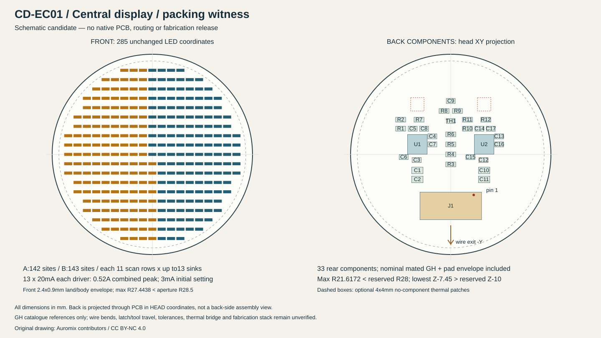

# CD-EC01：285 点中央圆形 LED 板原理图与排布候选

本版完成 **双 LP5860 原生 KiCad 原理图、318 件元件级 BOM、285 点地址映射、双驱动初始化示例和背面排布见证**。原生 ERC 为 0，716 个已连接引脚与 KiCad XML 回读一致。285 个像素的 XY 与 CD-MOUNT01 源 CSV 数值逐点相同。

这轮**没有建立 PCB 或完成布线**，因此没有 DRC、Gerber 或制造放行。前序 FPL01 的 ERC/DRC 结果不适用于本板。背面 33 件器件包络放得下，是继续详细布局的依据；过孔、走线、连接器插拔、温升和装配公差还需要后续验证。

## 交付入口

- [原生原理图](../../../engineering/electronics/central-display-cd01/kicad/central.kicad_sch)、[矢量原理图](../../../engineering/electronics/central-display-cd01/kicad/plots/central.svg)、[实际 ERC 与回读报告](../../../engineering/electronics/central-display-cd01/kicad/checks/verification.json)。
- [BOM](../../../engineering/electronics/central-display-cd01/bom.csv)、[逐脚网络](../../../engineering/electronics/central-display-cd01/pin-net.csv)、[像素权威表](../../../engineering/electronics/central-display-cd01/pixel-map.csv)、[映射版本说明](../../../engineering/electronics/central-display-cd01/mapping-revision.json)。
- [排布图](../../../engineering/electronics/central-display-cd01/packing-review.svg)、[机械包络和接头变换](../../../engineering/electronics/central-display-cd01/mechanical-packing.json)、[功率计算](../../../engineering/electronics/central-display-cd01/power-budget.json)。
- [C99 接口示例](../../../engineering/electronics/central-display-cd01/cd01_example.c)、[头文件](../../../engineering/electronics/central-display-cd01/cd01_example.h)、[寄存器仿真传输检查](../../../engineering/electronics/central-display-cd01/firmware-check.json)、[来源和输入哈希](../../../engineering/electronics/central-display-cd01/sources.json)。



仓库根目录执行：

```sh
KICAD_CLI=/path/to/official/kicad-cli python3 engineering/electronics/central-display-cd01/rebuild.py
```

该命令重建源表、原理图、C 示例与排布图，编译运行 C99 模拟寄存器测试，调用 KiCad 10 的原生 ERC/网表/SVG 导出，再独立比对针脚、极性、地址、坐标和来源哈希。没有自定义 ERC 排除项；KiCad 默认忽略的单次全局标签、四路结点、SPICE 模型与封装过滤器原样列入报告。`Footprint` 仍为空，候选名称在 `CandidateFootprint` 和 BOM 中，未伪称已形成正式板库。原始 CLI 日志保留主机 Fontconfig 提示，导出的矢量图已实际渲染目检。

## 电路和完整器件范围

本板沿用 [FPL01](final-petal-fpl01.md) 已核验的器件、电流设置和极性规则：LED **pin 1 阴极连接恒流吸收端 CS，pin 2 阳极连接扫描开关 SW**。CS0…12 是 13 路恒流输出，和 SPI 的片选信号是不同概念。每个芯片配置 11 行；CS13…17 不接，相关点位保持禁止。两颗芯片的 VCAP 各自使用独立电容，不能并联成一个电源。[TI LP5860 数据手册](https://www.ti.com/lit/ds/symlink/lp5860.pdf)

| 部件 | 数量 | 具体候选与作用 |
|---|---:|---|
| U1、U2 | 2 | LP5860RKPR；U1=A 组、U2=B 组 |
| D1…D285 | 285 | Würth 150060YS75000，0603 黄色 LED |
| J1 | 1 | SM12B-GHS-TB(LF)(SN)，背面侧插 GH12 |
| 22 µF | 4 | C2012X5R1V226M125AC；每颗驱动两只 VLED 储能电容 |
| 1 µF | 6 | C1608X7R1E105K080AB；每颗 VLED/VCC/VCAP 各一只 |
| 100 nF | 5 | C1608X7R1H104K080AA；每颗 VLED/VCC 各一只，另一路温度滤波 |
| 1 nF | 2 | C1608C0G1H102J080AA；每颗 VIO 本地旁路 |
| 电阻 | 12 | Vishay CRCW0603 对应完整值后缀见 BOM；两路 IFS/片选/MISO，共用下拉，47 kΩ/1 kΩ 温度接口 |
| TH1 | 1 | NCU18XH103F6SRB；10 kΩ NTC，沿用 NCU 候选，未退回 NRND 的 NCP 系列 |

上述数量合计 318 件，全部有具体候选型号。完整型号不等于库存、温度降额、偏压电容、焊接工艺或批次匹配已经确认。保留每颗 MISO 输出端各 33 Ω 串联阻尼，再汇入公用总线；主机一次只能拉低一个片选。IFS 各经 4.7 kΩ 拉至 VIO；片选各经 10 kΩ 拉至 VIO。共用 SCLK/MOSI/VSYNC/VIO 下拉没有机械复制为两套并联负载。

NTC 仍为 47 kΩ 上拉、10 kΩ NTC、1 kΩ 串出和 100 nF 输出滤波，25°C 名义输出约 0.579 V。它测量板上局部温度，不能直接当作两颗芯片或 LED 的结温。控制板不重复加入上拉。器件来源及其受控尺寸范围在[来源清单](../../../engineering/electronics/central-display-cd01/sources.json)中列出。

## GH12 的针序与背面变换

本板 J1 与 HEAD-CTRL02 J15 **板端针号同号连通**，逐脚自动核验；线束装配仍须端到端测通，不能按插壳外观猜测针 1。

| 针 | 网络 | 用途 |
|---:|---|---|
| 1 | LED_POWER4 | 中央板专用受控 VLED 3.3 V 分路 |
| 2 | GND | 地 |
| 3 | 3V3_LOGIC | VCC 逻辑电源 |
| 4 / 5 / 6 | LED_SCK / LED_MOSI / LED_MISO_BUS | SPI |
| 7 | LED_CS4 | U1/A 组片选 |
| 8 | LED_VSYNC | 与四片灯共用的刷新信号 |
| 9 | LED_VIO | 受控 IO 电源与使能，不是 MCU GPIO 直接供电 |
| 10 | NTC_C | 板上温度分压输出 |
| 11 | LED_CS5 | U2/B 组片选 |
| 12 | GND | 第二地回路；实际回流分配需布线验证 |
| M1 / M2 | GND | 本地焊接固定片，不属于线束芯数 |

采用 [CD-HW01 官方尺寸记录](../sources/central-display-hardware01.json)中的侧插头，配 GHR-12V-S、SSHL-002T-P0.2。控制板端候选 BM12B-GHS-TBT 是顶插头，两者不能互套机械包络。[JST GH 官方目录](https://www.jst-mfg.com/product/pdf/eng/eGH.pdf)

接头原点为头坐标 **(0,−14,−3) mm**。官方安装面坐标 u/v、离开板面的 h，转换为 `X=−u; Y=−14+v; Z=−3−h`；这是绕 Y 的 180° 刚体变换，行列式 +1，不是重新编号引脚。pin 1 焊盘中心为 **(+6.875,−12.15,−3) mm**，线向 −Y 引出。

合并目录配对体和焊盘后，初查矩形包络为 X±9.225、Y−19.55…−11.3、Z−7.45…−3 mm。它不包括线束弯曲、锁扣按压、拔出行程及厂商受控公差。不能因该盒位于 R28 内就认定接头及线束已经可装配。当前没有取得原厂受控配对 STEP，也未提交索取表单。

## 地址、初始化和共同刷新

源 [led-centres.csv](../../../engineering/generated/central-display-mount01/led-centres.csv) 的 285 个 XY 完全保留。`old_driver/old_SW/old_CS` 只是历史字段；本版的 **pixel-map.csv** 才是新的电气映射权威。

A 组取 X<0 与中心列 Y<0 的点，共 142 点；B 组为其余 143 点。每组先按 X 由小到大，列内 Y 交替方向形成局部蛇形顺序，再每 13 点分配一个 SW，组内序号分配 CS0…12。A 的末行 12 点，其余行和 B 的全部行各 13 点。每个像素仍使用稳定的源 index，与 SPI 顺序解耦。圆环、注意方向和表情可在这一物理像素表上绘制，不另加固定灯环。

[两份寄存器计划](../../../engineering/electronics/central-display-cd01/register-plan-A.json)从同一映射生成：11 行、16 位 PWM，显式写入 3 mA 设置和全黑；仅使能已焊点位，缺失地址 DC/PWM 为零。不能依赖厂商两份资料存在差异的复位默认值。SPI 头、低字节在前的 PWM、读回和等待条件沿用 [TI 编程说明 SNVU786](https://www.ti.com/lit/pdf/SNVU786)。这不是可直接烧录的 STM32 固件。

上电前主机 SPI/VSYNC 低或高阻，片选高阻；VCC/VLED 有效后打开 VIO，待建立后使片选高，再逐颗初始化并回读。示例没有自动开启 20 mA。断电前先黑屏，再释放总线，最后关闭 VIO；不支持热插拔。

`cd01_stage_frame()` 只写两个驱动的帧，不产生 VSYNC 边沿。`cd01_commit_shared_vsync()` 必须由**全头调度器**在四瓣和中央的所需帧都准备完成后调用。部分写入失败时不允许盲目提交；主机需要重新写全帧或按故障策略关断该分路。主 PWM 修改不被宣称为跨芯片原子事务，传输失败也没有自动回滚保证。两颗驱动内部扫描时钟的相位一致性尚未测量。

模拟传输测试实际编译运行 C99，覆盖两颗初始化、全部 285 地址、缺失点清零、两路传输失败、读回损坏拒绝、全部 1024 地址头及越界拒绝。测试没有替代真实 SPI 波形或芯片响应。两颗完整 PWM 帧共 792 字节，2 MHz、60 Hz 仅载荷约占 19.008%；100 kHz 首亮阶段不能维持该全帧刷新率。

## 排布、层叠和热预算

PCB 为 Ø60×1 mm，头坐标 Z−3…−2；本轮没有改外形、钻孔或安装契约。LED 的 2.4×0.9 mm 焊盘/最大体宽包络全部留在窗口内：最远角点 R27.4438，距 Ø57 可见口边缘名义 1.0562 mm。以器件最大高度 0.8 mm 加规划焊高 0.1 mm，LED 顶面 Z−1.1，距窗口底面 Z−0.5 名义 0.6 mm；实际板翘、焊高、定位和透光件公差仍未算入。[Würth 尺寸与极性](https://www.we-online.com/components/products/datasheet/150060YS75000.pdf)

背面 U1/U2 位于 **(−10,3)/(10,3) mm**，每颗都有独立近旁 VLED/VCC/VCAP/VIO 电容。22 µF 电容 A 组 C1/C2、B 组 C10/C11 位于各自 X=±10、Y=−4.8/−7.5；TH1 位于 (0,10)。全部背面坐标和逐件包络在 JSON 中，不以仅放两颗芯片推断完整板可行。

33 个背面器件检查了 528 对 XY 保守矩形，无重叠；普通器件焊盘/体包络各加 0.25 mm 平面规划余量，接头沿用原厂参考尺寸并单独标明未加受控公差。全部角点最大 **R21.6172 mm**，留在 R28 内；最深名义为 GH 的 Z−7.45，留在 Z−10 限界内。两块背面无器件候选区中心 (−10,15)/(10,15)、各 4×4 mm，仅作以后绝缘导热桥研究，当前没有实际导热桥、压缩量或结构受力设计。

| 20 mA、全亮、忽略消隐的规划量 | A / B | 合计 |
|---|---:|---:|
| VLED 峰值 | 各 0.26 A | 0.52 A |
| VLED 平均 | 0.25818 / 0.26000 A | 0.51818 A |
| 3.3 V LED 分路功率 | 0.852 / 0.858 W | 1.710 W |
| VF=2 V 时 LED 电功率 | — | 1.036 W |
| 同一假设下驱动导通损耗 | 0.336 / 0.338 W | 0.674 W |

另给两颗逻辑和偏置合计 **0.100 W 工程规划量**，并非厂商保证的全工况上限。中央板总规划约 **1.810 W**；加原四灯片 **2.264 W** 基线为 **4.074 W**，未含头部控制器、相机和电机。3 mA 首亮时 LED 分路峰值 0.078 A、平均约 0.07773 A。电流误差、温度、输出电压余量与驱动切换损耗须实测后再加严预算。

每颗 44 µF 名义储能面对 0.26 A、8 µs 的孤立脉冲，理想 ΔV=IΔt/C≈0.0473 V；若有效仅 20 µF 则约 0.104 V。这是灵敏度算例，未计 MLCC 偏压、温度、ESR/ESL、源阻抗或脉冲补充过程，不能当电源稳定性证明。GH 单 VLED 针使用目录 AWG26 的 1 A 数值进行比较，0.52 A 只是名义 52%；温度、实线规、压接和多针热耦合仍需确认。

下一步应建立连续地参考面、两个独立局部 EP/去耦回流、短的扫描大电流路径和远离扫描回流的温度信号。正面密集 LED 与背面 QFN 热过孔可能竞争空间；铜层数、1 mm 实际层叠、填孔盖帽、焊膏开口均未冻结。不能直接用数据手册的 JEDEC 热阻推导密闭头部温升，也不能把两个预留地铜区当成已实现散热路径。

本版支持进入详细 PCB 布局/布线研究，尚不支持生产下单。仍需关闭：原厂连接器受控配对/插拔和线束，正式封装与装配高度，走线及 DRC，电源完整性/温升，光学混光、像素一致性与同步刷新实测。

原创电路、程序和分析：CC BY-NC 4.0。Odradek — Auromix contributors（https://github.com/Auromix/odradek）。厂商资料保留原权利，未随本目录重新分发。
