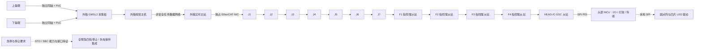

# R4 电气、相机与内走线候选

核查日期：2026-09-27。状态：**工程候选 / 未采购 / 未接线实测 / 不得作为生产接线图**。本表中的“建议”是项目选择；参数事实由厂商资料支持，二者分开记录。配套索引见 [electrical.json](../sources/electrical.json)。

## 1. 基线与架构选择

确定约束是 7 轴本体、4 个独立手指、2 kg 末端工件、内走线、外置计算、可拆卸末端、双鱼眼上下外倾且左右对称。700 mm 伸展仅为首轮计算假设。相机接口“gxxx”暂按 **GMSL2 候选**研究，不能视为用户已经确认。2 kg 工件不能抵扣末端自重；电源与线缆按最终驱动的实测电流和热条件定额。早期 3D 打印件仅验证几何与手动动作，未批准带电承载 2 kg。

建议采用外箱集中计算、关节就近驱动：

这是 **7个臂关节 + 4个独立指伺服 + 1个头部I/O，共12个EtherCAT从站** 的候选串链。顺序是本轮布线约定，实际驱动适配板IN/OUT、背板与端接仍需核实；头部MCU不承担第二个EtherCAT主站角色，不假定它转发运动命令给四个局部非EtherCAT驱动。头内5个节点有4段逻辑连接，跨J7只需一路链路上行；连接数量不等于已经完成线束/PCB设计。

电源分为48 V臂动力、**24 V指动力**、**24 V辅助逻辑/I/O/停止电路**。四指动力电源容量、型号、回馈与保护单独选择；HDR-100-24仅作辅助电源候选，不默认承担四指电机、所有抱闸或视觉主机负载。相同24 V标称不等于可混并电源，也不表示已经实现隔离。

EtherCAT 链用于周期位置、速度、转矩、状态和诊断；两个视频通道不经过运动链。停止/失电保持要求覆盖全部关节与四指；图中的虚线仅表示待完成要求，不能当成RH已有认证STO/SBC接口。EtherCAT 的专用 ESC 在硬件中转发帧；它不是给普通 IP 相机使用的交换机。[ETG 技术说明](https://www.ethercat.org/en/technology.html)

本项目明确不用普通以太网交换机把相机流量混入该运动链。若需要分支，使用可验证的 EtherCAT junction；主站网卡与上层网络分开。布线示意不构成 FSoE 实现，普通 EtherCAT PDO、MCU watchdog、驱动 enable 信号都不自动成为认证安全功能。

## 2. 相机首选：完整模块优先于自行拼 SerDes

**鱼眼外观和实际可集成性首选：2 × Stereolabs ZED X One S Fisheye（ZED-414012）。** 每台已有镜头、传感器、序列化与壳体，适合上下位置分别外倾。它是优先样机候选，尚未锁定采购批次、可交付日期或与本机器人线束的兼容性。

| 链路环节 | 候选与已核实内容 | 设计动作 / 尚未闭环 |
|---|---|---|
| 传感器与成像模块 | ZED-414012；onsemi AR0234，2.3 MP RGB 全局快门 | 读取每台序列号和标定参数，实测 LED 点亮时曝光与条纹 |
| 鱼眼镜头 | 内置 1.38 mm；厂商列 H 204°、V 137°、D 218° | 安装后的有效视场必须扣除壳体、灯片和工件遮挡；不能把 H 角当 V 角 |
| 模块尺寸 | 25 × 25 × 34.2 mm；36 g / 台 | 是模块包络，未含插头、拔插工具、弯线半径、安装耳；安装孔按官方 CAD 复核 |
| 相机侧序列化 | 模块内置 GMSL2，FAKRA Z 接口，PoC | **本轮官方资料未确认内部 serializer 具体芯片**；不得擅写 MAX9295 / MAX96717 |
| 解串与采集 | ZED Link Duo；MAX96712 | 使用该板对应的线束/分支配置与供电；“Duo”不等于任意两路输入可随意换插 |
| 主机 | 官方 NVIDIA Jetson AGX Orin Developer Kit + ZED Link Duo，均放外箱 | 优先作为固定验收台；量产换载板必须重新核对设备树、CSI 通道及驱动 |
| 驱动基线 | 官方驱动页本次列 GMSL v1.4.3；Duo 有 JetPack 6.2.2 / L4T 36.5 条目 | 在实机固定 **完整 L4T patch、driver deb、SDK、板卡 revision**；不得只写“支持 JetPack 6” |
| API | ZED SDK CameraOne；厂商也链接 zedx-one-capture | 双独立图像流先验收；上下外倾双鱼眼的立体重建另行验证，不承诺开箱深度 |

参数来源：[相机规格与型号](https://docs.stereolabs.com/docs/products/cameras/zedxone/specifications)、[Duo 数据表](https://support.stereolabs.com/hc/en-us/article_attachments/27901419886615)、[驱动矩阵](https://www.stereolabs.com/developers/drivers)、[单目安装方法](https://docs.stereolabs.com/docs/products/cameras/zedxone/monocular-vision)。鱼眼版不能继承 Wide 版的 IP69K 声明。供电应经采集板 PoC，不向相机同轴直接灌 24 V。

首轮不拆解采购模块、不另购串行器来替换其内部电路。内部器件型号未公开不阻止把**整机模块**作为 BOM 行，但阻止声称其内部电路已完整复现、可自行制造或与任意解串板通用。驱动页面列出的兼容性也不是本项目完成了运行验证。

### 2.1 需要显式芯片闭环时的 GMSL2 / USB 外箱备选

TechNexion 有另一条公开清晰的链路：**VLS-GM2-AR0234-C-S128-IR → 同厂 GMSL2 线束 → UVC-VL-GM2-1CAM → 外箱 USB 3 主机**。相机使用 AR0234 + MAX96717，接收端使用 MAX96714；每条支路一块 UVC 采集器，采集器公开支持 Linux / Windows 10/11 的 UVC。[相机产品及型号表](https://www.technexion.com/products/serdes/gmsl/gmsl2/vls/vls-gm2-ar0234-sl/)、[采集器产品表](https://www.technexion.com/shop/serdes/gmsl/gmsl2-frame-grabber/uvc-vl-gm2-1cam/)

该标准型号镜头仅列 **128° 对角视场**，不是本项目需要的鱼眼。厂商页面虽有 fisheye 选项筛选，本轮未查到 AR0234 鱼眼对应的明确订货号、镜头参数、适配标定和可交付套件，故不能把这条备选写成“鱼眼选型完成”。另外，两块单通道 UVC 采集器不自动提供跨设备硬同步；同步连接、时戳和漂移需验收。

### 2.2 GigE 与原生 USB 备选

| 路线 | 具体可查候选 | 取舍 |
|---|---|---|
| GigE Vision | Basler a2A1920-51gcBAS，IMX392，C-mount，GigE / PoE；主机使用 pylon 对应版本 | 数据网络与 EtherCAT 物理分开。壳体含接口长 62.2 mm、宽高 29 mm；镜头还会增加长度和质量 |
| USB 3 Vision | Basler a2A1920-160ucBAS，IMX392，C-mount，锁紧 Micro-B | 可用于桌面光学验证；USB 长动态线缆、接头固持和轴间弯扭仍需单独验证，不能只按静态传输距离决定 |
| 两条路线的光学研究件 | Fujinon FE185C057HA-1，1.8 mm C-mount 鱼眼，135 g，最近工作距离 100 mm（镜头前端起） | 镜头较重；官方 185° × 185° 是指定传感器裁切条件，不能直接移到 IMX392。需查侵入深度、后焦与传感器实际裁切，并确认最近夹持位置仍清晰 |

资料：[Basler GigE](https://docs.baslerweb.com/a2a1920-51gcbas)、[Basler USB](https://docs.baslerweb.com/a2a1920-160ucbas)、[Fujinon 鱼眼系列](https://www.fujifilm.com/uk/en/business/optical-devices/mvlens/fe185)。这些是候选组合，不是厂商已经验证该相机与镜头配套。本项目优先保留更轻、更短的整合 GMSL2 鱼眼。

### 2.3 双目数据量和光学条件

按每路 1920 × 1200、60 fps、16 bit / pixel 做传输预算，两路纯图像有效负载为 **4.424 Gbit/s**；每路 2.212 Gbit/s，尚未计 blanking、协议和元数据。这个计算只用于系统预算，不表示 ZED 的每条内部联系实际采用这种像素格式。若外箱最后经过一个 5 Gbit/s USB 上行桥，必须按厂家公布模式核算，不能用“5 Gbps”标称值证明双路最高模式可同时通过。

上下外倾保持对称，但要分别标定。若相机基线 b、外倾 α、安装后有效垂直半视角 β、目标中心离面 z，则理想无遮挡近场条件为 `α + atan(b / (2z)) ≤ β`。抓取区有高度时应检查整个工件包络。上表 V 137° 仅给 β 的光学上限 68.5°；不能替代装配后的有效 β。参见本项目 [R3 推导](../../r3-closure-study.md)。

## 3. 可用于展开设计的电气元件清单

以下数量不包含另列于执行器候选清单的 7 轴电机、编码器、驱动、制动器和 4 个手指执行器。它们的电流、接口和散热资料必须回填后才能冻结下表。

| 代号 / 数量 | 具体候选 | 采用边界与未决事项 |
|---|---|---|
| CTRL-01 / 1 | Beckhoff C6015-0040 外置 IPC | 双以太网口平台；CPU、RAM、SSD、OS 和 TwinCAT 运行许可属订货配置。作为确定性 EtherCAT 验收台候选，未测最坏周期/抖动；视觉任务放另一主机 |
| ESC-H / 1 | Microchip LAN9252 + EVB-LAN9252-SPI 先行验证 | 末端 EtherCAT ESC / SPI PDI 候选；量产需磁性器件、ESI、EEPROM、PHY/EMC 设计及一致性测试。不能把裸芯片当可直接使用的完整 EtherCAT 从站 |
| MCU-H / 1 | ST STM32G474RET6；样机 NUCLEO-G474RE | 经SPI PDI连接HEAD-IO ESC，管理I/O、灯效和传感器；LED用本地SPI。四指由外部主站分别控制独立EtherCAT伺服，MCU不作运动主站或默认四轴FOC |
| DISP-DRV / 按像素数 | TI LP5860RKPR | 11 × 18 单色点阵 / 198 dots，每颗可经 SPI 驱动。屏幕按圆形可视区排布 LED，环形效果用像素表达。驱动数 `ceil(N / 198)` 只是通道下界，仍需实际扫描布线匹配 |
| LED-A / 按面板布局 | Würth 150060YS75000，0603 黄色 LED | 初版统一琥珀表达的候选。实际颜色、亮度、扩散罩、热和鱼眼眩光以试片确定；“有灯”不等于满足照明通量 |
| AUX-DC / 按需 | TI TPS54360B 60 V 输入 / 3.5 A 降压控制器 | 只建议用于经保护的 24 V 辅助支路设计；外围器件、EMI 和热验证未完成。不得直接因 60 V 额定就挂到未钳位的 48 V 再生母线 |
| PSU-M / 1 候选 | MEAN WELL RSP-1000-48，48 V / 21 A / 1008 W | 仅为电源箱容量候选，不是7轴峰值功率已证明足够；最终还取决于驱动允许电压、同时率、启停峰值、再生吸收及市电条件 |
| PSU-L / 1 候选 | MEAN WELL HDR-100-24 | 仅逻辑/I/O/停止电路辅助候选；不含四指动力，且不能默认涵盖所有抱闸和视觉主机 |
| PSU-F / 1 待选 | 24 V四指动力电源，完整型号TBD | 与辅助支路分开；四轴工况、峰值、回馈、限流/保险和压降未闭合，不直接接48 V臂母线 |
| SAFE-01 / 1 候选 | Pilz PNOZ s5 750105，24 V；2 即时 + 2 延时 N/O | 双通道急停及延时触点研究件；不是完整安全系统。若驱动提供已认证 SS1/SBC 或用可编程安全控制器，需要重新定义功能分配，不能仅按继电器触点延时猜制动动作 |

一手资料：[IPC](https://www.beckhoff.com/en-us/products/ipc/pcs/c60xx-ultra-compact-industrial-pcs/c6015-0040.html)、[LAN9252](https://www.microchip.com/en-us/product/LAN9252)、[评估板](https://www.microchip.com/en-us/development-tool/EVB-LAN9252-SPI)、[MCU](https://www.st.com/en/microcontrollers-microprocessors/stm32g474re.html)、[LP5860](https://www.ti.com/product/LP5860)、[LED 数据表](https://www.we-online.com/components/products/datasheet/150060YS75000.pdf)、[DC/DC](https://www.ti.com/product/TPS54360B)、[48 V 电源](https://www.meanwell.com/Upload/PDF/RSP-1000/RSP-1000-SPEC.PDF)、[24 V 电源](https://www.meanwell.com/Upload/PDF/HDR-100/HDR-100-SPEC.PDF)、[安全继电器](https://www.pilz.com/en-INT/eshop/product/750105)。

四片灯板必须与承力夹指隔离：PCB / LED / 窗口不承担夹持法向力；导线经转动根部进入指片，并有应变释放。先验收白色/琥珀试片，再决定是否需要 RGB；不能把 198 个单色点写成 198 个 RGB 像素。屏幕和四片光源的平均功率应受 firmware 与硬件限流共同约束，曝光期间可同步降亮。

## 4. 内走线是关节尺寸约束，不是建模后的装饰

### 4.1 已核实线缆能力与不适用范围

| 用途 / 料号 | 官方能力 | 对当前结构的结论 |
|---|---|---|
| EtherCAT 研究线：igus CFROBOT8.PLUS.045 | CAT5e，4 × 2 × 0.15 mm²，外径最大 7.5 mm；该系列动态扭转应用最小弯曲半径 10d | R ≥ 75 mm 的约束很大。可用于台架/较大基座环，不应直接在纤细腕部画成锐弯 |
| 上述系列寿命条件 | -15～+60°C，360°/s、60°/s² 表内条件下，5M / 7.5M / 10M 周期分别列 ±360 / ±270 / ±180° 每米 | “±360°/m”和“10M”不能同时摘出拼成同一额定；须同时满足供应商的所有安装及保证条件 |
| 相机台架线：Stereolabs CBL-320500 | 0.5 m、1→4 FAKRA、RTK031 同轴，官方用于采集板分支 | 仅外箱或固定支路验证；官方该页未给机器人反复弯扭寿命和动态 R，**不能批准为关节运动线** |
| 动态视频研究线：Rosenberger HySpeedVision | 公布支持 GMSL1–3；示例 Ø8.5 mm，动态 R=15d，±180°/m，1M 周期 | R=127.5 mm；接口为混合 M12 方案，不能不经适配便插 FAKRA。公开资料不是本项目的明确订货线束号，因此不冻结 |
| 更细的动态同轴研究线：Rosenberger CG:02，官方称 Similar to RG316 | 同一官方目录另列 Ø3.1 mm，同轴动态弯曲 R75 mm、2M 周期、扭转 ±180°/m；单次弯曲 R15 mm | 优先向供应商落实此结构的 FAKRA 总成。CG:02 是 cable group，不是完整线束 SKU；不能用任意 RG316 替代，也不能把静态 R15 mm 用到运动中 |

资料：[igus 型号尺寸目录](https://blog.igus.ca/wp-content/uploads/2024/05/chainflex-torsion-cables-catalog.pdf)、[igus 当前系列寿命表](https://www.igus.com/product/CFROBOT8_PLUS)、[Stereolabs 分支线](https://store.stereolabs.com/products/gmsl2-1-to-4-fakra-cable)、[Rosenberger 动态能力](https://www.rosenberger.com/fileadmin/content/headquarter/Downloads/_Other/HySpeedVision_Flyer.pdf)。不同页面或地区版本的直径与保证条件若有变化，以订单对应数据表为准，不能从不同版本取各自最优值。

**本轮找到了 3.1 mm 的耐弯扭同轴结构依据，但没有核实到同时满足当前腕部空间、整根 GMSL2 信号完整性和目标寿命的可直接下单线束 SKU。** 这是真实的制造冻结阻塞项，不用普通汽车同轴或“高柔线”名称代替证明。

### 4.2 两对线 EtherCAT 的细径筛选

LAPP **2170941 / ETHERLINE ROBOT PN FC Cat.5e** 数据表明确列 EtherCAT，用一个四芯星绞结构形成两个信号对（1 × 4 × AWG22/19），外径 **6.8 ± 0.3 mm**。它比 7.5 mm 的四对 igus 候选略细，但仍不是一根 3–4 mm 细线。LAPP **2170433 / ETHERLINE P EC FD Cat.5e** 则为 AWG26/19、**4.8 ± 0.3 mm**，数据表支持 EtherCAT 与拖链应用；本轮没有其反复扭转额定，故只允许研究消除扭转后的弯曲布置。[2170941 数据表](https://imager.lapp.com/e/lapp/5di4RA3zY0WwUKwyFeGtJg~~/DB2170941EN.pdf)、[2170433 数据表](https://imager.lapp.com/e/lapp/jC7Lyg4YokqH2qg5r8noxw~~/DB2170433EN.pdf)

较细不自动意味着可在更小动态回环中运行。2170941 独立数据表 v01（2022-04-01）第 2 页列连续弯曲 12d、±180°/m、5M 扭转周期；但 LAPP 综合寿命表中该型号 5M 弯曲工况使用 15d。存在资料条件差异，采购前按保守 15d 做包络并向厂商落实适用 revision，不能默认两套条件可以同时使用。2170433 的 3M 弯曲表也为 15d；按最大外径作包络分别为 **106.5 mm** 与 **76.5 mm**。这些是表内条件的弯曲工况，不同时构成任意组合弯扭寿命保证。[LAPP 寿命表](https://products.lappgroup.com/fileadmin/catalog/en_A_pdf/A2_2_Data_cables_for_use_in_power_chains_Bending_cycles_and_operation_parameters_en.pdf)

HELUKABEL **11007800 / HELUKAT PROFInet R+ CAT.5e SF/UTP PUR ROBOTIC** 同样是两对 AWG22，但外径约 7.2 mm、动态 R10d，未提供更小包络收益。[官方型号页](https://shop.helukabel.com/ch-en/helukat-profinet-r-cat5e-sfutp-pur-robotic-m11007800/11007800)

### 4.3 RH 关节中空孔的面积初筛

机械选型输入为带闸 RH25 Ø22 mm、RH20 / RH17 Ø12 mm，以及无闸 RH14 N Ø10 mm 中空孔。这里只使用该分组提供的孔径做横截面积筛查，孔公差、衬套与运动姿态需要结合正式驱动 CAD 复核。

示例整束：1 × Ø7.1 mm EtherCAT、2 × Ø3.1 mm 同轴；另假设 48 V 线 2 × Ø3.4 mm、24 V辅助线 2 × Ø2.0 mm、另加24 V四指动力线 2 × Ø3.4 mm、安全信号 4 × Ø1.5 mm、等电位线 1 × Ø3.4 mm。**上述电源、安全与等电位绝缘外径只是空间占位，并非已选线规/料号或载流许可。** 合计外截面积 **113.44 mm²**（原95.28 mm²示例未含独立四指24 V动力线，本次已补齐两根占位线）。

| 输入关节 / 孔径 | 孔面积 | 毛面积填充率 | 筛查结论 |
|---|---:|---:|---|
| RH25 / Ø22 | 380.13 mm² | 29.8% | 可继续排布；尚不代表装配/运动通过 |
| RH20、RH17 / Ø12 | 113.10 mm² | 100.3% | 毛面积已超孔面积，不能容纳该示例整束 |
| RH14 / Ø10 | 78.54 mm² | 144.4% | 光是面积就不可能容纳该整束 |

如把 40% 作为**项目初筛假设而非标准条款**，该示例至少需面积等效孔径 Ø19.00 mm，尚未计衬套与误差。仅两根 Ø3.1 mm 同轴合计 15.10 mm²，在 Ø10 mm 孔的毛填充率约 19.2%，有继续做实物穿线验证的空间；仍需验证入口 R、两端固定和旋转磨损。完整输入与计算保存于 [electrical.json](../sources/electrical.json)。

**可行方向：混合内走线。** 在小孔关节优先研究同轴过中空轴，EtherCAT、功率和安全线走关节旁的封闭、可拆侧腔；沿长臂段设置独立导向和活动余量。侧腔仍属内走线，但要接受关节局部加宽、加厚或限制旋转角。所有腔体按照动态 R 建模，不能只为线缆外径让出一条细沟。封闭侧腔也不等于可把任意关节转角转换成纯弯曲，必须做每轴固定端姿态与全行程扫掠。

**装配顺序研究：** 标记各线段与零扭转姿态 → 安装保护衬套 → 穿入未装大外壳的合格半成品线束，或从可拆侧腔放入已端接总成 → 用原厂规定工具端接/装入连接器壳 → 做导通、绝缘和屏蔽检查，GMSL 做通道测试 → 固定应变释放点 → 手动全行程检查 → 合壳。FAKRA/M8/RJ45 的外壳和锁扣尺寸不能假定可穿 Ø10/12；必须用实际供货件测量，不允许为穿孔随意切断再焊接高速同轴。若供应商要求工厂完整端接，使用可拆侧腔或结构分体装配，不能在制造图中藏起不可实现的穿线步骤。

### 4.4 给机械建模的定量输入

1. 每轴必须有两侧固定点和可变形的自由线段。均匀扭转近似为 `κ = |Δθ| / L_free`；保持同一数据表约束时 `|Δθ|max ≤ κ_allowed × L_free`。200 mm 自由段在 ±360°/m 情况下只对应 ±72°；若按上述 10M 条件的 ±180°/m，则只对应 ±36°。这是筛查，不是对任意复杂线束的寿命保证。
2. 若 J7 要 ±160°，按 ±180°/m 单纯扭转至少需要 0.889 m 自由长度；腕部常不能容纳。必须通过经过验证的弯曲回环/卷绕布置、改变轴限位或专门旋转传输方案解决。不得把其他关节的自由长度重复记到 J7。
3. CAD 分别放置静态插头包络、拔插空间、应变释放、动态最小 R 包络与完整轴运动扫描。允许切口处护套和圆角，禁止将 PCB 插座当作线夹。两路线缆贴合运动也要算相互磨损。
4. 束径先用 `A_bundle = Σ π d_i² / 4` 统计；通孔净面积须包含非满填余量、护套、分区、装配和防磨。面积条件满足只是必要条件，不能证明线束会穿过弯道。
5. 48 V 供电、制动开关和电机相线与高速数据分隔；若无法满足距离，采用有依据的屏蔽、接地和滤波方案并实测，不在无数据时写一个万能最小间距。
6. 金属版本需要独立的保护连接/等电位方案，不依赖轴承、氧化层、涂层或塑料壳导通。3D 打印版本的温升、绝缘和固定方式不能自动继承到金属版本。

### 4.5 连接器选择边界

EtherCAT 模块接口先跟随实际驱动厂商的 port 定义。外部可维护连接研究 HARTING M8 D-coded 4-contact：公头 **21 02 185 1405**、母头 **21 02 185 2405**。官方目录对应 AWG22 IDC；上面的 CFROBOT8.PLUS.045 是约 AWG26，**不能直接配对压接**。若选该连接器，应同步改成符合线规的线缆并重新核算束径；D-code 与 A-code / P-code 不混用。[HARTING 官方目录](https://b2b.harting.com/files/livebooks/en/PRD0200000100248/downloads/livebook.pdf)

相机按所选采集板的 FAKRA Z 标准组件保持连续屏蔽和 50 Ω 链路条件，不将普通 pogo pin、杜邦端子或未经验证的滑环用于 GMSL2。同轴分支线是独立通道扇出，不是把一路信号被动并联给两个相机。关节快拆不在首版同时承诺电气盲插；头部先断电、卸载、再拆机械固定及锁紧插头。48 V、24 V、安全通道的最终端子与保险型号须等驱动电流和接点能力确定。

## 5. 电源、再生与停机设计输入

电源容量不能只相加机械额定转矩。按每轴工况计算母线功率与电流：`P_bus(t) = Σ P_drive,i(t) + P_aux(t)`；区分驱动输入电流与电机相电流，核对连续、峰值、启动及制动状态。线束按最大持续电流、同时率、压降、束内温升和环境降额计算，保险按导线与支路器件的可承受 I²t 协调。

例如一对铜导线的电阻近似 `R_loop = 2ρL / A`；取 20°C 的筛查值 ρ≈0.0175 Ω·mm²/m、单程 L=1.5 m、A=2.5 mm²，则 R≈0.021 Ω，21 A 时压降约 0.441 V、发热约 9.26 W。此处是自建直流估算，**不是在狭窄塑料臂内允许 21 A 的载流结论**。长度、温度、接触电阻和线束降额仍须回填。

RSP-1000-48 不能由“1008 W”推导为能吸收制动回馈。须核对各驱动制动斩波器、制动电阻和过压限值，并计算姿态下降与减速能量：`E_regen ≈ ΔU_g + ΔE_kin - losses`。本轮尚未指定斩波器/电阻、DC 接触器、预充电、熔断器或线径，因缺少驱动、电容、惯量和工作循环闭环；这几项不得在制造 BOM 中标完成。

正常启动的设计顺序为：逻辑供电及自检 → 验证编码器/轴姿态 → 驱动建立承重转矩 → 释放制动 → 允许运动。正常停机为：受控减速 → 确认停止 → 保持电机支撑的同时使制动器接合 → 达到实测/厂家规定接合时间并验证条件 → 撤销转矩。动作时序不是写死的通用毫秒值。

急停/失电另行设计：STO 会撤掉转矩，本身不防重力下落；制动器接合有延迟，且保持制动器不一定能承担反复动态急停。需按选定驱动安全手册确定 SS1、SBC、STO、冗余支撑和能量保持的分配。Synapticon 对其特定 Safe Motion 模块明确描述 SBC 与 STO 间制动延时，以及运行中使用 SBC 的机械风险；这支持设计原则，**不证明其他驱动拥有同样的安全功能**。[SBC 官方文档](https://doc.synapticon.com/circulo_safe_motion/smm/sbc.htm)

手指也需考虑 2 kg 工件的失电保持。只切断手指电源可能松脱工件；不能靠灯片互相碰住当保持机构。不得将安全继电器型号、单个部件认证或 EtherCAT 通讯成功等同于整机已满足目标 PL/SIL。

## 6. 下单与制造前的验收清单

| 验收项 | 需要的实际证据 | 当前状态 |
|---|---|---|
| 相机闭环 | 精确鱼眼 SKU、采集板 revision、完整 OS/driver/SDK、双路连续帧率、丢帧、曝光、温度记录 | 有官方可集成候选；未采购实测 |
| 光学与抓取 | 最近/最远工件、上/下外倾的共同可见区域、四指全行程遮挡、LED 眩光与频闪 | 未测 |
| 动态相机线 | 明确料号、完整组装线束、每关节 R/自由长度、弯扭寿命、衰减/回损和装机误码记录 | **阻塞** |
| EtherCAT | 7臂轴+4指伺服+HEAD-IO共12从站的 ESI / PDO / DC，同步周期、链路恢复和 watchdog 实测 | 架构候选，未验证 |
| 电源保护 | 工况电流、过压回馈、保险/线径/接触器/预充与接地图 | **阻塞，不能只采购一个 PSU 了结** |
| 停机与负载保持 | 实测制动时序、掉电/断线/故障工况、各姿态下防坠及工件保持 | **阻塞** |
| ECAD 制造包 | 审核后的原理图/PCB/接线图、连接器 pinout、BOM/线束表、测试规程 | 未发布 |

这份研究可以驱动下一轮机械包络与台架采购决策；它没有宣称所有电气元件已经冻结，也没有给未经核实的料号虚构价格、现货或安全等级。
