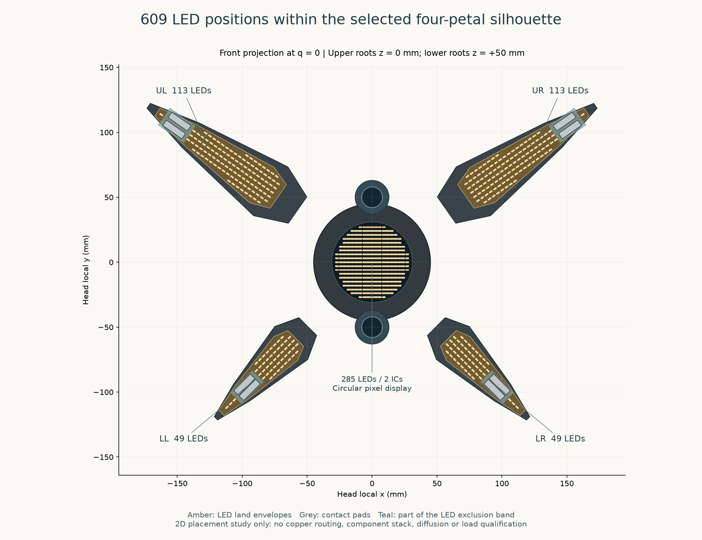
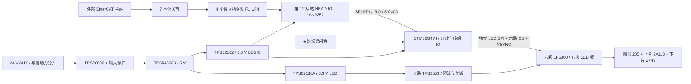

# 头部圆形 LED 点阵、四灯片与 EtherCAT IO 选型

**HLIO-01 · 2026-09-27 · 原理级设计与像素布局研究，尚无已放行 PCB／Gerber。**

选择 **609 颗黄色 LED + 6 颗 LP5860**：中央为真正圆形可寻址 LED 点阵，上片较大、下片较小，四片独立亮度与动画。环形效果由中央点阵绘制，不增加实体灯环，也不换成 LCD。灯片继续承担造型和照明表达；夹持力经独立结构及接触垫传递，PCB、透光窗口和 LED 焊点不进入受力路径。

对应 [30 行独立 BOM](head-lighting-io-bom.csv)、[19 个原厂来源、像素坐标与电源计算](../sources/head-lighting-io.json)。不改整机 BOM；其 LED-01…LED-13 可据此做后续合并。`selected-for-electronics-prototype` 是首版电子／光学样件的明确选择，不表示完成机械集成或生产定型；`candidate` 仍需电路、热与采购核验；`blocked` 是尚缺的制造输入。厂商目录可核实不等于已经报价、查库或买到。

## 1. 元件与实现层级

| 功能 | 选择 | 状态及理由 |
|---|---|---|
| 609 个发光点 | **Würth 150060YS75000** | 0603 黄色、典型主波长 590 nm；首版统一料号、20 mA 脉冲目标。色调和扩散片必须实看，不把渲染琥珀色当实际色度。 |
| 扫描与调光 | **TI LP5860RKPR ×6** | 圆板两颗、每片一颗；各有 11 扫描行×18 电流通道，支持 SPI 与逐点 PWM。 |
| MCU 台测 | **NUCLEO-G474RE ×1** | 首版在外置电子台架验证。定制板候选为 **STM32G474RET6**，不重复计入评估板采购。 |
| EtherCAT 台测 | **EVB-LAN9252-SPI ×1** | 通过 SPI PDI 接 MCU；定制板候选 **LAN9252I/PT**，不是额外主站。 |
| SII 与物理端口 | **24FC512-I/SN ×1、J0011D01BNL ×2** | 候选，沿用 Microchip 原理参考的 EEPROM／磁性 RJ45 方向；晶体、复位、匹配网络和布局仍未闭合。 |
| 24→5 V | **TPS54360BDDAR ×1** | 仅接受保护的 24 V 辅助支路；外部磁性件、二极管和补偿未出完整 BOM。 |
| 5→3.3 V LED | **TPS62130ARGTR ×1** | 3 A 级独立 LED 电源，避免把所有 LED 驱动压降留在 5 V 线性耗散上。 |
| 5→3.3 V 逻辑 | **TPS62162DSGR ×1** | 1 A 级独立逻辑支路；500 mA 是本研究分配值，不是实测最大值。 |
| 输入／分路保护 | **TPS26600PWPR ×1、SMBJ33A ×1、TPS2553DBVR ×5** | 输入 eFuse、输入 TVS、每物理灯板一个限流分支。设定电阻、熔断配合、瞬态能量和故障动作待电路验证。 |

主要规格来自 [LED 原件](https://www.we-online.com/components/products/datasheet/150060YS75000.pdf)、[LP5860 数据表](https://www.ti.com/lit/ds/symlink/lp5860.pdf)、[STM32G474 数据表](https://www.st.com/resource/en/datasheet/stm32g474re.pdf)、[Nucleo 手册](https://www.st.com/resource/en/user_manual/um2505-stm32g4-nucleo64-boards-mb1367-stmicroelectronics.pdf)、[LAN9252 数据表](https://ww1.microchip.com/downloads/aemDocuments/documents/UNG/ProductDocuments/DataSheets/LAN9252-Data-Sheet-DS00001909.pdf) 和 [原厂评估板](https://www.microchip.com/en-us/development-tool/EVB-LAN9252-SPI)。

这批黄色点阵负责发光片、注意力指向、呼吸和中央符号。**尚未证明工作物照度、颜色辨识或相机曝光质量**；不能将 609 点直接换算成合格的任务照明。若台测证明需要白光补光，另立光源／驱动支路及光学防眩需求，不靠提高黄灯电流代替。

## 2. 与当前机械轮廓协同的布点规则



[毫米制DXF](../../../engineering/generated/lighting-layout/led-front-projection.dxf)与[坐标参考CSV](../../../engineering/generated/lighting-layout/led-coordinate-reference.csv)由源JSON生成，包含609个唯一电气地址。图中上下层的深度错开被投影消去；DXF只有器件焊盘包络，不能当PCB铜层、贴片坐标或加工放行文件。

源为 `engineering/parameters/r4-layout.json` 的 R4-layout-03；JSON 存其 SHA-256，及每个像素的本地坐标、驱动 IC、SW 行和 CS 电流通道。只是二维 LED 焊盘包络可布置，不是已布线 PCB。

| 发光面 | 轮廓输入 | 格点／数量 | 驱动容量 |
|---|---|---|---|
| 中央圆面 | 当前可视直径 62 mm | 3 mm 格点，**285 点** | 两颗，分别 143／142 点 |
| 上右／上左 | 指片 140×46 mm 的 CAD 发光窗口多边形 | 4 mm 格点，**各 113 点** | 各一颗 |
| 下左／下右 | 指片 100×36 mm 的 CAD 发光窗口多边形 | 4 mm 格点，**各 49 点** | 各一颗 |

LED 采用厂家推荐的 **2.4×0.8 mm 焊盘包络**筛选，而不是只检查器件中心。圆面焊盘四角在半径 29.5 mm 内，留下 1.5 mm 可视边界；灯片焊盘四角距当前发光窗口边缘至少 1.5 mm。接触中心沿指片方向为上 113.4857／下 66.1740 mm；其前后各 12 mm 的**整条横向带**保留为无 LED 区，并计入焊盘半长 1.2 mm。这样不依赖楔垫细小横移，就能给夹垫、紧固和绝缘留出空间。

无 LED 带不等于已解决 PCB 跨带走线：可以在受保护背面走线，或分成局部子板，但要由结构和 ECAD 确定。不得把一块普通矩形显示模组放到夹垫上方。当前 CAD 的连续透光占位件尚未切出最终夹垫避让、PCB 固定孔和线路通道，本研究也没有重新生成或扩大机械碰撞证书。

厚度也有明确缺口：当前 CAD 发光占位仅 **0.6 mm**，所选 LED 本身高度为 **0.7±0.1 mm**，尚未计 PCB。供下一轮结构研究的层叠预算可先用 **0.8 mm PCB + 0.8 mm LED 包络 + 0.8 mm 混光间隔 + 0.6 mm 透光片 = 3.0 mm**；这是设计假设，不是已选材料或合格混光距离。驱动和连接器背面高度另计。需要重做承力骨架凹槽、透光面与楔垫高度关系和完整动作碰撞，不能在既有 0.6 mm 占位上直接加厚后沿用原证书。

像素电气映射与物理格点分离：各 IC 按像素索引 `k` 分配 `SW = k mod 11`、`CS = floor(k/11)`；圆面像素交错分到两颗 IC。所有 IC 固定 11 行扫描、空格不安装 LED 并关闭。**不能因为下片只有 49 点就自动减少扫描行数**，否则平均亮度、电流和热量都会改变。中央灯环由半径阈值选择像素，箭头、聚焦点、进度与错误符号共用同一像素表。

## 3. 扫描、电流和热预算

初始设计目标为 `I_pulse=20 mA`、11 行扫描。忽略行切换消隐时，单点满亮平均电流上界为 `20/11=1.818 mA`。消隐会降低平均值，下面不是实测光通量。列出的峰值考虑 **真实已安装像素**在最密扫描行同时导通，各驱动相位按最不利重合计算。

| 面板 | 满亮平均电流上界 | 瞬时峰值 | 3.3 V_LED 满亮输入上界 |
|---|---:|---:|---:|
| 圆面 | 0.5182 A | 0.520 A | 1.710 W |
| 每个上片 | 0.2055 A | 0.220 A | 0.678 W |
| 每个下片 | 0.0891 A | 0.100 A | 0.294 W |
| 合计 | **1.1073 A** | **1.160 A** | **3.654 W** |

在“亮起 25% 像素、这些像素平均 PWM 35%”的明确示例下，LED 支路平均输入上界是 **0.320 W**。这个乘积只是动画预算示例，不能假定用户所有图案都服从它；电源按全部像素亮起设计。

`P_LED,electrical = N × I_pulse × duty_scan × duty_PWM × Vf`。按该 LED 的 20 mA 条件，Vf 典型 2.0 V／上限 2.4 V，609 点满亮的 LED 电输入分别约 **2.215／2.657 W**。按典型 Vf，驱动／扫描开关路径合计约 **1.439 W**，另加驱动逻辑消耗。电输入不等于热量：光辐射未测，热初筛保守地把全部输入留作热负担；不能凭 LED 数量或厂家 mcd 值虚构 lumens、lux 或光生物安全评级。[Würth 光电条件](https://www.we-online.com/components/products/datasheet/150060YS75000.pdf)

逻辑 3.3 V 暂分配 **0.50 A / 1.65 W**，覆盖 MCU、ESC、磁性件、六颗驱动逻辑及辅助电路。LAN9252 在两铜口有流量、内部稳压启用、3.3 V 磁性件供电条件下，典型总电流是 **112+82=194 mA**；82 mA 不能漏算。此为典型值，剩余逻辑预算必须通过软件／温度最坏情况测量闭合。[LAN9252 §18.4](https://ww1.microchip.com/downloads/aemDocuments/documents/UNG/ProductDocuments/DataSheets/LAN9252-Data-Sheet-DS00001909.pdf)

三段降压均暂按 **85% 效率**做敏感性计算，此值不是厂家保证：

```text
P24_full = (3.654/0.85 + 1.650/0.85)/0.85 = 7.341 W
I24_full = P24_full/24 = 0.306 A
P24_pattern = (0.319725/0.85 + 1.650/0.85)/0.85 = 2.726 W
LED_peak_design_budget = 1.160 × 1.25 = 1.450 A
I5_peak_budget = (3.3×1.450/0.85 + 1.650/0.85)/5 = 1.514 A
```

25% 峰值系数是工程留量，不是 LP5860 精度规格。1.450 A 占 3 A LED 降压器额定的 48.3%，1.514 A 占 3.5 A 主降压器额定的 43.3%；这只是电流初筛，不能替代电感峰值、软启动、补偿、温升及 EMI 验证。输入 eFuse 和稳压器静态耗电、线损及公差应在详细电路中补入；外部 24 V 分支至少预留一个 **10 W 规划额度**，不是已经证明的最大功耗或保险额定。**该额度不含四个伺服驱动、两相机、抱闸或外部计算机**；上级辅助供电预算须另行累加实际接在其上的负载。

在上述满亮假设下，降压损耗约 `7.341−3.654−1.650=2.037 W`，主要位于头内电源板；连同 LED／逻辑共约 7.34 W 输入需要有真实散热路径。每板放一颗 **NCP18XH103F03RB** NTC，温度采样及限亮策略必须测试；NTC 表面读数不是 LED 结温。LP5860 的 JEDEC 热阻不能直接套成薄塑料灯片的实测温升。[NTC 资料](https://www.murata.com/en-us/api/pdfdownloadapi?cate=luNTCforTempeSenso&partno=NCP18XH103F03RB)

**20 mA 不是硬件不可突破的限值。**LP5860 可配置到更大电流，故障寄存器／扫描配置可能使单颗 LED 超过所选 LED 额定；总支路限流也无法检测仅一颗点被过流。需要上电默认灭灯、读回配置、完整性检测、watchdog 失效关灯以及独立过温／支路切断验证。绝不将 50 mA 驱动上限当作此 LED 的允许工作电流。

3.3 V_LED 还需通过最不利恒流余量检查：`V_LED,min − V_wire/contact − I_row×R_scan,max − Vf_LED,max(T) > V_sink_required`。数据表 25°C 的 Vf 不能代表最低环境温度，典型饱和压降也不是保证上限。若低温／最长线的余量不足，应调整 LED 电源目标并重算热量，不能用软件加大电流补偿恒流失效。

## 4. EtherCAT 与本地 IO 架构



MCU 不做第二个 EtherCAT 主站，也不默认承担四指 FOC。LED SPI 与 ESC SPI 使用不同外设／DMA 资源，避免显示批量更新阻塞过程数据；具体 pin mux 在原理图中分配并核验，不将未验证的 Nucleo 跳线表冒充接线图。ESC 的 IRQ、SYNC0、RESET、SPI 方向、3.3 V IO、电源时序及 SII EEPROM 均需接入，不能只连四根 SPI 线就宣称从站完成。

对六颗 IC 全量发送 16-bit、198 点数据，纯数据为 `6×198×2=2376 byte/frame`。在 **2 MHz LED SPI、60 Hz 帧率**设计目标下，纯数据占线约 **57.0%**，另加地址、间隔、读诊断及调度开销。2 MHz 低于驱动标称 SPI 上限，但不是已经通过柔性线缆的速率。采用各片独立 CS、短支线、源端串阻及可测测试点，必要时降速／分总线。

共享 VSYNC 用于一致提交帧；数据表要求高脉冲至少 200 µs，脉冲期间不可继续改 PWM 数据。**VSYNC 是帧提交，并不自动等于相机曝光同步，也不消除扫描条纹。**125／62.5 kHz PWM 频率不能单独证明相机无条纹；实际行扫描、最暗占空比和两个相机曝光组合须测试。可优先用模拟电流控制形成慢呼吸，以减少极短 PWM 脉冲；与采集器曝光触发的关系另行验证。[LP5860 时序](https://www.ti.com/lit/ds/symlink/lp5860.pdf)

## 5. 连接器与可拆头边界

四根局部灯片线每根两端采用 **JST GH 10 pin**：`BM10B-GHS-TBT(LF)(SN)`、`GHR-10V-S`、**`SSHL-002T-P0.2`** 接点。应以这一官方接点名核对，不凭相似 GH/SH 名称替换。该系列在 AWG26 条件下额定 1 A，有锁扣；这不代表线缆具有关节往复寿命。[JST GH 原件](https://www.jst-mfg.com/product/pdf/eng/eGH.pdf)

| 项目分配针号（尚未 ECAD 放行） | 信号 |
|---:|---|
| 1 | 分路 3.3 V_LED |
| 2 | GND；与电源回流共同布局 |
| 3 | 3.3 V_LOGIC，LP5860 VCC |
| 4／5／6 | SCLK／MOSI／MISO |
| 7 | 本片 SS |
| 8 | VSYNC |
| 9 | VIO_EN，失效低电平方案待电路验证 |
| 10 | NTC 模拟返回；板上 NTC 另一端接 GND |

这张表是**我们拟定义的接口**，不是 JST 规定的电气针脚。中心两颗驱动需要第二路 CS，因此不强塞入该 10 pin 定义；中心内部连接器另选，BOM 明示 blocked。线端 1 号方向、线束镜像与壳体防错都需由实际封装图校验。

以 AWG26 铜导体约 0.134 Ω/m（20°C 工程近似），往返 0.60 m、0.220 A 上片峰值估算线压降约 **17.7 mV**，另加端子、开关和温升电阻。两端各 50 mΩ 接点计入电源及回流共四接触面，额外约 **44 mV**；总约 **62 mV** 仅为筛选。线型、长度、端子实际降额、根部自由弯曲长度和夹持点都未冻结，不得将这些假设写成耐扭证书。正面焊盘／LED、背面驱动与根部连接器厚度还没加入当前 CAD，需重新做动作干涉。

24 V 电源台测接口选择 Phoenix **1803277 + 1803578**；官方明确无锁扣，限定固定电子台架。真正可拆头的 24 V 辅助连接器仍需与 24 V 指动力防错区分，不能把这个台架连接器直接用于运动中的整头接口。[Phoenix 原件](https://www.phoenixcontact.com/en-au/products/pcb-header-mc-15-2-g-381-1803277)

## 6. 仍需完成的制造输入

现阶段可以准备 LED、六颗驱动与评估板进行独立电子／光学样件验证。定制 PCB 仍缺：完整原理图和去耦、每种降压器的真实磁性件／补偿／电容、输入与支路限流电阻、25 MHz 晶体、复位与 watchdog、EtherCAT 磁性件接法、封装／布线／电源完整性、制造公差和测试点，以及 ESI/SII／固件。**没有 Gerber、装配坐标或能交付板厂的完整细项 BOM。**

下一轮验收应记录全部亮起、典型呼吸、纯环、单点最大亮度与错误帧下的各轨电压／电流；关闭透明罩与换金属框后的温升；两相机近／远曝光与条纹／眩光；断 SPI／失去 EtherCAT／MCU 复位／支路短路时关灯行为；四片根部实际循环与连接器压降。达到这些结果后，才更新功率额定、导线型号、结构散热件和制造状态。
