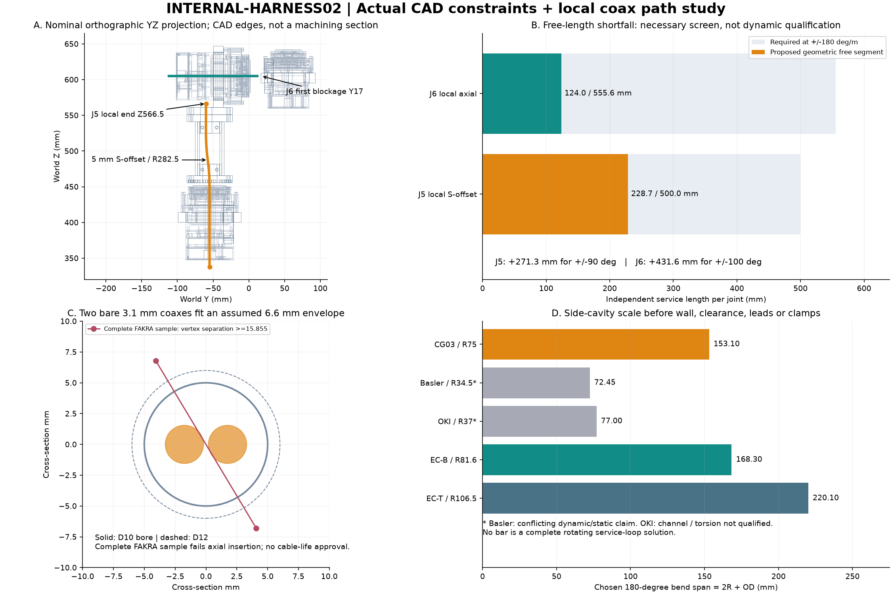

<!-- SPDX-License-Identifier: CC-BY-NC-4.0 -->
<!-- Required Notice: Odradek — Auromix contributors (https://github.com/Auromix/odradek) -->
# INTERNAL-HARNESS02 — 独立动态段与 J5/J6 实体内走线

2026-09-27。**局部几何研究，未完成整束布线、采购或动态寿命放行。** 本研究不改关节原点、限位、承力 CAD 或旧线束文档。双鱼眼 GMSL2、EtherCAT、供电进入本体，计算与控制主机留在外箱。

目前最有希望保持细长比例的方向是：**双同轴优先穿轴，电源与 EtherCAT 经可拆侧舱，本轮先按每个转动界面各设独立抗转夹紧自由段进行筛查**。已经找到 J5 内部不改金属的 5 mm 缓 S 弯；但其约 229 mm 自由长度仍不足以按现有同轴扭转指标覆盖 ±90°，J6 更受限。已核对的完整装壳 FAKRA 样件也不能直接沿轴穿过 Ø10/12 孔。下述长度差只约束本轮夹持构型，不是整机不可突破的角限或扩臂下界。



[审查 PDF](../../../engineering/generated/internal-harness02/internal-harness02-review.pdf) · [数值与逐实体证据](../../../engineering/generated/internal-harness02/evidence.json) · [来源快照](../../../engineering/generated/internal-harness02/source-records.json) · [可复现脚本](../../../engineering/internal_harness02.py)

## 分段与控制边界

本轮采用正在推进的 [P16 路线](../p16-control-interface.md)：`外箱主站 → J1…J7 → HEAD-DC`，共 8 个候选 EtherCAT 从站；四路 H 桥放在头内。旧 [线束文档](../harness-and-connectors.md) 的四路独立 BLDC 从站、12 节点和四指 24 V 动力是历史分支，不与本轮叠加。当前指动力为外置 12 V，辅助电源支路保留独立定义；相机经原配 GMSL2 PoC，不另把 12/24 V 接到同轴口。

`pre=n` 表示刚体跟随前 n 轴。本轴关节壳体和其电气口处于 `pre=i−1`，本轴输出连接件处于 `pre=i`。EtherCAT 的动态段从 Ji 的固定壳体 OUT 到下一关节固定壳体 IN；每段是局部点到点链，不能把一根从头到尾的“EtherCAT 总线线”画成跨七轴的完整拓扑。相机两路同轴则需穿过全部七个运动界面。

| 段 / 固定端 → 活动端 | 输出面原点 mm / 轴向 | 实际孔 / baseline 角域 | 本段跨越的下游负载 | 每轴独立抗转夹持时，CG03 纯扭转必要自由长度 |
|---|---|---|---|---:|
| HJ1，pre0 → pre1 | [0,0,105.2] / +Z | Ø22 / ±90° | 两同轴、J2…J7 48 V 支路、头12 V/辅助、EC J1→J2、等电位 | ≥500 mm |
| HJ2，pre1 → pre2 | [0,0,170] / +Y | Ø22 / ±90° | 两同轴、J3…J7支路、头电源、EC J2→J3、等电位 | ≥500 mm |
| HJ3，pre2 → pre3 | [0,55,220] / +Z | Ø12 / ±90° | 两同轴、J4…J7支路、头电源、EC J3→J4、等电位 | ≥500 mm |
| HJ4，pre3 → pre4 | [0,0,400] / −Y | Ø12 / ±120° | 两同轴、J5…J7支路、头电源、EC J4→J5、等电位 | ≥666.7 mm |
| HJ5，pre4 → pre5 | [0,−55,450] / +Z | Ø12 / ±90° | 两同轴、J6/J7支路、头电源、EC J5→J6、等电位 | ≥500 mm |
| HJ6，pre5 → pre6 | [0,0,605] / +Y | Ø12 / ±100° | 两同轴、J7支路、头电源、EC J6→J7、等电位 | ≥555.6 mm |
| HJ7，pre6 → pre7 | [0,55,640] / +Z | Ø10 / ±90° | 两同轴、头12 V/辅助、EC J7→HEAD-DC、等电位；本轴48 V不必跨自己的输出面 | ≥500 mm |
| HT0，可拆头固定接口 | pre7 → 同一pre7 | 不新增关节角 | 2×FAKRA、HEAD-DC网络/电源与要求中的监测接口 | 固定段，不重复记入HJ7 |

关节端口按 [RH-OPERATION](../rh-operation-evidence.md) 保留原厂称谓：EtherCAT IN/OUT为SH1.0 mm 4 pin；RH14/17/20动力附件为XT30(2+2)，RH25为XT30U-F。原厂尚未提供可直接制造线束所需的完整厂家PN与明确pin1观察面，不能自行等同某款JST，也不能把附件的480mm网络线长度当作已批准的动态自由段。其连接器/端子、锁扣按压空间、屏蔽压接和护线出口的受控尺寸仍TBD，本轮没有把未知口画成可穿孔的小盒子。关节抱闸由模块自身DC口供电，未新增独立外供闸线。头控制板内部EtherCAT端型仍未冻结；灯片GH10连接器的存在不代表它适用于EtherCAT。

各段屏蔽、支路保护与停止/保持接口待电气架构闭合；**不虚构 STO 针脚**。对于本轮独立段构型，两抗转夹具分别固定在表中两刚体上，同一段长度不能同时分配给多个轴。这一前提下七段必要自由长度合计至少 3.722 m/每根同轴，还没加固定引线、接头直段与弯曲储量；这是独立纯扭转指标筛查，不是裁线表，也不是所有内走线构型的下限。

上表仍使用未改的 R4-layout-03；+35 mm 肩部候选会使 J2 及下游原点整体上移，但本地 J5/J6 关系和本文局部长度不变。±角域均是模型研究值，肩部已有另行碰撞限制，并非可执行运行域。

## 线材证据与尺寸下限

| 线材 | 可用公开指标 | 本轮用途与限制 |
|---|---|---|
| Rosenberger Similar RG316-d，CG:03 | 名义 OD3.1；弯曲R75、3M；扭转±180°/m、5M；单次R15 | 当前9页目录第7页，与旧CG02快照区分。弯曲/扭转是分别试验；没有批准本研究复合路径或完整FAKRA订货总成 |
| Basler 2200002798 | 最大OD3.45；文档R34.5/5M、−5…60°C、机器人适用 | 同料号商店标static，冲突未消除；R34.5仅条件空间对照，未与ZED通道确认 |
| OKI FKR(CX) K动线 | OD3；R37、>10M滑动弯曲参考，动态最长5m | 厂商明确参考值非保证；无扭转额定，GMSL2 6Gbps配置和完整端型未核，不当滚转线使用 |
| LAPP 2170941 | OD6.8±0.3；连续弯曲12d；±180°/m、5M；另一寿命表有15d条件 | 本轮空间保留最大OD7.1/R106.5的较大值；不拼接不同试验条件成复合寿命 |
| LAPP 2170433 | OD最大5.1；现行数据表连续弯曲16d，3M试验为15d；官方产品表扭转适用为No | 本轮采用**R81.6**。旧R76.5是指定试验半径，不能当较小的无条件连续弯曲值；仅研究消除扭转后的路线 |
| 48 V / 12 V / 辅助电源 | 线规、绝缘OD与动态指标尚未冻结 | 不用关节随附18/14 AWG短线推导全臂母线；不沿用旧24 V指动力的电流假设 |

来源：[Rosenberger](https://www.rosenberger.com/fileadmin/content/headquarter/Downloads/_Other/HySpeedVision_Flyer.pdf)、[Basler文档](https://docs.baslerweb.com/basler-cable-gmsl-fakra-z-1x-f-f)、[Basler商店](https://www.baslerweb.com/en/shop/cable-gmsl-fakra-z-1x-f-f-3m/)、[OKI](https://www.okidensen.co.jp/en/prod/cable/movable/index_fakra.html)、[LAPP2170941](https://imager.lapp.com/e/lapp/5di4RA3zY0WwUKwyFeGtJg~~/DB2170941EN.pdf)、[LAPP2170433数据表](https://imager.lapp.com/e/lapp/jC7Lyg4YokqH2qg5r8noxw~~/DB2170433EN.pdf)、[LAPP官方产品表](https://e.lapp.com/jp/p/ethernet-cables/etherline-p-ec-fd-cat-5e-2170433)。

本轮复查发现旧本地 `lapp2170433.pdf` 实际为一页品牌底图，不能作为正文证据；R81.6与不适用扭转由官网产品表交叉核对，数据表正文检索另保留16d/15d差异。原文件未被覆盖。CG03原始PDF哈希继续使用 [CAM-CABLE02](../camera-cable-refresh.md) 固定的 `8ee280…f3ebc4`。

尺寸筛查不能只用截面积：两根OD3.1、间隔0.4的同轴可被Ø6.6圆柱包络包含；这不含衬套、外径公差和线夹。EC-T最大OD7.1与一根OD3.1同轴的两圆最小容纳孔径已至少10.2 mm，因此**仅这两根就不能同时通过裸Ø10**；更不能假定加上电源的全束能通过。Ø12或Ø22的空面积大于线面积也不证明装配、间隙和动态通过。

## 真实 FAKRA 包络与装配后果

读取 Stereolabs 官方 `GMSL Cable - FAKRA Z Female connector.stp`，6个实际solid，原生长轴为X：完整外包络 **26.2 × 9.7 × 13.7 mm**。截面上两真实BREP顶点的投影距离为 **15.8550 mm**，任何容纳该轴向投影的圆孔直径都不能小于这个值；因此这个完整接头不能轴向穿入Ø10/12。此值是严谨的必要下界，**不是最小包络圆精确值，也没有证明所有假想斜插动作**。图中未把接头重新绘成可穿孔小圆柱。[官方模型文件](https://cdn.sanity.io/files/s18ewfw4/staging/93950f8ae45e38bac0814db247ad58c799831cb1.stp/GMSL%20Cable%20-%20FAKRA%20Z%20Female%20connector.stp)

这不是 CG03 已确认可配的完整接头料号。前者提供相机侧真实几何，后者提供动线家族指标；端接、50Ω、高频损耗、PoC与锁扣仍需成品总成验收。接头抽出、按压锁扣与应变释放需要额外空间，26.2mm不等于最小维护舱长。

**完整塑壳过不了孔，不等于预压接金属芯一定过不了孔。** Rosenberger 原厂 [MA_59V116，rev b00，2022-10-20](https://products.rosenberger.com/_ocassets/ma/MA_59V116.pdf) 第1–2页确有先压接接触件、再装塑壳锁止的流程；它例示 FAKRA 2 的59S10O与FAKRA SF的59S16A等plug，因此证明这种制造顺序存在，尚未批准我们所需的CG03 female总成。保持胶帽/密封件的预装顺序也须服从该总成工艺，不能默认成品插头可无损拆壳复用。

具体料号不能仅按相近后缀配对：[59S10O-103A4](https://products.rosenberger.com/radio-frequency/connectors/170501/59s10o-103a4-straight-plug) 的原厂页是RG316-d、Ø3.1、50Ω且为plug；[59K13O-103A4](https://products.rosenberger.com/radio-frequency/connectors/170823/59k13o-103a4-straight-jack) 却列RG179-d、Ø3.1、75Ω。后者不是本项目50Ω CG03选型依据。[59Z063-000Z](https://products.rosenberger.com/radio-frequency/connectors/487658/59z063-000z-plastic-housing-jack) 证明独立Z编码jack塑壳有明确料号，但不能单独证明CG03端接兼容。

保留的优先条件路线是：由供应商在机外完成并检测金属接触组件 → 加可移除保护穿过轴孔 → 在可达端按对应指引装编码壳并检验锁止。**CG03所配female金属芯PN、包含压接套/止挡/保护的最大通行截面、适用塑壳与后装工艺仍TBD，本文不声称裸芯已能穿Ø10。** 两根芯应逐根穿入，还要检查第一根线占孔后第二根芯的通过空间，以及从侧舱进入每轴的引导弯。该路线不要求在机械臂内重压接；在证据齐备前不把它写成已完成装配方案。

另一路线是可打开的旁路线槽，保留不可拆成品端接。只有必须现场端接时才需要供应商批准的未端接端及受控工艺；不能剪焊同轴、拆除锁扣或削护套绕过几何。

## J5：不改金属的缓 S 弯候选

使用实际七个关节原厂solid、六段24件金属连接、8件底座，以及L34/L45/L56已知紧固件：147个对象、418个solid。来源哈希固定；未包含整头、其余连接紧固件、线夹、衬套或外壳。对每个solid做Boolean，AABB仅用于有上界的排除，交集报告门槛1e−4mm³。

首先沿J5中心 `[0,−55,z]` 探测Ø6.6：在 **Z525** 被L56上端块卡住。该件既有孔为Ø16、中心Y−60；轴线与孔心相差5mm，`5+3.3 > 8`，因此完整旋转包络擦入。这是指定直线圆柱包络的反例，不能外推所有两线姿态都碰撞。

候选保持前臂外形和承力件不变：

- 固定端拟在 `[0,−55,338]`，比J5实际后端约低10mm；活动端拟在 `[0,−60,566.5]`。这两个只是夹持基准点，夹具还没设计。
- Z338…450沿轴；Z450…525用两段相切圆弧把线心向−Y平移5mm；Z525…566.5沿偏置孔继续直行。
- 每弧半径282.5mm、转角7.62815°；中性中心线长 **228.72203mm**。两根线径3.1、中心距3.5，名义间隔0.4。
- [两同轴中性几何](../../../engineering/generated/internal-harness02/J5-two-coax-home-shape.step) 与 [空间验证包络](../../../engineering/generated/internal-harness02/J5-local-family-envelope.step) 为原创研究体；不是商品线缆CAD，也不是可制造护线器。

对几何路径族令局部截面方位角为 `φ(s,q)=q·s/L`，固定端φ=0、活动端φ=q。J5轴以下由同轴Ø6.6包含；上方过渡段采用轴对称包络；Z520之后在随L56转动的坐标中，以偏置孔心为中心的R5管包含。其半径计算考虑最多±90°、未完成转动的剩余角和5mm偏移，需约4.94mm而采用5mm。各段轴向再加1.55mm，覆盖管截面跨段边界。包络逐实体检查与中性两线包含检查均无穿透。

**该结论是局部空间容纳，不是运动寿命合格。** 其余轴固定在home；上段与L56/J6共同转动抵消，固定上游实体以高度分离。夹点硬件、带衬套后的自由活动、摩擦、线长随弯扭变化的余量、最小动态曲率和复合疲劳尚未闭合。中性S弯的R282.5不能直接当所有变形状态的曲率下限。

按CG03的±180°/m独立纯扭转指标，228.722mm至多对应约 **±41.17°的必要筛查**；拟覆盖±90°需要500mm，至少还缺 **271.278mm有效自由长度**。这是本路线的长度差，不是任意三维方案的全局最小加长，也不能据此把控制器限位直接改成±41.17°。

## J6：通孔之后立即遇到下一轴支架

沿J6中心 `[0,y,605]` 探测Ø6.6，输出面Y0之后在 **Y17mm** 首先撞L67后环，随后Y26附近进入J7本体。J6后壳轴向末端约Y−102；若在后端外10mm设拟夹面Y−112，前方为避让留5mm设Y12，则局部直段仅 **124mm**。

按同一纯扭转指标只能筛查约 **±22.32°**；±100°需要555.556mm，尚缺 **431.556mm有效长度**。后方搜索到Y−300没有遇到障碍，不表示有300mm可用独立自由段：它已伸到本体外，缺支承、防护、到上游夹点的路线和其他轴碰撞验证。证据JSON对此明确区分搜索边界与物理阻挡。

因此这个J6独立夹持候选不能仅通过“把线从Ø12拉出来，再在17mm缝隙内大角转弯”完成。保留其独立夹持与角域时，可研究侧舱受导向动态段、拉长自由段或更高扭转能力的小径GMSL合格总成。在这个模型内不能把J5同一段长度再独立分配给J6。若取消中间抗转夹持，模型必须改用下面的连续自由段研究，而不是沿用这些单轴结论。

## 侧舱需要多大，以及优先方向

对于指定180°半圆弯，裸跨度为 `2R+OD`。下表再给一个**双同轴平行分层**的壳体尺寸预算：两层间隙0.4、线到壳各1、壳厚各1.5mm。该预算只有静态截面与半圆，并未闭合转动两端的恒长运动。

| 线材方案 | 单线裸180°跨距 | 加间隙/壳厚后的该方向跨度 | 双同轴分层厚度 |
|---|---:|---:|---:|
| CG03，R75/OD3.1 | 153.1 | **158.1mm** | **11.6mm** |
| Basler条件R34.5/OD3.45 | 72.45 | **77.45mm** | **12.3mm** |
| OKI条件R37/OD3 | 77 | **82mm** | **11.4mm** |
| EC-B，R81.6/OD5.1，单线 | 168.3 | 173.3mm | 不合并同轴厚度 |
| EC-T，R106.5/OD7.1，单线 | 220.1 | 225.1mm | 不合并同轴厚度 |

以现有R75绕J5做同心反向U环，若内圆R75、外圆R225，裸直径就到453.1mm；它可以解析保持中心线长度，却明显不符合细长目标。本轮只给解析尺度比较，没有投入巨型壳体设计。较小半径的条件方案若沿关节侧面排布，77–82mm跨度和约12mm层厚值得继续研究，但**尚未证明其运动路径、连接器或其他线束可同时装入**。EC-B也会成为更大的弯曲半径约束，不能只优化相机线而忽略网络线。

推进顺序应为：先把CG03穿轴+J5缓S弯作为无载穿线样件；同时取得Basler/OKI或同等级合格小径总成的明确动态/扭转与GMSL2通道规格，再为J6设计固定/旋转夹点和可拆侧舱。若坚持现有CG03、本文每轴独立抗转夹持及原角域，则本地J5/J6候选分别缺约271/432mm有效自由长度；可改变路径构型、夹持策略或布局，不能把这一差值直接称为臂体必需加长量。**目前没有证据证明不改变尺寸即可保留全角域。**

另保留**连续同轴自由段**路线：相机同轴不分支，取消中途抗转夹紧，改用低摩擦旋转导向，使多轴扭转可能分散到更长的连续段，必要时包括外箱内的松弛段。这可以改变上面的独立段长度结论，但尚无模型或试验支持其可用角域。必须计算多轴组合的端部相对姿态与总扭转，并验证导向摩擦、绕线路径、接触卡止、材料扭矩、局部扭转集中、PoC/高速链路与疲劳；不能把整条线长直接批准给每个轴，也不能认为全臂角度简单代数相加就代表三维线束状态。电源与逐轴分段的EtherCAT仍需自己的导向/夹持，不能一并套用连续相机线假设。

电源线、EtherCAT、等电位线、护套和隔离距离均应另占侧舱截面；本文12mm级厚度不能标成全束侧舱厚度。全束定版至少需要完整料号和pin-to-pin、母线电流/压降/再生保护、线规/外径、夹点和中性姿态、成品链路/PoC测试，以及真实多轴轨迹下曲率/拉力/磨擦/温升和循环寿命。

## 复现与边界

```sh
python engineering/internal_harness02.py \
  --model 'RH14-N=/private/vendor/RH14-N.step' \
  --model 'RH17-B=/private/vendor/RH17-B.step' \
  --model 'RH20-B=/private/vendor/RH20-B.step' \
  --model 'RH25-B=/private/vendor/RH25-B.step' \
  --fakra-step '/private/vendor/GMSL-FAKRA-female.stp'
```

原厂STEP与接口提取核对哈希；默认重算实体，`--reuse-axial`仅复用来源哈希完全一致的长轴探测，局部包络仍重算。公开输出不含原厂CAD。主参数SHA仍为 `4349d1797b906b67a7bc396fcb84bc439c2d70dd0b337659e552cee293d2dd81`。

本次完成了一个局部几何候选和两处具体约束测量；**整臂全束、恒长柔性运动、实际应变释放和动态寿命均未完成**。没有改动任何已有结构或把研究角度写入运行配置。
