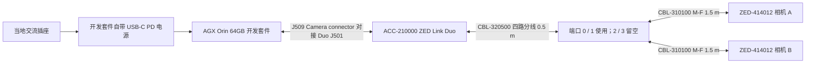

# 双鱼眼固定光学台架 OB-01

状态：**selected-for-optical-bench**；核验日期：2026-09-27。适用于桌上两路独立单目图像采集、视场/遮挡观察和后续标定。这里的选定仅覆盖固定光学台架，不冻结整臂电气或运动线束；未采购、未安装、未实机验证。采购明细见 [optical-bench-bom.csv](optical-bench-bom.csv)，可机读证据见 [optical-bench.json](../sources/optical-bench.json)。

## 采购配置

| 另购件 | 精确型号 / PN | 数量 | 选择及接口 |
|---|---|---:|---|
| 相机 | Stereolabs **ZED-414012**，ZED X One S Fisheye | 2 | 镜头已含；下单 F-F cable 选 None，Mount 选 None，转接板单列 |
| 采集板套件 | Stereolabs **ACC-210000**，ZED Link Duo | 1 | 已含 0.5 m 四路分线、3 个 M2.5×20 螺钉、3 个 16 mm 隔柱 |
| 外置主机套件 | NVIDIA **945-13730-0050-000**，Jetson AGX Orin 64GB Developer Kit | 1 | 完整开发套件；已有 eMMC、原厂电源与 USB A-C 数据线，不是裸模组 |
| 原厂延长线 | Stereolabs **CBL-310100**，1.5 m FAKRA Z M-F | 2 | 与套件 0.5 m 分线串接，每路名义线长 2.0 m |
| 相机底部转接板 | Stereolabs **ACC-151200**，Plate | 2 | 含螺钉包；底部 1/4-20 UNC 接口 |
| 桌面支架 | Manfrotto **MTPIXI-B** | 2 | 1/4-20 公螺钉；用于两台相机静置调角 |

相机现售包装只列相机本体，F-F 线和安装件是单独选项，不能沿用旧 GS 套装的赠品假设。[相机商城](https://www.stereolabs.com/store/products/zed-x-one-s)；[Duo 套件与附件](https://www.stereolabs.com/store/products/zed-link-capture-card)。

主机 0050 区域 PN 覆盖 US/CA/CN/TW/JP；其他地区用 NVIDIA 同表中相应的 0055 或 0057 完整套件，不混用裸模组 PN。此处固定 0050 为采购基准，并未推断收货地区；实际下单须匹配当地插头及销售区域。[NVIDIA 区域 PN 表](https://developer.nvidia.com/embedded/faq)。

ACC-151200 配合 MTPIXI-B 的标准螺纹作为独立静置支架，避免先加工相机底孔。前者官方尺寸 22×20×6.2 mm，后者允许俯仰约 ±35°。这套支架用于通电观察，不复现头部两相机的基线、50 mm 指根错层或最终遮挡；重新定位后需要重新标定。安装时先用配套相机螺钉，检查三脚架螺钉未触底、板面确实压紧，不能以加力解决不贴合。[Stereolabs 转接板](https://www.stereolabs.com/store/products/camera-mount-for-zed-x-one-s)；[Manfrotto 支架](https://www.manfrotto.com/global-uk/pixi-mini-tripod-black-mtpixi-b/)。

可选原厂主机底罩 **ACC-221000** 用于保护 Duo；台架最少启动配置不强制购买。首次开放桌面试验应让板件离开导电台面并保持风道畅通；如需要长期搬动，安装该底罩后再搬运。[官方底罩](https://www.stereolabs.com/store/products/enclosure-for-orin-agx-devkit)。

## 电源和线缆闭合



两条 GMSL2 路径均同时承载图像、控制和 PoC 相机供电。套件的四联公头接 Duo，分线的两个母头分别接延长线公头，延长线母头接相机背部公头。剩余两支分线固定在台面上，避免拉扯或接触导电异物。**CBL-320200 是 F-F，不是本方案的延长线**；CBL-320500 已含在 Duo 包装内，采购数量为 0，装配数量为 1。[官方接线指南](https://support.stereolabs.com/articles/6548481498-what-type-of-gmsl2-cable-should-i-use-with-my-zed-x-camera)；[分线 SKU](https://www.stereolabs.com/store/products/gmsl2-1-to-4-fakra-cable)；[延长线 SKU](https://www.stereolabs.com/store/products/gmsl2-cable-extender)。

AGX 开发套件通过板间连接给 Duo 供电，**无需额外 Duo 9–19 V 电源，也无需 CSI FPC 线**。使用 Duo 随盒的 16 mm 隔柱和 3 颗螺钉；不要套用 Orin Nano 的接线步骤。主机电源接 DC 圆孔上方的 USB-C **J24**；刷机数据线接 40-pin 排针旁 USB-C **J40**，两者不要混淆。原厂指南给出 USB PD 输入档位 20 V / 4.5 A（90 W）等；本方案直接使用套件自带电源，不另选通用 24 V 适配器。[Duo 官方 AGX 安装](https://docs.stereolabs.com/docs/products/embedded/zed-link-capture-card/gmsl2/zed-link-duo/jetson-orin-agx-devkit-setup)；[NVIDIA 接口标识](https://docs.nvidia.com/jetson/agx-orin-devkit/user-guide/latest/hardware_layout.html)；[NVIDIA 供电指南](https://docs.nvidia.com/jetson/agx-orin-devkit/user-guide/latest/howto.html)。

相机 S 单台公开典型值为 0.89 W，Duo 典型值 0.32 W，因此图像链典型估算约 **2.10 W**，不含主机、线损和启动瞬态。这不是整机额定电源预算，也不把旧 GS 的最大功耗当作 S 的保证值。[相机规格](https://docs.stereolabs.com/docs/products/cameras/zedxone/specifications)；[Duo 功耗](https://www.stereolabs.com/docs/products/embedded/zed-link-capture-card/gmsl2/gmsl-2-power-requirements)。

两根 RTK031 延长线仅用于**固定实验台架**：线留松弛弧、在桌面做应力释放、相机移动前先停采集并断电。厂家页面没有机器人反复弯曲、扭转寿命或跨关节使用证明；本选择不解决整臂动态同轴线问题，不宣称任何未公布的最小弯曲半径。

## 固定软件矩阵

选择标准非 RT 内核，直接在主机上运行相机 SDK。此表按 2026-09-27 官网及实际下载工件核验，不跟随各页面的「最新版」自动滚动。

| 层 | 固定值 | 证据 |
|---|---|---|
| 安装工作站 | x86_64 Ubuntu 22.04；NVIDIA SDK Manager 2.4.1 | [主机兼容表](https://developer.nvidia.com/sdk-manager) |
| 目标硬件 | NVIDIA AGX Orin 64GB Developer Kit；官方 carrier | [NVIDIA 型号表](https://developer.nvidia.com/embedded/faq) |
| JetPack | **6.2.2** | [NVIDIA 6.2.2](https://developer.nvidia.com/embedded/jetpack-sdk-622) |
| Jetson Linux / L4T | **36.5.0**，Ubuntu 22.04，标准非 RT | [NVIDIA 6.2.2](https://developer.nvidia.com/embedded/jetpack-sdk-622)；下列驱动包元数据 |
| 内核 | **5.15.185 系列 tegra 非 RT**，包版本 ≥5.15.185 且 <5.15.186 | Duo 1.4.3 包 `Depends`；不是允许任意 5.15 内核 |
| CUDA | **12.6**，使用 JetPack 自带版本 | [NVIDIA 6.2.2](https://developer.nvidia.com/embedded/jetpack-sdk-622) |
| GMSL2 驱动 | **1.4.3-LI-MAX96712-L4T36.5.0**，`stereolabs-zedlink-duo` arm64 | [Duo 下载矩阵](https://www.stereolabs.com/developers/drivers) |
| ZED SDK | **5.5.0**，Tegra L4T36.5 安装包 | [SDK 5.5 发布页](https://www.stereolabs.com/developers/release) |
| 采集 API | SDK `sl::CameraOne`；两个独立相机实例，各按 serial number 选择 | [单目指南](https://docs.stereolabs.com/docs/products/cameras/zedxone/monocular-vision) |
| 首次采集模式 | 每台 HD1200 / 1920×1200 @30 fps；稳定后再试 60 fps | [Duo 相机分组与上限](https://docs.stereolabs.com/docs/products/embedded/zed-link-capture-card/gmsl2/zed-link-duo/jetson-orin-agx-devkit-setup) |

锁定的驱动包：

```text
stereolabs-zedlink-duo_1.4.3-LI-MAX96712-L4T36.5.0_arm64.deb
SHA256 c6963e0b999557df6ffc9d62f8bb8ac00af15618e21b5fdd18fa3ae239b582ac
```

[原厂版本化下载](https://download.stereolabs.com/drivers/zedx/1.4.3/R36.5/stereolabs-zedlink-duo_1.4.3-LI-MAX96712-L4T36.5.0_arm64.deb)。本次仅在内存中读取该 1,654,184-byte 包的元数据并计算哈希，没有执行安装脚本。`Pre-Depends` 要求 `nvidia-l4t-core >36.5-0` 且 `<36.6-0`；若套件实机报告的内核或 L4T 不符，先重新核对镜像，不能强制跳过依赖。

SDK 精确文件为 `ZED_SDK_Tegra_L4T36.5_v5.5.0.zstd.run`；[发布页下载入口](https://download.stereolabs.com/zedsdk/5.5/l4t36.5/jetsons)本次 HEAD 返回 200 并解析到 [5.5.0 的原厂 CDN 文件](https://stereolabs.sfo2.cdn.digitaloceanspaces.com/zedsdk/5.5/ZED_SDK_Tegra_L4T36.5_v5.5.0.zstd.run)。只核验了下载元数据，未下载或运行 SDK；首次部署需留存安装文件哈希和安装日志。系统更新前需重新核对整行矩阵，尤其避免单独升级内核后沿用旧 GMSL 驱动。

## 搭建顺序

1. 准备有 USB-A 数据端口的 x86_64 Ubuntu 22.04 工作站、互联网和 NVIDIA 开发者账号。工作站至少 8 GB RAM、27 GB 可用系统盘；另预留下载和图像保存空间。目标使用套件 eMMC，首轮不必买 NVMe。SDK Manager 选 JetPack **6.2.2** 和完整 AGX Orin 64GB devkit；若列表隐藏旧版本，官方提供 `sdkmanager --archived-versions`。[主机要求](https://docs.nvidia.com/sdk-manager/system-requirements/index.html)；[安装工具](https://developer.nvidia.com/sdk-manager)。
2. 使用套件 USB A-C 数据线接 J40，在 Force Recovery Mode 用 SDK Manager 刷入 eMMC 并安装 JetPack/CUDA 组件。可以通过 USB headless 完成初始账号设置，再用套件 Wi-Fi 联网；无需为启动台架另买显示器。Mac 可以作为串口终端，但这里选定的刷机流程需要前述 Ubuntu 工作站。[NVIDIA 初始设置](https://docs.nvidia.com/jetson/agx-orin-devkit/user-guide/latest/quick_start.html)。
3. 主机正常关机、拔下电源和可能回供电的 USB 数据线。装 Duo、隔柱和螺钉；固定两台相机，断电状态连四路分线与两条延长线。先用 **port 0 和 port 1（Group A）**，另外两路空置。厂商允许每组两台 S 相机达到 HD1200@60；本台架先降到 30 fps 做基础记录。
4. 上电先留存版本读回，再安装上述确切 Duo `.deb` 并重启。安装包会配置设备树/服务；不要另套 Mono、ZED Box 或 RT 包，也不要照抄旧网页中的 1.3.2 / L4T36.4 示例。[驱动安装](https://www.stereolabs.com/docs/products/embedded/zed-link-capture-card/gmsl2/install-and-upgrade-the-drivers)。
5. 安装上述 SDK 5.5.0 的 L4T36.5 版本，保留 tools、samples 和 C++ 开发文件。CUDA 由 JetPack 提供；不要使用 `skip_cuda` 绕过版本检查。最小试验不需要 ROS 2、容器、深度或 AI 模型；这些均不属于本矩阵。[SDK 安装](https://www.stereolabs.com/docs/development/zed-sdk/linux/work-with-nvidia-jetson)。
6. 用 `CameraOne::getDeviceList()` 记录两台 serial number；两个 `CameraOne` 实例分别绑定一台相机，设 HD1200/30。先显示/保存未校正图，记录当前 SDK 能否取得各镜头标定信息；不要将两台相机默认打开逻辑误写成同一 serial。项目采集代码尚未实现，本指南规定接口和试验步骤，不声称已有可运行应用。[CameraOne API](https://www.stereolabs.com/docs/api/classsl_1_1CameraOne.html)。

在目标 Jetson 上执行的版本留证命令（本机未执行）：

```bash
cat /etc/nv_tegra_release
uname -r
dpkg-query -W nvidia-l4t-core nvidia-l4t-kernel nvidia-jetpack
dpkg-query -W stereolabs-zedlink-duo
nvcc --version
systemctl status zed_x_daemon --no-pager
```

驱动安装示意（需先完成版本核对，且命令目录中已下载正确文件）：

```bash
sha256sum stereolabs-zedlink-duo_1.4.3-LI-MAX96712-L4T36.5.0_arm64.deb
sudo dpkg -i stereolabs-zedlink-duo_1.4.3-LI-MAX96712-L4T36.5.0_arm64.deb
sudo reboot
```

## 首次台架验收及剩余未决

下列都是**待实机执行的项目**，当前通过的是文档选型与兼容性核对。

| 试验 | 必须留存的证据 | 本轮判据 |
|---|---|---|
| 双路身份 | 物理 port、贴纸 serial、API serial、软件版本 | 两台身份唯一，重启后可追溯 |
| 固定线缆图像 | 同时采集 10 min，帧数/丢帧计数/断流日志、主机温度 | 先以双 30 fps 验证；启动后无断流，丢帧记录并分析，不预填通过 |
| 60 fps 边界 | 相同日志，CPU/GPU 温度和功耗模式 | 另立结果，不能用官方上限代替实测 |
| 视场与遮挡 | 标尺/标定板、相机位置、未校正图像、遮挡物位置 | 确认实际有用视场，检查灯片/夹垫进入画面的区域 |
| 发光部件影响 | 同一曝光条件下灯灭/灯亮对照图 | 检查反光、曝光压缩和杂散光；需另备真实灯件才能做 |

**TBD 只保留尚不能由公开资料闭合的试验问题：**双鱼眼最终内外参、共同有效视野、应用允许的遮挡、同步误差与曝光偏差、头部真实夹具和动态同轴寿命。两台单目启动不等于获得深度；未验证鱼眼模型与虚拟双目流程前，不承诺 SDK 深度可用。硬件同步能力也不代替相位误差实测。

相机 PCB 内部 serializer 的具体 PN 未公开核实，但采购完整 ZED-414012 不需要自行选择该芯片。主机原厂电源和相机转接板螺钉分别随完整套件供货，故无须把其内部子料号伪装成未闭合采购项。补购替换件时再按实际批次标签核对。长时间数据集录制容量、灯光/圆形显示电源和最终头部安装不在这个最小双相机台架的选定范围。
