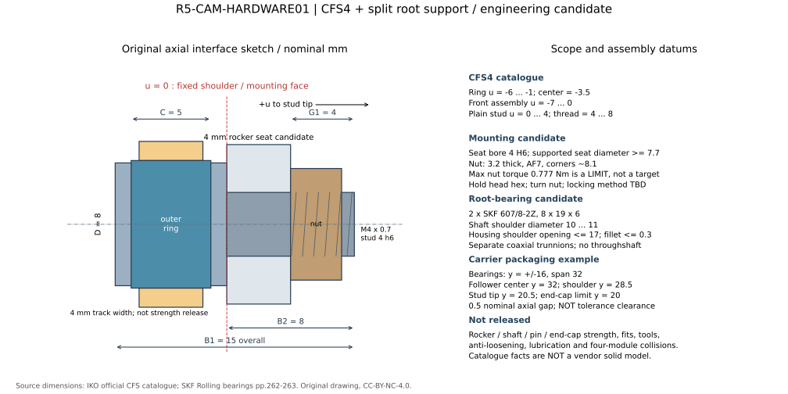
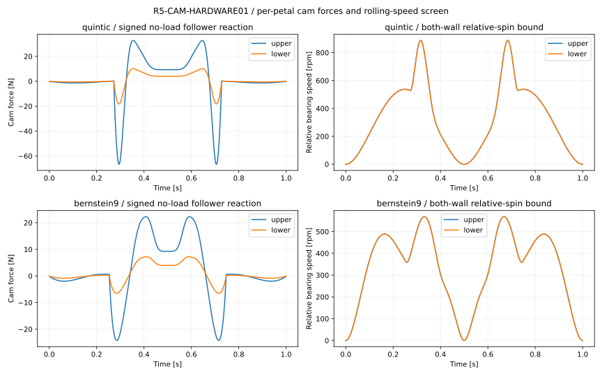

# R5-CAM-HARDWARE01：单瓣凸轮随动器与分体根铰支承候选

状态：**元件级条件筛选完成；单瓣装配、四瓣包装、制造公差与夹持额定未放行。** 本研究保持 STAGE01 的 a=8 mm、相位 −45°、R=31…91 mm、q=0…90°，不修改冻结槽线和 FORM02。唯一主随动器候选为 **IKO CFS4**；根铰条件候选为每瓣 **2×SKF 607/8-2Z**。自制摇臂、短轴颈、止动和槽板仍需由实际载体结构定尺寸。

原 Ø6 滚轮/6.3 mm 槽仅为几何占位。真实 Ø8 件需要另建槽宽；本研究用 **8.05 mm** 作公差讨论，不把它回写为已批准结构。四瓣各一只 CFS4 加八只 SKF 轴承的目录质量小计为 **73.6 g**，不含随附螺母、轴、摇臂、壳体、盖板和其他紧固件。

## 原厂件与装配基准

| 项目 | IKO CFS4 主候选 | SKF 607/8-2Z 根铰候选 |
|---|---|---|
| 形式 | 碳钢、保持架、圆柱外圈、普通级；不是 F/V/W 变型 | 双防尘盖深沟球轴承；不是 619/8-2Z |
| 主尺寸 | 外径 8、外圈宽 5、螺杆 Ø4 h6、M4×0.7 | 内径 8、外径 19、宽 6 mm |
| 动/静额定 C / C₀ | 1120 / 1120 N | 2340 / 950 N |
| 另行约束 | 最大容许静载 919 N；40 HRC **平面钢轨**容量 799 N | 轴肩直径 10…11、壳肩开口 ≤17、圆角 ≤0.3 mm |
| 目录质量 | 本体参考 4 g；螺母另计 | 单只参考 7.2 g |
| 转速 | 保持架/脂润滑 d₁n 推荐 8400、最大 84000，即 Ø4 对应 2100/21000 rpm | 参考 85000、极限 43000 rpm；并非本应用振摆寿命证明 |

数据来自 [IKO 当前原厂目录](https://ikont.com/api/directus-asset/e5d07c75-b960-4d38-99c0-e7a95f037172?modified_on=1775854492829)、可复核的 [IKO 中文原厂目录 PDF 12–17 页](https://ikowb01.ikont.co.jp/technicalservice/download/pdf_catalog/1569CN.pdf)，以及 [SKF 原厂目录印刷 262–263 页](https://cdn.skfmediahub.skf.com/api/public/0901d196802809de/pdf_preview_medium/0901d196802809de_pdf_preview_medium.pdf)。来源、页码和本地参考文件哈希见 [来源登记](../sources/r5-cam-hardware01.json)。同样 8×19×6 的 619/8-2Z 静额定仅 465 N，不能混用。

以 CFS4 固定肩面为 u=0，+u 指向螺纹端：前总成 −7…0；**滚动外圈 −6…−1，中心 −3.5**；光杆 0…4；螺纹 4…8 mm。随附 M4 螺母厚 3.2、对边 7、对角参考 8.1 mm。候选 4 mm 摇臂座使螺母占 4…7.2，名义露头 0.8 mm。孔为 4 H6（4.000…4.008），支承肩面直径至少 7.7 mm；实际倒角、螺纹退刀、拧紧工具和防松尚未闭合。**0.777 N·m 是目录拧紧上限，不是已经确定的安装扭矩**；固定头部、转动螺母，不能把头部内六角当成拧入板内的安装方式。该尺寸不带补脂孔，内部已封脂，外部滚道仍需润滑方案。



[机械接口 JSON](../../../engineering/electronics/r5-cam-hardware01/mechanical-interface.json) 将目录尺寸、原创装配假设及未知项分开。该图是尺寸关系草图，不是原厂 BREP 或完整公差实体。4 mm 槽板居中于外圈时，名义两侧各留 0.5 mm；考虑外圈宽度下限 4.88 后仅各 0.44 mm，仍未扣安装偏斜。

## 单片受力，不能用路径总推力除以四

每片在径向–Z 平面建模，q 正向闭合。相对铰心的材料质心为 (x,z)，铰心随 R 平移。令

\[
A_c=-x\sin q-z\cos q,\quad B_c=x\cos q-z\sin q,
\]
\[
a_r=\ddot R+A_c\ddot q-B_c\dot q^2,\qquad a_z=B_c\ddot q+A_c\dot q^2.
\]

FORM02 已建材料的单上/下片质量为 71.4579/46.4958 g；绕根铰的惯量为 0.000535407/0.000147936 kg·m²。它们**不含 LED、PCB、线、滚轮、摇臂和紧固件**。保留移动铰耦合后，所需闭合方向力矩为

\[
\tau=J_H\ddot q+mA_c\ddot R+mgB_c.
\]

槽中心线 \(c=[R+a\cos(q-\pi/4),\ 0.020+a\sin(q-\pi/4)]\)，取 \(n=(-c'_z,c'_r)/|c'|\)。滚轮有效力臂 \(h=a\cos(q-\pi/4)/|c'|\)，所以**有符号法向反力 F_c=τ/h**。负号表示换到另一侧槽壁。本模型的 h 最小为 4.712714 mm，q90 的直槽段 h=5.656854 mm。

独立重构每支路径广义力 \(F_s=-ma_r+F_c n_r\)，两上两下之和分别恢复 STAGE01 的 69.283792 N 和 39.757852 N；不是先把这两个数除四。全周期功–能残差 ≤3.74×10⁻⁸ J；从质心位置作独立二次有限差分，加速度最大误差 ≤0.0222 m/s²（25 μs 采样，包含分段 C² 接点），相对各自峰值 <0.05%。

| 1 s 空载往返时程 | 单上片最大 \|F_c\| | 单下片最大 \|F_c\| | 轴承内外圈相对转速上界 |
|---|---:|---:|---:|
| 五次径向输入 | 66.665 N | 18.220 N | 887.471 rpm |
| STAGE01 Bernstein9 输入 | 24.236 N | 7.194 N | 568.452 rpm |

单纯重力造成的最大上/下反力为 9.228/3.951 N；惯性项、总项峰值发生时刻不同，不能相加成新的“实测峰值”。以上是同步、无接物、无间隙冲击的已建材料模型；被动差动分支不同步时须重算。



滚轮中心沿槽移动，轴钉随片转动，不能只算中心速度除半径。保守相对角速度为 \(|v_{track}|/r+|\dot q|\)。实际加载壁纯滚动计算也已输出；力换号时该旋转速度可能突变，实物需经历间隙跨越、滑移/碰撞。推荐转速满足不代表该换边冲击、振摆润滑或循环寿命已满足。

## 夹持静载比空载更关键

此处采用**显式算例**：四个均衡接触、2 kg 工件、重力载荷因子 2、假设 μ=0.4、局部接触 x=65 mm、发光接触面高于铰轴 6 mm，head 重力沿 −Z。每片 N=24.516625 N，设计向下切向力 Fₜ=9.80665 N。因子 2 是设计载荷，不表示静置工件实际重量变为 4 kg。

\[
\tau_{cam}=0.065N-0.006F_t-mgz_{COM,hinge},\quad F_c=\tau_{cam}/(0.008/\sqrt2).
\]

只计物体法向为 **1.593581 N·m、281.708 N**；加入片重但不计切向力为上/下 **281.621/281.654 N**；再加入上述切向力后为 **271.219/271.252 N**。这些分量没有被隐藏进“空载很小”的结论。q90 最大闭角止挡通常抵抗继续闭合，**不能替代抵抗展开力矩的导槽**；可解锁止回/双向锁止目前均未设计。

以约 281.7 N 的法向单项检查，CFS4 的 C₀/载荷约 3.98、结构上限/载荷约 3.26、原厂平轨容量/载荷约 2.84。本研究参考 IKO 高精度情景而选择静态筛选目标 C₀/F≥3；它不是用户给定或整机强制要求。工件重力载荷因子2用于构造需求载荷，C₀/F则是额定与该需求的比值，两者分别报告，不将它们混作同一个安全系数。这仅是一个筛选目标，结构最大载荷与轨面接触还要分别检查。原占位尺寸对应 CFS3 的 C₀=611 N，约 2.17，故不保留为主选。

[静载扫参 CSV](../../../engineering/electronics/r5-cam-hardware01/static-grip-scenarios.csv) 给出 μ=0.2/0.3/0.4/0.6、x=35/65/95 mm 及法向分量/含切向力两种情况。μ 未测，不可把 0.4 当材料属性；x95 也不是已证明位于每块下片可用面内。**μ0.4、x95 的下片约401.27 N，C₀/F≈2.79，已不满足所选静态目标；μ0.2、x95约812.998 N，更超过799 N平轨目录值。** 因此此选型不是整个50–120 mm物体范围或任意接触位置的上界。更大摇臂/限制接触区/提高实测摩擦都需要重新验证，而不能只限电机电流后宣称额定2kg。

## 弯槽、材料和游隙

中心线数值最小曲率半径为 5.453590 mm。Ø8 的半径 4 小于该值；8.05 mm 槽的内侧偏置半径最小约 **1.428590 mm**，局部偏置正规性余量 **0.261954**。这只是稠密数值检查，不是全域区间证明，也不是加工刀具可达性验证。

799 N 是 40 HRC 平面钢轨条件；**不适用于打印塑料、未热处理铝或直接套到小曲率凸壁**。本研究另用同材钢 E=210 GPa、ν=0.3、有效线接触长度 4 mm 的 Hertz 理想模型：

\[
R_e=r(1\pm r\kappa),\quad p_0=\sqrt{|F_c|E^*/(\pi L R_e)}.
\]

取两壁更不利的一侧，最小等效半径仅 1.066153 mm。按平轨目录值作等应力比例**代理** \(799(4/5)(R_e/r)\)，全程最小为170.371 N；它不是原厂弯轨额定。同步五次/优化时程上片的“同位置载荷/代理值”峰值分别0.15474/0.13053，乘1.5动态因子后0.23211/0.19579；不把只发生在小曲率折叠段的170N与发生在直槽q90段的282N错误相比较。五次/优化时程的上片理想峰值 Hertz 压力约356.2/214.6 MPa；实际边缘接触、倒角、粗糙度、偏斜和冲击均可提高应力。4 mm 接触宽度折算本身也是工程代理，不能据此出硬度/热处理制造放行。

普通级外径是**平均直径**7.992…8.000，径向跳动上限15 μm，内部径向间隙3…17 μm。8.05 mm槽按名义外径的外部单边游隙25 μm，最不利 h 处线性化角游隙约±0.304°；只把平均外径下限代入则±0.353°。均未包含全部公差，不能当最终回差保证。载体并行研究仍保留8.3 mm槽：它的内偏置最小半径1.303590 mm、局部正规性余量0.239033，单边间隙仍是0.15 mm，因此线性化角游隙仍约±1.824°。与旧6/6.3数值相同是间隙相同，并非允许继续用旧滚轮实体；8.05讨论值不能代替载体实际8.3。

未找到 Ø8 CFS 的原厂偏心/预压变型。真实偏心 CFES 家族最小 Ø16，半径8超过现槽中心曲率半径，不能直接替换。把一只滚轮压紧两壁也不是可用的无间隙滚动：运动时两接触点要求相反自转。可调整双独立滚轮、轨板调整或单向回位预载属于后续结构研究，本次没有虚构现成型号。

## 短轴支承和轴向包装

不以贯穿轴穿过 FORM02 原有实体根部；由连接托架和两侧分离短轴颈支承。607/8-2Z 的精确安装行已从 SKF 相邻目录页逐项对应；端盖只压适当外圈肩，不能压防尘盖。拟定轴承中心 y=±16 mm、跨度32，轴承宽区 y=±[13,19]，壳外径22是候选壁厚1.5，外端盖外径20、厚1仍待强度计算。

真实 CFS4 安装肩若在 y28.5、螺杆朝内：滚动面 y29.5…34.5，中心y32；端部到y20.5，距盖最外面y20只有0.5名义间隙。4mm槽板处在y30…34，可能决定整头紧凑性；四瓣手性、邻片碰撞由载体研究单独校核。不能只用滚轮Ø8球形包络代替这套轴向长度。

在上述 μ0.4/x65 静载算例，跨度32、滚轮y32的近/远轴承合力为上 **401.779/141.413 N**、下 **401.923/141.279 N**。保留片质心横向偏置，力与力矩残差 <2×10⁻¹⁵ N·m。近轴承 C₀比仅约2.364；若该根支承也要求静态系数3，则当前包装不满足，需减悬伸/加跨距/改变支承，而不能称通过。[反力扫参](../../../engineering/electronics/r5-cam-hardware01/split-root-reaction-sensitivity.csv) 同时保留30和33mm跨距例子。

约1.534 N·m的夹持矩必须通过真实摇臂→短轴/托架→灯片传递；轴承不会提供绕自身轴线的正传扭约束。Ø8短轴与3mm横销目前不是已选制造件：材料、孔边距、双剪/弯曲、疲劳、配合、防松及装入顺序均未闭合。反力表另列灯片质心横向镜像、滚轮仍在+Y的结果，适配内部全同手性研究；变化小于0.04 N，但最终载体自重和传扭实体仍须加入。

## 交付与复现

[BOM](../../../engineering/electronics/r5-cam-hardware01/bom.csv) 区分目录件与必须定制的未知接口；价格、库存及交期未核验。原厂PDF/图片只缓存于工作区，公开目录保留原创图、数据及来源，不重新分发厂商媒体。

在仓库根目录运行（Python需numpy、scipy、matplotlib）：

```sh
python engineering/electronics/r5-cam-hardware01/build_interfaces.py
python engineering/electronics/r5-cam-hardware01/calculate.py
python engineering/electronics/r5-cam-hardware01/draw.py
python engineering/electronics/r5-cam-hardware01/verify.py
```

`build_interfaces.py` 记录本地已取原厂参考文件的哈希；缓存不在公开库时，它保留已登记来源哈希，不联网补取或伪造新核验。输入哈希、分量载荷、速度与校核见 [budget.json](../../../engineering/electronics/r5-cam-hardware01/budget.json) 和 [verification.json](../../../engineering/electronics/r5-cam-hardware01/verification.json)。零数值审计错误不能替代实际装配、轨道寿命、碰撞或夹物试验。

SPDX-License-Identifier: CC-BY-NC-4.0。原创研究，非金属加工放行文件。
