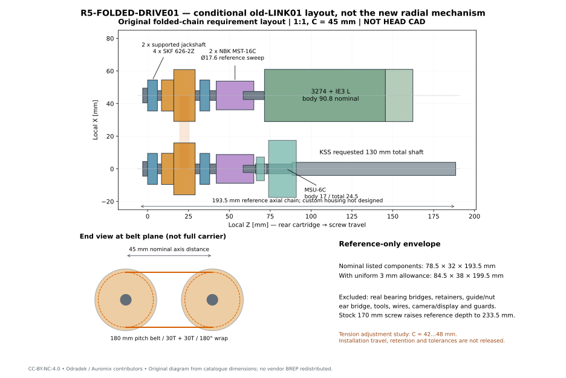
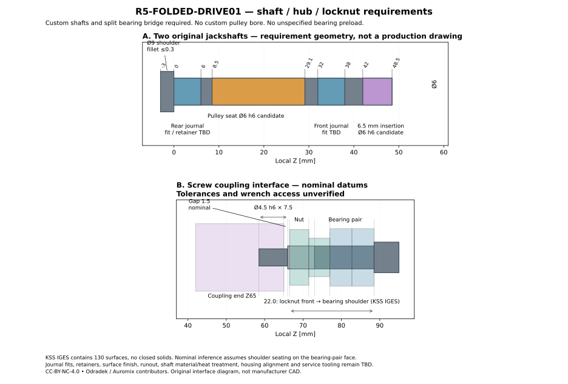

# R5-FOLDED-DRIVE01：单中央丝杆驱动的并列同步带折返

**结论：一套有明确目录零件的条件布局可继续；原轴直接安装带轮不可用，整套传动仍不能制造放行。** 采用两根独立支承小轴、两只现成 Ø6 Fairloc 带轮和两只异径联轴器，把皮带径向力交给新支承。对于旧 R5-LINK01 的 40 mm 滑块／R5-MOTION02 的 3200 rpm，名义轴向链从 243.8 缩为 **193.5 mm**，只减少50.3 mm；裸件名义宽度增至78.5 mm。支架、工具、线缆和整头空间均未闭合。

本研究只消费冻结的旧 LINK01/MOTION02 与 SLIDER-HARDWARE01。Ø112 mm 球的287.171 N、理想输入0.114262 N·m只是一个条件接触点，不能当盒体／瓶罐50–120 mm的全范围上限。本次没有采用或证明适配正在研究的径向机构，没有修改全头CAD、采购或联系厂家。



## 唯一主候选与被排除的直接安装

| 件 | 确切目录身份 | 数量及接口 |
|---|---|---|
| 同步带 | **Gates 180-3MGT3-6 / 9400-53250** | 1；3 mm节距、60齿、180 mm节线长、6 mm宽。SDP目录构成码 `A36R53M060060` 是同规格GT3供货身份的另一个目录入口，不能不核对送货身份就自动替换。 |
| 带轮 | **SDP/SI A 6D53M030DF0906** | 2；30T、Ø6 `+0.025/0`孔、M3 Fairloc、总长20.6±0.4、毂突出7.5、法兰Ø31.8±0.4 mm。适配GT2/GT3/FHT3且带宽≤9 mm。 |
| 电机侧联轴器 | **NBK MST-16C-5-6** | 1；Ø5电机→Ø6小轴。 |
| 丝杆侧联轴器 | **NBK MST-16C-4.5-6** | 1；Ø4.5丝杆→Ø6小轴。 |
| 独立小轴轴承 | **SKF 626-2Z** | 4；每轴2只，6×19×6 mm。 |
| 小轴、桥架、张紧和保持件 | 原创需求图，**无现成SKU** | 2根小轴；轴承桥、轴向保持及整电机模块调整结构待详细设计。不是“购买带轮后即可装机”。 |

带/带轮依据：[Gates 2024目录](https://www.gates.com/content/dam/gates/home/knowledge-center/resource-library/catalogs/industrial-power-transmission-catalogue-en.pdf)、[SDP D815 2-162/2-170](https://sdp-si.com/D815/D815-Metric-Section2-Belt-and-Chain-Drives.pdf)。NBK两个孔径组合确实列在[原厂MST-16C表](https://www.nbk1560.com/en/products/coupling/couplicon/slit_type/MST-C/MST-16C/)；不是把自制钻孔写成stock型号。目录存在不等于现时有货，未记录价格。

NBK两件都是Ø16×23 mm，每侧推荐插入6.5 mm、M2.5螺钉1 N·m，目录额定0.5 N·m／39000 rpm；需要按[参考回转径Ø17.6](https://www.nbk1560.com/images/en-US/product/contents/yougo_kaitenchokkei_coupling_NBK/yougo_kaitenchokkei_coupling_NBK_1.pdf)留位。0.5 N·m额定与本研究0.28 N·m设计筛查可比较，但不能替代选定轴公差下的夹紧滑移试验。[型号尺寸表](https://www.nbk1560.com/images/en/product/slit_type/MST-C/MST-C_1.pdf)及[安装说明](https://www.nbk1560.com/en-US/resources/coupling/article/couplicon-maintenance/)是插入和误差配合依据。

**直接安装反例**：该现成带轮孔径6，既不适配电机5，也不适配丝杆4.5。带轮20.6总长亦不能简单套进电机13±0.3或丝杆7.5的轴段。即使另做异径薄轮，仍是新的定制零件，必须重新核对夹持长度、法兰与锁母以及悬臂载荷。本次不把它列作第二套已选候选。

## 预紧必须计入轴承载荷

等径30T带轮，节径 `Dp = 30×3/π = 28.647890 mm`，中心距 `C=(180−90)/2=45 mm`，每轮包角180°／15齿啮合；3200 rpm时带速4.8 m/s。名义调整研究区42–48 mm尚不是已验证的装带、张紧行程。

以0.140 N·m为**假定静矩预算**，取显式服务系数2，设计转矩0.28 N·m。Gates的3MGT／6 mm每跨最低预紧2.4 lbf=10.6757 N；按其 `T₀=max(Tmin,1.21Q/Dp+M S²)`、M=0.078计算，S用千ft/min并完成力单位转换，得到12.1361 N/跨。这里仅为计算采用 `[12.1361,13.3497] N/跨` 的+10%敏感区间，**不是发布的装配张紧值**。Gates通用表14 lbf/跨若直接使用，会带来124.55 N静态径向合力；不能忽略它。[Gates设计手册，PDF67](https://www.gates.com/content/dam/documents-library/catalogs/light-power-and-precision-manual.pdf)

令两跨弹性对称、准静态分摊差张力：

```text
ΔT = τ / (Dp/2)
Ttight = T₀ + Tc + ΔT/2
Tslack = T₀ + Tc − ΔT/2
Fradial = Ttight + Tslack = 2(T₀+Tc)
Tc = (mbelt / Lbelt) v²
```

实际0.140 N·m的差张力9.77384 N；设计0.28时19.54769 N。采用目录带质量3 g的动态示例，Tc=0.384 N/跨，预紧区间上端对应**27.46746 N径向力**，两跨保持正张力。这不包含跑偏、齿啮合冲击、张紧误差和弹性波动；3 g也不是称重公差保证。

目录30T／3200 rpm／6 mm运行转矩1.96 N·m，180 mm长度系数0.85后为1.666 N·m，超过0.28的筛查要求；这是运行传动能力比较，不能推出零速握持、反复换向定位或疲劳寿命已合格。[同一Gates手册，PDF21](https://www.gates.com/content/dam/documents-library/catalogs/light-power-and-precision-manual.pdf)

## 载荷路径与真实轴端

独立小轴后轴承中心Z3、前轴承中心Z35，带载荷规划中心Z22.55 mm。径向力27.46746 N时，静态梁反力后10.68656／前16.78090 N。即把载荷位置放宽到整个法兰段Z16–29.1，单轴承最大也为22.40315 N。SKF表列C2340、C₀950 N、极限40000 rpm，只说明目录量级足够进入装配设计；没有替代配合、温升和寿命计算。[SKF目录PDF262–263](https://cdn.skfmediahub.skf.com/api/public/0901d196802809de/pdf_preview_medium/0901d196802809de_pdf_preview_medium.pdf)

对Ø6、32 mm简支跨度、E=210 GPa的纯梁筛查，弯矩0.20892 N·m、弯曲应力9.852 MPa、载荷点挠度0.001269 mm。它不含肩部应力集中、配合、扭转疲劳和桥架柔度，不能当小轴强度放行。后端选Ø9肩符合SKF给的8.4–9.4肩径范围／圆角≤0.3；轴承轴颈配合、轴向保持槽与材料均未指定。前轴承外圈应有定义清楚的轴向随动，不能随意施加预紧。

电机[3274原厂](https://www.faulhaber.com/fileadmin/Import/Media/EN_3274_BP4_DFF.pdf)的50 N径向数值只对应3000 rpm及距法兰5 mm。假定直接带轮距法兰1 mm、毂7.5、余下部分中点6.55，则带力臂15.05 mm；把27.46746 N按等弯矩映射到5 mm得82.6771 N。**此映射只是保守对比，不是厂家给出的承载缩放定律**；更不能把3000 rpm指标自动延到3200。主候选用联轴器只传递扭矩，将皮带径向反力导向独立桥架；偏心联轴器残余反力仍需校核。

丝杆的287 N条件轴力仍经MSU-6C角接触对进入机架，不经电机或新小轴支承。主方案理想情况下不再给MSU增加皮带径向载荷；如果取消丝杆侧小轴、把带轮改到丝杆上，就必须另算MSU/短细轴/锁母悬臂，不属于本方案。



原厂[KSS A219](https://kssballscrew.com/us/pdf/catalog/A219.pdf)固定端总30 mm，包括Ø4.5 h6×7.5、M6×0.75×7和推导15.5 mm轴承段。新下载的[KSS MSU6C IGES](https://www.kss-superdrive.co.jp/jp/cad/3d/MSU6C.zip)有130个面、没有封闭实体；参考轴承肩native Z−14.5与锁母前面+7.5相差22 mm，与[MSU目录参考尺寸(L2)=22](https://kssballscrew.com/us/pdf/catalog/E107-E108.pdf)一致。若肩正确贴合，尖到锁母面名义8 mm；联轴器插入6.5后有**1.5 mm名义端面间隙**。不可把这写成实装公差保证或工具进入已经通过。

原厂IGES两轴承参考包络合计11.5 mm，与裸MTA06-15HP5DF目录单只5.5 mm×2不同。保留这个0.5 mm来源差异，不用表面CAD推导真实轴承宽、压紧或预紧。[提取审计](../../../engineering/electronics/r5-folded-drive01/msu-reference-audit.json)给出原文件hash、面分组及假设；厂家文件只存work，没有随项目再分发。

## 折返尺寸、质量与惯量代价

本地坐标与head无绑定：丝杆轴X0、电机轴X45，两者Y0、平行Z。小轴后肩Z−3–0，轴承Z0–6／32–38，带轮Z8.5–29.1，联轴器Z42–65；电机/丝杆尖Z58.5，电机法兰Z71.5，3274+IE3组合后端Z162.3。130 mm请求丝杆末端Z188.5。取未设计桥架后边界Z−5，只得到下述**参考链**：

| 量 | 数值与范围 |
|---|---|
| 名义裸件参考包络 | 78.5×32×193.5 mm；法兰最大已知尺寸会使宽/高至少变成78.6/32.2，仍未形成全公差包络。 |
| 均匀加3 mm的展示盒 | 84.5×38×199.5 mm；不是罩壳结构，不包含真实桥架、螺母耳座、导轨安装偏置、工具或线缆。 |
| 与原直列比较 | 130 mm请求轴243.8→193.5 mm，省50.3；原170 mm stock轴283.8→233.5 mm，同样只省50.3。 |
| 目录/典型质量已知小计 | 534.4 g：motor、IE3典型、MSU两支承、两导块/115 mm轨、4轴承、带。 |
| 混合参考小计 | 800.876 g：再加联轴器最大孔参考、两个带轮/小轴名义几何代理和丝杆/螺母代理。**不是实际组件重量、保证上界或整头质量。** |

新小轴/带轮代理采用明确的实心环/圆柱计算；全部单项在[budget.json](../../../engineering/electronics/r5-folded-drive01/budget.json)。全头、支架、保持件、紧固件、护罩等未分配，`whole_head_mass_kg=null`。3274+IE3长度90.8±0.6来自[IE3组合图](https://www.faulhaber.com/fileadmin/Import/Media/EN_IE3-1024L_DFF.pdf)，没有用电机裸长代替。

将两个带轮与小轴代理、两联轴器最大孔参考惯量及带的平动等效惯量相加，得到 `Jadd=9.67720×10⁻⁶ kg·m²`。这个混合值既非实际值，也非保证上界；其量级约为电机+编码器4.808×10⁻⁶的2倍。对冻结七段时序CSV逐点重算 `τnew=τold+Jadd αmotor`：

| −Z重力，旧已建指体、单1秒空载往返 | 未加折返J，CSV回读 | 混合J示例 |
|---|---:|---:|
| 峰转矩，含目录电机摩擦 | 0.025403 N·m | **0.047022 N·m** |
| 单周期RMS转矩，同上 | 0.012265 N·m | **0.027339 N·m** |
| 理想负机械功积分 | 0.717613 J | **1.803718 J** |
| 新增峰动能 | 0 | 0.543346 J |

0.5 ms CSV再积分与原MOTION02高密度结果有微小数值差异，未冒充原始积分精度。表中仍缺真实丝杆、滑座、连杆、带/轴承损失与实际接触动力；负机械功也不是母线必然收到的电能。1:1不改善保持机械优势，0.114262/0.140对应的总传力比例仍至少约0.8162，额外传动损失只会吃掉余量；0.140本身不是装壳持续保证。实际回生/发热必须重新进入SERVO预算。

## 如何使用这份结果

可用的是一套真实目录件身份、可复算载荷及原创接口需求图；可据此决定是否值得为50 mm长度收益承担宽度、惯量、零件和装配代价。**不能将现图下发加工或把它自动迁移到新径向机构。** 首要未闭合项是精确6 mm/M3 Fairloc的夹紧/滑移数据、小轴定位与浮动配合、桥架与调整机构、锁母/联轴器公差及工具路径。张紧时应移动电机及其整套支承，不横拉联轴器强行吸收中心距变化；装带不应撬越法兰。MSU成套预调支承不拆解。

B型130 mm丝杆仍是 `SG0802.5-080R130C5B1X` 配置请求，不是厂家确认SKU；3200 rpm也没有消除KSS对循环器加速度的限制。失电保持、机械限位、夹力控制和新物体适配均未被一条同步带解决。

复算（从仓库根目录，环境须有numpy/matplotlib；原厂IGES额外读取须cadquery/OCP）：

```sh
python engineering/electronics/r5-folded-drive01/calculate.py
python engineering/electronics/r5-folded-drive01/make_bom.py
python engineering/electronics/r5-folded-drive01/draw.py
python engineering/electronics/r5-folded-drive01/verify.py
# 可选：另行取得上述官方ZIP解包，不自动下载、也不修改旧研究
python engineering/electronics/r5-folded-drive01/audit_msu_reference.py /path/to/MSU6C.igs
```

[BOM](../../../engineering/electronics/r5-folded-drive01/bom.csv) · [精确坐标](../../../engineering/electronics/r5-folded-drive01/layout-parameters.json) · [载荷CSV](../../../engineering/electronics/r5-folded-drive01/tension-and-bearing-loads.csv) · [惯量敏感性](../../../engineering/electronics/r5-folded-drive01/added-inertia-sensitivity.csv) · [一手来源与hash](../sources/r5-folded-drive01.json)。验证文件只证明本研究计算和来源关联自洽，不证明实机或制造合格。

SPDX-License-Identifier: CC-BY-NC-4.0。Required Notice: Odradek — Auromix contributors (https://github.com/Auromix/odradek)。第三方资料权利归原权利人。
