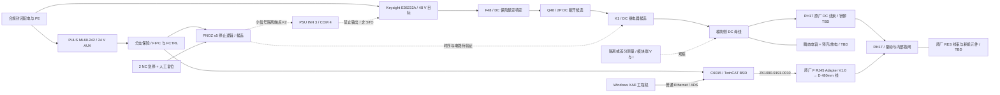

# 单 RH17 EtherCAT 电动台架：选型及接线边界

Revision **SA-BENCH-01** · 核验日期 **2026-09-27** · 状态 **设计配置已选，电动测试尚未放行**

本台架只验证 **1 个 RH17 模块固定在金属夹具内、输出端无机械臂／工具／工件**时的通信、制动状态、低能量动作和停止行为。对应 [独立 BOM](single-axis-bench-bom.csv) 与 [一手资料及计算输入](../sources/single-axis-bench.json)。这不是整臂接线图，也不证明 2 kg 负载能力。现有打印件只可用于安装与手动动作验证，不能承接本台架的电动扭矩反力。

`selected-for-single-axis-bench` 表示本台架的明确设计选择；`candidate` 表示已有具体候选但应用条件未闭合；`blocked` 表示必需接口／保护环节缺失；`TBD` 表示没有确定部件。**任何 selected 行都不等于允许给 RH 送电。**所有报价为空缺，数量是本台架规划数量，不并入整机采购量。

## 1. 已选配置

| 功能 | 本台架选择 | 应用边界 |
|---|---|---|
| DUT | MYACTUATOR **EPS-RH-17-100-E-B-D**，须核对实物完整铭牌 | 带抱闸、双编码器、EtherCAT；选择 RH17 也便于验证 RES 接口。RH14 无该接口，不作为第一台架对象。 |
| IPC | Beckhoff **C6015-0040 + C9900-C657 + C9900-H855 + C9900-M602** | X7213RE 双核／8 GB、80 GB SSD、DIN 安装；CPU/SSD 是整机配置选项，不能重复计作独立主机。 |
| 操作系统 | **C9900-S602 TwinCAT/BSD platform 40** | 要求供应商交付匹配 BIOS、网卡及运行时的镜像。 |
| 主站功能 | **TC1250-0v40**，目录中的 `v` 字段待厂家明确 | 官方支持 TwinCAT/BSD，包含 PLC 和 NC PTP 10；这是目录订货模板，完整商务订货号、软件 build 以及 RH 联调仍待确认。 |
| DUT 动力电源 | Keysight **E36232A** | 200 W 单路可调电源，名义目标 48 V；限流、OCP、OVP、斜率尚未设定，非已验证的回馈吸收电源。 |
| 辅助电源 | PULS **ML60.242** | 24 V／2.5 A／60 W、NEC Class 2，只供 IPC 与控制件。需闭合 IPC 启动电流及总功率预算。 |

依据：[RH 原厂资料包](https://www.myactuator.com/_files/archives/cab28a_be98b58973d34f7aaa50bdf3f2aa12ed.zip)、[C6015 配置](https://www.beckhoff.com/en-us/products/ipc/pcs/c60xx-ultra-compact-industrial-pcs/c6015-0040.html)、[BSD 订货表](https://www.beckhoff.com/en-us/products/ipc/software-and-tools/operating-systems/c9900-s6xx-cxxxxx-0185.html)、[TC1250](https://www.beckhoff.com/en-us/products/automation/twincat/tcxxxx-twincat-3-base/tc1250.html)、[E36232A](https://www.keysight.com/us/en/product/E36232A/200w-autoranging-power-supply-60v-10a.html)、[ML60.242](https://products.pulspower.com/uk/ml60-242.html)。产品页列出型号不代表已询价、现货或已购买。

C6015-0040 的两个板载口为 **100/1000/2500BASE-T**。分配一个专用 EtherCAT 口直连 RH IN，另一个用于工程下载／ADS；以实物 MAC 和系统枚举绑定，不凭旧型号端口编号猜测。50 mm 上下散热空间纳入外置柜布局。IPC 输入要求是 **22–30 V NEC Class 2**；X101 的正负与控制针脚必须采用该代出厂图，本文不抄旧代针脚编号。[C6015 电气条件](https://infosys.beckhoff.com/content/1033/c6015/9021305867.html)

辅助功率核算：`P_IPC,max + P_stop_logic + P_K1 + P_K2 + P_other ≤ P_aux,derated`，并另验启动瞬态／线路压降。60 W 不是已证实余量；若厂商最大负载或实测启动超过本配置，修改辅助电源分配后再放行。IPC 与停止逻辑的 24 V 不经过动力急停触点，保留诊断；停掉动力不应重启控制器。

## 2. 功能连接图：尚未冻结的节点用 TBD 标明



该图省略端子针号是有意的接口边界，不是供装配人员自由补线的空间。PE 连到设备规定的保护接地点、柜体及金属夹具；**48 V 回路 DC−、24 V 0 V、屏蔽层与 PE 的连接策略需明确设计**，不默认全部短接。EtherCAT 屏蔽由适配线／机壳连接方案闭合，避免用屏蔽承担动力回流。普通交换机不串入 EtherCAT 主站至从站链。

## 3. RH 原厂线束必须交付的完整链路

RH V1.4 §5.1 写明名义 48 V、接口最大 55 V；§7 说明抱闸由模块 DC 供电，**无需外接 24 V 抱闸线**。抱闸属于静态保持用途，不应把切断电源视为可重复动态制动方式。§5.2 要求 EtherCAT 引脚按实物标签确认。以下是连接关系要求，未知针脚不作推定。[RH V1.4 原件](https://www.myactuator.com/_files/archives/cab28a_be98b58973d34f7aaa50bdf3f2aa12ed.zip)

| 链路 | 允许确定的两端 | 厂家必须补齐，当前禁止猜测的部分 |
|---|---|---|
| 动力 | K1 后模块侧 +48／DC− 端子 → 随货 A Power Supply Cable，20 cm → RH DC 插口 | 手册列 XT30(2+2)、18 AWG；需核验实物公母／腔位、DC+/DC−、其余触点、线尾处理和极性／拉脱记录。独立采购订货号未公开。 |
| EtherCAT | IPC 专用 RJ45 → **ZK1090-9191-0010** 1 m 网线 → 原厂 **F RJ45 Adapter Plate V1.0** → **D EtherCAT Communication Cable** 480 mm → RH IN | D 标为 SH1.0 4 pin，F 标为 T+/T−/R+/R−；这些不是可直接套用的数字腔位号。核验图示方向与实物标签、差分配对、屏蔽和线序。禁止仅按颜色自行制作。 |
| 单从站出口 | RH EtherCAT_OUT | 按原厂单从站拓扑处理未使用 OUT，不加 CAN 的 120 Ω 终端。未用接头绝缘固定。 |
| 诊断 | CAN 口 → B CAN 线（GH1.25-2P、300 mm）→ E 原厂 USB-CAN 调试器（若厂家要求） | C 为 120 Ω CAN 终端；CAN_H/L 与小触点的对应必须实物核对，明确隔离／接地关系。 |
| 再生 | RH RES+/RES− → B Bleeder Resistor Cable（GH1.25-2P、300 mm）→ 原厂认可的电阻 | 同外形 B 线可承担不同功能，必须按 RES 标签识别；内部斩波阈值／电流／占空比、最小电阻／脉冲能量及过热动作未定。 |
| 编码器电池 | 原厂 BAT+/BAT− | 是否随货已装、所需电池化学体系／电压与更换程序由厂家确认；不接辅助 24 V。 |

RH 产品手册 260805 的 PDF 第 7 页列有随货 A 两根、D 两根、RES 用 B 一根；E 调试器和 F 转接板各按订单配一套（F 限 EtherCAT 版）。本单轴只使用一根 A、一根 D，其余留作有标识备件，不能重复计为另购套件。F 裸板必须安装在绝缘保护壳内并固定线缆。所选 [Beckhoff 网线](https://www.beckhoff.com/en-au/products/i-o/accessories/pre-assembled-cables/ethercat-and-fieldbus-cables/zk1090-9191-0xxx.html) 仅用于台架固定铺设，不据此宣称机器人耐扭性能。

这意味着**原厂配套链路已经找到**；剩余缺口是独立订货号、实物 revision、腔位方向和屏蔽／配对验收。D 的产品照片并不证明满足用户手册所述的屏蔽双绞要求，需向厂家核实实际交付线，不能给它补写未验证的屏蔽性能。因此 **SB27/SB28/SB30 的上电接口状态仍为 blocked**。到货后留存铭牌、插座与线束两端照片、厂家图、断电导通／短路检查记录；两电源关闭、储能放电并测得残压后才可连接／拆卸，不热插拔 RH。

## 4. 48 V 限流、保险及再生约束

台架选 **可调限流仪器电源**，而不是声称存在已计算完成的“安全能量”数值。E36232A 的 200 W 在 48 V 下给出 `200/48 = 4.167 A` 的功率上界算术值；**这不是短路限流值**，降压后仪器额定范围可到 10 A。CC 可以持续输出并积累热量，只有与 OCP／切断时间／储能共同考虑才能形成有限的故障能量预算。CV/CC、OCP/OVP 和斜率功能见 [Keysight 数据表](https://www.keysight.com/content/dam/keysight/en/doc/ungate/data-sheets/5992-3747.pdf)。

首轮设置保持 **TBD**：需要厂家提供启动／抱闸释放／空载保持电流，确认驱动输入欠压行为、相电流限制与输入电流关系；再按线束、保险、仪器精度和测试目标确定 `I_limit`、OCP 延时、`V_OVP` 和升压斜率。不能把输入电流上限直接换算成输出安全扭矩。

**55 V 是不能触及的器件上界，不是 OVP 目标值。**需满足 `Vset + ΔV_accuracy + ΔV_wiring/transient + ΔV_regen < V_allow < 55 V`。OVP 的典型反应时间不能代替模块端高速过压验证，且不证明能吸收回馈。首轮用本地 2 线感测，远端 sense 如有需要再单独验证断线／切断瞬态，避免跨越断开的功率触点仍形成补偿路径。

RH 推荐的开关后 1000 µF／100 V 电解电容只是瞬态参考值，精确器件、预充、泄放及安装未选定。以名义 1000 µF 计算：

```text
E_C = 1/2 × C × V²
E_C(48 V) = 1.152 J
ΔE_C(48 → 55 V) = 0.3605 J   # 只作容量量级示例，55 V 不可作为工作阈值
E_rot = 1/2 × J_equiv × ω²
C_needed ≥ 2 × E_regen / (V_allow² − V_start²)
E_fault ≈ 1/2 × C_total × V² + ∫ V(t) I(t) dt
I_charge = C_total × dV/dt
V_discharge(t) = V_initial × exp[-t/(R_discharge C_total)]
```

`J_equiv` 包括转子经减速比折算的惯量和输出盘惯量；无外载不等于无再生。`C_total` 含仪器、模块和新增电容，值尚未知。电容容差、ESR、线电感、接点弹跳及电源控制均影响瞬态。RES 电阻的阈值、电流、峰值／平均功率和热环境未闭合，不能凭静态欧姆定律给出可采购电阻。对独立斩波器的初步约束可写为 `R ≥ V_clamp/I_chopper,max`、`V_clamp²/R ≥ P_regen,peak`，但实际斩波控制和脉冲额定仍需厂家校核。

保护件采用 [UK 5-HESI 3004100](https://www.phoenixcontact.com/en-gb/products/fuse-terminal-block-uk-5-hesi-3004100) 保险座，4 A 的 [0477004.MXP](https://www.littelfuse.com/assetdocs/littelfuse-fuse-477-datasheet-pdf?assetguid=624AC410-146D-47DC-9971-CDAAA78F2C78) 和 [A9N61524](https://www.se.com/in/en/product/A9N61524/miniature-circuit-breaker-c60h-2-poles-4-a-c-curve/) 只是协调候选。4 A 不能因为接近 `200/48` 就定案；限流源下可能没有足够故障电流触发断路器磁脱扣，延时保险也可能持续不熔断。计算要同时覆盖最小故障电流、最大电容放电电流、导线耐热、DC 分断与方向、再生反向电流和启动 I²t。

整臂现有 [RSP-1000-48](https://www.meanwell.com/Upload/PDF/RSP-1000/RSP-1000-SPEC.PDF) 仍保持 **candidate**。其 48 V／21 A／1008 W 能力不等于首轮单轴需要的电流限制与能量预算；不直接复用到本台架。本台架选 E36232A 是为了可设、可测、可记录，而不是把较低铭牌功率当作机械安全保证。

## 5. 停止和抱闸：元件候选，不是完整认证系统

候选控制件是 [XALK178G](https://iportal.se.com/Contents/docs/SQD-XALK178G.PDF) 的两路 NC 急停触点、[PNOZ s5 750105](https://www.pilz.com/en-INT/eshop/product/750105) 以及独立人工复位／使能按钮。控制触点只驱动经过核验的接口或线圈，不能直接接 48 V 动力负载。PNOZ 的即断／延时输出如何分配，要依据 RH 实测停止与抱闸时序，不预设一个“通用安全延时”。[PNOZ 使用手册](https://www.pilz.com/download/open/PNOZ_s5_Operat_Man_21397-EN-17.pdf)

K1 候选 **G9EJ-1-E-UVD DC24** 有 DC 功率触点，但触点有极性、额定主要针对规定负载，且没有在本研究中证实可用于镜像反馈的触点。不能据此宣称实现冗余切断／触点熔焊诊断。线圈抑制依原厂要求采用压敏或二极管加齐纳方案；单个续流二极管会改变释放特性。真实负载的充电冲击、反向回馈、接点熔焊和失电释放时间需验证。[Omron 数据表](https://omronfs.omron.com/en_US/ecb/products/pdf/en-g9ej-1-e.pdf)

E36232A 的 **INH pin 3 / COM pin 4** 是低压数字口，COM 接机壳；数字端最高 +16.5 V，**不得直灌 24 V**。K2 候选 **PLC-RSC-24DC/21AU，2966265** 用金触点隔离 24 V 逻辑与 INH。正常许可时接地、断开时由内部上拉禁止输出的概念，需要先核验触点低电流可靠性与正逻辑／锁存配置。INH 默认禁用、掉电记忆、断线、锁存清除和重启状态都要实测；它不是 STO，也不能证明解除回馈储能。[Keysight 接口数据](https://www.keysight.com/content/dam/keysight/en/doc/ungate/data-sheets/5992-3747.pdf)、[INH 编程](https://www.keysight.com/ga/en/assets/9018-04839/programming-guides/9018-04839.pdf)、[信号继电器](https://www.phoenixcontact.com/en-us/products/relay-module-plc-rsc-24dc21au-2966265)

需分别验证以下事件，不能只测正常软件停止：受控减速→保持→抱闸→撤动力；急停时硬件请求／切断；IPC 崩溃；EtherCAT 断线／丢周期；24 V 逻辑失电；48 V 突然失电；K1 拒动／触点粘连；再生母线升压。每次复位只恢复待命，必须另行执行有意识的使能动作，不自动重新运动。RH 当前公开资料未闭合 STO／SBC 能力及抱闸指令／反馈／时序，本文不标注系统 PL、SIL 或安全认证等级。

## 6. EtherCAT 主站闭环

采用 **Windows XAE 工程机 → ADS → C6015 TwinCAT/BSD runtime → 独立有线网口 → 1 个 RH17**。工程机可与实时运行机分开；不要求用户 Mac 承担实时主站，也不声称 XAE 可在 macOS 原生运行。主机两个口各有明确用途，EtherCAT 口不承载普通网络／电源仪器 LAN 流量。

RH 协议资料包含 CiA 402 的 Controlword／Statusword、PDO 与 CSP/CSV/CST；这些并不等于已通过 TwinCAT 互操作测试。**还需厂家提供与铭牌／固件一致的 ESI XML 和已验证配置**，核对 Vendor ID／Product Code／Revision、PDO 字节数与类型、位置／速度／转矩单位和符号、绝对编码器初始化、Sync0／DC 周期、看门狗与失步反应。先验证 INIT→PREOP→SAFEOP 和输入数据一致，再在独立安全条件满足后验证 OP。循环周期、看门狗阈值与轨迹速度尚未冻结；不以任意 1 ms 或默认参数宣称实时闭环达标。

无实际硬件时能做的是配置审查与程序离线检查，不能记录“已扫到从站”“抱闸正常”“急停通过”。最终记录应包含镜像／固件／ESI hash、网口 MAC、有效 Working Counter、最坏周期抖动、丢帧恢复、实测输出单位、方向以及全部停止情形。

## 7. 放行条件与交付边界

| Gate | 必须形成的证据 | 当前状态 |
|---|---|---|
| G1 原厂接口 | 铭牌、完整线束订货号、针脚／屏蔽图、配套电池信息、固件／ESI | **blocked** |
| G2 辅助支路 | C6015 当代 X101 图、功耗／启动预算、24 V 分支保险、封闭 AC／PE 接线与检查 | **blocked** |
| G3 动力保护 | 实际 I-limit/OCP/OVP、线径、保险协调、开关方向、预充／泄放和校准测量方案 | **blocked** |
| G4 停止与抱闸 | 已审查电路、人工复位、独立切断响应、抱闸事实／时序、故障测试及必要整改 | **blocked** |
| G5 再生 | RES 参数／额定、最不利回馈能量、模块端最高电压、断电状态和热验证 | **blocked** |
| G6 EtherCAT | 匹配的 ESI／软件、单位与符号、周期和 watchdog、通信故障反应 | **blocked** |
| G7 机械台架 | 金属夹具、紧固和桌面锚固、扭矩反力、输出旋转防护、无附加载荷确认 | **blocked** |

推进顺序为资料／断电接线审查、辅助支路单独验收、停止逻辑与仪器在无 DUT 条件下的台测、再生与限能方案闭合，之后才是有防护且经放行的单轴上电试验。每一步记录失败条件并整改，不用后面的动作代替前面的证据。电动试验完成前本文件保持“未放行”，更不能外推到七轴整臂或 2 kg 操作。

已完成的仅是配置收敛、官方资料核验、BOM 与接口缺口定义；**未发生采购、实体接线、上电、运动或认证测试**。
