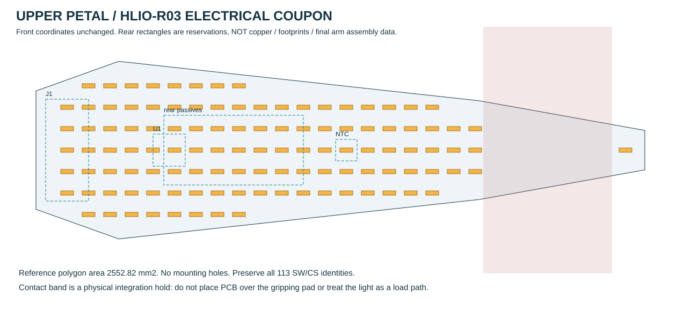

# 上灯片电路样片 ULP-01（历史版本）

当前已布线候选为 [ULP-02](upper-petal-ulp02.md)。本页保留 ULP-01 的旧映射和 220 mA 预算，不得与 ULP-02 的新地址、CS11…13 和 280 mA 峰值混用。

**2026-09-27 · HLIO-R03 独立电测样片 · 元件级电路审查包，尚未 PCB 制造放行。**

本包把一块上灯片落实为 **113 颗正面 LED、1 颗背面 LP5860、NTC、GH 接口及全部本地电阻电容**。沿用 HLIO-01 的 UR 灯点坐标与 SW/CS 映射，不修改主机械模型。R03 的夹持接触研究已有装机几何冲突；本样片用于电路、灯效、温升与相机条纹测试，**不承诺适配下一版承力指片**。

## 交付与复现

文件均位于 [`engineering/electronics/upper-petal-prototype`](../../../engineering/electronics/upper-petal-prototype/)。

| 文件 | 用途 |
|---|---|
| [schematic-control.svg](../../../engineering/electronics/upper-petal-prototype/schematic-control.svg) | U1 全部针脚、J1 与全部外围器件的具名网络原理图 |
| [schematic-led-matrix.svg](../../../engineering/electronics/upper-petal-prototype/schematic-led-matrix.svg) | 113 颗 LED 逐颗极性、网络与物理坐标 |
| [bom.csv](../../../engineering/electronics/upper-petal-prototype/bom.csv) | 134 个板上器件的逐位号完整 BOM |
| [pin-net.csv](../../../engineering/electronics/upper-petal-prototype/pin-net.csv)、[netlist.json](../../../engineering/electronics/upper-petal-prototype/netlist.json) | 317 条针脚记录，36 个相连网络；工具中立格式 |
| [register-plan.json](../../../engineering/electronics/upper-petal-prototype/register-plan.json) | SPI 头、全黑初始化、113 点 ON/OFF 掩码和逐点 DC/PWM 地址 |
| [footprint-constraints.json](../../../engineering/electronics/upper-petal-prototype/footprint-constraints.json) | 封装尺寸、已核验焊盘与仍需图形复核的项目 |
| [mechanical-power-budget.json](../../../engineering/electronics/upper-petal-prototype/mechanical-power-budget.json) | 面积、厚度、电流及热预算 |
| [external-interface-bom.csv](../../../engineering/electronics/upper-petal-prototype/external-interface-bom.csv) | 板外插壳、接点、源端串阻、供电和主控边界，不计入 134 件 |
| [verification.json](../../../engineering/electronics/upper-petal-prototype/verification.json)、[sources.json](../../../engineering/electronics/upper-petal-prototype/sources.json) | 输入/输出 hash、数据一致性检查和原厂证据 |

从仓库根运行 `python3 engineering/electronics/upper-petal-prototype/build.py` 可重建。这是数字连接关系和地址的检查，**不是 ECAD ERC/DRC**。初查未找到 KiCad 后，已在工作目录建立官方 KiCad 10.0.6 临时环境，校验下载 SHA256 与应用签名。原生 [KiCad 子项目](../../../engineering/electronics/upper-petal-prototype/kicad/README.md) 已通过真实 ERC、317 针 XML 比对和原理图/PCB 一致性检查；布线结果与未连接项以 [实际检查报告](../../../engineering/electronics/upper-petal-prototype/kicad/checks/verification.json) 为准。仍未制造放行，不能由 ERC 通过推导布线完整、温升合格或装机可用。

## 极性、矩阵及供电

每颗 **Würth 150060YS75000** 的 **1 脚为 K，2 脚为 A**。A 接 LP5860 的 SW 扫描行，K 接 CS 恒流下拉列。使用 SW0…10 和 CS0…10，CS11…17 对应 U1 的 24…30 脚明确悬空；不得接地。没有外置 ISET 电阻，也不为每颗 LED 增加常规串联限流电阻。电流由 MC/CC/DC 寄存器决定。[LED 官方图面](https://www.we-online.com/components/products/datasheet/150060YS75000.pdf)、[LP5860 官方数据表](https://www.ti.com/lit/ds/symlink/lp5860.pdf)

U1 采用 5×5 mm、0.4 mm 间距的 RKP0040B。AGND 和裸露焊盘 41 接同一连续 GND 铜面；VCAP 只接 C5 去耦，不外接电源、不带负载。C1/C2 共 44 µF 标称容量接 VLED；VLED/VCC/VCAP 的 1 µF、VLED/VCC 的 100 nF 和 VIO_EN 的 1 nF 均列入 BOM。局部电容应在 U1 所在背面就近放置；当前坐标只是面积预留，不是已闭合的回路寄生参数。[TI EVM 电路及 BOM](https://www.ti.com/lit/pdf/SNVU762)

本板不接受 24 V，输入是外部保护后的 **3.3 V_LED** 和 **3.3 V_LOGIC**。3.3 V 恒流余量须包含低温 Vf、线路及扫描开关压降；只凭典型值不能保证最暗像素或低温恒流准确度。外部电源型号、限流设定、启动浪涌和故障保护尚未在本板闭合，不使用 Nucleo GPIO 给 LED 供电。

## 接口与 NTC 修订

J1 = **BM10B-GHS-TBT(LF)(SN)**，线端为 **GHR-10V-S + 10×SSHL-002T-P0.2**。下表是本项目定义，并非 JST 的固定信号规范。M1/M2 是本设计为焊接固定片使用的焊盘名，连接 GND，不额外算作信号接点。

| J1 针号 | 1 | 2 | 3 | 4 | 5 | 6 | 7 | 8 | 9 | 10 |
|---|---|---|---|---|---|---|---|---|---|---|
| 网络 | VLED_3V3 | GND | VCC_3V3 | SCLK | MOSI | MISO_HOST | SS_N | VSYNC | VIO_EN | NTC_RETURN |

**VIO_EN 同时是 IO 电源与使能。**其低电平期间，主控驱动到该 IC 的所有数据脚须低电平或高阻，不能靠一个 SS 拉高到独立常开电源规避时序。R1=4.7 kΩ 将 IFS 拉至 VIO_EN 选择 SPI，R2=10 kΩ 将 SS 拉至同一 VIO_EN。本样片限定一对一 SPI 台测；共享六颗 IC 的 MISO/VSYNC 并单独切断某个 VIO 时仍需隔离或共同电源时序设计，不能直接套用此单板测试接法。

主控 SCLK/MOSI/VSYNC 的 33 Ω 串阻在主控源端；本板 R7=33 Ω 位于 MISO 源端。阻值为起始候选，需用实际线缆测试。GH 官方 1 A 额定采用 AWG26 条件，不能推导运动线束疲劳寿命；线型、线长、线端 pin 1 镜像、保持力与压接工具待闭合。[JST GH](https://www.jst-mfg.com/product/pdf/eng/eGH.pdf)

本子板将旧 HLIO 候选 NCP18XH103F03RB 替换为 **NCU18XH103F6SRB**。NCP18 已被官方标为 NRND；新料为 10 kΩ±1%、B25/50=3380 K±1%。R8=47 kΩ 从 VCC 到 NTC_NODE，TH1 从该点到 GND，R9=1 kΩ 串至返回线，C9=100 nF 对地。主控 ADC 必须高阻、不再叠加上拉；主照明 BOM、来源表和接口说明已同步；其他灯板仍需落实各自电路。[NRND 通告](https://www.murata.com/products/thermistor/ntc/overview/lineup/ncp)、[NCU18_S 原厂规格](https://www.murata.com/-/media/webrenewal/products/thermistor/ntc/ncu/ncu18-s.ashx?cvid=20240402040000000000&la=en-us)

在 3.3 V、25°C 标称条件下，NTC 偏置 **57.9 µA**、读数 **0.579 V**、自热功率 **0.0335 mW**，ADC RC 时间常数约 **0.925 ms**。官方 0.1 mA 指定的是单体在 25°C 静止空气中约 0.1°C 自热的测量条件，不能当作全温区绝对电流极限。正式温度换算用原厂 R–T 表并计分压/ADC/参考源误差；B25/50 近似不代替全温区校准。NTC 位置与封装温度不等于 LED 或 U1 结温，不承担安全温度保护声明。

## 可复核的扫描配置

`SW=k mod 11, CS=floor(k/11)` 保持原数据，**SRAM 点编号则为 `18×SW+CS`**，不可把源像素编号 k 直接用作 SRAM 偏移。11 行始终存在，只有 113 个已焊点启用，另外 85 个地址 OFF/DC0/PWM0。

寄存器候选：Dev_initial=0x5C（11 行、Mode 3 16-bit、125 kHz）；Dev_config1=0（1 µs 消隐、无相移）；Dev_config2=0；Dev_config3 初次点亮写 **0x51/3 mA**，复核后另用 **0x59/20 mA**。所有值显式写入并读回。TI 数据表与寄存器手册的 Dev_config3 复位缺省分别记为 0x47 和 0x57，本设计不依赖该差异。[TI 寄存器手册](https://www.ti.com/lit/pdf/SNVU786)

时序先保证供电/IO 条件，再等待至少 500 µs。初始化使能前写全黑和正确掩码；Chip_EN=1 后至少 100 µs，再提交合法画面。VSYNC 高脉冲至少 200 µs，期间不改 PWM。SPI mode 0、MSB first，初次 100 kHz，实际线缆验证后才考虑 2 MHz。20 mA **仍是软件配置，硬件可被误设更大电流**；因此软件损坏、扫描行配置错误或过温后的独立关断仍是整头控制板工作。

## 面积、厚度与热量

参考多边形面积 **2552.816 mm²**，约 25.53 cm²。候选四层、0.8 mm FR4，不含固定孔；113 个 LED 的正面焊盘总包络面积为 216.96 mm²。所有其他器件在背面，根部 GH 旋转 90° 预留空间；U1 的裸露焊盘需要可制造的导热过孔和钢网分窗。0.15 mm 最小线宽/间距、SW 至少 0.5 mm、CS 至少 0.2 mm、电源主干至少 0.8 mm 均为布线起点，尚未过 DRC 或温升/压降验证。

| 条件 | 候选计算 |
|---|---:|
| 20 mA、最密扫描行 | 11×20 = **220 mA** 瞬时峰值 |
| 忽略消隐的满亮平均上界 | 113×20/11 = **205.455 mA** |
| 8 µs 亮 + 1 µs 消隐 | **182.626 mA** 标称满亮平均 |
| 按平均上界的 3.3 V_LED 输入 | **0.678 W** |
| 典型 Vf=2.0 V 的 LED 电输入 | **0.411 W** |
| 驱动导通路径典型分摊 | **0.267 W**，另加逻辑 |
| 逻辑暂留 0.050 W 后板总量 | **0.728 W** 规划值，非保证最大值 |
| 对整个参考面积均摊 | **0.0285 W/cm²**，非热仿真 |

热初筛保守把全部输入视为热负担；局部 U1 热阻、壳体接触、封闭罩和邻近机械件会造成热点。44 µF 标称容量若独自供应 220 mA 的 8 µs 脉冲，理想压降 40 mV；若有效值仅 20 µF 则为 88 mV。这个灵敏度例子不包含 ESR、线路阻抗或真正 DC-bias 曲线，不能当作电源完整性验证。

正面 LED 最大 0.8 mm，PCB 0.8 mm，背面最高散装电容最大 1.45 mm，普通区域合计 **3.05 mm**。GH 配合参考高度 7.3 mm，根部达到 **8.9 mm**；若另加 0.8 mm 混光间距和 0.6 mm 透光片，则根部 **10.3 mm**。尚未计焊高、厚度公差、绝缘、应力释放及拔插/线弯空间；现有机械 0.6 mm 发光占位显然无法直接容纳。

无 LED 接触保留带为 x=101.4857…125.4857 mm，但 x=128 mm 仍有末端一颗 LED。PCB 如何跨越/绕过接触带、在哪里承托、如何不进入受力路径，仍须结合下一版指片解决。不可把本多边形直接铣板后强行贴到夹垫之上。

## 制造前检查与当前边界

已经完成逐针连接、113 点极性/唯一映射、33 个掩码字节回解、198 个 DC/396 个 PWM 字节及 10-bit SPI 地址头自洽检查。134 件均有明确物料号；外部供电和线材仍明示 TBD。真实 ECAD 捕获、独立网表比对和 ERC 已在 KiCad 子项目执行；布线及最终 DRC 结果见其报告。封装生产库、供电/温升和装机条件仍需闭合。

JST 完整型号图面现由厂商要求提交公司/联系方式并邮件发放；本任务没有提交表单或外联。公开目录已通过 PDFium 目检，明确固定片坐标、针 1 朝向与 0.6×1.7 mm 信号焊盘；1.7=5.6−3.9 mm。4.25 mm 是横向深度，壳体高度为 4.05 mm 加约 0.15 mm 座高。完整型号受控图及生产库仍需复核，不能冒充已获厂商确认。NTC 现已取得官方网页可读的完整规格和 land 范围，仍需图形/实际库叠图。光学扩散、20 mA 电热降额、焊接温度曲线、温度阈值及实际固件均未验收。

授权：原创设计和生成器按仓库 **CC-BY-NC-4.0**；厂商资料保留原厂权利，仅链接引用，不把厂商整套库/图面重新许可。
