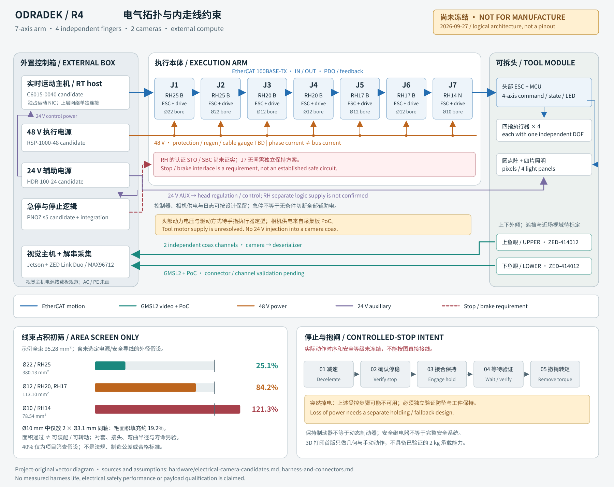

# R4 内走线、连接器与有限转角

版本：2026-09-27。状态：**可计算的设计约束，未冻结线束、引脚或制造接线图**。本轮依据 [电气候选](hardware/electrical-camera-candidates.md)、[关节候选](hardware/joint-candidates.md)和对应一手数据表展开。早期打印件只做几何与手动动作验证，不具备已经验证的 2 kg 负载能力。



## 1. 固定架构与仍需决定的接口

控制与视觉计算在外箱，本体保留执行器、编码器/驱动、局部接口与内部线束。7 个关节与 4 个指伺服、1 个头部 I/O 从站组成同一条 EtherCAT 链，与两路相机高速链分开；头部从 J7 输出侧拆卸。该结构图是逻辑架构，不是实际电气导通图，不定义插针编号，也不证明 RH 系列已具备认证 STO/SBC。

首轮机械候选为 J1/J2 RH25 B、J3/J4 RH20 B、J5/J6 RH17 B、J7 RH14 N。B 为带保持制动器，N 为无闸；J7 保持方案尚未完成。图中 Ø22 / Ø12 / Ø10 为对应候选中空孔输入，不能替代衬套之后的实际净孔径或驱动电缆接口尺寸。

拟定逻辑顺序为 **外箱主站 → J1…J7 → F1 → F2 → F3 → F4 → HEAD-IO**，共12个从站。F1…F4各为独立EtherCAT伺服驱动，候选为MC3001 ET或EPOS4 Micro EtherCAT；HEAD-IO的LAN9252通过 **SPI PDI** 接MCU，MCU只负责I/O、传感器和灯效，经本地SPI等已定义接口控制LED驱动，不充当第二个EtherCAT主站或默认四轴FOC控制器。头内5个节点之间有4段逻辑连接；实际IN/OUT、适配板和背板实现要按最终硬件核实，不能接普通IP交换机代替。

电源分为48 V本体动力、**24 V四指动力**、**24 V辅助逻辑/I/O/停止电路**三支路。四指动力与HDR-100-24辅助容量分别计算、保护和布线；四指24 V电源型号及回馈吸收尚未选定。均为分支定义，不代表关节已支持独立逻辑电源，也不代表实现了电气隔离。

相机接口仍是 GMSL2 候选，用户最初的“gxxx”尚未在本稿中视为确认。首选鱼眼 ZED-414012 使用模块原有的同轴 PoC，不在末端叠加未经核实的串行器或直接施加 24 V。

## 2. 线缆家族及几何约束

下列 R 都指数据表所述的弯曲半径，不能改成弯曲直径。外径用于包络；有公差时采用最大值。供应商定义的周期和试验条件必须整体使用。

| 代号 | 具体候选 | OD / 建模值 | 弯曲与扭转依据 | 本方案状态 |
|---|---|---|---|---|
| EC-T | LAPP 2170941 / ETHERLINE ROBOT PN FC Cat.5e，1×4×AWG22/19 | 6.8±0.3 mm / **7.1 mm** | 单独数据表列连续 R12d、±180°/m、5M 扭转周期；综合寿命表的 5M 弯曲条件列 R15d | 保守先放 **R106.5 mm** 包络；厂商需确认两个表的适用条件，未批准任意复合弯扭 |
| EC-B | LAPP 2170433 / ETHERLINE P EC FD Cat.5e，1×4×AWG26/19 | 4.8±0.3 mm / **5.1 mm** | 拖链寿命表 3M 对应 R15d；**未核实耐扭转值** | 仅纯弯曲导向研究，按 **R76.5 mm** 放包络；不能用在未消除扭转的滚转轴上 |
| EC-ALT | igus CFROBOT8.PLUS.045，4×2×0.15 mm² | 最大 **7.5 mm** | 动态 R10d；-15～+60°C 表内 5M / 7.5M / 10M 分别对应 ±360 / ±270 / ±180°/m | R75 mm；较大束径、四对中只利用所需对；寿命不得拼接成“±360°/m @10M” |
| CAM-T | Rosenberger 同轴结构 **CG:02 / Similar to RG316** | 名义 **3.1 mm**，最大公差待厂商 | 官方组合页列动态 R75 mm、2M 周期、±180°/m；单次弯曲 R15 mm | 找到适合研究的线材结构，**不是完整可下单 FAKRA 总成号**；仍需端接和 GMSL 通道验收 |
| CAM-S | Stereolabs CBL-320500，RTK031 FAKRA 分支线 | 完整外径/接头包络按供货件 | 公开产品页未给机械臂动态寿命 | 只用于固定外箱/光学台架，不用于关节动态段 |
| P48 | 48 V 母线与每轴支路 | 线规与绝缘 OD 待电流、热、保险确定 | 需合格机器人动态电源线及其弯扭表 | 不使用随附短线的 AWG 代替全臂母线计算 |
| P24-AUX | 24 V辅助供电与末端逻辑降压输入 | 待功率预算 | 同上；RH 是否可独立保持逻辑供电尚未确认 | 不含四指动力电流，不假定每个关节都支持外部双电源 |
| P24-F | 独立24 V四指动力支路 | 待电流/压降/再生保护与线径 | 必须另选机器人动态动力线 | 未选电源和保护，不能由HDR辅助或48 V母线直接替代 |
| SAFE | 停止、保持与监测要求接口 | 根数、屏蔽和线径待安全架构 | 认证撤力接口在 RH 候选中未证实 | **无引脚定义，不允许先布“STO 脚”再补证据** |
| BOND | 保护连接 / 等电位导线 | 截面与安装按整机电气设计 | 不依赖轴承导通、喷漆面或阳极层 | 打印版与金属版分别设计 |

来源：[LAPP 2170941](https://imager.lapp.com/e/lapp/5di4RA3zY0WwUKwyFeGtJg~~/DB2170941EN.pdf)、[LAPP 2170433](https://imager.lapp.com/e/lapp/jC7Lyg4YokqH2qg5r8noxw~~/DB2170433EN.pdf)、[LAPP 寿命表](https://products.lappgroup.com/fileadmin/catalog/en_A_pdf/A2_2_Data_cables_for_use_in_power_chains_Bending_cycles_and_operation_parameters_en.pdf)、[igus 型号目录](https://blog.igus.ca/wp-content/uploads/2024/05/chainflex-torsion-cables-catalog.pdf)、[igus 寿命表](https://www.igus.com/product/CFROBOT8_PLUS)、[Rosenberger](https://www.rosenberger.com/fileadmin/content/headquarter/Downloads/_Other/HySpeedVision_Flyer.pdf)、[Stereolabs 固定分支线](https://store.stereolabs.com/products/gmsl2-1-to-4-fakra-cable)。

## 3. 可计算的扭转自由长度

为每个关节定义独立动态段 HJ-i；在该段两端设置跟随相邻刚体的线夹，记录零位、可变形自由长度和端部方向。`L_free` 是两夹具之间能够分担扭转的实际有效长度，不是整条线缆的总长，也不包含被扎带/护管夹死的部分。

先使用均匀纯扭转的筛查式：

$$\kappa_i=\frac{|\theta_i|}{L_{free,i}},\qquad L_{free,i}\geq\frac{|\theta_i|_{max}}{\kappa_{allowed}}.$$

θ 使用从已定义中性姿态到极限的角度幅值。±120° 表示幅值 120°、总行程 240°，不是把 240° 再套入同一幅值公式。若零位含预扭，应检查正负两个极限并计入预扭，不能只检查总行程。多个串联关节的旋转不可直接按标量相消：实际空间转动、固定点姿态和弯曲路径要一起建模。

| 中性位置到极限的幅值 | κ=±180°/m 时最小 L_free | κ=±270°/m | κ=±360°/m |
|---:|---:|---:|---:|
| ±30° | 166.7 mm | 111.1 mm | 83.3 mm |
| ±60° | 333.3 mm | 222.2 mm | 166.7 mm |
| ±90° | **500.0 mm** | 333.3 mm | 250.0 mm |
| ±120° | **666.7 mm** | 444.4 mm | 333.3 mm |
| ±160° | 888.9 mm | 592.6 mm | 444.4 mm |

这三列代表不同厂商/寿命组合的纯扭转筛查，不是同一种线材的可自由切换工作模式。EC-T 及 CAM-T 都应先按 ±180°/m 研究；EC-ALT 的更高扭转列对应较低周期条件。最终整束还受最弱线材、连接器、夹具与实际复合轨迹限制，不能把相机线的 2M 当整机已达 2M。

反向检查例：200 mm 自由段，若按 ±180°/m，则只容许 **±36°** 的均匀纯扭转筛查幅值。把 700 mm 臂长与每轴 500～667 mm 自由长度对照可见，全部关节仅靠轴孔直穿并累积分配扭转并不闭环。必须研究以下组合：扩大并延长封闭线槽、可控弯曲/卷绕回环、降低局部角范围，或换用经验证的旋转传输机构。

下面的短式可在表格或脚本中重算；它只计算上述初筛量，不输出电缆寿命：

```text
required_free_length_mm = 1000 * angle_amplitude_deg / allowed_twist_deg_per_m
available_twist_amplitude_deg = free_length_mm / 1000 * allowed_twist_deg_per_m
cut_length_mm = fixed_route_mm + dynamic_route_mm + termination_allowance_mm
```

实际 `dynamic_route_mm` 与 `L_free` 不总相等。弯曲回环的展开长度不能未经验证全部计作可均匀扭转长度；连接头附近还需保持厂家要求的直线段。

## 4. 分关节线束段与装配界面

以下 ±90 / ±120 仅是检查空间需求的**示例幅值，不改变运动学文件或用户规格**。在真实 CAD 确定后，用真实限位替换；裁线长度全部待定。

| 动态段 | 关节 / 孔径输入 | 通过该运动界面的信号类别 | 示例幅值 / EC-T、CAM-T 的纯扭转 L_free | 首轮走线研究与连接位置 |
|---|---|---|---|---|
| HJ-1 | J1 / RH25 B / Ø22 | 下游 EtherCAT、2×CAM-T、下游 P48/P24-AUX/P24-F、SAFE、BOND | ±120° / ≥666.7 mm | 基座内设置可维护线束盒；先研究大孔直穿加长臂内自由段。J1 输出侧设置第二夹点，不能把外箱电缆拉入关节当补偿 |
| HJ-2 | J2 / RH25 B / Ø22 | 同上；各轴动力按上游/下游支路拆分 | ±90° / ≥500.0 mm | 肩部封闭侧腔为活动回环预留空间；轴孔直穿只是候选。EtherCAT 端接在固定侧支架、屏蔽连接有独立固持 |
| HJ-3 | J3 / RH20 B / Ø12 | 2×CAM-T 优先过轴；EC-T/P48/P24-AUX/P24-F/SAFE/BOND 研究侧腔 | ±120° / ≥666.7 mm | 上臂滚转不能将普通拖链线当耐扭线；侧腔与长臂内槽共同建模，夹点不得随表面装饰件漂移 |
| HJ-4 | J4 / RH20 B / Ø12 | 同 HJ-3 | ±90° / ≥500.0 mm | 肘部弯曲导向可研究 EC-B，但只有证明端部不累积扭转后才采用。动态 R 包络需避开肘部硬限位 |
| HJ-5 | J5 / RH17 B / Ø12 | 2×CAM-T、到 J6/J7/头部的供电和链路 | ±120° / ≥666.7 mm | 前臂轴向转动服务回环；上游电源线在分支后才允许依据剩余负荷缩线径，不凭位置猜测电流 |
| HJ-6 | J6 / RH17 B / Ø12 | 2×CAM-T、J7 与头部 EtherCAT/电源、安全与等电位 | ±90° / ≥500.0 mm | 腕俯仰侧腔可拆，正负角分别扫描；防止线束进入头部四片的闭合包络 |
| HJ-7 | J7 / RH14 N / Ø10 | 2×CAM-T、J7 OUT→F1 IN、头部电源、要求中的 SAFE/BOND | ±120° / ≥666.7 mm | 工具法线滚转必须有限转角。两同轴可继续研究小孔通过，其余走封闭旁路；J7 无闸及断电工具姿态未解决 |
| HT-0 | J7 输出法兰→可拆头固定接口 | 2 路相机、1 路头部数据、动力/辅助电源与要求中的安全接口 | **固定连接段，不额外分配 J7 的旋转量** | 在头背面布置可触及锁扣和应变释放；拆卸时先卸载/断电，再分离接头与机械固定 |
| HE-1…4 | 头内固定节点之间 | F1→F2、F2→F3、F3→F4、F4→HEAD-IO EtherCAT | 固定连接，不占用其他关节动态自由长度 | 4段逻辑连接，可由合格短线束或经确认背板实现；实际板卡IN/OUT与针序待核实 |
| HF-1…4 | 头部→各片 | 指片 LED 电源/数据、需要的反馈与执行器局部线 | 每片真实开合角待机构确定 | 独立根部弯曲线段；不借用整头 GMSL/ECAT 自由长度；PCB 和窗口不承受抓取载荷 |

HJ-i 对应某一机械转动界面的动态段，不意味着每个轴都要多加一个转接插头。EtherCAT 是上一从站 OUT 到下一从站 IN 的点到点链；其驱动接头通常在关节固定体上，实际哪根电缆跨越哪个输出面应以该版关节 CAD 为准。厂商已经集成的电机/编码器内部线不拆开重走。两路相机线优先保持连续至外箱，减少高速连接点。

## 5. 中空孔、侧腔与装配顺序

当前示例整束外面积 **113.44 mm²**；占 Ø22 孔 29.8%、Ø12 孔 100.3%、Ø10 孔 144.4%。原95.28 mm²示例未含单独四指24 V动力馈线，现补入2×Ø3.4 mm绝缘线占位；这是几何假设，不是已选线规。计算输入在 [electrical.json](sources/electrical.json)，其中电源和安全导线的 OD 仍是假设。面积筛查已经排除了“全部同一线束直穿 Ø10”的画法，不能据此认为 Ø22 已通过制造检查。

两根 Ø3.1 mm 同轴面积约 15.10 mm²；在裸 Ø10 孔的面积比约 19.2%。此数值未包含公差、护套、抗磨衬套、连接器与弯曲入口；仅支持继续做穿线样件。优先形成“细线过轴 + 其他线走封闭可拆侧腔”的混合路线，造型上允许局部关节壳变宽，与细长连杆而非超薄关节外壳形成比例。

装配顺序必须能在图纸中实际执行：

1. 先冻结线夹坐标、零位与头尾标识，再决定每段裁线长度；各活动段按供应商规定预处理。
2. 安装保护衬套和防夹导向。若线束须完整工厂端接，就通过可拆侧腔装入，或采用结构分体装配；不能假定 FAKRA、M8 或 RJ45 外壳可穿过 Ø10/12。
3. 只有供应商允许现场端接时，才先穿合格半成品、后用匹配端子和专用工具端接。不得通过剥去动态护套、任意切焊同轴或磨削锁扣获得穿孔空间。
4. 固定应变释放点后检查导通、绝缘、屏蔽连续性；高速链路按整根成品验收。不得只用万用表导通判定 GMSL2 合格。
5. 断电手动扫每轴全行程及组合姿态，测量曲率、拉力、磨擦和四指干涉；通过后才合侧盖。接头不承受运动拉力。
6. 金属阶段核对保护连接、接地和屏蔽策略；承力装配、线束安装和维护拆卸都要有工具空间。

## 6. 接头与引脚状态表

| 界面 | 已知连接信息 | 禁止猜测 / 下一项核验 |
|---|---|---|
| RH EtherCAT IN/OUT | 原厂附件表为 SH1.0 4 pin；电缆要求屏蔽双绞 | SH1.0 仅有节距/外形级信息；**完整厂家料号、壳/端子、镀层、线规及针序未确认**。不能凭 T/R 文本推导 PHY 引脚 |
| RH14/17/20 动力附件 | XT30(2+2)，随附线标 18 AWG | 四针含义、极性、允许持续电流/温升、通讯附加针是否启用待厂家确认；不直接并联整臂总线 |
| RH25 动力附件 | XT30U-F，随附线标 14 AWG | 以实际发货总成、配对件和插接方向确认；母线保护与转接点仍需设计 |
| 头部 EtherCAT 外部维护口候选 | HARTING M8 D-coded **21 02 185 1405 / 21 02 185 2405** | 官方目录为 AWG22 IDC。与 EC-T 的线规相符并不证明外径夹持匹配；对 AWG26 EC-B 或 igus .045 不能直接套用 |
| 头部 CAM-U / CAM-L | ZED-414012 原厂 FAKRA Z；外箱 ZED Link Duo 对应线束 | 正确单路/多路壳、性别、端子、50 Ω 通道和 PoC 方向按对应配套图核定；不使用通用 pogo pin 或未经验证滑环 |
| 头部电源 | 四指动力24 V候选与辅助24 V分开；峰值电流/电源/保护待预算 | **针数、极性、触点定额、带电插拔等级尚未冻结**；拆头按断电作业设计 |
| SAFE / brake | 仅有系统停止/保持要求；RH 认证 STO/SBC 未找到证据 | 不发布虚构 pinout，不把普通 enable / EtherCAT watchdog 作为认证接口 |
| BOND / shield | 金属化后需要明确保护连接与 EMC 连接 | 屏蔽不自动承担保护地电流；不通过轴承或紧固件涂层维持导通 |

连接器出处：[MYACTUATOR 官方协议/手册包](https://www.myactuator.com/_files/archives/cab28a_be98b58973d34f7aaa50bdf3f2aa12ed.zip)、[HARTING 目录](https://b2b.harting.com/files/livebooks/en/PRD0200000100248/downloads/livebook.pdf)。粗径 AWG22 动态以太网线与很小的 SH 接头之间需要厂家认可的端接总成或固定转接方案；不能把粗线削股后塞入小端子，也不能让转接 PCB 参与活动弯曲。

## 7. 线束制造放行需要补齐的数据

每条线束最终需有：两端完整料号及 pin-to-pin 表、线材明确制造商料号、原始/成品长度与公差、剥线/屏蔽处理、压接工具与拉拔标准、保护套和标签、固定端坐标、中性姿态、允许转角、动态 R、扭转指标与对应试验条件，以及成品电气与运动试验记录。

当前缺项包括：RH 实际引脚与线端子确认；小径 GMSL 完整总成；四指EtherCAT驱动的实际IN/OUT/ESI/PDO与电机反馈端接；母线电流/再生与保护定额；停止及抱闸架构；各动态段真实自由长度和三维曲率。图示和表格已经明确这些约束，**不应把一张好看的走线渲染或上述面积计算升级成制造发布**。
