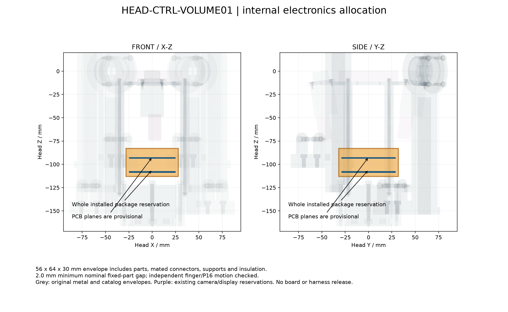

<!-- SPDX-License-Identifier: CC-BY-NC-4.0 -->
<!-- Required Notice: Odradek — Auromix contributors (https://github.com/Auromix/odradek) -->
# 末端控制电子件的中央空间候选

**HEAD-CTRL-VOLUME01：HEAD03 中央腔体存在一块 56×64×30 mm 的名义可用包络。** 它对既有固定件的最小间隙为 2.0 mm，并与四指及 P16 的连续独立运动保持分离。该结果用于约束电气设计，不代表控制板、安装件或线束已经完成。

[空间 STEP](../../engineering/generated/head-control-volume01/HEAD-CTRL-VOLUME01-reservation.step) · [机器可读检查](../../engineering/generated/head-control-volume01/study.json) · [生成脚本](../../engineering/head_control_volume_study.py)

坐标均相对于 HEAD03 正面，+Z 朝工件。整体包络为 X `[−28,28]`、Y `[−32,32]`、Z `[−113,−83]` mm。肩架抬升后，局部坐标不变。可以研究两层 PCB：名义板面位于 Z −109、−94 mm，板厚暂取 1.6 mm；逻辑/EtherCAT 与四路推杆驱动/电源可分层，尚未确定实际分板。

**包络必须容纳全部已插合的电子装配。** 单块 50×58 mm PCB 仅剩每侧 3 mm，侧向连接器通常会超过，因此实际板形可能需要减小，或把接插件朝向 Z 方向。基板、器件、对插头、支撑柱、螺钉、绝缘与散热件都应在此空间内建模；线束离开空间后的路径另行检查。不能把裸板不碰撞当作装配能容纳。

检查直接读取当前 HEAD03 的逐件 STEP，未重建简化承力件。所有固定对象逐 solid 核查，无正体积交叠；固定件最小名义间隙 2.0 mm。对转子使用既有真实零件包围盒的三角函数极值支持平面，上两指最低 Z 为 −31.4834 mm，与空间顶部的连续间隙下界为 51.5166 mm，下两指更远。对原厂实体包含关系已经验证的 P16 包络，使用几何点速度界和自适应区间距离证明：上两路间隙下界 22.7709 mm，下两路 15.3988 mm，覆盖各自完整独立研究角域。

仍需建立实际电子件、安装/拆卸路径、工具空间、绝缘及受载公差叠加、散热路径和头部可拆接插件。这块 STEP 是空间预留，不是要加工的金属块；没有将其计入产品质量、BOM 或整头惯量。
