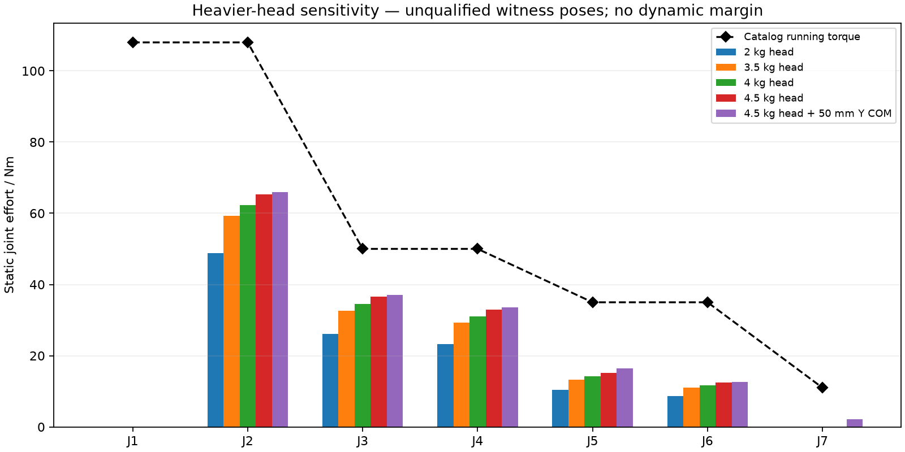

# 重型末端对机械臂的载荷影响

**R4-HEAD-MASS-01：重新评估 3.5 / 4.0 / 4.5 kg 头部，不修改 R4-layout-03。** 真实驱动支承显示原 2 kg 头部预算不能直接视为可达。此处仍按用户 2 kg 要求的“净工件”解释，另加头部自重；不是已经测得的整机质量。



本轮结果没有发现超过目录运行力矩的名义静力姿态，但**这不足以放行现有执行器**。搜索只给出已找到的载荷下界；任意姿态的三角不等式上界在 J3 超出 50 N·m，因此本轮上下界尚不能证明所有研究姿态都在额定内。真实热条件、运动加速度、接触反力和线束允许姿态仍未知。

## 明确假设

- 净物体 2 kg，原工具点 `[0,55,890] mm`，无额外偏心。
- 头部以原 COM `[0,55,760] mm` 为基线。另列 4.5 kg、COM 向 +Y 偏 50 mm 的敏感性情景；它不是新驱动总成或完整头部的测量值。
- 加重情景把 L5 预算从 0.50 提至 **0.85 kg**，用于容纳 J5→J6 连接的约 0.728 kg 原创金属件和暂估装配余量。最终紧固件、表处及真实 COM 尚未合计，0.85 kg 不是称重结果。
- 其他连杆预算与模块 COM 代理沿用原参数。没有加入新末端可能需要的安装延伸、TCP 后续变动和其他五段连接增重；因此不能称为整机最坏情况。

## 已找到的静力姿态

每个情景使用相同的 15,005 个确定性采样姿态，并对每轴最高的三个样本做有界局部优化。表内各轴数值来自各自的不同姿态，不是同一个总装姿态；原始角度完整保存在 JSON 中。所有姿态仍未通过自碰或线束资格检查。

| 头部情景 | J2 | J3 | J4 | J5 | J6 | J7 |
|---|---:|---:|---:|---:|---:|---:|
| 2 kg，旧 L5 0.50 kg | 48.887 | 26.130 | 23.234 | 10.442 | 8.711 | 0 |
| 3.5 kg，L5 0.85 kg | 59.291 | 32.613 | 29.214 | 13.290 | 10.991 | 0 |
| 4.0 kg，L5 0.85 kg | 62.329 | 34.582 | 31.058 | 14.221 | 11.751 | 0 |
| 4.5 kg，L5 0.85 kg | 65.367 | 36.552 | 32.903 | 15.153 | 12.511 | 0 |
| 4.5 kg，再向 +Y 偏心 50 mm | 65.996 | 37.130 | 33.544 | 16.499 | 12.704 | 2.206 |
| 当前目录运行力矩 / N·m | 108 | 50 | 50 | 35 | 35 | 11 |

J1 的轴在本重力坐标系始终竖直，因此重力驱动力矩为零；它仍承受轴向力和倾覆力矩。居中的头部/物体使 J7 重力驱动力矩为零，同样不表示腕部没有载荷。最后一行偏心情景显示，仅头部偏心就会让 J7 需要约 2.206 N·m。

所有优化见证姿态均再用独立的 `Arm.gravity_compensation` 校核，误差小于 1e−8 N·m。独立参考使用 Rodrigues 递推及重量叉乘，避免只比较同一个实现的两个调用。

## 全姿态边界与结构关联

对于 4.5 kg 头部及 +Y 50 mm 偏心情景，当前质量模型的路径长度上界为：

```text
J1…J7 = [0, 74.656, 63.422, 38.522, 30.516, 15.417, 10.648] N·m
```

这些是三角不等式得到的保守边界，可能很松；**63.422 > 50 本身不是 J3 已发生过载的证据**。它说明需要更紧的全域界、经验证的任务工作域，或实机载荷/热数据，才能关闭选型判断。也不能用本次较低的局部最大值反过来宣称全域安全。

头部 COM 若再有任意方向 50 mm 不确定性，4.5 kg 对每个相关轴的额外标量力矩上界是 `4.5×9.80665×0.05=2.2065 N·m`；这不包括其他质量和尺寸误差。底座、连接板、腕部轴承及固定螺钉需要按更新载荷重新核算，旧底座以约 2 kg 头部建立的研究载荷不得直接沿用。

后续先完成支承和壳体减重，并从完整 CAD/BOM 汇总质量/COM；再同步连杆实际连接、可拆接口的后伸空间和 TCP，最后重算静力、动态与连接。不能靠只升级一个大关节来掩盖末端体积和质量增加。

复现：`python engineering/head_mass_sensitivity.py`。参见[脚本](../../engineering/head_mass_sensitivity.py)、[数值与全部姿态](analysis/head-mass-sensitivity.json)、[原静力独立审查](arm-screening-review.md)。
