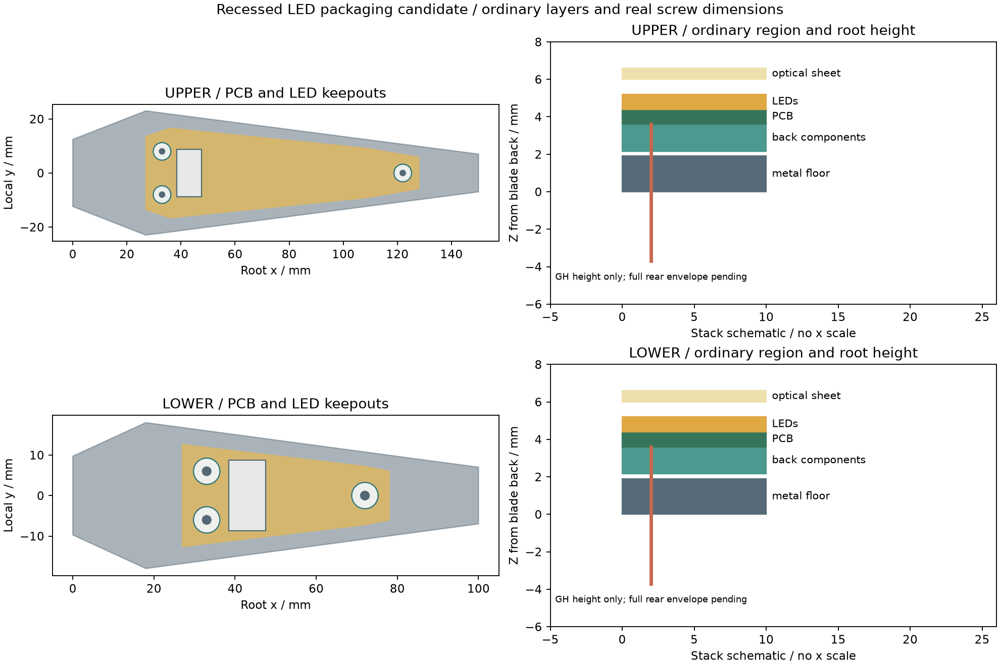
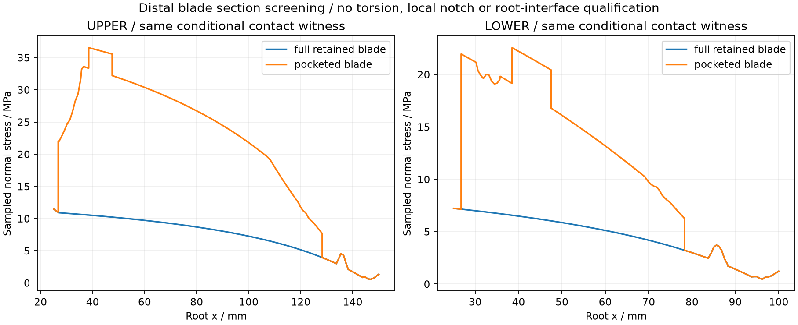

<!-- SPDX-License-Identifier: CC-BY-NC-4.0 -->
<!-- Required Notice: Odradek — Auromix contributors (https://github.com/Auromix/odradek) -->
# 灯片电子腔、PCB安装与骨架柔度

状态：**R4-LED-POCKET-01，普通区域层叠和安装结构的名义几何研究，未与正式灯板、根部线束和完整夹爪集成。** 本版把普通电子区放入原6 mm骨架内，发光面仍为Z6.0…6.6。已有113点ULP电测样片的轮廓和元件坐标不直接适配本结构；它们没有被本研究改动。



## 厚度与装配

沿用[上灯片电子样片](hardware/upper-petal-prototype.md)中的器件最大高度，以及混光/透光片的设计预算。局部坐标从指根向片尖为X，金属背面Z0。显示区域从X27开始，末端止于L−22；上L150，下L100。

| 层 / 特征 | 局部Z，mm | 说明 |
|---|---:|---|
| 普通口袋底 | 0…1.9 | 金属剩余厚度，周边仍保留原6 mm骨架 |
| 背面器件预留 | 2.15…3.6 | 最高1.45，距金属底名义0.25；不是实际器件整块实体 |
| PCB | 3.6…4.4 | 0.8 mm候选板厚，尚无本形状铜箔布局 |
| 正面LED预留 | 4.4…5.2 | 最大0.8，安装孔周围禁止放灯 |
| 混光空间 | 5.2…6.0 | 0.8为设计假设，未验证均匀性 |
| 透光片 | 6.0…6.6 | 0.6为假设；压边/胶接/卡扣保持待设计 |

普通区域整体Z2.15…6.6，厚4.45 mm。口袋平面轮廓比候选PCB外扩0.25 mm；机械间隙不等于电气绝缘认证或完整制造公差链。

每板三个Ø5.5一体金属安装台：上片 `(33,±8)`、`(122,0)`，下片 `(33,±6)`、`(72,0)`；台面Z3.4。预留0.2 mm绝缘环后支承PCB底面Z3.6。绝缘环材料、压缩量和供应商尚未选择。PCB孔Ø2.4，元件/LED禁布圆Ø6.5；不是允许铜直接贴金属台。

螺钉候选为 **NBK SSH-M2-4**：M2×0.4、头下4、头Ø4×1.1、1.3 mm内六角。帽顶Z5.5，距透光片底0.5；名义端部Z0.4，几何进入金属3.0。金属孔暂表示Ø1.6底孔贯通，未画螺旋牙型；实际完整牙长要扣倒角等。[原厂SSH尺寸表](https://www.nbk1560.com/images/en-US/product/lowsmallheadscrew/SSH/SSH_1.pdf)。该表0.3 N·m是厂家上限，**不是选定的PCB安装扭矩**；头/螺纹等级也不同，必须连同铝牙、FR4和绝缘环重新确定预紧。

三处头部和自由螺杆、PCB、绝缘环、安装台及元件预留逐实体检查：每型55对，共110对，无正体积干涉。螺纹啮合区域按设计排除；这不证明实物牙型、夹紧力、焊高和防松已完成。螺钉必须在透光片装入前从正面操作。

## 根部连接器仍是独立缺口

在X43、Y0预留9×17.5 mm贯通开口；它是候选让位区域，**不是已证明包含完整配对GH的包络**。若按当前7.3 mm配合高度参考、PCB底Z3.6，连接器后端到Z−3.7，后向突出3.7 mm。母头、锁扣、压接端子、线弯和工具退插还需实体检查。

因此只对表中普通区及已建安装件做外部包络结论：它们全部位于原CONTACT02骨架/灯窗包络内，源STEP逐件相减的外逸体积为0。根部GH、线束、透光片保持、公差和受力变形明确排除。不能把这项结论写成“完整电子已通过四指闭合”。

片尖保持孔沿用[浇注键](contact-pad-retention-study.md)。近根x≤25仍待与P16/SUPPORT构造集成，现有STEP的旧宽根不能直接当作完成的新指轴接口。

## 开腔后的刚度变化

对口袋前后两种真实CAD，从X25.01到片尖取121个等距截面，并补孔/开口/口袋边缘邻近采样，薄片厚0.002 mm。用体积惯量求净面积、形心、Iy、Iz；对称截面Iyz接近0。计算：

`σx = Fx/A + My·(z−zc)/Iy − Mz·(y−yc)/Iz`。

沿长度用实际Iy/Iz积分 Euler–Bernoulli 弯曲，理想夹固设在X25。载荷来自软垫保持研究的一组Ø80×40、μ0.4、2 kg×2、每指3.7 N·m条件力解；接触偏心和两个垫的不同受力都保留。



| 指标 | 上片：开腔前 → 后 | 下片：开腔前 → 后 |
|---|---:|---:|
| 当前全片金属估重 | 74.698 → 46.584 g | 40.721 → 29.014 g |
| 最大采样正应力 | 11.478 → 36.549 MPa | 7.224 → 22.559 MPa |
| 片尖Z弯曲挠度指标 | 0.332 → 0.753 mm | 0.074 → 0.166 mm |

结果说明容纳电子的代价包含明显柔度增加。上/下片压缩差会改变真实双垫分担，后续需要结合接触柔顺模型与实测调整；不能将当前静力见证解当成变形后的真实受力。

这些数值不包含根部柔度、扭转/横向剪应力、局部缺口、螺钉预紧、接触应力、屈曲、疲劳、动态或热作用。采样不证明孔缘最大值，理想夹固及台阶形心梁模型也不是整片3D有限元或保守变形上界。不能仅因正应力低于材料屈服就把1.9 mm底板定为生产规格。元件预留体积不代表实体材料，不能按其体积估算整板质量。

## 文件与复现

[生成目录](../../engineering/generated/led-petal-pocket/)含两型独立STEP装配、22份分件STEP、[几何记录](../../engineering/generated/led-petal-pocket/study.json)和[截面/载荷记录](../../engineering/generated/led-petal-pocket/net-section-loads.json)。这些是机械接口候选，不含Gerber、STL打印承载资格或生产图纸。

```sh
python engineering/led_petal_pocket_study.py
python engineering/led_petal_pocket_loads.py
```

依赖CONTACT02、软垫保持和上灯片电路预算；输入/生成器SHA均记录。后续需把局部深腔与真实元件分布配合，进一步保持骨架刚度，再完成连接器、透光片固定、热路径及正式灯板布局。
