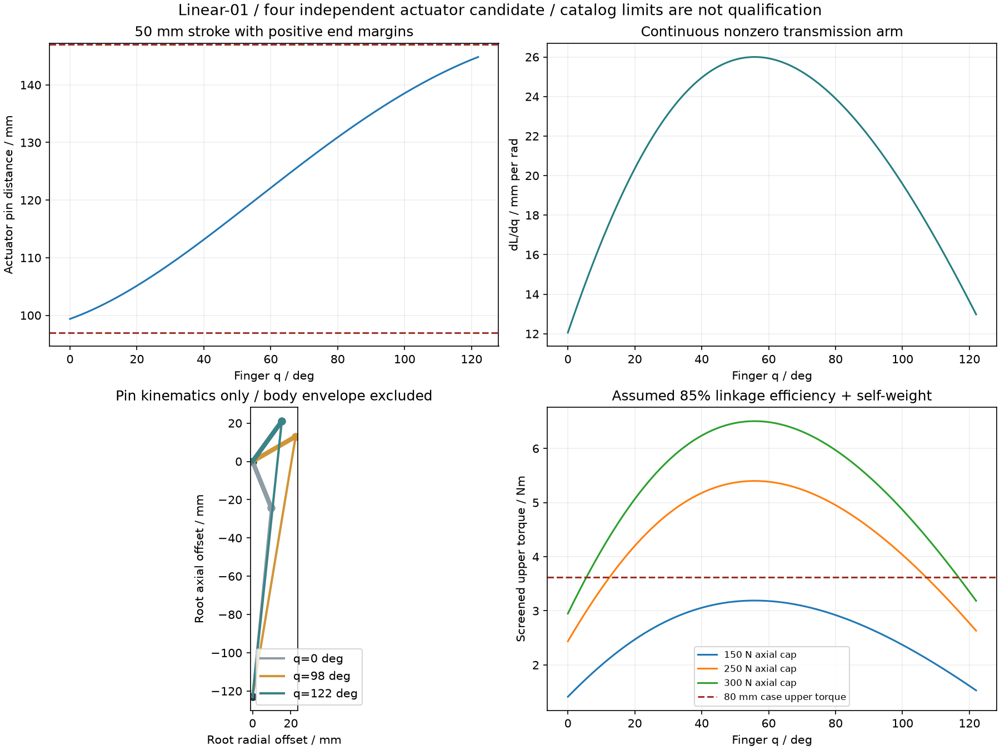

# 四路直线驱动候选 LINEAR-01

**计算与包装候选，尚未选定。** SUPPORT-02 的四套直角驱动及原创支承已约 2.687 kg，整头预算超过最早的 2 kg 假设。这里评估用四个微型直线执行器分别推动曲柄，保留四指独立开合，减少减速齿轮与电机支承的质量。

候选为 **Actuonix P16-50-256-12-P**：12 V、50 mm 行程、97 mm 闭合销距、单件 95 g、目录最大推力 300 N、最大静载 500 N。四件执行器合计 380 g；未计框架、指轴、销轴、驱动器、线束或其余头部。最大占空比 20%、空载速度 4.8 mm/s 和反复堵转限制是主要代价。P 型有位置反馈，须另配电机驱动及控制；不能按一体伺服接线。[原厂规格 Rev B](https://www.actuonix.com/assets/images/datasheets/ActuonixP16Datasheet.pdf)、[具体型号](https://www.actuonix.com/p16-50-256-12-p)

## 几何及数学关系

[生成器](../../engineering/linear_finger_drive_study.py)读取 [CONTACT-02](distal-contact-study.md) 的真实接触点并计算，不改变主机械参数。结果为 [study.json](../../engineering/generated/linear-drive-study/study.json)。

在每指根轴的径向—轴向平面中，固定销 `A=(0,−D)`，曲柄销 `B=(a cosα,a sinα)`。取 `D=123 mm`、`a=26 mm`、`α=q−68°`。两销轴沿切向，与原指轴平行；根轴位置不移动。上指 q=0…109°、下指 q=0…122°。

- 销距 `L(q)=sqrt(D²+a²+2Da sinα)`。
- 速度关系 `L̇=J(q)q̇`，`J=Da cosα/L`，单位 mm/rad。
- 逆解 `q=asin((L²−D²−a²)/(2Da))+68°`，仅用于本单调分支。
- 理想力矩 `τ=F J/1000`；力矩与力应统一符号，实际选型另计损失、自重和摩擦。
- `J′=−Da sinα/L−(Da cosα)²/L³`，故 `L̈=Jq̈+J′q̇²`。

完整角域 α=−68…54°，cosα 恒正，行程严格单调且无曲柄死点。销距范围 **99.3717…144.8429 mm**，相对 97…147 mm 的标称行程两端分别留 **2.3717／2.1571 mm**。连续传动臂最小 **12.0557 mm/rad**、最大 26 mm/rad。上／下全闭合需分别伸出 42.0537／45.4712 mm（相对开态）。这些是销中心数学关系，不证明整个电机壳、连接叉或线束可装入。

正逆解误差 <1.4×10⁻¹⁵ rad；一、二阶导数与中心差分误差分别 <1.8×10⁻⁹、8.3×10⁻¹⁰ mm/rad、mm/rad²。解析端点及唯一内部极值决定连续界，网格用于图示与回归。

## 夹持筛选

沿用 CONTACT-02 的 2 kg 工件、2 倍竖向重力、八个接触点及四个共享力矩限制。另假设曲柄传动效率 85%，上片移动质量 0.15 kg／质心臂 85 mm、下片 0.10 kg／60 mm，逐轴扣除最大不利重力矩。这些质量与效率是灵敏度输入，尚非称重或实测。

Ø80、μ=0.4 条件下，最小总夹力的一组可行解中，上／下执行器需约 **218.8／123.1 N**，250 N 计算限制可行，150 N 不可行。μ=0.3 时，上指需求约 **296.0 N**，几乎耗尽 300 N 目录最大值，不能据此发布。μ=0.6 时约为 142.2／76.3 N，但摩擦未实测，不采用该值作为承载承诺。这些力是各目标下的示例可行分配，不是最低驱动力的证明；[双垫分担复核](paired-pad-loadsharing.md)说明固定法向分担可能改变所需上限。详细文件逐项列出十个直径与有限高度案例。

最大静载或回驱阻力不等于安全制动器，也不保证软垫在保持时不蠕变。须在接触后停止推进、限制电流并验证夹持衰减，不能持续堵转维持夹紧。力传感、异常退出和断电保持仍需单指台架验证。

## 灵动感、速度与节拍

仅按标称空载最大速度，不计加减速，全开到全闭合已需至少 **上指 8.76 s／下指 9.47 s**；带载会更慢。它适合低速验证，但明显限制快速张合。若希望快速全幅“注意力”动作，应继续比较其他传动，不能在渲染里用更快动画掩盖这一差距。

小幅机械呼吸仍可研究：例如 3°↔8° 往返总行程约 2.559 mm，空载最短通电运动时间约 0.533 s。20% 占空比下，循环周期至少 2.666 s 的计算只是必要条件；减速、摩擦、实际速度和厂商规定的占空比时间窗都需复核。不能直接宣称持续 3 s 呼吸已获热验证。灯光呼吸、J7 旋转与小幅指运动应共同设计。

反馈重复性与机械回差不能混作绝对角精度。将 ±0.3 mm 销距误差通过逆解传播的逐姿态结果已列入 JSON；实际还需加电位计线性度、ADC、装配间隙与柔顺变形。原厂反馈重复性使用其 P+LAC 条件，换用自己的 EtherCAT 执行板须重新测量。

## 下一步装配与电气

先使用原厂公开 STEP 核对四个壳体、销连接、根轴双支承及全角域碰撞，再形成自有可加工支架。供应商模型仅保存在工作参考目录，不随本仓库重新许可。[原厂 CAD 下载入口](https://www.actuonix.com/datasheets)

若采用此方案，头部改为四路 12 V H 桥和四路反馈采样，仍由 EtherCAT 连接外部主控制器。必须重新选择电源、保护、驱动和反馈接口；现有“7 本体＋4 指伺服＋1 头 IO”主架构暂不改动。当前四路 1 A 堵转电流只提供电源故障情景的起点，不是正常耗电或允许持续功耗。快拆、线束、重心、热和最终整头质量尚待合并。
