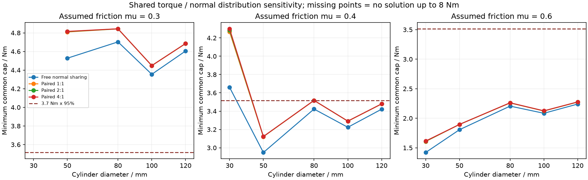

# 同指双软垫的受力分担与最低共同力矩上限

**PAD-LOADSHARING-01：条件静力敏感性，修正驱动力矩的推论。** 同一刚性指片只有一个开合轴，不能把两块软垫的法向力当作两个可独立控制的输出。原八点LP正确地共享四个轴力矩限制，但各点法向力仍可自由分配；这只证明存在静力平衡，不证明软垫刚度和控制器能实现该分配。

## 目标函数与修正

原求解器先最小化总法向力，再在这些最优解内减小最高轴力矩。Ø80、μ=0.4、每轴限制3.7 N·m时，得到上／下约3.621／1.928 N·m的一组解。**不能因为该示例上轴是3.621，就推断所有更低驱动力矩都不可行。** 稍微增加总夹力或重新分配接触力，可能降低所需的最大轴力矩。

本次直接对共同力矩上限做24次二分，每次重新求解完整的八点／四轴LP。约束还可追加 `N[a]=k·N[b]`，其中a、b是同一指片的两块垫，k是指定的法向分担比。这不是八个独立驱动，也不是软垫的实测本构关系。

| Ø80、μ=0.4 | 数值可行阈值 / N·m | 3.515 N·m上限是否有解 |
|---|---:|---|
| 每点法向力自由分配 | 3.423045 | 有 |
| 每指双垫1:1 | 3.517351 | 无 |
| 每指双垫2:1或1:2 | 3.517352 | 无 |
| 每指双垫4:1或1:4 | 3.517354 | 无 |

这些是具有求解容差的数值区间上端，不是解析极限；末位差异不能当作实际设计余量。固定分担比的几个阈值十分接近，不代表任意法向刚度或任意物体偏心都不敏感。

“3.7 N·m减速器×95%传动效率=3.515 N·m”在自由分配模型下有解，在以上固定分担模型下已略低于阈值。这个差只有约0.00235 N·m，远小于未确认的效率、自重、摩擦和制造变化，不能据此发布，也不能依据原3.621示例单独判为绝对不可行。85%／90%对应3.145／3.33 N·m，在本Ø80场景的自由分配模型下均无解。

## 尺寸和摩擦范围

共检查 Ø30／50／80／100／120、μ=0.3／0.4／0.6，以及自由、1:4、1:2、1:1、2:1、4:1分担，共90种组合。Ø30、μ=0.3的六种分担在8 N·m以内仍无解；不能外推为无限力矩也无解。对于Ø30、μ=0.4，自由分配和固定分担的差异更明显，表明早期“不打架、能碰到”的几何条件远不足以证明稳定抓取。

模型仍使用2 kg工件×2竖向重力、指定COM、每垫至少1 N、16边内接摩擦锥。没有接触压强上限、材料破坏或保持件强度约束，也没有主动力控制的可达性模型。下一步需要实际软垫刚度／摩擦、夹持衰减和电机电流—输出力关系；视觉检查不能替代这些量。

## 实现和回归

[solve_grasp](../../engineering/grasp_screening.py)新增可选 `normal_ratio_constraints=[(a,b,k), ...]`。不传此参数时保留原求解目标和约束。二阶段优化也保留这些附加等式，避免只在第一阶段施加约束后又放开。

[研究脚本](../../engineering/paired_pad_loadsharing.py)记录各可行上端的完整力分配及残差，见[结果JSON](../../engineering/generated/pad-loadsharing/study.json)。2:1与1:2镜像阈值差为0；默认接口复算此前已提交的长圆柱案例，法向力总和差为0、可行状态一致。原“四点拆成八点但共享四轴”的回归继续通过，小力矩上限仍被拒绝。

复现：`python3 engineering/paired_pad_loadsharing.py`。此研究不修改几何、关节限制或主BOM，源代码及原创图按仓库CC-BY-NC-4.0使用。
