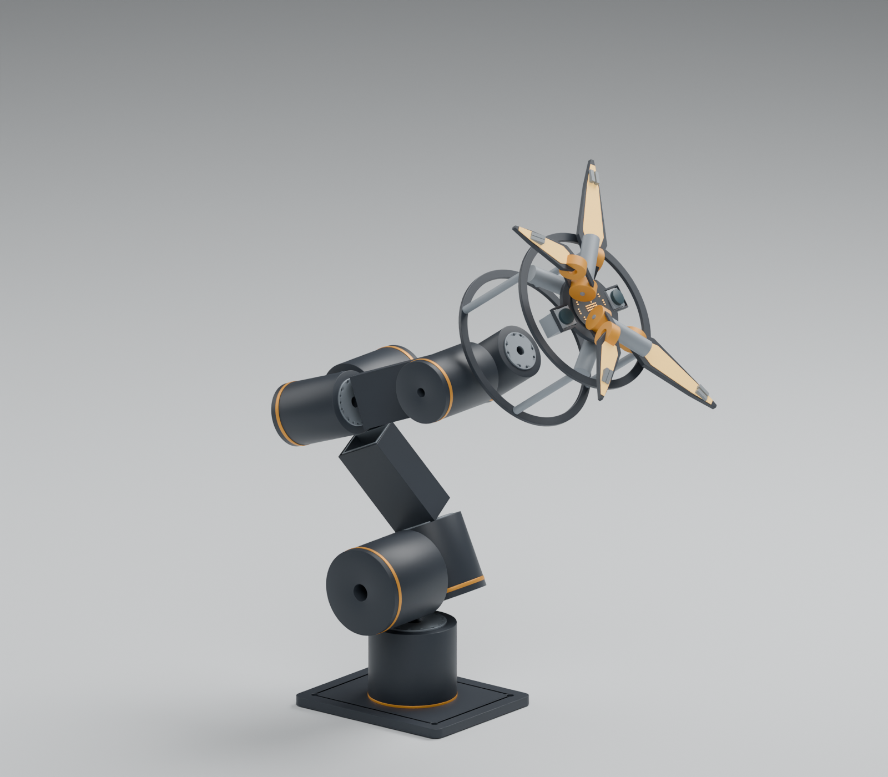
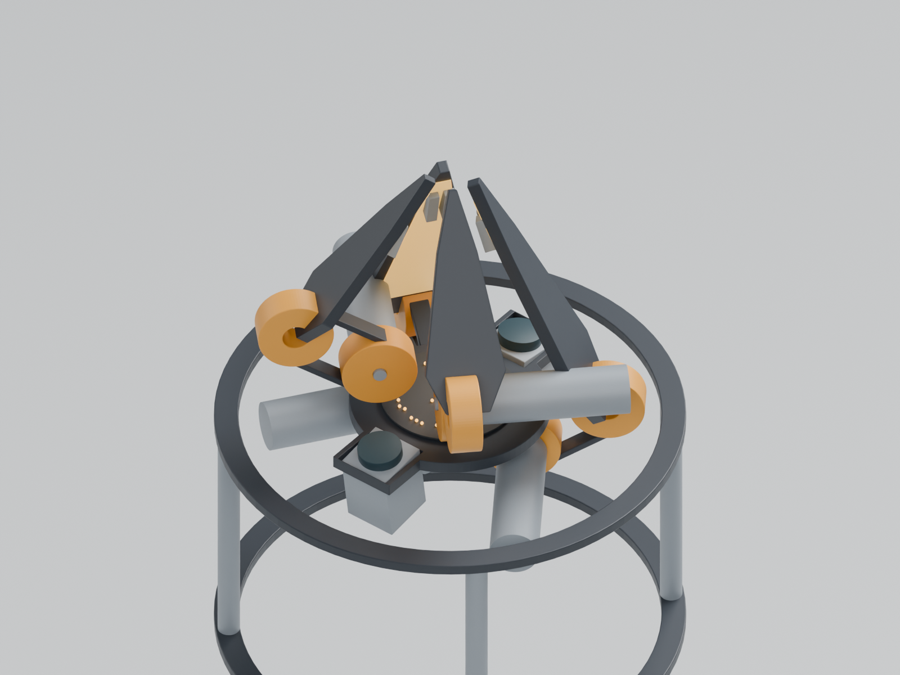
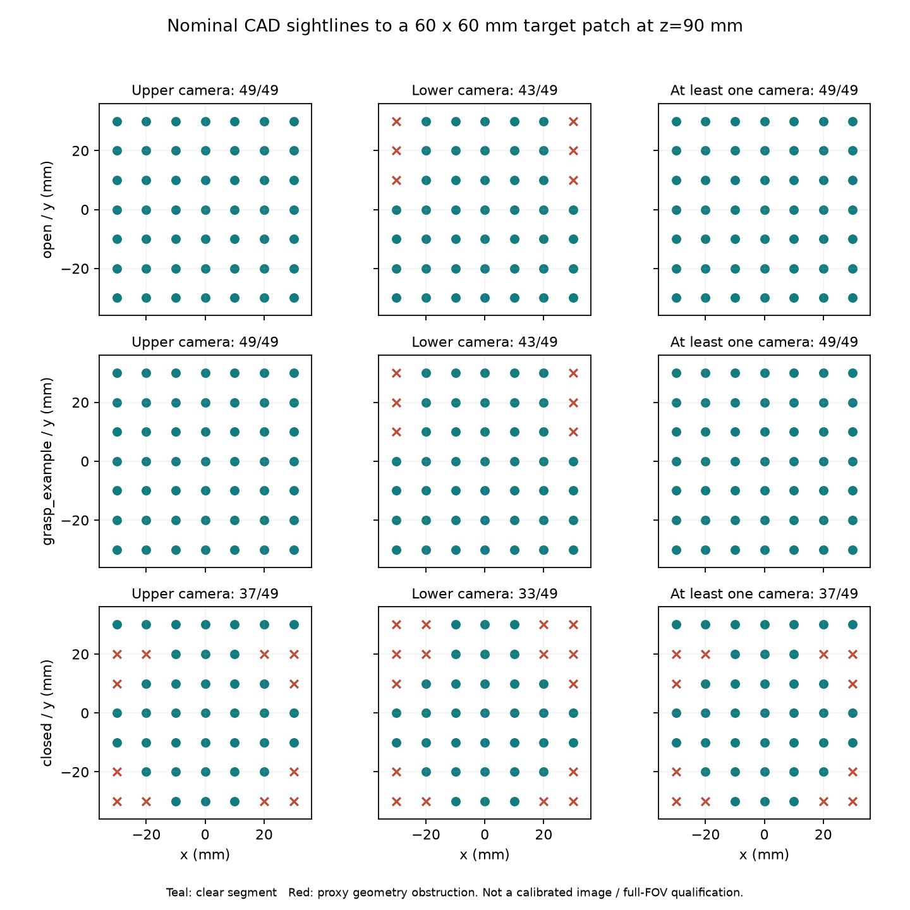

# R4 参数化布局、闭合与抓取

当前参数：`R4-layout-03`。本轮保留七轴本体、可拆四指末端、上长下短和左右镜像，已建立同源 STEP、Blender、尺寸审查图、运动学和负载计算。**这些是可复算的工程研究与几何打印件；整机承力连接、真实驱动组合、线束动态路径和制造放行尚未完成。**

## 直接查看

- [可编辑 Blender 装配与开合动画](../../engineering/generated/layout/odradek-r4-layout.blend)：7 个本体轴、4 个独立指轴，长度单位按米存储，以毫米显示。
- [STEP 装配布局](../../engineering/generated/layout/odradek-layout.step)：74 组原创解析实体，包括关节和驱动占位；不是原厂完整总成或生产零件。
- [两页 A3 装配审查 PDF](../../engineering/generated/layout/ODR-R4-assembly-review.pdf)及[毫米制 DXF](../../engineering/generated/layout/ODR-R4-assembly-review.dxf)：正交视图、轴坐标和关键布局尺寸。
- [四种关节接口试装片](interface-coupon-guide.md)：实际孔阵坐标，可先打印验证孔位。
- [单指手动几何台架](../../engineering/generated/finger-fixture/README.md)：四个打印件、尺寸图、装配件与限位检查，不装电机、不承受 2 kg。

图中的后部框架、轴承和带轮区域暴露空间需求，尚不是外观定版。标准关节的直径和轴长没有为了细长风格被缩小；本体主梁改为闭口矩形候选，外侧装甲不计入主要承力路径。

**已知布局问题：** `BASE_layout` 是旧占位板，名义 z0–12 mm 区域与 J1 后壳占用冲突，不能直接加工装配；[真实安装接口研究](mount-interface-study.md)已给出需让后壳穿过的后环与前压环。带轮模型也尚未加入完整双轴承支承和联轴器。当前总装用于传达尺寸与坐标，不代表这些连接已经成立。

## 同一坐标源

所有配置来自 [r4-layout.json](../../engineering/parameters/r4-layout.json)。CAD 用 mm，数学核心用 m、kg、s、rad。关节位置是零姿态下输出接触平面中心，方向是空间转轴；这些几何坐标不能直接当编码器电气零位。

| 项目 | 当前数值 | 性质 |
|---|---:|---|
| 净工件 / 整头预算 | 2.0 / 2.0 kg | 工作假设，头质量检查 1.8–2.2 kg |
| 肩 J2 到名义 TCP 的零姿态距离 | 722.10 mm | 当前参数计算；约 700 mm 的工作假设，不是可达球半径 |
| 7 个关节目录质量合计 | 12.32 kg | 不含结构、线束、底座和头 |
| 模型总质量，含固定 J1 与工件 | 19.17 kg | 质量预算，不是实物称重 |
| 头安装面 / 前脸 / TCP 的 Z | 650 / 780 / 890 mm | TCP 为当前名义接触中心，前脸前方 110 mm |
| 整头 COM 预算 | (0, 55, 760) mm | 因驱动前移而修订；不是实测，另检查偏心敏感性 |
| 裸四驱动包络 | Ø175.035 × 109 mm | 未含全部支承、轮毂、张紧和接线 |
| 当前固定头架与驱动预留外包 | Ø210 × 197 mm | 从后安装面到最前驱动占位；不含展开手指 |

本体 J1/J2 使用 RH25 B、J3/J4 使用 RH20 B、J5/J6 使用 RH17 B、J7 使用 RH14 N 的目录包络。此分配仍需零速热、实际惯量、组合轴承载荷与制动条件核验，见[关节候选](hardware/joint-candidates.md)。有限转角只是研究区间，不能当线束允许范围。

## 闭合的几何修改

前脸局部 `+z` 指向工件。四指 φ 为 35°、145°、225°、315°，根半径 70 mm；上长 140、下长 100 mm。上根 z=0、下根 z=+50 mm。零宽直杆的共同片尖深度给出差值 `sqrt(140²−70²)−sqrt(100²−70²)=49.829 mm`，因此用 50 mm 作为实际错层的起点；实体不能按零宽公式直接宣布闭合。

实体检查推动了三处变化：下根由后移改成前移；片的后半段与片尖收窄；接触垫移近片中心线并采用定角楔面。同步带经过前盖的区域做了明确避让槽。正面上大下小的轮廓保留，但侧面厚度确实增加。

当前闭合研究区间为上指 0–114°、下指 0–126°。灯面在向前卷合时转向内侧；结构框与凸出的软垫先接触物体，LED 窗口不承载。所谓空载全闭合是带间隙的机械终点，不是密封壳，也不是四个片尖必须压在一个点上。

[解析证书](analysis/petal-separation-certificate.json)对 16 个平面实体的 192 个顶点，分别求坐标 `A+B cos(q)+C sin(q)` 在整个角度区间内的极值。各片保持在相应象限的分离半空间，因此所有四个角度的独立组合均满足片与片避让；六对中最小的统一分离轴下界为 **4.7862 mm**。这是名义刚体几何结论，未扣制造误差、背隙、弹性或限位误差，也未包括驱动、支承和线束。

[实体采样检查](analysis/layout-collision-samples.json)另外检查了 25 个同步闭合姿态对相机/掌面、三个本体姿态的关节圆柱包络，以及静态驱动对相机/前盖。本轮所列检查无实体交叠。布尔检查逐个实体执行；这些离散点不证明完整机构的连续无碰撞。独立审查见[证书审查](petal-certificate-review.md)。

## 有效抓取需要专门的接触面

原平垫在本轮 `2 kg × 2`、μ=0.4 的沿头部 −z 重力工况下，不能满足所设 3.7 N·m 指根上限。原因包括夹紧法向的轴向分量及实际接触力臂；本例四个名义接触中心共面。仅证明灯片能转到某个角度不能证明它能抓住工件。

现在给出一个明确的任务接触示例：名义径向接触半径 40 mm、接触中心 z=110 mm、垫面中心距片基准 h=11 mm。每片的实际接触沿长位置由 `s²+h²=(110−zroot)²+(70−40)²` 得到。

| 参数 | 上片 | 下片 |
|---|---:|---:|
| 接触沿长位置 s | 113.485682 mm | 66.174013 mm |
| 对应指角 q | 99.718818° | 107.127163° |
| 楔面相对板法线补偿 | 9.718818° | 17.127163° |
| μ=0.4，每指法向力 | 27.07285 N | 21.96040 N |
| μ=0.4，每指静力广义力矩 | 2.65314 N·m | 1.05410 N·m |
| μ=0.3，每指静力广义力矩 | 3.64581 N·m | 1.49331 N·m |

上述力已经包含载荷系数 2，没有再重复乘系数。楔面在各自目标角的实际 CAD 法向为径向向内；其他物体尺寸对应角度不同，不能继续假定法向仍径向。数学模型把每指双垫等效为一个名义点；实际双垫横向偏置、物体曲率、软垫压缩和接触面积需要另行验证。“80 mm”指此名义接触尺度，不是已验证能抓所有直径 80 mm 的物体。

[抓取 LP](../../engineering/grasp_screening.py)包含六维力/力矩平衡、单边法向、16 射线内接摩擦锥、每点至少 2 N 预载和指根力矩限制；先最小化总法向，再在同一法向最优值下最小化峰值指力矩。72 个限定场景中 54 个可行、18 个不可行，见[结果](analysis/grasp-screening.json)及[独立审查](grasp-screening-review.md)。可行只是相应接触模型下的解，不是全物体力闭合或实测负载。

力矩尚未计入指片自重、加速度、摩擦和外传动损失；3.7 N·m 是齿轮箱目录上限，不是已验证的整机零速保持能力。μ=0.3 的上指余量很小。软垫摩擦、持续温升、失电保持和实际任务物体仍是必须关闭的项。

## 相机关注区域

上下相机保持左右对称，外倾暂取各 8°，仍是布置假设。[光线段检查](analysis/optical-sightline-screen.json)用实际 CAD 面测试前脸前方 z=90 mm、60×60 mm 目标区域的 49 个点；镜头入瞳位置是明确的几何假设，并非标定数据。

展开和当前抓取示例中，上相机到 49 点均未被当前 CAD 遮挡，下相机为 43 点，至少一相机可见 49 点、共同可见 43 点。空载闭合时相应数量下降。这没有模拟鱼眼投影、真实物体遮挡、缺失支承/线束或光照；不能把点数写成实测视场覆盖率。

## 制造推进顺序

先用接口片验证真实关节孔位与接头装配，用单指台架检查楔面/转角和手动限位。随后完成金属关节适配、指根与输入轴的独立双支承、张紧与紧固，再做线束动态路径和完整公差链。打印验证件的材料/层向不能被自动替换成金属件的强度结论。

整机仍缺完整可制造承力连接和受载验证。具体证据与开放项分别在[静力审查](arm-screening-review.md)、[梁截面筛选](structure-screening.md)、[线束架构](harness-and-connectors.md)和[发布清单](release-checklist.md)中持续维护。
