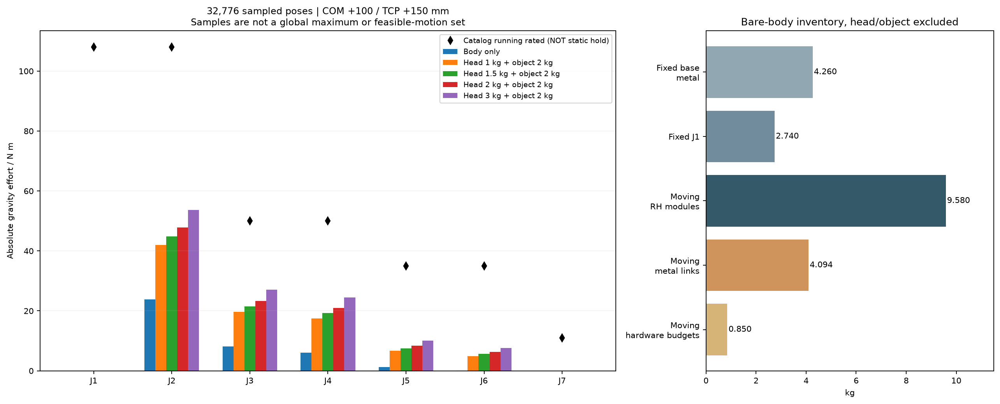
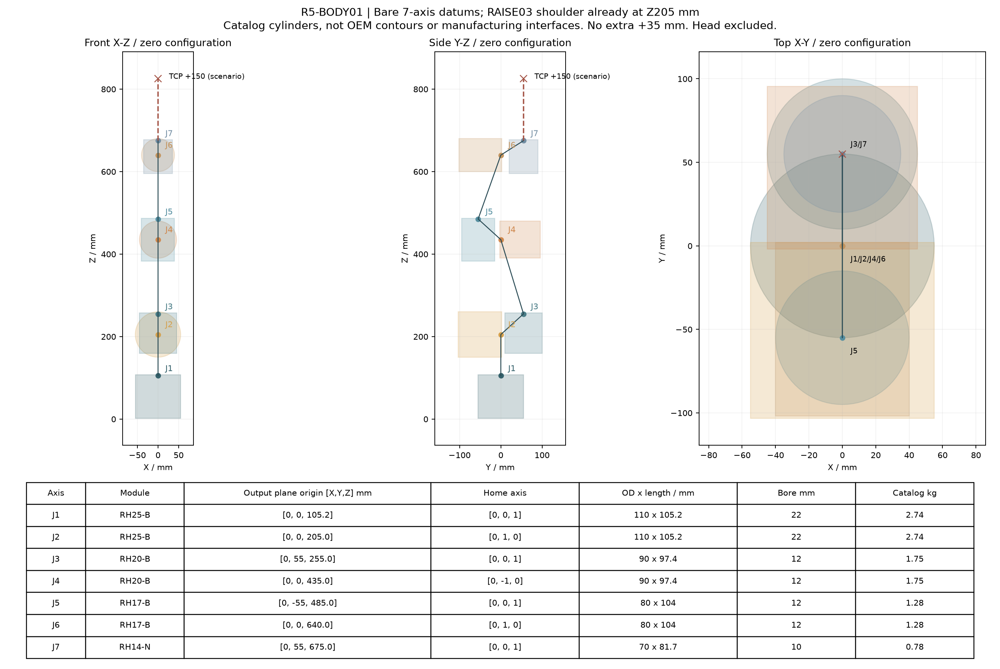
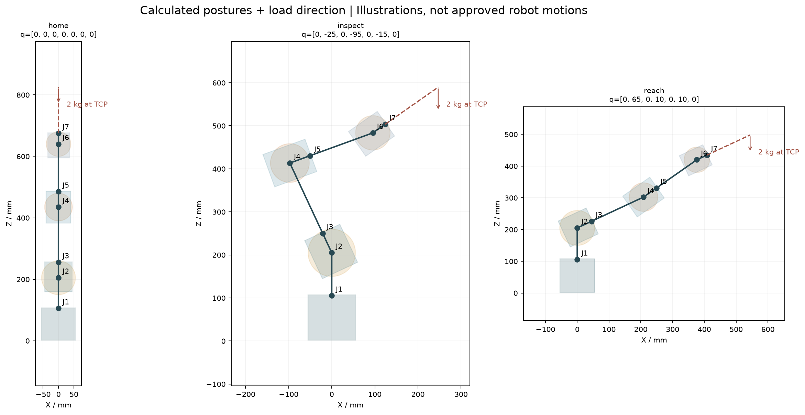

# R5-BODY01 — 七轴本体与末端分开核算

SPDX-License-Identifier: CC-BY-NC-4.0  
Attribution: Odradek — Auromix contributors (https://github.com/Auromix/odradek)

**当前本体本身偏重，并非仅由旧 P16 末端造成。** 按已建结构和目录关节质量，运动本体规划质量为 **14.524 kg**，固定底座原创金属加 J1 模块为 **7.000 kg**。移除旧头后，J2 肩轴仍有约 23.79 N·m 的样本最大重力矩。减轻头部能明显降低肩、肘、腕负担，但不会自动把这套 RH 本体变成轻巧的细长臂。

本轮保留真实七轴原点、SHOULDER-RAISE03 和六段连接件，不修改原 CAD 或关节选型。2 kg 为已确认工件净重，头重另外计算；1.0/1.5/2.0/3.0 kg 都是参数场景，不表示新联动头已经实现相应质量。约 700 mm 的目标需要明确量到**裸法兰还是新 TCP**：当前裸法兰零位距肩轴只有 473.207 mm，不能借旧头的长度继续称作 700 mm 本体。

## 1. 质量替换与坐标基准

读取 `raised-arm-integration01/model.json`：J2 已在世界 Z=205 mm，J7 裸输出安装接触面原点为 **[0,55,675] mm**，正向为该轴的局部 +Z。这个输入已经包含一次 +35 mm 抬肩；本轮 **额外平移为 0**。

| 替换项 | 处理 |
|---|---|
| 旧 RAISE01 L12 三个金属体＋`L12_hardware_reserve` | 四体整组移除，共 0.871453 kg |
| RAISE03 `planning_models.primary_preserve_200g_total.bodies` | 插入 11 个金属体＋1 个 0.20 kg 总硬件规划体，共 1.427752 kg，全部 `preceding_joints=1` |
| 已知 12 颗螺钉 0.1276 kg | 已包含在 0.20 kg 总硬件账内，**不再相加**；未分配 0.0724 kg 不是保证上界 |
| 旧 `head_bodies` | 13 体、2.802491 kg 整组排除，包括旧头部接口及驱动；不把这些质量暗留在新头预算之外 |
| 旧 `net_object` | 移除，新的各载荷场景仅加入一次 2 kg 工件 |
| 旧工具点 | 不继承旧世界 Z=949 mm 的 TCP；改用裸 J7 输出面＋明确的新工具偏移 |

依据：[RAISE03 质量与替换契约](shoulder-raise03.md)、[原始质量文件](../../engineering/generated/shoulder-raise03/mass-properties.json)。生成的 [body-only-model.json](../../engineering/generated/r5-body01/body-only-model.json) 有 45 个质量体，没有头和工件；每体的 COM、惯量与依附关节均保留。静力计算按相同依附序号聚合 COM 与质量，已与全部 45 体逐项计算交叉核对；该聚合仅用于重力，不代替完整动力学惯量。

## 2. 本体质量已经有多大

| 质量类别 | kg | 已知边界 |
|---|---:|---|
| 固定底座原创金属，8 个实例 | 4.259646 | 名义 CAD 体积×铝密度；不含底座紧固件、桌面、线材 |
| J1 整模块，当前模型归固定侧 | 2.740000 | 厂商目录质量；内部转子/输出件未分拆 |
| **固定侧已计小计** | **6.999646** | 不是含所有硬件的称量结果 |
| J2–J7 模块 | 9.580000 | 目录质量，COM 用外形中心代理 |
| 六段运动连接原创金属 | 4.094288 | 真实名义 CAD 积分；L12 已换 RAISE03 |
| 运动连接总硬件预算 | 0.850000 | 未全部称量，不是保证上限 |
| **运动本体规划小计** | **14.524288** | 不含头、工件、未计线束与外罩 |
| **本体＋固定底座已计规划合计** | **21.523934** | 加 1.5 kg 头和 2 kg 工件即 25.023934 kg，仍缺上述未计项 |

“固定/运动”遵循已有模型的**整模块归上游壳体**策略：例如 J1 的内部转子实际会转，当前没有其真实质量拆分，不能把本表当作精确运动件实重或转动惯量清单。J1 整模块归固定侧对该静力模型有明确含义，对 J1 加速矩则仍需要转子分配。

运动本体中 RH 模块占 **65.96%**。L12/L23/L34/L45/L56/L67 的原创金属质量分别为 **1.227752 / 0.398809 / 1.054991 / 0.352707 / 0.811973 / 0.248056 kg**。详见 [逐体质量账](../../engineering/generated/r5-body01/body-mass-ledger.csv) 与 [连接件分组账](../../engineering/generated/r5-body01/link-mass-groups.csv)。底座保持桌面锚固要求，不能因为计入固定质量就声称可自由站立。



## 3. 真正的轴位置与臂展

下图由计算采用的七个原点、轴向、原厂目录外径/轴长自动生成。圆柱是**目录尺寸示意**，用来保持真实比例与轴方向，不是原厂精细壳体或加工接口；连接线只表示运动链，不是新增承力梁。用户的 `12-r5-arm-body.png` 是风格参考，不用于替代这些坐标。



所有偏移沿零位裸法兰 +Z。头 COM 扫描 50/100/150 mm；工件 COM 暂与新 TCP 重合，TCP 扫描 100/150/200 mm。它们是独立输入，不暗设“头 COM=TCP/2”。新头质量必须包含裸法兰之后的转接、驱动、外壳、相机和灯片；已删除的旧延长件不得额外叠回。

| 裸法兰至 TCP 轴向偏移 | 零位肩到该点 | 32,776 个配置中最远 | 局部优化最好值 | 全配置折线路径长度上界 |
|---:|---:|---:|---:|---:|
| **0 mm：裸法兰** | **473.207 mm** | 510.960 mm | 513.405 mm | 566.537 mm |
| 100 mm | 572.647 mm | 605.421 mm | 607.026 mm | 666.537 mm |
| 150 mm | 622.435 mm | 653.270 mm | 654.962 mm | 716.537 mm |
| 200 mm | 672.254 mm | 701.419 mm | 703.336 mm | 766.537 mm |
| 250 mm，额外臂展对照 | 722.098 mm | 749.810 mm | 752.025 mm | 816.537 mm |

采样/优化结果是找到的数学配置，**不是已排除碰撞、桌面、插头和线束限制的可用工作空间**，也不是已证明的全局最远点。折线上界是沿 J2→…→J7→TCP 各段长度相加，通常偏松。TCP+100 mm 的上界已小于 700 mm，能排除该模型达到肩距 700；TCP+150 mm 虽然没找到 700 mm，但上界仍大于 700，不能仅凭局部最优声称绝不可能。TCP+200 mm 已找到超过 700 mm 的数学配置，需随后逐实体检查。

若要求**零位**肩到 TCP 恰为 700 mm，则本轴布置需要轴向伸出约 **227.836 mm**；若 700 mm 指裸法兰，本体必须重设连杆长度，沿链增加至少 133.463 mm 只是由上界得到的必要条件，未证明足够。旧头 TCP Z949 对应肩距 **746.030 mm**，本轮明确不沿用该数值描述新头臂展。



图中的 home/inspect/reach 名称是历史计算姿态标签；图只展示实际变换和载荷方向，不作为运动指令或无碰撞认证。

## 4. 静态比较：头影响明显，但本体重量仍重要

以 `τg = −Σ Jvᵀ m g` 计算；只考虑重力，未加加速、摩擦、线束或接触外力。32,768 个确定性 Sobol 点＋8 个具名配置覆盖既有数学角度箱；J1 绕竖直轴、J7 对轴线上载荷的对称性减少两个采样维度，另做数值验证。没有筛除碰撞配置，故本结果用于载荷筛查，不代表可执行轨迹。

下表固定头 COM 在法兰前 100 mm、工件 TCP 在前 150 mm，便于比较。数字为**样本最大绝对重力矩**，各列最大值不一定来自同一姿态。

| 场景 | J2 | J3 | J4 | J5 | J6 | J7 驱动轴 |
|---|---:|---:|---:|---:|---:|---:|
| 本体，无头无工件 | 23.790 | 8.111 | 6.081 | 1.213 | 0.028 | 0 |
| 本体＋2 kg 工件，头重记 0 以隔离贡献 | 36.204 | 16.033 | 13.970 | 4.926 | 3.601 | 0 |
| ＋1.0 kg 参数头＋2 kg 工件 | 41.981 | 19.677 | 17.462 | 6.628 | 4.925 | 0 |
| **＋1.5 kg 参数头＋2 kg 工件** | **44.885** | **21.499** | **19.208** | **7.480** | **5.587** | **0** |
| ＋2.0 kg 参数头＋2 kg 工件 | 47.789 | 23.328 | 20.955 | 8.333 | 6.249 | 0 |
| ＋3.0 kg 历史重头对照＋2 kg 工件 | 53.598 | 27.002 | 24.447 | 10.038 | 7.572 | 0 |

单位 N·m。3 kg 是同一 COM 参数下的历史重量对照，不是把旧 P16 全部真实姿态复刻成一个质点的测量结论。3 kg 例的 J2 最不利样本中，本体/头/工件同向贡献约 **23.658 / 17.426 / 12.514 N·m**；旧重头占约 32.5%，本体约 44.1%。把头降到 1.5 kg，此基准 J2 样本最大下降约 16.3%，J6 下降约 26.2%；不能由此推断本体已经轻量化。

对四个主要场景又用两个采样种子、正负目标做局部优化。1.5 kg 基准的 J2/J3/J4/J5/J6 最好值为 **45.402 / 22.156 / 19.244 / 7.489 / 5.587 N·m**；这些比采样略大，仍不是全局最大。完整配置和收敛结果保存在 [study.json](../../engineering/generated/r5-body01/study.json)。

同时给出可证明的**所述质点模型全配置三角不等式上界**，以及原厂运行额定/峰值作为分开的参考：

| 轴 | 现选 RH | 本体上界 | 1.5 kg 头基准上界 | 3 kg 头基准上界 | 原厂运行额定 / 目录峰值 |
|---|---|---:|---:|---:|---:|
| J1 | RH25-B | 0 | 0 | 0 | 108 / 157 |
| J2 | RH25-B | 28.699 | 52.557 | 62.362 | 108 / 157 |
| J3 | RH20-B | 21.726 | 43.033 | 51.744 | 50 / 80 |
| J4 | RH20-B | 8.191 | 23.038 | 28.981 | 50 / 80 |
| J5 | RH17-B | 4.934 | 17.230 | 22.079 | 35 / 54 |
| J6 | RH17-B | 0.520 | 7.171 | 9.601 | 35 / 54 |
| J7 | RH14-N | 0 | 0 | 0 | 11 / 28 |

三角上界超出额定不等于已经发现真实超载，因为上界可能偏松；采样小于额定也不能证明全部配置通过。RH 运行额定对应原厂 **24°C、25 rpm、温升 60°C 热平衡**等条件，不能替代零速持续保持。原厂短时堵转表与目录峰值存在不同定义，本轮不把更高短时值挪作持续能力。精确型号、制动和热条件见 [RH 运行证据](rh-operation-evidence.md) 与[原厂手册包](https://www.myactuator.com/_files/archives/cab28a_be98b58973d34f7aaa50bdf3f2aa12ed.zip)。

所有 36 个头质量/COM/TCP 组合及 4 个隔离场景见 [scenario-summary.csv](../../engineering/generated/r5-body01/scenario-summary.csv)。其中最重/最远组合（3 kg、COM150、TCP200）的 J2/J3/J4/J5/J6 样本值为 55.934/29.414/26.801/11.990/10.024 N·m；仍是数学样本，不是全域最大。

## 5. 不能被零重力矩掩盖的载荷

J1 的轴竖直，故该重力模型的绕轴驱动矩恒为零；J1 仍承受轴向力、倾覆弯矩、偏心载荷和加速惯量。RAISE03 比旧 L12 增加约 **0.556299 kg**，但它全属 J1 之后、J2 之前，所以本轮验证 J2–J7 重力矩没有变化，J1 的重力驱动矩也仍为零。这不意味着加重肩架没有代价：桌面锚固、J1 轴承、J1 动态转矩和搬运质量都会受影响。

J7 的头/工件 COM 都沿其轴线，本轮轴向场景使驱动轴重力矩为零；其输出轴承倾覆矩却不为零。在 1.5 kg 头 COM100＋2 kg 工件 TCP150 时，轴水平可达到 **4.41299 N·m 弯矩**；3 kg 头同条件为 5.88399 N·m。它们不能与 RH14 的“11 N·m 驱动扭矩”直接比较为轴承通过。

另以 1.5 kg 基准加入工件 COM 在法兰 XY 面内偏心圆盘：半径 50/100 mm 时，J7 可达到的附加驱动重力矩分别为 **0.980665 / 1.961330 N·m**。各固定姿态的最不利偏心方向用解析投影求得，并以显式偏心质量体核对；配置维度仍只采样，不能称整臂全域最坏值。J7 无闸仍是失电保持问题，不能用轴线上例子里的零值取消保持设计。

## 6. 细长与减重的优先级

目前可用证据确定优化顺序，尚没有证据直接放行某一处减薄或更小关节。建议保持承力核心与表皮分层：真实关节 Ø110/90/80/70 mm 和轴长不能靠外壳视觉压缩；细长感可以先来自两段梁的比例、线缆侧舱和少量轮廓线，不把装饰罩变成新的重块。

| 项目 | 已量化的事实 | 下一步可执行方向与边界 |
|---|---|---|
| L12 肩架 | 1.228 kg 金属，后叉单件约 0.720 kg；承力/端口和长螺钉已有真实约束 | 以既有材料、接触和载荷重新做后叉去料/肋板方案；不得切穿钢块支承或已保留的端口通道。它的减重主要改善 J1 与总质量，不降低 J2 自身重力负担 |
| L34/L56 | 金属 1.055/0.812 kg；两根闭口梁只有 0.139/0.113 kg，余下主要是端块与关节载体 | 优先整合端块、叉架与支承界面；单纯再薄化直梁的总质量收益有限。承力接触、螺钉通道与刚度必须重新验证 |
| 桌面底座 | 原创金属 4.260 kg，其中 260 mm 平板和背板共约 3.738 kg | 可研究更轻的夹台/锚固底座，但不减少悬臂关节重力载荷；锚固与桌面接触计算必须重做 |
| J4 一档小模块 | RH20-B→RH17-B 目录差约 0.47 kg；1.5 kg 基准的当前质点上界 23.04 N·m，小于 RH17 的运行额定 35 | 值得做下一轮候选。只是静力优先级，不是替换批准；轴长由 97.4 增到 104 mm，孔阵和定位也变，不能缩放原接口直接装入 |
| J2/J3 一档小模块 | 分别可少约 0.99/0.47 kg；当前基准上界 52.56/43.03 N·m，拟小模块运行额定仅 50/35 | 当前界不能证明余量；需更紧的可行域静力界、加速度、轴承和热实测。J2 自身模块属于其上游，减其自重不会直接降低自己的重力矩 |
| J6 换 RH14-N | 可少约 0.50 kg，当前基准上界 7.17 N·m | 会丢失 B 版抱闸、通孔由 12 降到 10 mm；腕部轴承与内走线仍未闭合，不能仅据 11 N·m 运行额定采用 |
| J1 缩小 | 重力驱动矩零只由轴方向产生 | 先有 yaw 加速度/全臂惯量和轴承倾覆证据，不能以静态零值选小模块 |

目录差值来自当前[关节候选与原厂出处](hardware/joint-candidates.md)，只表示物料尺度差，不表示替换后的真实结构与力矩已重新生成。取消抱闸来追求轻量不作为本轮默认方案。更大幅度减重会涉及关节平台或传动路线变化；其收益与代价应另立候选，不把现有 12.32 kg 七模块配置包装成轻型产品已定稿。

## 7. 复算与检查

```bash
OPENBLAS_NUM_THREADS=1 ../../work/r4-runtime/venv/bin/python engineering/r5_body01.py
```

全部输出只写 `engineering/generated/r5-body01/`。原输入与生成脚本 SHA、40 场景、逐轴样本配置/局部最好配置、上界、质量账和臂展在 [study.json](../../engineering/generated/r5-body01/study.json)；PNG/SVG 为真实计算结果的示意，没有新建装饰 CAD。

独立 Rodrigues 重力矩与 `Arm` 的最大差为 5.33×10⁻¹⁵ N·m；45 体与依附组聚合的差相同；势能差分梯度与重力矩差约 1.09×10⁻⁸ N·m。偏心圆盘最坏方向显式核对、J1/J7 对称性、旧→RAISE03 重力不变性及所有样本低于三角上界均通过。所有图已实际渲染核读。

这些检查说明单位、依附、坐标和重力计算相互一致。它们不替代真实关节 COM/转子分配、全臂无碰撞运动域、线束寿命、动态刚度/疲劳、零速热平衡、制动与制造公差验证。本体和新头继续分开推进，但整机最终负载必须再合并真实新头质量、COM 和工件偏心。
