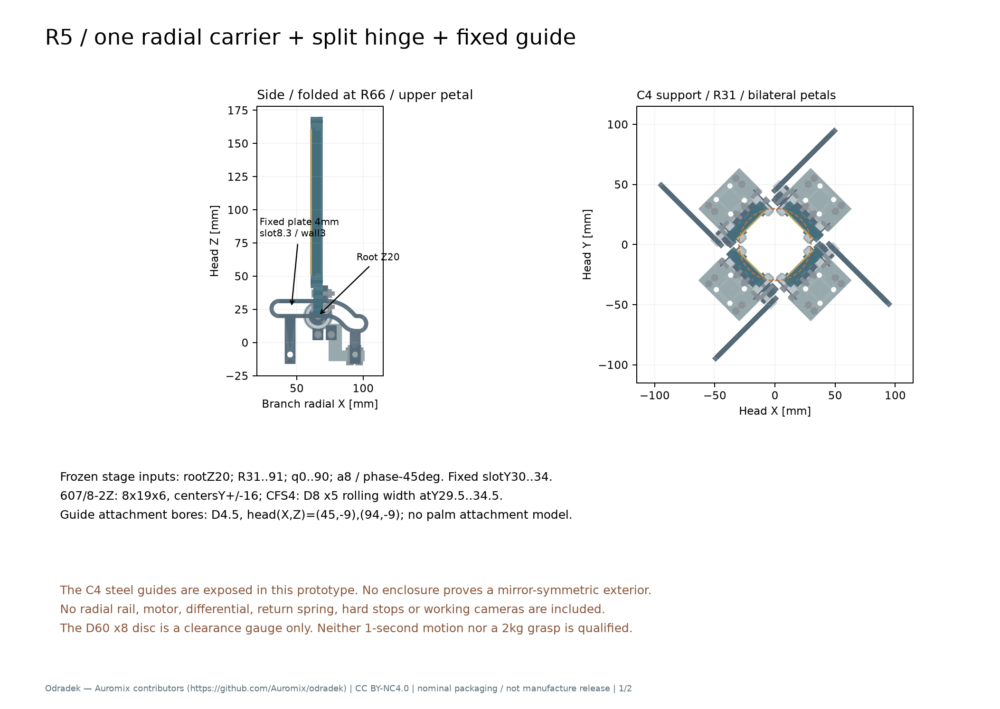
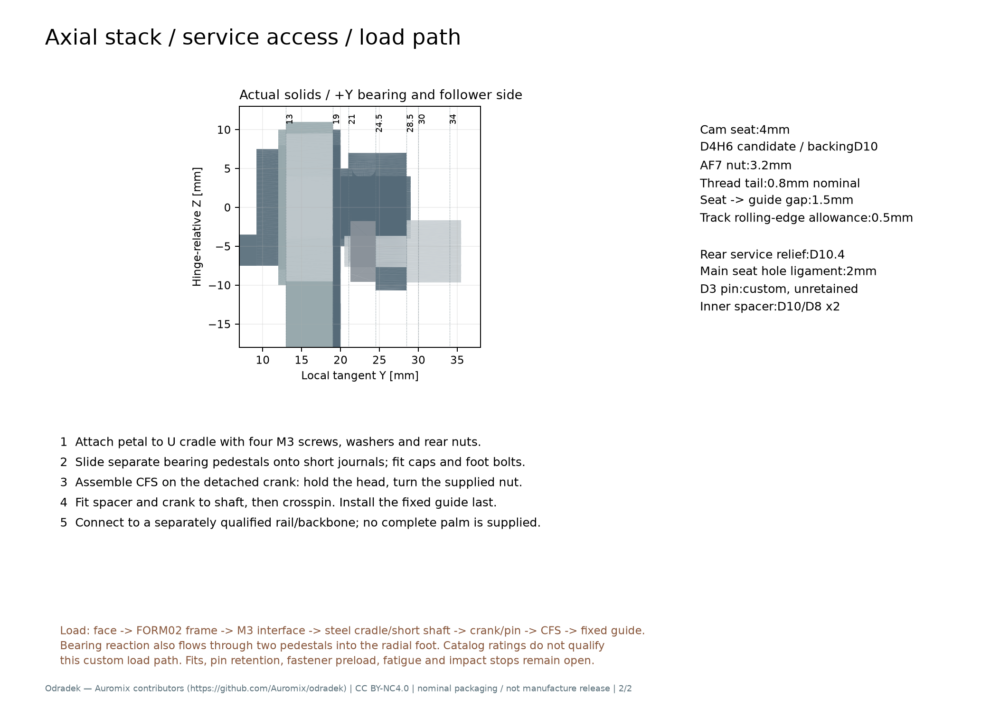

# R5-CARRIER01：单瓣径向载体、分体短轴与固定折叠槽

本轮保留 FORM02 灯片、根轴 Z20、a8 / phase −45°、R31…91 与 q0…90。已建立一套可拆的名义实体子组件，并将同一内部 +Y 手性旋转复制到四象限。原有左右镜像导槽存在实体穿透；C4 内部布置消除了该反例。**这仍是包装与载荷路径候选，不是选定载体或可制造整头。** 导轨、掌体、单电机差动、回程与硬止挡均不在本模型中；没有 1 秒循环或 2 kg 夹持资格结论。

灯片仍是实际左右镜像零件。内部 C4 钢槽目前外露，不具有左右反射对称；没有外壳可证明其被隐藏。脚板向根轴外侧伸出 35 mm，整个径向行程的机械件保守旋转外包直径约 **256.53 mm**，不含灯片展开跨度及未建部件。不能用导槽本身约 219 mm 的包络代替整个机构。



## 1. 来源、坐标与真实接口

复现源为 [r5_carrier01.py](../../engineering/r5_carrier01.py)，输入逐项哈希见 [source-hashes.json](../../engineering/generated/r5-carrier01/source-hashes.json)。读取冻结 FORM02 STEP 和 STAGE01 参数，没有修改旧几何。目录证据与原厂页码沿用 [CAM-HARDWARE01 来源](sources/r5-cam-hardware01.json) 及其 [机械接口 JSON](../../engineering/electronics/r5-cam-hardware01/mechanical-interface.json)。公开 CAD 均是原创件或依据目录绘制的简化包络，没有再分发原厂 BREP。

根铰局部原点在轴线上，+X 径向、+Y 切向、+Z 朝前；FORM02 原始 Z 坐标需先减 3.5 mm。瓣与附件绕 −Y 转 q，然后平移 `[R,0,20]`；整支路再绕头部 Z 旋转 45°、135°、225°、315°。载体仅平移，固定槽已经在头部支路坐标内。内部件不做左右反射。

| 部位 | 本轮实际名义几何 | 未释放条件 |
|---|---|---|
| 根接口 | 原四 Ø3.2，X7/17、Y±4.5；NBK SSHS-M3-16-FT 包络，后垫圈与 M3 螺母 | 预紧、材料、有效牙、公差、锁固 |
| 钢根托 | 背板 X0…23、Y±11.8，局部 Z−7.5…−3.5；两侧圆颊与 Ø8 短轴 | 原创加工/刀具可达、配合、疲劳 |
| 双支承 | SKF **607/8-2Z**，8×19×6，中心 Y±16，跨度 32 | 安装配合、游隙、倾覆刚度、承压 |
| 轴肩/壳肩 | 轴肩 Ø10；壳肩开口 Ø16；轴承壳外径 Ø22 | SKF 要求轴肩 Ø10…11、壳肩开口≤Ø17、圆角≤0.3；本轮并非公差闭合 |
| 内圈定位 | +Y 侧 Ø10/Ø8×2 间隔环接曲柄；−Y 侧 Ø10 端垫与 M3×8 包络 | 横销定位无名义预压；销保持、端螺钉预紧未定 |
| 凸轮滚轮 | IKO **CFS4**：Ø8、滚道宽 5；滚道 Y29.5…34.5，安装肩 Y28.5 | 目录前段按 Ø8×7 保守包络；非受控原厂模型 |
| 滚轮安装 | 4 mm 安装座 Y24.5…28.5；Ø4H6 候选；背托 Ø10≥原厂 7.7；螺母 Y21.3…24.5 | 退刀、螺纹起止、公差、实际工具与扭矩 |
| 固定槽 | Y30…34；槽宽 8.3；名义边壁 3；两 Ø4.5 安装孔 `(X,Z)=(45,−9),(94,−9)` | 曲槽硬化、接触/磨损、固定掌体及螺钉未建 |
| 载体脚板 | 相对根 X8…35、Y±24、Z−34…−30；全局 Z−14…−10 | 不是某款商业滑块孔型，也没有导轨承载证明 |

轴承后端盖螺钉移到根轴后下方 `(X,Z)=(0,−14),(10,−14)`，避免原上方端盖耳在折叠时撞肩部。两轴承座为独立件，可从两侧套入短轴后再固定到脚板；没有把双短轴硬塞进不可装入的整体闭口叉。

目录细节直接见 [IKO CFS 官方表 PDF 第 17 页](https://ikowb01.ikont.co.jp/technicalservice/download/pdf_catalog/1569CN.pdf) 与 [SKF 官方总目录 PDF 第 264–265 页](https://cdn.skfmediahub.skf.com/api/public/0901d196802809de/pdf_preview_medium/0901d196802809de_pdf_preview_medium.pdf)。不能将同尺寸 619/8 的额定值或肩位借给 607/8。本轮 CFS4 4 g 目录质量不含随件螺母；螺母另按名义体积计量。

## 2. 真实干涉与连续范围

结果在 [geometry-checks.json](../../engineering/generated/r5-carrier01/geometry-checks.json) 和 [continuous-certificate.json](../../engineering/generated/r5-carrier01/continuous-certificate.json)。证据分为实体采样与解析包围证书，两者没有互相替代。

| 检查 | 结果与边界 |
|---|---|
| 本路 q0…90，每 5° 一态 | 19 态全部零实体穿透；共动件另在真实基态逐对检查 |
| 四支路独立状态组合 | 六对 × 16 组合，共 96 组零穿透；采样最近 1.414214 mm，为 R31 的相邻端盖 |
| 径向段连续 R | q90，各支路独立 R31…66；实际构造原件的分块包围盒，逐件包含检查，六对下界约 1、40、0.5、0.5、40、1 mm |
| 折叠与混合相位 | 折叠一侧 R≥66，解析最小径向坐标≥55 mm；任意另一支路切向绝对值≤35.5 mm，交叉支路下界 19.5 mm |
| 固定槽对邻支路 | 槽最小径向坐标 29.506854 mm；其邻支路负切向外伸≤24 mm，连续下界 5.506854 mm |
| 槽与本路非滚轮件 | 槽 Y≥30，其他转动附件 Y≤29，至少 1 mm；灯片自身 Y≤23 |
| 中央量规 | Ø60、Z−8…0 的圆盘量规，四个采样态零穿透，最近 2 mm；不是实际相机、接头或显示模组 |

径向段的证书不依赖 R 采样：将每个有形零件放到 R31、q90，对端盖/轴承座按真实构造块细分并核实包含关系，再验证所用分离方向在两支路 R 各自增大时只会扩张。折叠段对各 CAD 包围盒的角点，解析求 `x cos(q) − z sin(q)` 在 0…90° 的极值，避免把端点采样当连续证明。上述约 0.5 mm 下界很紧，尚不包含实际配合偏心、槽游隙、装配误差和受力挠曲。

自身运动的额外几何分解为：灯片 `|Y|≥12` 的肩部始于 X≥16.285714，轴承环支承半径≤11；下方座腿 Z≤−6，而瓣局部旋转后 Z≥−3.5；钢托背板 `|Y|≤11.8` 避开 Y12 的壳肩；Ø15 圆颊通过 Ø16 壳肩开口。外侧曲柄与端盖轴向至少 1 mm，曲柄远端与后下端盖螺钉的保守 Z 间隙约 0.593 mm。允许的轴承/轴、贴合面及名义螺纹实体相交单独列账，不将它们偷换成意外干涉。

滚轮中心线仍是 STAGE01 的 q(R)，但实际槽宽已按 CFS4 改为 8.3 mm。模型使用 R 步长 0.25 mm 的折线中心线与圆角缓冲；脚本从二阶导数界估计曲线弦误差，再扣除缓冲多边形误差。Ø8 包络的连续名义半径间隙下界约 **0.148 mm**。这个值不含原厂径向跳动、内游隙、加工误差、热变形、弹性或磨损；不是滚道通过声明。

±0.15 mm 名义法向游隙的局部线性角度敏感性仍约 ±1.824°。本轮没有实际 0/90° 硬止挡，证书只覆盖名义 q(R) 和指定装配支路；不覆盖游隙导致的 q>90。长片超越 90° 后可能继续向中心探入，因此约 0.5 mm 模块间隙和旧裸片分离证书均不能直接成为含回差的整机运动保证。

镜像反例保留在同一结果文件：本版 camY32、带安装脚的左右镜像槽，在 UR–UL、LL–LR 各穿透 **101.061207 mm³**；同手性 C4 的最近槽间距 **59.506854 mm**。早期 camY32.5、未加安装脚探针的 100.335876 mm³ / 60.006854 mm 属于不同几何，不用它们替代本版结果。

## 3. 滚轮锁紧、曲柄净截面与承力边界

旧后毂螺母避让孔与 Ø8 轴孔之间只剩约 0.4 mm 材料，这条残片已删除。当前 Y21…24.5 的后毂用 **Ø10.4 服务开口**主动连通轴孔，成为开口 C 形；主安装板 Y24.5…28.5 仍有连续 4 mm 厚度，Ø8 与 Ø4 两孔之间最近保留 2 mm。Ø3 横销中心线到服务开口边缘的最近剩余距离约 1.3 mm。不能把已删除的薄颈作为承载路径。

真实切片结果见 [crank-section-screen.json](../../engineering/generated/r5-carrier01/crank-section-screen.json)。取滚轮力 282 N、真实 Y32 偏置，在根轴孔边 s4 与滚轮孔边 s6 之间选四个截面，净面积 45.958…62.774 mm²。0.04→0.02 mm 切片变化小于 1.1×10⁻⁵。包括出平面偏心后的轴力与线性双向弯曲，四个截面名义最大约 71.384 MPa；仍有 1.10…1.26 N·m 的截面轴向扭转未解。无缺口 Ø8 圆轴名义扭剪 15.868 MPa，Ø3 销双剪平均 28.210 MPa。**这些不是完整等效应力或安全系数**：开口毂扭转、孔接触、销端保持、缺口、疲劳与预紧仍需分析；未使用未知钢牌号的屈服值作放行。

静态输入继承 CAM-HARDWARE01 的条件例：2 kg、μ0.4、重力系数 2、四点分担、局部 X65。计向下摩擦后单片滚轮力约 271 N，C4 实际镜像质心下最坏近轴承约 **401.945 N**，SKF C0 比约 **2.364**。它们只覆盖既定接触/姿态假设；轴承额定值不能代替本轮短轴、销、钢托、铝壳、螺钉和掌体的验证。q90 物体的展开反力由滚轮/槽承担，普通最大闭角止挡不能承受这个方向的载荷。

上述 CAM 反力仍沿用已知裸片质量，未回填本轮新增的约 53.7 g/路转动附件，因此不是本轮完整模块的最终反力或动态载荷。后续动力学应从本轮逐件质量/惯量重新计算，不能只复用 401.945 N。



安装顺序和量规结果见 [assembly-and-tool-checks.json](../../engineering/generated/r5-carrier01/assembly-and-tool-checks.json)：先把瓣固定到钢托，装两侧独立轴承座/端盖，再装脚板。**滚轮必须先在脱离根轴的曲柄上锁紧**；原厂要求固定头部、旋转螺母，不能用前侧 1.5 mm 六角孔当作独立拧入螺杆。Ø10、AF7.2 套筒空间量规对离轴曲柄零穿透，对装轴状态会穿入根轴约 265.792491 mm³，明确否定装轴后用这一路径拧紧。预装曲柄套上根轴、插横销后，固定槽最后沿 Y 装入。套筒仅为空间量规，实际工具、扭矩和工序尚未选定；完整四支路装到掌体后的维修路径也未证。

## 4. 质量、坐标与动力学输入

[parts-manifest.json](../../engineering/generated/r5-carrier01/parts-manifest.json) 保留每个零件的 mass、COM、惯量、材料/目录口径与 STEP 哈希。原创件按钢 7850 kg/m³、铝 2700 kg/m³ 的候选密度积分；目录轴承/滚轮采用原厂质量、均布外形惯量代理；螺钉/螺母是名义无牙型体积代理。全部不是实测质量。

| 每支路，不含 FORM02 | 名义质量 |
|---|---:|
| `group=rotor`，随瓣转动附件 | 53.743959 g |
| `group=carrier`，平移载体/固定紧固件 | 45.184473 g |
| `group=bearing`，两轴承总质量代理 | 14.400000 g |
| `group=guide`，固定导槽 | 28.864954 g |
| 合计 | 142.193385 g |

纯平移总计 **59.584473 g/路**。`rotor` 的 `COM_part_m` / `inertia_COM_part_axes_kg_m2` 均是 **q0 根铰局部坐标**，无需再减 FORM02 的 3.5 mm。惯量关于自身 COM、单位 kg·m²。`guide` 字段使用头部支路坐标，不能再加根轴平移。轴承全部分到平移体只是未辨识质量分配，本轮没有分内外圈。

四支路加 FORM02 已知材料小计约 **0.804681 kg**；[mass-summary.json](../../engineering/generated/r5-carrier01/mass-summary.json) 重新积分三种装配态 COM/惯量，不沿用旧 P16 或其他头部质量。`whole_head_mass_kg=null`：所有实际电子、线束、滑轨、掌体、驱动、差动、回程和硬止挡仍未计入。

IKO 4 g 目前统一作为随曲柄运动的均布代理，**滚轮外圈的质量与自转惯量未辨识**。同一条目列 `outer_ring_spin_inertia_kg_m2=null`，另列 0…6.4×10⁻⁸ kg·m² 的 `mR²` 敏感性上界，不能当真实外圈惯量。不得据现有 STAGE01 强制同步时序宣称加入这些附件后仍实现 1 秒，或将理想差动平均输入 u 当成四路同步。

## 5. 交付与复现

- [单路实际总装 STEP](../../engineering/generated/r5-carrier01/open.step)、[逐件 STEP](../../engineering/generated/r5-carrier01/parts-manifest.json)。四路最小口径总装保存为压缩 STEP，解压后可用普通 MCAD 打开。
- [两页尺寸/装配 PDF](../../engineering/generated/r5-carrier01/R5-CARRIER01-dimensions-and-assembly.pdf)。标注尺寸与 JSON 是名义设计，不是完整加工公差图。
- [四路压缩 STEP](../../engineering/generated/r5-carrier01/four-C4-minimum-aperture.step.gz)。原始未压缩重复状态不入本交付，避免以重复文件扩大版本库。

从仓库根目录运行，路径以本工作区为例：

```sh
../../work/r4-runtime/venv/bin/python engineering/r5_carrier01.py
../../work/r4-runtime/venv/bin/python engineering/generated/r5-carrier01/delivery_check.py
```

只重建实体/图纸可加 `--build-only`；只做几何/质量复核可加 `--check-only`（需先有实体账）。复核生成目录的所有质量惯量采用 SI，CAD 使用 mm。固定原输入哈希后才可继承证据。

本候选的下一门槛是确定承载滑轨/掌体和真实接口、校核开口曲柄及销保持、完成配合/预紧/曲槽硬化与接触寿命、建立实际止挡和回程，再把真实新增惯量放进异步差动动力学。几何打印件只能用于无载装配观察，不能代替金属件、滚道或负载试验；本轮未发布可承载打印件。

Required Notice: Odradek — Auromix contributors (https://github.com/Auromix/odradek). CC BY-NC 4.0 applies to the original study and geometry; supplier documents remain under their original terms.
