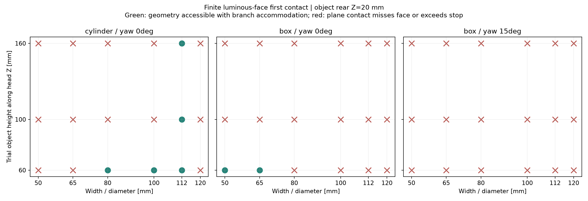

<!-- SPDX-License-Identifier: CC-BY-NC-4.0 -->
# R5-GRASP-RANGE01：盒体、瓶罐50–120mm接触范围

**目前的R5单铰灯片机构不能据此认定覆盖50–120mm。** 本轮找到明确的失配：短小圆柱可能超出上瓣角度限位；较高圆柱可能先碰下瓣金属压圈；盒体偏转会改变角点与有限灯面的关系。加分支弹簧可以补偿先后接触，但不能修复碰到金属边、灯面够不到工件或角度不足。

用户确认的是日常盒体、瓶罐和约50–120mm夹持宽度。下面的具体高度、方位与插入深度由工程选作试验变量，不是附加给用户的使用限制。

[可复算脚本](../../engineering/r5_grasp_range01.py) · [216组几何算例](../../engineering/generated/r5-grasp-range01/cases.json) · [汇总CSV](../../engineering/generated/r5-grasp-range01/summary.csv) · [实体接触反例](../../engineering/generated/r5-grasp-range01/brep-challenges.json)



图中绿色仅表示四瓣分别能到达有限灯面接触位置，允许分支作计算出的长度补偿；并非已能同时施加夹力。红色表示平面支撑点未落在有限灯面或超过角度限位，不是声称不存在任何其他姿态的抓法。图仅展示工件后端Z20mm子集。尤其棱边/罐口接触不能沿用旧球的径向摩擦模型。

## 试验对象与坐标

使用[R5-PETAL-FORM01](r5-petal-form01.md)真实28实体、根半径62mm、上瓣0–105°、下瓣0–113°及[LINK01](r5-link01.md)40mm滑块。头部Z朝前，物体中心线穿过Z轴，物体姿态在此固定，尚未加入中央掌体与相机。

圆柱轴沿头部Z，直径取50/65/80/100/112/120mm；方盒横截面为相同边长的正方形，绕Z偏转0°或15°。两类均取轴向高60/100/160mm、后端Z10/20/40/60mm，共216组。瓶肩、瓶盖、罐卷边、纸盒倒角和薄壁变形都未建模，不能把这些理想锐边试件称为真实消费品。

## 首次接触公式及有限面判断

对每瓣径向单位向量eᵣ，令物体横截面支撑量为`rho=max(e_r·p_xy)`。圆柱rho=W/2；方盒rho为半边长乘两项旋转后径向分量绝对值之和。物体位于Z[z₀,z₁]时，未压缩灯面与物体的有向支撑间隙为：

```text
g(q) = (62 − rho) sin(q) + z_ext cos(q) − 6
z_ext = z₀ when q ≤ 90°; z₁ when q > 90°.
```

所有灯片实体位于自身发光面后方，因此g>0保证此瓣全部实体尚未接触物体。g首次变零后，还要把真实支撑点变换回灯片局部坐标，并用实际皮层STEP判断该点是否在有限面内。另做半径2mm邻域包含检查，以区分靠边点；此邻域不是物理接触斑。

90°的圆柱接触可在其侧壁生成线上选点。其他角度对这里的有限圆柱首先支撑在前/后端圈，对方盒则在相应角点。它们的反力方向由真实棱边、软层与变形共同决定，不是无条件沿头部径向。

## 具体结果与反例

216组中有34组满足四面支撑点可达，其中7组没有四瓣同时满足半径2mm邻域包含。这些只是本试验网格中的计数，不代表抓取成功率；绿色也不自动保证边缘余量。

下表均采用后端Z20mm、轴向高60mm，方盒偏转0°：

| 试件 | 平面接触角，上／下瓣 | 有限发光面结论 | 几何联动补偿 |
|---|---|---|---|
| Ø50圆柱 | 110.917°／110.917° | 上瓣超过105°限位 | 不给四面抓取结果 |
| Ø80圆柱 | 101.229°／101.229° | 四个面都能达到接触点 | 下支杆先接触后需缩短0.654838mm；主滑块再进1.093630mm |
| Ø100圆柱 | 94.277°／94.277° | 四个面都能达到接触点 | 下支杆缩短0.246630mm；主滑块再进0.412378mm |
| Ø120圆柱 | 78.342°／78.342° | 支撑点落在根部x≈19.18mm，未进入灯面 | 不给四面抓取结果 |
| 50mm方盒 | 104.694°／104.340° | 四个面都能达到接触点 | 下支杆缩短0.903860mm；主滑块再进1.506163mm |
| 80mm方盒 | 90.208°／88.365° | 下瓣支撑点错过有限灯面 | 不能直接从平面公式断言无其他皮层接触 |

对14个越限/错面情况进一步做实际BREP挑战。平面间隙先提供确定无接触的接近段，再在之后以≤1°扫描、二分定位首次观察到的距离零点；后段不是全域连续根的严格证明。代表性结果：

- **Ø50、高100、后端Z20mm圆柱**：下瓣约108.533090°首次观察到压圈接触，皮层还离物体2.513741mm。相同宽度仅改变高度，接触失配机制就不同。
- Ø80、高100、后端Z20mm圆柱：下瓣约99.541438°先碰压圈，皮层还有1.065069mm。
- Ø120、后端Z20mm圆柱：约80.609803°先碰压圈，皮层还有1.203535mm。
- 80mm方盒、后端Z20mm：下瓣在88.964309°可以先碰皮层，压圈余距0.311936mm。这说明平面支持点错面只是筛查不通过，不能全部误判成“没有发光面接触”。该接触是皮层有限边界，不自动满足四面夹力模型。

这些反例已否定把当前子集结果直接宣称为50–120mm通用覆盖。只增加分支弹簧不能消除已观察到的金属碰撞或越限，其他姿态可行性仍需另证；未做的角度/插入深度也不能拿已通过子集外推。

## 一电机的分支补偿关系

对于四个平面支撑点均在有限灯面内且角度可达的算例，求各自接触角qᵢ和对应刚性支路滑块xᵢ。取`x_last=max(x_i)`，先接触瓣保持qᵢ不变，让滑块继续到最后一瓣接触。该支路需要的有效杆长为：

```text
L_i,new = sqrt[(42 + a_i cos(q_i+psi_i))²
               + (a_i sin(q_i+psi_i) − x_last)²]
compression_i = L_i − L_i,new
```

这里给的是销中心间长度差，需由每支路串联弹性、差动或其他机械结构实现。不能把一个电机的力矩指令当作四个独立夹力指令。最后接触支路此刻的增量压缩为零；尚未证明四支路同时建立正夹力，进一步加压后的弹簧刚度、预载、物体移动、皮层压缩与限力均须重新解算。

50mm方盒算例最后滑块已到−40.094967mm，距名义−40mm终点只剩约0.095mm。这点余程不能在没有弹簧/柔性模型时当作已经足够的载荷建立行程。2kg、1秒空载节拍、摩擦和压坏物体的边界均不由本轮通过。

独立复核还直接检查了实体后果：Ø80×高60、后端Z20mm的算例，如果四条杆坚持刚性并继续到最后接触位置，两下瓣已经穿入物体，单实体最大交叠约680.32mm³；让已接触下瓣停住、下支杆各缩短0.654838mm时，名义交叠为零。因此分支补偿是结构实现要求。复核使用独立Rodrigues变换、方盒八顶点/圆柱端圆支撑及真实面IN/ON分类，864个逐指支撑角、局部点和杆长变化与主计算一致。

## 下一轮结构改动的输入

保持大上瓣、小下瓣及有折线的外轮廓，优先解决两类互不替代的问题：

1. **有效接触边缘**：将承力发光面与周边金属的前缘关系重新设计，使较高瓶罐在短下瓣端部首先接触可承力的透光层；需同步处理透明盖挠度、软层保持、灯珠隔离和螺钉头。不能简单把整片金属压圈涂成发光色。
2. **接触轨迹与顺应**：比较根部几何、允许角域以及带被动姿态调整的连杆，让50mm小物体在可用灯面范围内接触，并留出建立夹力的额外行程。若需要根部平移或第二被动转轴，仍可只有一个主动电机，但须重新验证完整运动、邻瓣避让和真实支承；不能继续继承R5-LINK01的载荷及3.58mm余量。

本轮没有悄悄改动已冻结FORM01/LINK01，也没有将研究反例改成采购图。脚本、输入哈希、逐瓣位置、后续BREP结果和图表都保留，作为下一版结构必须消除的具体问题。
