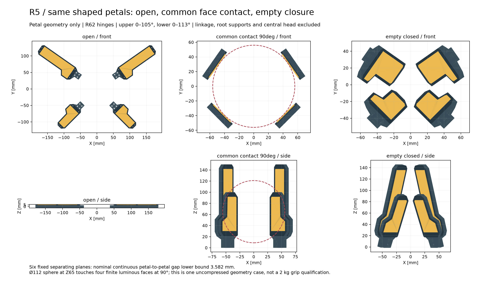

<!-- SPDX-License-Identifier: CC-BY-NC-4.0 -->
# R5-HEAD-GEOMETRY01：真实造型灯片的收拢和共同接触

四瓣采用[R5-PETAL-FORM01](r5-petal-form01.md)真实实体，灯面直接参与接触。将根轴放在半径62mm、上瓣名义收拢105°、下瓣113°后，**六对灯片在各自整个独立角域内，名义分离间隙下界至少3.581912mm**。这覆盖范围内的任何联动轨迹，也为限定范围内的被动角度留出几何研究空间。

这个结论仅包含28个灯片实体／电子预留体。中央掌体、电机、连杆、轴毂、相机、屏幕、线缆、真实紧固件、公差和变形不在证明内；尚不能称整头完全闭合通过。105°／113°是空手收拢候选端点，实际限位结构仍待设计。

[三状态图PDF](../../engineering/generated/r5-head-geometry01/three-states.pdf) · [展开STEP](../../engineering/generated/r5-head-geometry01/R5-HEAD-GEOMETRY01-open.step) · [共同90°STEP](../../engineering/generated/r5-head-geometry01/R5-HEAD-GEOMETRY01-common_contact_90deg.step) · [收拢STEP](../../engineering/generated/r5-head-geometry01/R5-HEAD-GEOMETRY01-empty_closed.step) · [可复算脚本](../../engineering/r5_head_geometry01.py) · [连续界](../../engineering/generated/r5-head-geometry01/continuous-separation.json) · [有限面接触](../../engineering/generated/r5-head-geometry01/finite-face-contact.json)

## 坐标和候选尺寸

头部+Z朝向工件。四根轴的方位角依次为UR35°、UL145°、LL225°、LR315°；径向单位向量为eᵣ，切向为eₜ，正闭合角绕−eₜ。轴中心P=62eᵣ，轴平面Z=0。单片坐标沿根到尖为+X、面内为Y、发光接触侧为+Z，根参考点h=[0,0,3.5]mm。

局部点映射为 `p_head = P + Rot(−e_t,q) [x e_r + y e_t + (z−3.5)e_z]`。左右片使用各自真实镜像STEP，变换本身是行列式+1的旋转；不能再次镜像几何或电子导体。STEPS均为mm且已经烘焙到文件状态，不能再施加同一闭合角。

上片150mm、下片100mm保持真实长度和轮廓，不在闭态缩短或变形。短下瓣多闭8°，让长短片的尖部进入相近径向区域；前后高度仍不同，不能称同深度密封茧。R60的同角域下界只有1.010762mm，本版将根半径增至62mm以增加名义余量。3.581912mm尚未扣制造、装配、轴游隙和受载挠曲。

## 连续避让的计算方法

先逐件以CAD差体积证明，7个局部实体都包含在对应轮廓凸包×Z[0,9.5]mm的凸柱内；凸包包括肩部缺口的空区，因此是保守外包络。任意固定平面法向n上的顶点投影可写为 `A cos(q)+B sin(q)+C`，端点及导数零点给出区间的精确极值。

每对手指采用沿两根径向差方向的固定分离平面。各自角度可以独立变化，不以采样或动作错峰掩盖中间碰撞。以A最小投影减B最大投影得到下表；它是沿单位法向的分离下界，也是欧氏距离下界。

| 灯片对 | 整个独立角域的名义间隙下界mm |
|---|---:|
| UR／UL | 11.094850 |
| UR／LL、UL／LR | 33.171430 |
| **UR／LR、UL／LL** | **3.581912** |
| LL／LR | 6.958550 |

证明依赖已冻结的轮廓、厚度、R62和角域。后续新增螺钉头、指根曲柄或线缆不能自动继承。对28件之外的任何东西，也不能从这张表宣布没有碰撞。

## 灯面确实接触：一个明确的工件几何

设计共同夹持位置为四瓣都达到90°，这时四个发光面朝向中心且与Z轴平行。名义接触面距根轴6mm，因此内切球半径为62−6=56mm。取**直径112mm、中心[0,0,65]mm的参考球体**，四个切点都落在各自灯片局部[x,y,z]=[65,0,9.5]mm，且其周围半径4mm的薄圆片包含于实际有限皮层内。

球体在此仅为几何试件；用户随后确认的任务对象是盒体、瓶罐、宽度约50–120mm，这个单球算例不覆盖该任务范围。半径4mm的包含检查只说明切点远离光面边界；实际球体与未压缩平面理论上是点接触，**不能把这个圆片面积拿来计算平均接触压强**。皮层压缩后接触斑、夹持力和金属边缘接触需重新求解。

28项真实CAD检查表明球体不穿入任何灯片实体，四个皮层距离为0，其他件仍有名义正间隙。对每瓣从0°到90°的接近段，球心到面平面的有向距离减球半径为 `62 sin(q)+65 cos(q)−6−56`；解析极值不为负，故此段不会在90°前穿入光面后方的灯片实体。这里没有检查球体与中央屏／相机或传动的关系。

这也是为何单驱动关系要经过共同90°位置：如果上、下瓣角度始终保持任意固定比例，同一位置下四个灯面未必能一起贴住前方的同轴球体。真实滑块／连杆研究会把0°、共同90°和105°／113°三个位置同时纳入，而不是只匹配全开和全闭。

## 夹持数学仍是条件模型

[36组条件接触计算](../../engineering/generated/r5-head-geometry01/conditional-grasp.json)针对上述真实切点建立6维力／矩平衡。每处摩擦锥用16条内接生成线，摩擦系数取0.2／0.4／0.8，2kg净工件、载荷系数1／2，分别检查头部±X／±Y／±Z六种重力方向。每处至少5N只是显式预紧算例，不是已选弹簧预载；优化目标为最小共同法向力上限。

例如假设μ=0.4、载荷系数2、重力沿±Z，理想解的每个上瓣需27.072849N、下瓣21.960401N。上下法向力不同才同时满足横向平衡。六个轴向载荷通过不代表所有方向或带偏心外力矩都通过。抓取矩阵秩6也不等于真实机构具备这些力。

单电机仅给总驱动力，实际分支力由弹性、传动和接触顺序决定。当前LP允许分配四处力，因而它给出可行性输入，**没有证明单驱动能实现该分配**。实测摩擦、透光盖挠曲、皮层保持、温升、物体损伤、失电夹持和2kg实物资格均待完成。

运行 `python engineering/r5_head_geometry01.py` 重建三个状态、参考球体、解析连续界与条件接触结果。输出保存输入文件和产物SHA；三张装配各重新读入28个命名实体。下一步将真实联动机构、支承和中央模块加入同一坐标系后继续检查。
