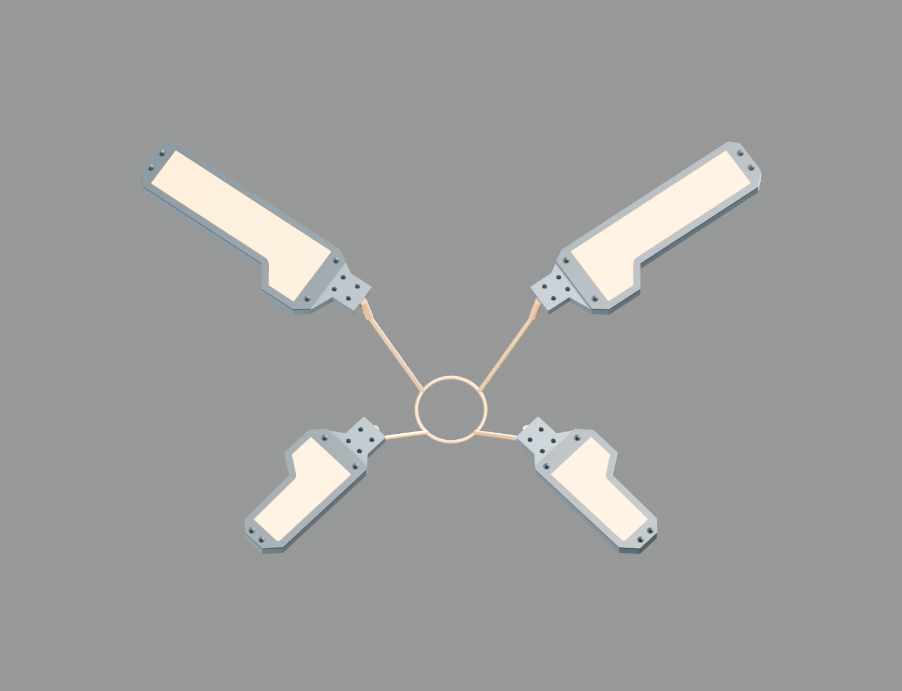
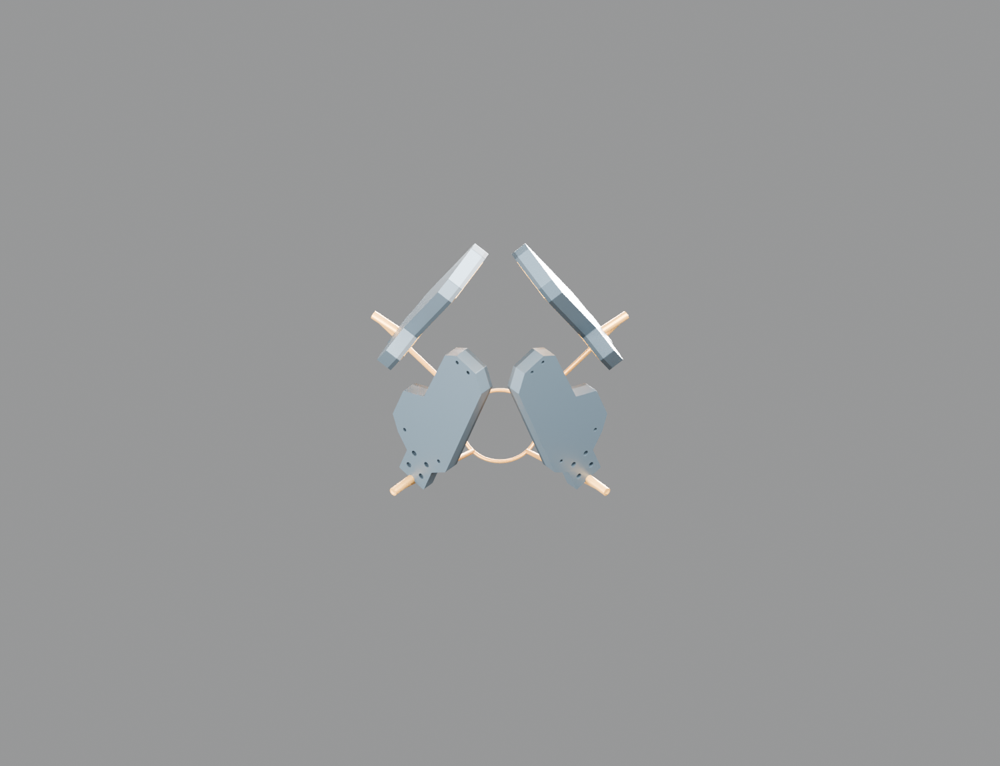

<!-- SPDX-License-Identifier: CC-BY-NC-4.0 -->
# R5-LINKAGE-BLENDER01：一个主控量驱动四瓣

这份原生Blender模型将[R5真实造型灯片](r5-petal-form01.md)装到[R5-LINK01滑块连杆关系](r5-link01.md)上。28件CAD网格保持实体尺寸；四瓣由同一个滑块参数驱动，上下瓣使用各自的非线性闭环关系，没有四个独立电机控制量。

[下载Blender文件](../../engineering/generated/r5-linkage-blender01/odradek-r5-single-drive.blend) · [生成脚本](../../engineering/r5_linkage_blender01.py) · [关闭自动脚本后重开核验](../../engineering/generated/r5-linkage-blender01/reopen-review.json)





## 操作

打开文件，选中`MASTER_SLIDER`，在对象自定义属性中修改`close_fraction`：0为全开，0.861875为四瓣共同90°，1为上瓣105°／下瓣113°的空载收拢候选。滑块坐标为`x=-80+40s`mm。模型保存时处于全开状态，没有把几何演示动画当作真实1秒动态验证。

四个`FOLLOWER_*`围绕各自切向轴旋转；4个连杆滑块端及共同参考环也受同一参数控制，共9条Blender原生简单表达式driver。跟随角由`acos`、`atan2`和平方根表达闭环解，不需要Python handler或启用文件自动执行。禁用自动脚本后重新打开仍能改变姿态。

## 与真实机构的边界

石墨色框、压圈、透光承力盖和发光接触皮层来自同一套STEP。每瓣三个电子分配体保留在文件中但隐藏显示；发光材质仅表达外观，没有假定灯板已经适配新轮廓。中央电机、丝杆螺母、直线导轨、掌壳、屏幕、相机、轴承、紧固件与线束未装入。

金色细杆和环明确是运动参考物。参考曲柄半径2.2mm、连杆半径1.3mm与LINK01粗包络CAD不同，不能继承其截面、质量、强度或碰撞结论；本版只核对端点约束。空手收拢不是同深度密封形态，也不代表50–120mm盒体、瓶罐已能可靠夹持。

## 核验

8个主控位置包含展开、共同90°、收拢及中间姿态。将Blender世界坐标网格包络与独立CAD实体包络逐件比较，共224项；最大差0.004223mm。四瓣角度最大误差4.71×10⁻⁸rad，连杆两端距离相对名义长度最大差4.41×10⁻⁶mm。9条driver均有效且为简单表达式。重开时自动Python执行关闭，未重新保存文件。

这些检查验证几何转换和驱动关系，不验证实体惯量、接触力、刚度、公差、伺服跟随、失电保持或制造资格。[灯片之间的连续几何分离](r5-head-geometry01.md)另有解析证明，但尚未覆盖完整中央机构。

```sh
python engineering/r5_linkage_blender01.py --prepare --mesh-json /tmp/r5-mesh.json
blender --background --python engineering/r5_linkage_blender01.py -- --mesh-json /tmp/r5-mesh.json
blender --background --disable-autoexec engineering/generated/r5-linkage-blender01/odradek-r5-single-drive.blend --python engineering/r5_linkage_blender01.py -- --mesh-json /tmp/r5-mesh.json --review
```

第一步需要CadQuery与项目Python依赖；后两步使用Blender内置Python。网格缓存属于可再生中间文件，输入哈希写入模型及核验报告。
