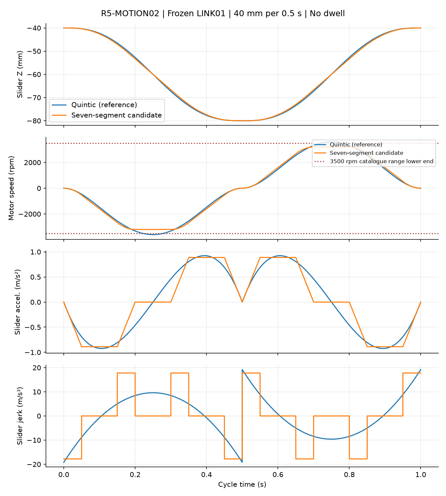
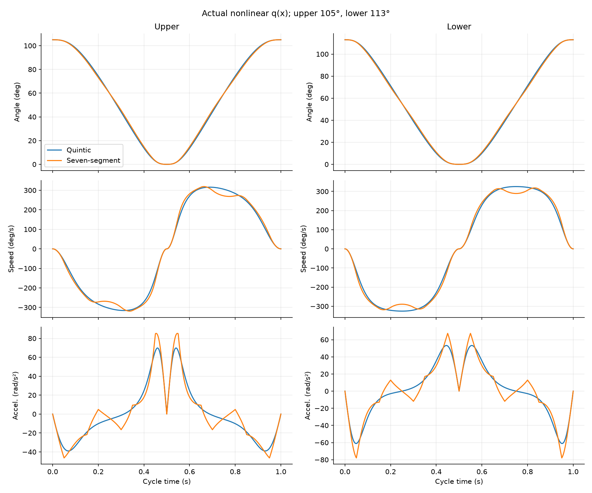
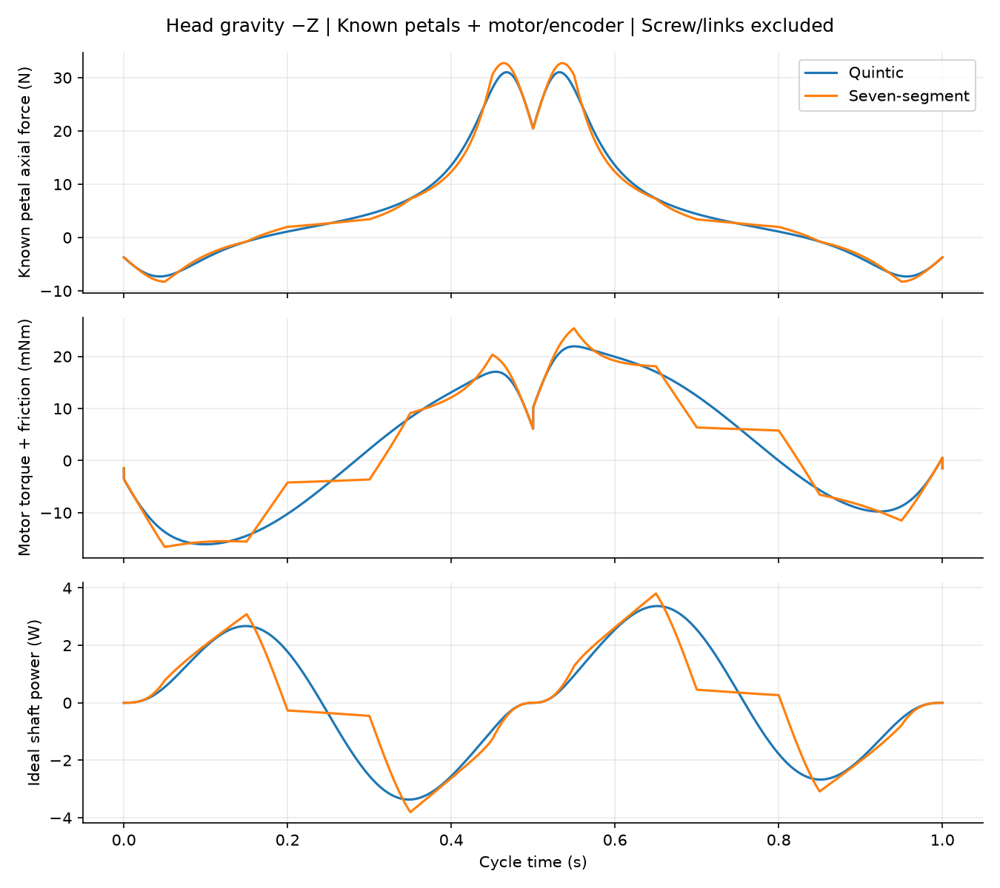

# R5-MOTION02：40 mm / 0.5 s 七段限 jerk 轨迹

SPDX-License-Identifier: CC-BY-NC-4.0  
Required Notice: Odradek — Auromix contributors (https://github.com/Auromix/odradek)

七段轨迹在冻结的 LINK01 几何下，严格满足**空载全闭 → 全开 → 全闭 1 s**：峰转速由五次轨迹的 3600 降为 **3200 rpm**。这是后续单轴台架的轨迹候选。非线性连杆使峰值指片加速度与电机扭矩反而增加；不能以“主轴降速”推断整机构载荷下降。当前结果没有把 SG0802.5 或整头判为硬件合格，也没有确认连续 1 Hz 的热占空。

## 1. 范围、来源和不变项

只读 [LINK01 study](../../engineering/generated/r5-link01/study.json) 的几何、四瓣已建材料质量和惯量。根半径 62 mm，滑块耳半径 20 mm；滑块 Z 从 −80 至 −40 mm，上/下指分别 0…105° / 0…113°，共同 90° 位形在 Z = −45.525 mm。未改机构、CAD、丝杆、控制器或旧五次曲线文件。

采用 `3274G024BP4 + IE3-1024 L`，直驱名义导程 2.5 mm；电机与编码器磁环总转动惯量为 **4.808×10⁻⁶ kg·m²**。四片已建材料质量共 **0.242488 kg**；每片绕候选铰轴惯量为上 **5.39464322×10⁻⁴**、下 **1.49157795×10⁻⁴ kg·m²**。丝杆、联轴器、螺母/滑块、曲柄、连杆、铰、电子件、紧固件和线缆的实际惯量/摩擦尚未计入基线，另列敏感性。

KSS 对微型丝杆给出的循环器转速范围为 **3500–4000 rpm**，依工作条件和环境变化；高加减速会增加循环器损坏可能。还须取安装条件确定的临界转速限制。3200 rpm 比该范围下端低 300 rpm（8.57%），并不等于获准以本加速度运行；3600 rpm 落在该工况相关范围内，也不能直接判为合格。[KSS 技术说明 A816](https://kssballscrew.com/us/pdf/catalog/BS_Technical_Description.pdf)

当前机械候选 `SG0802.5-129R170C5` 的导程为 2.5 mm；端部加工、实际支承跨距、循环器工况和临界转速由独立滑块硬件研究处理。本计算不把轴承额定转速视作丝杆许可转速。[KSS SG0802.5 A219](https://kssballscrew.com/us/pdf/catalog/A219.pdf)

## 2. 七段轨迹的精确积分

每单程取 `tj = 0.05 s, ta = 0.10 s, tv = 0.10 s`：

| 段 | 区间 / s | jerk / m·s⁻³ | 段末位移 / mm | 段末速度 / mm·s⁻¹ | 段末加速度 / m·s⁻² |
|---|---:|---:|---:|---:|---:|
| 1 | 0…0.05 | +17.777778 | 0.370370 | 22.222222 | +0.888889 |
| 2 | 0.05…0.15 | 0 | 7.037037 | 111.111111 | +0.888889 |
| 3 | 0.15…0.20 | −17.777778 | 13.333333 | 133.333333 | 0 |
| 4 | 0.20…0.30 | 0 | 26.666667 | 133.333333 | 0 |
| 5 | 0.30…0.35 | −17.777778 | 32.962963 | 111.111111 | −0.888889 |
| 6 | 0.35…0.45 | 0 | 39.629630 | 22.222222 | −0.888889 |
| 7 | 0.45…0.50 | +17.777778 | 40.000000 | 0 | 0 |

表为正向单程；完整周期前半程 `x = −0.040 − z(t)`、后半程 `x = −0.080 + z(t−0.5)`，单位 m。三个端点均为零速度、零加速度，不安排停顿。

每段从状态 `(z₀,v₀,a₀)` 出发，局部时间 u：

```text
z = z₀ + v₀u + ½a₀u² + ju³/6
v = v₀ + a₀u + ½ju²
a = a₀ + ju
T = 4tj + 2ta + tv = 0.5 s
S = j tj(tj+ta)(2tj+ta+tv) = 0.040 m
vmax = j tj(tj+ta) = 0.133333333 m/s
amax = j tj = 0.888888889 m/s²
```

生成脚本先以单位 jerk 逐段积分，再由行程反求幅值，没有仅抄公式数字。位置为 C² 连续，**jerk 在部分分段交界有有限跳变**；不是 jerk 连续轨迹。零速端点不能据此省略限位、接触检测或急停策略。

对照五次曲线 `h(u)=10u³−15u⁴+6u⁵`，两者的行程、单程时间、端点以及 LINK01 几何完全相同。



## 3. 真实非线性传动与动力学

沿用 LINK01 的后置连杆分支。设 `d=R−r`、曲柄长 a、杆长 L、初相 ψ，q 以 rad 表示，以下几何式中的 x/a/L/d 为同一长度单位：

```text
x(q) = a sin(q+ψ) − sqrt[L² − (d + a cos(q+ψ))²]
q(x) = −acos[(L² − d² − a² − x²)/(2a sqrt(d²+x²))]
       −atan2(x,d) − ψ
q̇ = q′(x) ẋ
q̈ = q′(x) ẍ + q″(x) ẋ²
F = Σ [Jᵢ q̈ᵢ − τgravity,ᵢ] q′ᵢ
  = M(x)ẍ + ½M′(x)ẋ² + U′(x)
M(x) = Σ Jᵢ(q′ᵢ)²
ω = 2πẋ/p; α = 2πẍ/p
τideal = Fp/(2π) + (Jmotor + Jencoder)α
```

动力计算先把导数统一成 rad/m、rad/m²。每片 COM 按实体坐标旋转，左片横向坐标镜像；正闭合轴为 `−e_t`，重力矩符号由叉积计算。不是将各分量绝对值相加后冒充实际扭矩 RMS。

### 空载结果：重力沿头部 −Z

| 指标 | 五次对照 | 七段候选 |
|---|---:|---:|
| 主轴峰速度 / mm·s⁻¹ | 150.000 | **133.333** |
| 电机峰转速 / rpm | 3600 | **3200** |
| 主轴峰加速度 / m·s⁻² | 0.923760 | 0.888889 |
| 主轴峰 jerk / m·s⁻³ | 19.200 | 17.778 |
| 上片峰速度 / °·s⁻¹ | 315.910 | 318.992 |
| 下片峰速度 / °·s⁻¹ | 325.462 | 318.320 |
| 上片峰加速度 / rad·s⁻² | 69.827 | **85.284** |
| 下片峰加速度 / rad·s⁻² | 61.125 | **77.938** |
| 已计指体峰轴向力 / N | 31.019 | **32.728** |
| 理想电机峰矩 / mN·m | 19.484 | **22.870** |
| 理想电机 signed RMS 矩 / mN·m | 11.646 | 11.606 |
| 加目录电机摩擦：峰矩 / mN·m | 21.940 | **25.403** |
| 加目录电机摩擦：signed RMS 矩 / mN·m | 12.310 | 12.265 |
| 目录等效峰电流 Ieq / A | 0.780786 | 0.904005 |
| 目录等效周期 RMS 电流 Ieq / A | 0.438077 | 0.436480 |

七段加速度平台经过传动比变化较快的位置，上片 `q″ẋ²` 项单独可达 **49.296 rad/s²**。因此降低主轴峰加速度并不能保证降低指片峰加速度。两种轨迹每周期都走 32 电机转，平均绝对转速均为 1920 rpm；较低峰转速也不代表更少的总循环行程。



[comparison.csv](../../engineering/generated/r5-motion02/comparison.csv) 同时列出无重力、−Z、−X、−Y 四种固定头部重力方向。−X 情况整组重力广义力因左右对称抵消，但单片重力载荷不为零；[finger-motion.csv](../../engineering/generated/r5-motion02/finger-motion.csv) 保留逐指峰矩。四种情景不是任意姿态的包络，也没有机械臂运动引起的基座惯性载荷。

### 电流定义与摩擦边界

电机目录给出 `Kt=28.1 mN·m/A`、`C₀=2.04 mN·m`、`Cv=9.24×10⁻⁷ N·m/rpm`、相间电阻 0.253 Ω。这里估算 `τem=τideal+sign(ω)(C₀+Cv|rpm|)`，再算 `Ieq=τem/Kt`。零速单点把摩擦项设零，未建立静摩擦模型。[FAULHABER 3274 BP4](https://www.faulhaber.com/fileadmin/Import/Media/EN_3274_BP4_DFF.pdf)

**Ieq 是目录扭矩等效电流，不是已核实的相 RMS、相峰值或直流母线电流。** 官方已取资料没有闭合跨驱动器的电流归一化，故不能把表值直接填进伺服电流限制。[FAULHABER 无刷电机技术说明](https://eshop.faulhaber.com/media/39/ea/a1/1755094024/EN_TI_BRUSHLESS_DC-MOTORS.pdf)

[current-convention-sensitivity.csv](../../engineering/generated/r5-motion02/current-convention-sensitivity.csv) 明列两种互斥解释：若 Ieq 为平衡正弦相幅值，平均铜耗模型为 `0.75 Rll·Ieq_RMS²`；若为相 RMS，则为 `1.5 Rll·Ieq_RMS²`。七段 −Z 对应 **0.03615 / 0.07230 W**。这不是误差区间或热合格结论；桥损耗、铁损、未知机械损耗、温升电阻和真实安装均未包含。

## 4. 机械回生与总能量

| −Z、已计材料 + 转子/编码器 | 五次对照 | 七段候选 |
|---|---:|---:|
| 理想整周期正机械功 / J | 0.840770 | 0.717610 |
| 理想整周期制动机械能 / J | **0.840770** | **0.717610** |
| 理想瞬时制动峰功率 / W | 3.366920 | **3.804615** |
| 转子 + 编码器峰动能 / J | 0.341662 | 0.269955 |
| 计电机摩擦后的正机械功 / J | 1.383501 | 1.331484 |
| 计电机摩擦后的制动机械能 / J | 0.463763 | 0.431038 |
| 目录电机摩擦耗能 / J·cycle⁻¹ | 0.919738 | 0.900445 |

七段使制动**总机械能**减少约 14.65%，但制动**峰功率**增加约 13.00%。正负功是在电机轴/电磁转矩边界的机械量；不等于真实母线可回收能量，也未包括感性能量。更不能用本空载周期替代急停或携物下放的最坏制动路径。



若极端地把整周期 0.717610 J 一次、无损灌入 24 V 电容，`V₂=sqrt(V₁²+2E/C)`；1 / 4.7 / 10 mF 分别约 **44.85 / 29.69 / 26.82 V**。这只是 [regeneration-sensitivity.csv](../../engineering/generated/r5-motion02/regeneration-sensitivity.csv) 的能量例子，不能据此指定电容、TVS 或制动电阻。真实驱动、供电吸收能力、其他负载以及再生过压阈值仍须配套验证。

## 5. 未计硬件的敏感性和夹持边界

[missing-hardware-sensitivity.csv](../../engineering/generated/r5-motion02/missing-hardware-sensitivity.csv) 扫描附加滑块质量 0 / 0.1 / 0.2 kg、附加丝杆/联轴器转动惯量 0 / 0.5 / 1.0 / 1.5×10⁻⁶ kg·m²，以及运动效率 1 / 0.65 / 0.85。均是显式假设，**不是选定零件的测量值或保证上界**。表中效率只用于分量绝对和的保守需求估算，名称与 signed 实际值分开；没有把运动效率套为静态 κ。

例如七段、附加 0.2 kg 和 1.5×10⁻⁶ kg·m² 时，理想 signed 峰/RMS 电机矩为 **26.291 / 14.000 mN·m**，理想制动机械能增至 **0.889398 J**。再假设运动效率 0.65，含电机摩擦的分量绝对和峰矩为 **35.393 mN·m**。此例依然没有曲柄/连杆分布惯量等全部项，不是装机总需求。

独立 [滑块硬件预算](../../engineering/electronics/r5-slider-hardware01/budget.json) 已记录名义实钢外包的丝杆惯量 proxy：全长 170 mm 约 1.067×10⁻⁶、改端总长 130 mm 约 0.816×10⁻⁶ kg·m²；它们不是厂商质量保证，联轴器和锁紧件另计。本任务只记录该预算哈希供追溯，没有把 proxy 自动混入已计质量，也没有继承旧 Thomson 丝杆质量。

四瓣共同 90°、112 mm 球、μ=0.4、力系数 2 的旧条件算例仍为 **287.171 N / 理想 0.114262 N·m**。改变空载轨迹不会降低该静态夹持需求。用户确认的盒体/瓶罐约 50–120 mm 范围、接触后的限力/顺应、完整工件加速度场景不能由该单点算例覆盖。本任务没有宣称实际 2 kg 抓持通过。

连续 1 Hz 仅是重复本轨迹时的数学周期定义。若未来每 T 秒重复一次、其余时间不通电保持，等效 RMS 可按周期积分除以 T 重算；若其间通电夹持，必须加上保持电流积分，不能只乘运动占空比。

## 6. 复现和独立审计

在仓库根运行：

```sh
python3 engineering/r5_motion02.py
```

依赖 NumPy 2.x、SciPy、Matplotlib。本地已验证环境为项目工作区 `work/r4-runtime/venv`；脚本不触发任何上游生成器，也不修改旧文件。原始密集计算 40001 点、步长 25 μs；80001 点再算作收敛比较，CSV 时程输出每 0.5 ms 一个点。分段边界都有精确状态。

[verification.json](../../engineering/generated/r5-motion02/verification.json) 有 **36 项检查**，包含：

- 逐段解析积分和数值梯形积分交叉验证；严格 40 mm / 0.5 s，0、0.5、1 s 端点位置、速度、加速度检查。
- 独立通过杆长隐式方程和 Brent 求根得到 q；不调用 LINK01 解析反解。再以五点差分核对 q′、q″。
- 另从数值 `M(x)` 与 `U(x)` 求 `M ẍ + ½M′ẋ² + U′`，核对虚功力公式；最大误差低于 10⁻⁶ N。
- 时域五点差分核对 q̇、q̈，避开 jerk 跳点；逐时累计 `∫τ ω dt` 对照真实动能 + 势能变化，最大残差约 **2.7×10⁻⁹ J**，并非只检查一个可因对称而抵消的周期总和。
- 密集/加倍网格的峰矩、RMS、制动能量收敛；记录脚本、输入和输出 SHA256。

峰值是密集采样并复算收敛的数值结果；没有称为连续区间全局极值证明。官方来源及本地已读 PDF 的 SHA 在 [study.json](../../engineering/generated/r5-motion02/study.json) 内。纯计算审计不替代丝杆允许加减速、驱动电流定义、限力响应、热设计或实物测试。
